# 1강 강화학습이란?

**그림 01-0** 지니가 소환한 요술 지도를 따라 사과나무와 장애물이 가득한 숲속으로 첫 탐험을 시작하는 도로시와 토토
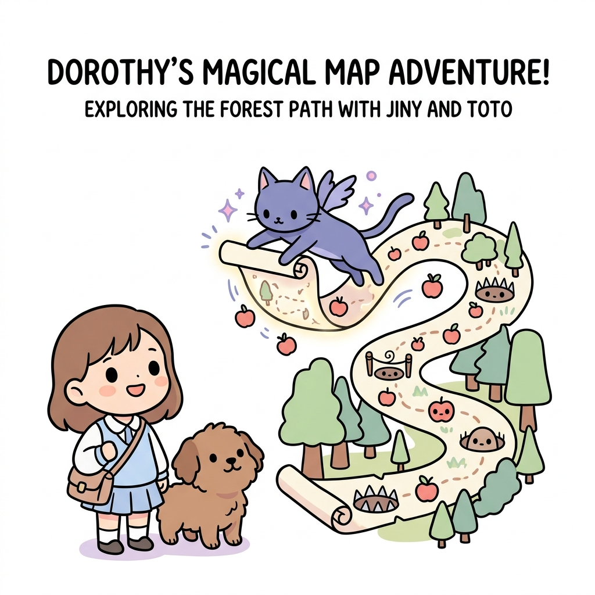

강화학습(Reinforcement Learning)은 스스로 환경과 상호작용하며 어떤 행동이 가장 큰 상(보상)을 받는지 몸으로 직접 겪어가며 배우는 과정입니다. 요정 고양이 지니가 도로시와 토토를 위해 펼쳐준 알록달록한 보물 지도 숲길처럼, 사과(보상)를 따먹고 웅덩이(함정)를 피하며 최선의 길을 스스로 찾아내는 놀라운 인공지능의 세계로 첫 발을 내딛어볼까요?

---

우리가 세상을 배우는 가장 자연스러운 방법은 무엇일까요? 아기가 기어 다니며 장난감을 만져보고, 넘어지면서 걷는 법을 배우고, 뜨거운 냄비에 손을 댔다가 깜짝 놀라며 조심하게 되는 과정이 바로 그 답입니다. 누군가 옆에서 교과서처럼 정답을 알려주지 않아도, 우리는 **주변 환경과 부딪치고 상상하며 몸으로 배우는 경험**을 통해 성장합니다.

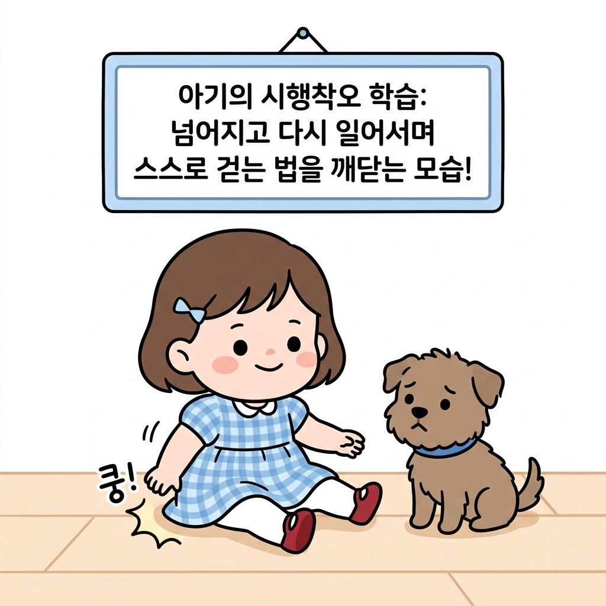


강화학습<sup>Reinforcement Learning</sup>은 바로 이러한 인간과 동물의 **'시행착오를 통한 학습'**을 컴퓨터(인공지능)에게 이식하려는 거대한 도전에서 시작되었습니다.


이번 1강에서는 본격적인 수식과 코드에 들어가기에 앞서, 강화학습이 무엇이고 기존 머신러닝과 어떻게 다르며, 어떤 과정을 거쳐 연구되고 발전되어 왔는지 편안하게 살펴보는 오리엔테이션을 가져보겠습니다.


---


## 1.1 오리엔테이션: 상호작용하며 배우는 기계

우리가 이번 장에서 만나볼 에이전트<sup>Agent</sup>(학습하는 주체)는 스스로 학습하는 똑똑한 꼬마 로봇과 같습니다.

 

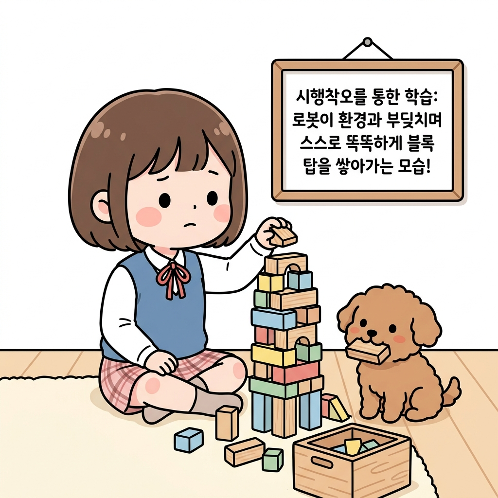

**그림 1-1** 시행착오를 통해 스스로 학습하는 에이전트


로봇이 방 안에서 블록을 쌓으려고 합니다. 이때 로봇을 제외한 방 전체와 블록들은 **환경<sup>Environment</sup>**이 됩니다. 로봇이 블록을 잘 쌓아서 탑이 무너지지 않으면 기분 좋은 스마일 마크(보상: `+1`)를 받고, 서툴게 쌓아 블록이 와르르 무너지면 슬픈 우는 마크(벌점: `-1`)를 받습니다. 


로봇은 처음에 블록을 어떻게 쌓아야 할지 전혀 모른 채로 무작위로 만져보기 시작합니다. 하지만 이 과정을 수백 번, 수천 번 반복하면서 다음과 같은 정보가 머릿속에 쌓이게 됩니다.

1. "아하, 블록을 밑에서부터 차곡차곡 쌓아야 탑이 무너지지 않는구나!" (인과관계 학습)
2. "지금 당장 블록을 삐딱하게 놓으면 결국 몇 단계 뒤에 탑이 쓰러져 벌점을 받게 되는구나!" (지연된 보상 예측)

이처럼 에이전트가 어떤 행동을 취할지에 대해 어떠한 직접적인 지침(라벨)도 받지 않고, 오로지 **시행착오<sup>Trial-and-Error</sup>**와 **지연된 보상<sup>Delayed Reward</sup>** 피드백만을 통해 장기적인 보상 합계를 극대화하도록 공부하는 기법이 바로 **강화학습**입니다.


---


## 1.2 머신러닝 3대 패러다임 비교

강화학습은 기존 머신러닝의 대표적인 분류인 **지도 학습<sup>Supervised Learning</sup>**, **비지도 학습<sup>Unsupervised Learning</sup>**과 뚜렷하게 구분되는 제3의 기계학습 패러다임입니다. 이 세 가지 공부법을 친근한 비유로 대조해 보겠습니다.

| 구분 | 지도 학습 (Supervised) | 비지도 학습 (Unsupervised) | 강화 학습 (Reinforcement) |
| :--- | :--- | :--- | :--- |
| **비유** | 친절한 선생님이 옆에서 **문제와 해설지(정답)**를 함께 보여주며 가르치는 공부법 | 선생님 없이 교실에 흩어진 **수많은 자료들을 닮은꼴끼리 정리하고 분류**하는 공부법 | 정답은 모르지만, **직접 행동해 보고 느끼는 피드백(보상)**으로 깨우치는 공부법 |
| **목표** | 새로운 문제가 나왔을 때 정답을 정확히 예측하기 | 데이터 내부에 숨겨진 유용한 규칙이나 패턴 찾아내기 | 장기적으로 받을 누적 보상의 합계를 최대화하기 |
| **학습 신호** | 정답(Label) | 없음 (정보만 제공) | 보상 신호(Reward) |

> [!NOTE]
> 강화학습을 비지도 학습의 일종으로 혼동하기 쉽습니다. 왜냐하면 둘 다 '정답 라벨'이 주어지지 않기 때문입니다. 하지만 비지도 학습은 데이터 속에 숨겨진 구조를 찾아내는 데 집중하는 반면, 강화학습은 오직 **보상을 극대화하는 행동을 찾아내는 것**이 목적이라는 점에서 본질적으로 다릅니다.
>
> 

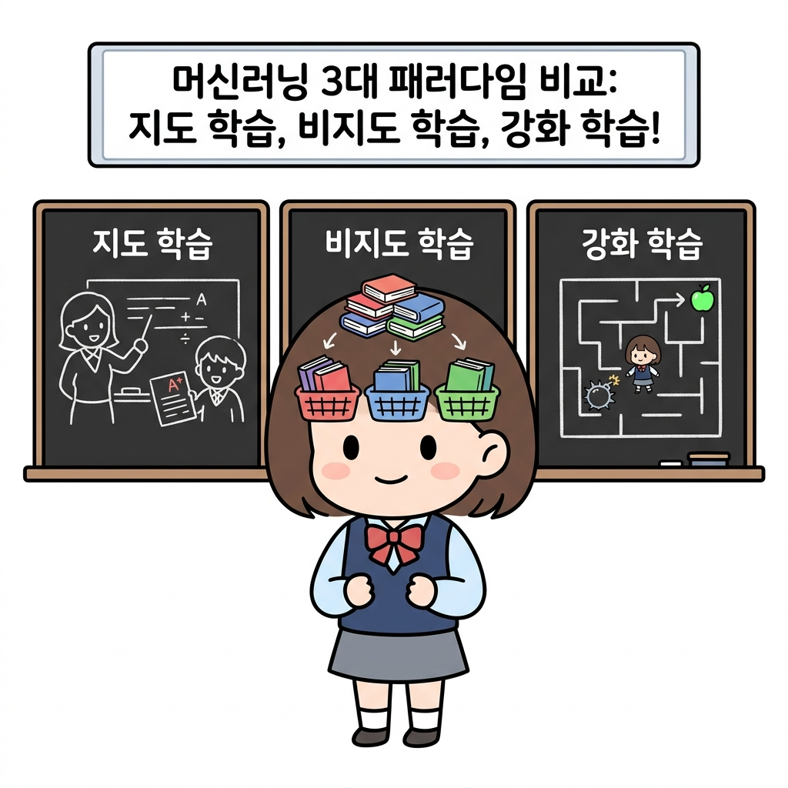


---


## 1.3 강화학습의 4대 핵심 구성 요소

학습을 진행하는 에이전트와 자극을 주는 환경 외에도, 강화학습 시스템을 구성하는 네 가지 기둥이 있습니다.


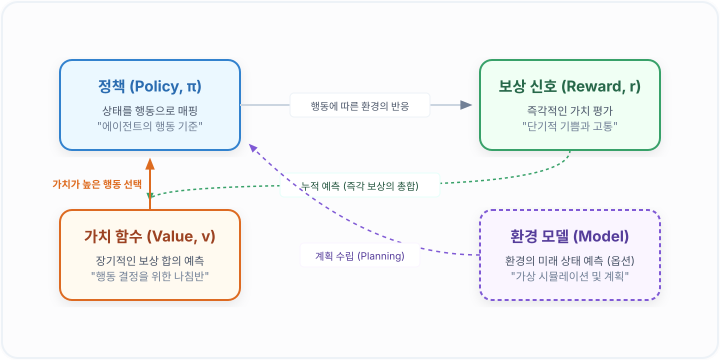


### 1. 정책 (Policy, *π*)
에이전트가 특정 상황에서 **어떤 행동을 해야 할지 결정하는 행동 지침**입니다. 심리학으로 치면 특정 자극에 대해 동물이 보이는 반응의 규칙과 같습니다. 상황에 따라 단순한 대응 표(Look-up table)일 수도 있고, 복잡한 신경망이나 탐색 계산 과정일 수도 있습니다. 일반적으로 상황 *s*에서 행동 *a*를 선택할 확률 분포인 *π*(*a* | *s*)로 나타냅니다.

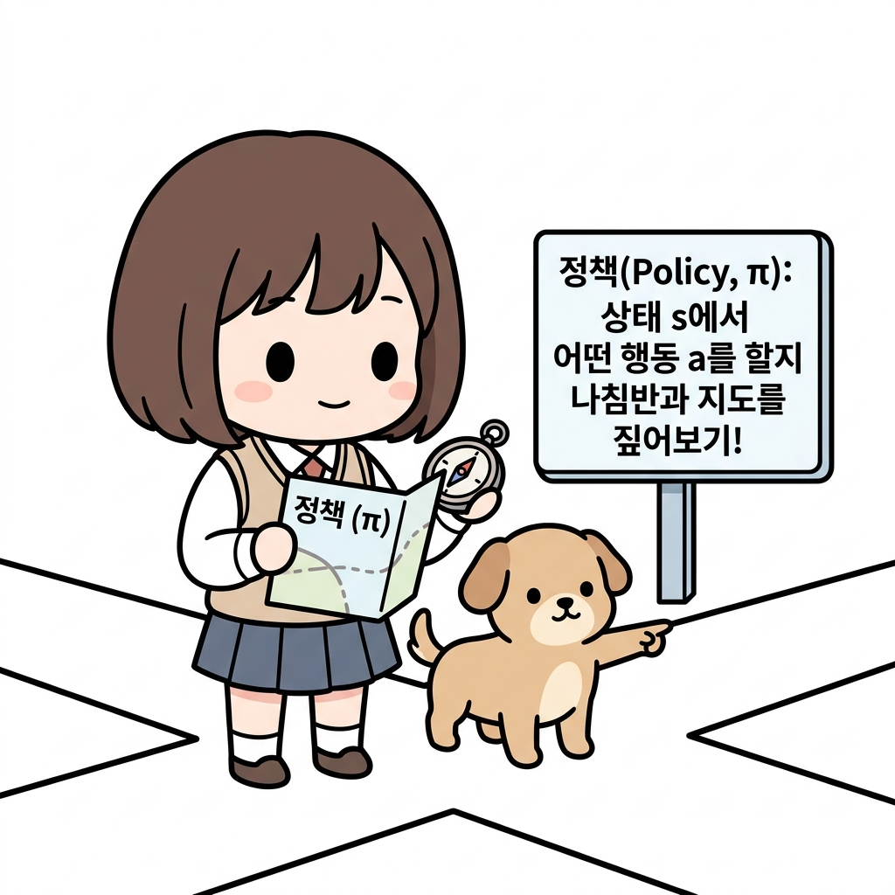


### 2. 보상 신호 (Reward Signal, *r*)
행동을 취한 직후 환경이 에이전트에게 돌려주는 **즉각적인 수치 피드백**입니다. 인간이 느끼는 찰나의 '기쁨'이나 '통증'과 같습니다. 보상 신호는 현재 에이전트의 행동이 좋았는지 나빴는지를 알려주는 가장 즉각적인 가늠자이며, 정책을 업데이트하는 직접적인 원인이 됩니다.

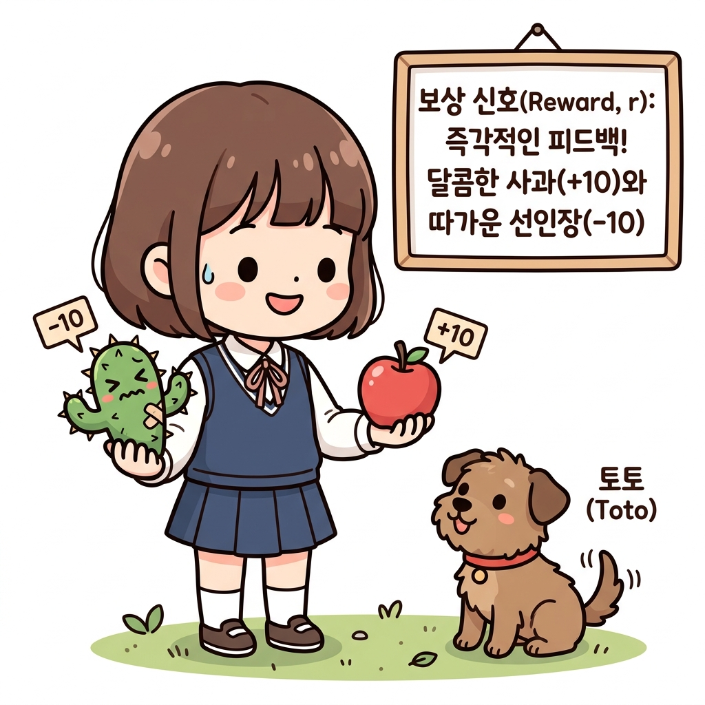


### 3. 가치 함수 (Value Function, *v*)
보상이 지금 이 순간의 좋고 나쁨을 나타낸다면, 가치는 **"장기적인 관점에서 미래에 받을 보상들의 총합이 얼마나 될 것인가"**를 나타내는 예측치입니다.
예를 들어 어떤 상태에서 지금 당장 받는 보상이 *r* = 0 이라 하더라도, 그 뒤에 엄청난 보상을 주는 상태들이 줄줄이 대기하고 있다면 그 상태의 가치 *v*는 매우 높습니다. 
반대로 지금 당장 꿀맛 같은 보상 *r* = 100을 주더라도 다음 발걸음에 낭떠러지로 떨어져 게임 오버가 된다면 그 상태의 가치 *v*는 바닥을 칩니다.


> [!IMPORTANT]
> **강화학습 알고리즘의 심장**은 바로 이 **가치 함수를 정확하게 추정해내는 것**입니다. 에이전트는 즉각적인 보상보다는 장기적인 가치 *v*가 가장 높은 행동을 선택하며 학습해 나갑니다. 보상은 환경이 그냥 던져주지만, 가치는 평생에 걸쳐 수없이 행동하며 스스로 어림짐작(추정)해 나가야 하므로 훨씬 계산하기 어렵고 까다롭습니다.

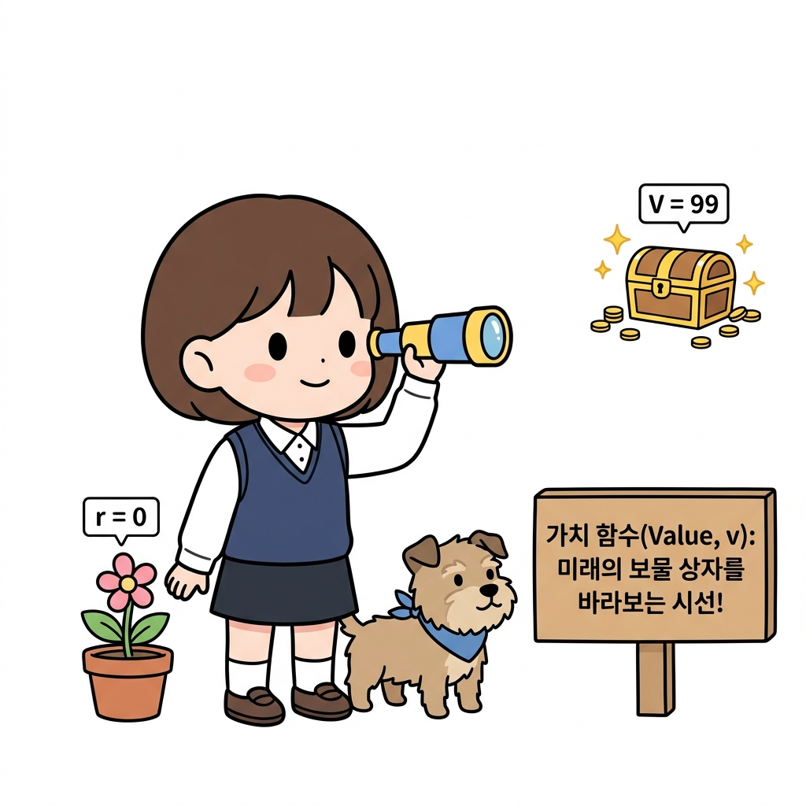


### 4. 환경 모델 (Model)
**환경이 앞으로 어떻게 반응할지 예측하게 해주는 가상의 내부 지도**입니다. "여기서 왼쪽으로 가면 벽에 부딪힐 거야", "오른쪽으로 가면 보상이 나올 거야"라는 식으로 미래 환경 변화를 미리 모사(시뮬레이션)해보는 용도입니다. 모델이 있으면 머릿속으로 시뮬레이션을 돌려 행동을 결정하는 **계획<sup>Planning</sup>**이 가능해집니다.
- **모델 기반<sup>Model-based</sup>**: 모델과 계획을 활용하여 똑똑하게 판단하는 방법
- **모델 없는<sup>Model-free</sup>**: 모델 없이 오직 몸으로 부딪히며 시행착오로만 배우는 방법

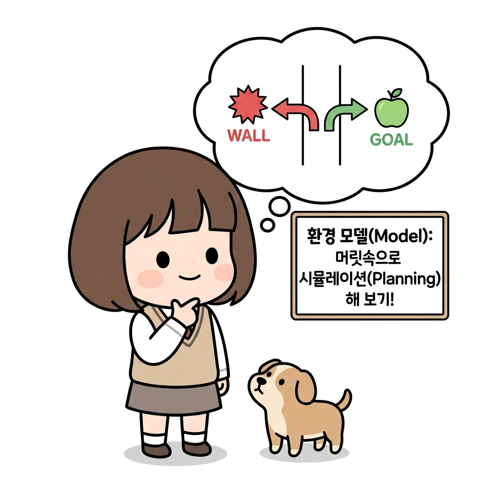


---


## 1.4 탐색(Exploration)과 활용(Exploitation)의 딜레마

강화학습을 관통하는 가장 유명하고도 어려운 문제가 바로 **탐색과 활용의 조율**입니다.

이해를 돕기 위해 실생활의 식당 선택 문제를 떠올려 봅시다.
- **활용 (Exploitation)**: 지난주에 가서 인생 최고의 파스타를 맛보았던 검증된 맛집에 오늘도 똑같이 밥을 먹으러 가는 행동입니다. (안정적인 보장)
- **탐색 (Exploration)**: 한 번도 가보지 않은 골목길 끝의 낯선 식당을 모험 삼아 들어가 보는 행동입니다. (새로운 대박의 가능성)

만약 늘 먹던 안전한 맛집만 간다면(활용만 추구), 골목 끝에 새로 생긴 훨씬 더 맛있고 저렴한 맛집(더 큰 보상)을 평생 발견할 기회를 놓치게 됩니다. 반대로 매일 낯선 식당만 찾아다니며 모험을 한다면(탐색만 추구), 끔찍하게 맛없는 음식을 먹고 배탈이 나는 리스크를 계속해서 겪어야 합니다.

강화학습 에이전트 역시 마찬가지입니다. 과거에 대박이 났던 최선의 행동 패턴만 주구장창 고집하면(활용) 최적의 정책을 결코 찾아낼 수 없고, 매번 새로운 기기만 만져보며 무작위 모험만 하면(탐색) 누적 보상을 풍족하게 쌓을 수 없습니다. 이 두 가지 행동 양식 사이에서 **적절한 타협점과 균형을 맞추는 일**이 강화학습 시스템 설계의 핵심 과제입니다.

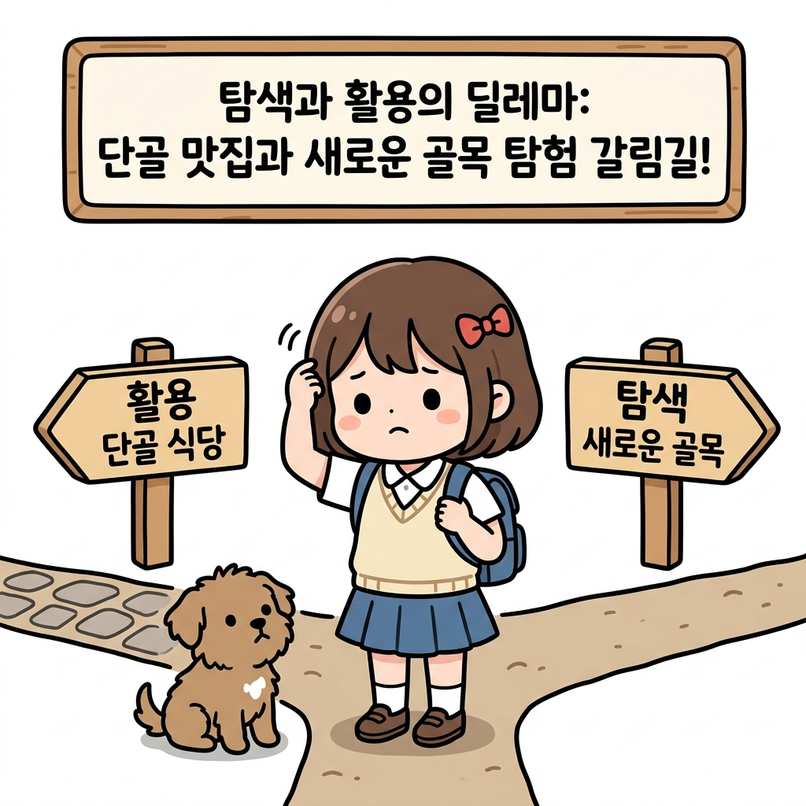


---


## 1.5 맛보기 예제: 틱택토 게임

강화학습이 실제로 어떻게 작동하는지 3x3 격자판에 삼목을 두는 **틱택토<sup>Tic-Tac-Toe</sup>** 게임을 통해 가볍게 맛을 보겠습니다.

```
 X | O | O 
---+---+---
 O | X | X 
---+---+---
   |   | X  (X 플레이어가 가로/세로/대각선 3칸을 이어 승리)
```

상대방에 대한 사전 정보가 전혀 없는 상태에서, 우리는 X를 놓는 플레이어로서 게임을 이길 확률을 극대화하는 법을 배우고자 합니다.


### 가치 표와 행동의 흐름
1. 게임판 위에 나타날 수 있는 모든 판 배치 상태에 대해 **승리할 확률(가치)**을 기록하는 표를 만듭니다.
2. 초기 상태에는 이길 확률을 반반(`0.5`)으로 설정하고, 완전히 3줄을 이어 승리한 상태는 가치를 `1.0`, 지거나 무승부가 된 상태는 가치를 `0.0`으로 고정합니다.
3. 게임을 진행하면서 대부분의 턴에는 가치 표를 보고 **승률(가치)이 가장 높게 예상되는 칸**에 X를 둡니다(활용). 
4. 하지만 간혹 의외의 좋은 경로를 발굴하기 위해 **무작위 빈칸**에 돌을 둡니다(탐색).

### 가치 함수의 점진적 갱신 (Temporal Difference)
게임을 두다 보면 이전 수의 판단(가치)이 실제 그 뒤에 이어진 결과와 다른 경우가 많습니다. 이때 강화학습 에이전트는 아래와 같이 아주 직관적인 수식을 사용하여 가치 표의 값들을 고쳐 나갑니다.

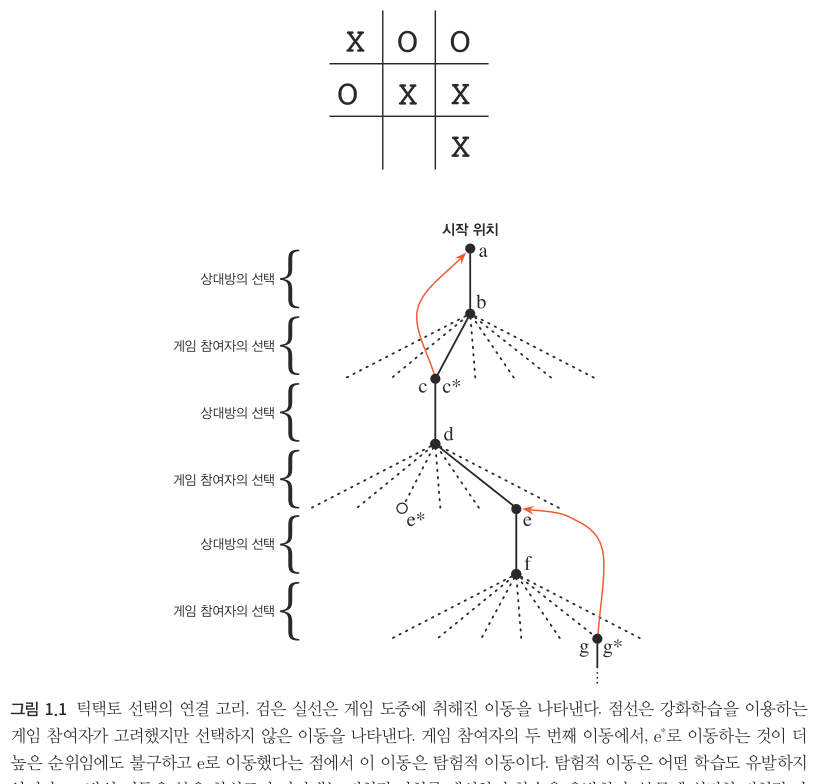

**그림 1-2** 틱택토 게임에서의 가치 갱신(Backup) 흐름

에이전트가 탐색을 제외하고 탐욕적으로 둔 수들에 대해, 한 단계 전 상태의 가치 *V*(*S*<sub>*t*</sub>)를 다음 단계 상태의 가치 *V*(*S*<sub>*t+1*</sub>)를 바라보며 조금씩 갱신합니다.

$$V(S_t) \leftarrow V(S_t) + \alpha \left[ V(S_{t+1}) - V(S_t) \right]$$

- *α*: 학습 속도를 조절하는 작은 양수(시간 간격 파라미터)
- $V(S_{t+1}) - V(S_t)$: 현재 예측치와 다음 단계 예측치 사이의 오차(시간차 오차)

> [!TIP]
> 이 수식은 **"지금 내 예상이 틀렸을 수 있으니, 한 단계 더 지나고 나서 관찰한 더 정확한 예상치($V(S_{t+1})$)를 향해 현재 예측치($V(S_t)$)를 조금씩 끌어당겨 수정하자!"**라는 뜻을 담고 있습니다. 
> 게임을 수만 번 반복하다 보면, 이 단순한 갱신 규칙 하나만으로도 상대방의 약점과 함정을 파고드는 완벽한 최적 승리 정책에 도달하게 됩니다.


---


## 1.6 강화학습의 기원과 역사

현대의 강화학습은 하늘에서 뚝 떨어진 학문이 아닙니다. 서로 완전히 다른 문제의식을 가지고 발전해 온 **세 가지 거대한 줄기**가 1980년대 후반에 한데 모여 융합되면서 탄생했습니다.

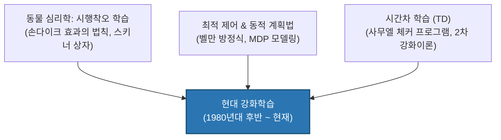
```mermaid
graph TD
    A["동물 심리학: 시행착오 학습<br>(손다이크 효과의 법칙, 스키너 상자)"] --> D["현대 강화학습<br>(1980년대 후반 ~ 현재)"]
    B["최적 제어 & 동적 계획법<br>(벨만 방정식, MDP 모델링)"] --> D
    C["시간차 학습 (TD)<br>(사무엘 체커 프로그램, 2차 강화이론)"] --> D
    
    style D fill:#2b76b2,stroke:#1a5276,stroke-width:2px,color:#fff
```

### 1. 첫 번째 갈래: 동물 심리학과 시행착오 학습 (Trial-and-Error)
19세기 후반, 에드워드 손다이크<sup>Edward Thorndike</sup>는 고양이가 상자 문을 열고 탈출하는 실험을 통해 **효과의 법칙<sup>Law of Effect</sup>**을 발표했습니다. "만족스러운 결과를 내는 행동은 기억 속에 강화되어 더 자주 나타나고, 고통을 주는 행동은 약화된다"는 원리입니다. 스키너 상자 실험 등으로 정교해진 이 시행착오 동물학습 이론은 앨런 튜링의 '기쁨-고통 시스템' 설계 구상과 1950년대의 미로 찾기 기계(섀넌의 쥐 등)를 거쳐 인공지능 초기 탐색 연구의 기틀이 되었습니다.


### 2. 두 번째 갈래: 최적 제어와 동적 계획법 (Optimal Control)
1950년대 중반, 수학자 리처드 벨만<sup>Richard Bellman</sup>은 시스템을 최적으로 조절하기 위해 시스템 상태와 가치 함수를 정의하는 함수 방정식을 제안했습니다. 이것이 바로 우리가 6강에서 중요하게 다룰 **벨만 방정식<sup>Bellman Equation</sup>**이자 **동적 계획법<sup>Dynamic Programming</sup>**의 시작입니다. 벨만은 의사결정 과정을 수학적으로 엄밀하게 모델링하는 **마르코프 결정 과정<sup>MDP</sup>** 체계를 정립하여 최적 제어 분야의 기틀을 닦았습니다. 다만, 당시의 최적 제어는 환경의 물리 법칙(모델)을 완벽하게 알고 수학적으로 푸는 오프라인 연산이 주를 이루었습니다.

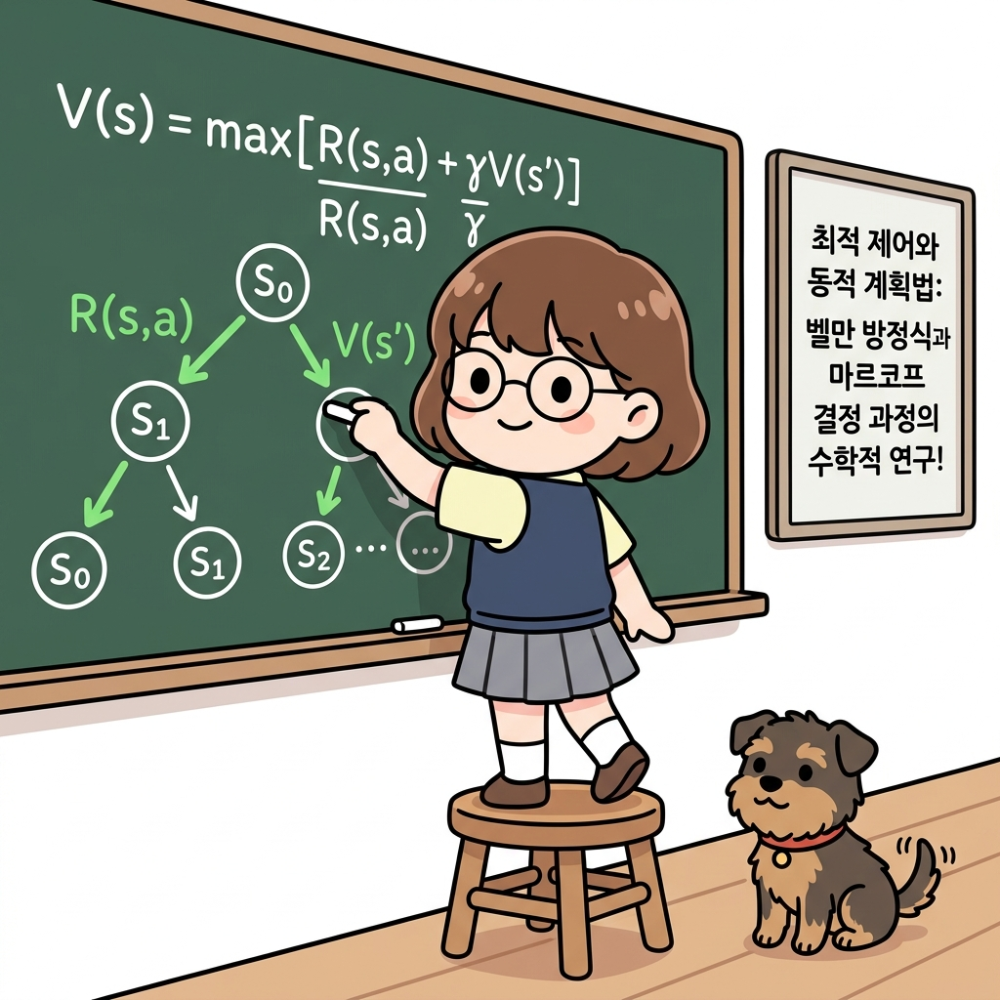


### 3. 세 번째 갈래: 시간차 학습 (Temporal Difference, TD)
사무엘<sup>Arthur Samuel</sup>은 1959년 컴퓨터가 스스로 서양 장기인 체커를 두며 실력을 올리는 프로그램을 개발했습니다. 이때 사용된 것이 바로 **"예측치와 예측치의 차이로부터 배우는"** 시간차 학습 기법이었습니다. 이는 동물 심리학의 '2차 강화자' 개념(음식과 짝지어진 소리만 들어도 침을 흘리는 현상)을 기계 학습에 훌륭하게 이식한 선구적인 시도였습니다.

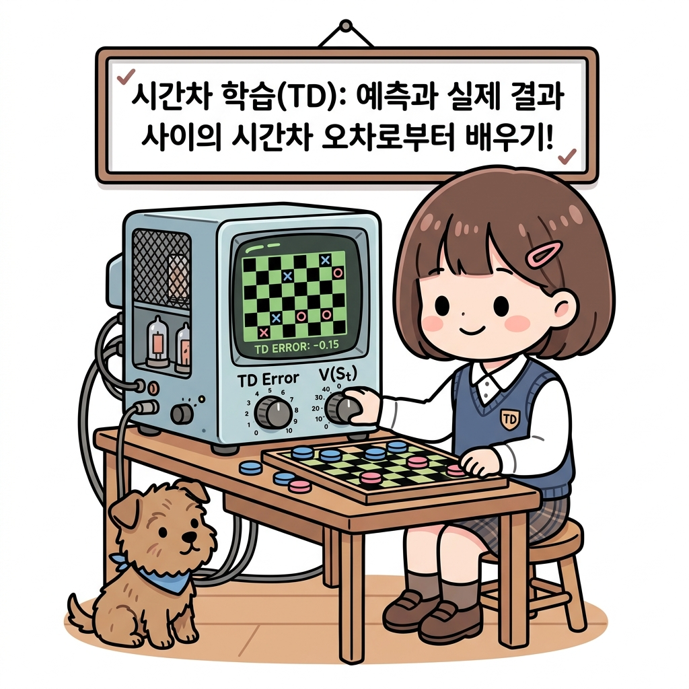


---

### 세 갈래의 위대한 결합 (1989년)
오랫동안 남남처럼 독립적으로 발전하던 이 세 갈래는, 1980년대 들어 해리 클로프<sup>Harry Klopf</sup>의 쾌락주의적 뉴런 모델링 촉구와 바르토-서튼 연구팀의 본격적인 노력으로 연결되기 시작했습니다. 

그리고 마침내 **1989년 크리스 왓킨스<sup>Chris Watkins</sup>의 Q-러닝<sup>Q-learning</sup>** 논문 발표를 통해, **동적 계획법(최적 제어)**의 수학적 뼈대 위에 **시행착오 학습(심리학)**과 **시간차 학습(사무엘의 예측)**이 물샐틈없이 결합되면서 오늘날 인류가 바둑 챔피언 이세돌을 꺾은 알파고를 빚어내고 자율주행 차량을 굴리는 **심층 강화학습<sup>Deep Reinforcement Learning</sup>**의 대항해가 비로소 막을 올리게 되었습니다.

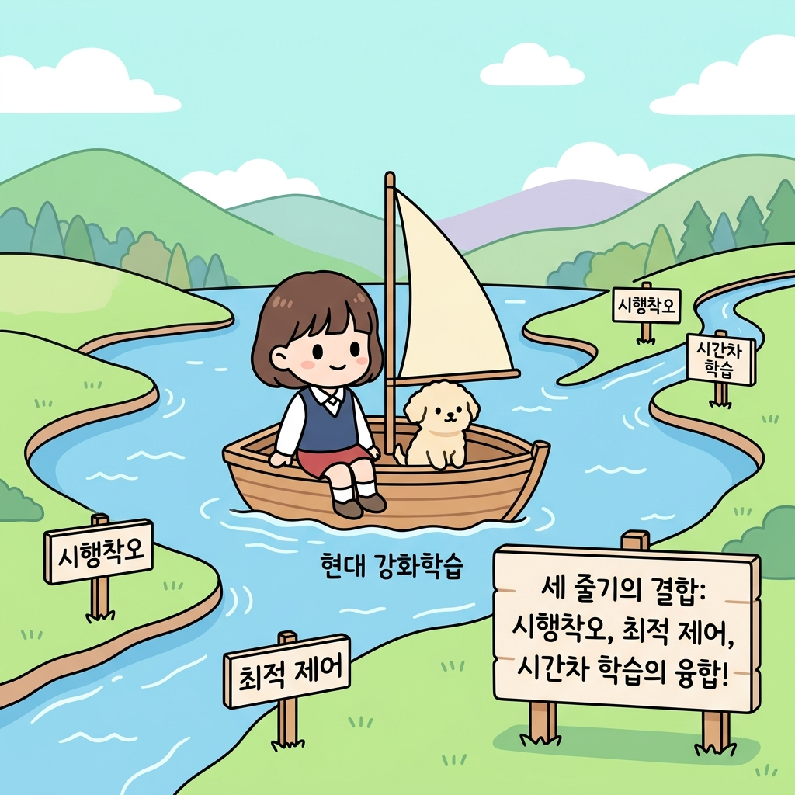


---


## 1.7 정리

강화학습은 어떤 정해진 설명서(지도학습)나 복잡한 지도 제작(환경 모델)이 없어도, **에이전트가 직접 세상과 상호작용하고 부딪치며 더 나은 삶을 향해 발전해 가는 모습을 수학적·계산적으로 정립한 학문**입니다. 

이어지는 2강부터는 강화학습의 가장 친근하고 단순한 형태인 **밴디트 문제**를 시작으로, 에이전트가 어떻게 맛집 탐방(탐색)과 기존 단골집(활용) 사이에서 지혜롭게 선택을 이어가는지 파이썬 코드로 직접 확인해 보겠습니다.