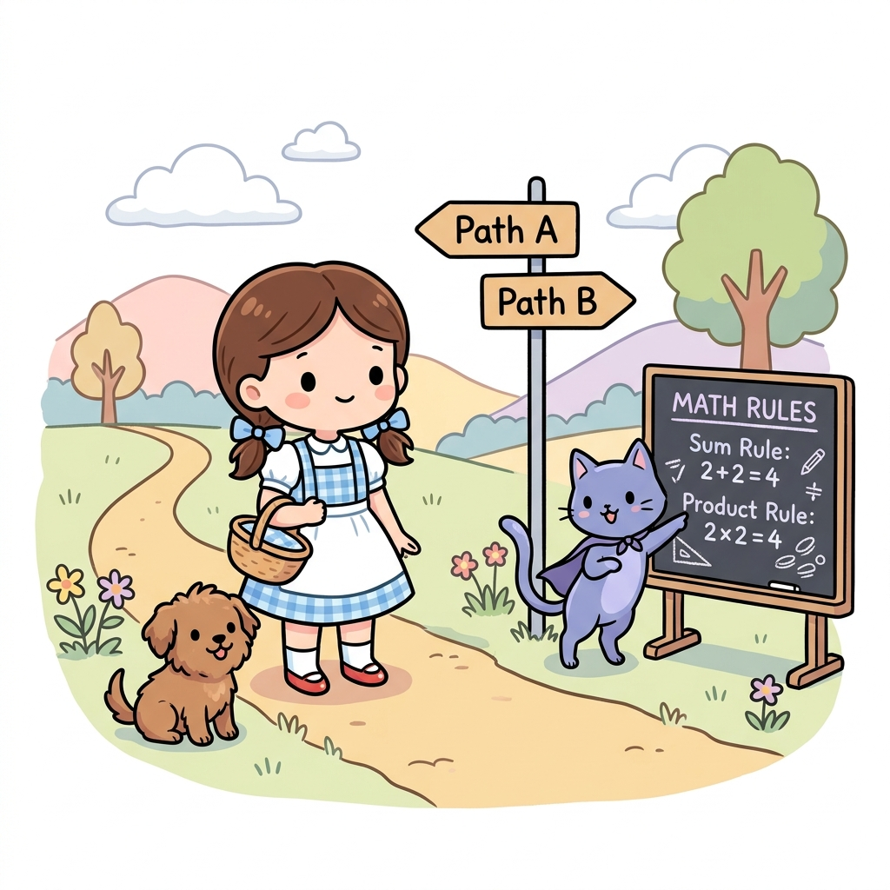
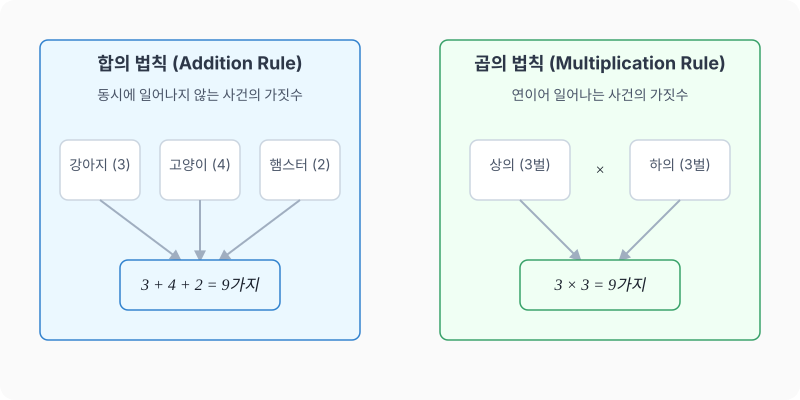

# 01강. 경우의 수와 합의 법칙, 곱의 법칙

**그림 02-1** 두 갈래의 갈림길(A, B)과 각 길 속 선택지의 합/곱 가짓수를 판서하며 강의해주는 지니

경우의 수는 모험 경로에서 우리가 직면할 수 있는 모든 선택지의 수입니다. 갈림길을 차례로 덧셈하여 전체 가짓수를 알아내는 **합의 법칙**과, 문들을 연속해서 통과하며 선택지를 곱하는 **곱의 법칙**의 첫 단추를 지니와 도로시의 갈림길 판서와 함께 유쾌하게 채워봅시다!

---

## 1. 학습 목표
- 사건과 경우의 수의 뜻을 이해한다.
- 동시에 일어나지 않는 두 사건에 대해 합의 법칙을 적용할 수 있다.
- 연이어 일어나는 두 사건에 대해 곱의 법칙을 적용할 수 있다.

---

## 2. 핵심 개념

### (1) 사건과 경우의 수
- **사건 (Event)**: 주사위를 던지거나 동전을 던지는 것과 같이, 같은 조건에서 반복할 수 있는 실험이나 관찰에 의해 나타나는 결과입니다.
- **경우의 수 (Number of Cases)**: 어떤 사건이 일어날 수 있는 가지 수입니다.
  - *예시*: 주사위 한 개를 던질 때, '짝수의 눈이 나오는 사건'의 경우의 수는 $2, 4, 6$으로 총 $3$가지입니다.

### (2) 합의 법칙 (Addition Rule)
두 사건 $A$, $B$가 동시에 일어나지 않을 때, 사건 $A$가 일어나는 경우의 수를 $m$, 사건 $B$가 일어나는 경우의 수를 $n$이라고 하면, 사건 $A$ **또는** 사건 $B$가 일어나는 경우의 수는 다음과 같습니다.
$$m + n$$
- *키워드*: **또는(Or)**, **~하거나**
- *주의*: 두 사건이 동시에 발생할 수 없을 때에만 성립합니다.

### (3) 곱의 법칙 (Multiplication Rule)
사건 $A$가 일어나는 경우의 수가 $m$이고, 그 각각에 대하여 사건 $B$가 일어나는 경우의 수가 $n$일 때, 두 사건 $A$, $B$가 **동시에(연이어)** 일어나는 경우의 수는 다음과 같습니다.
$$m \times n$$
- *키워드*: **동시에**, **연이어**, **그리고(And)**, **~하고 나서**
- *주의*: 여기서 '동시에'는 물리적으로 같은 시각만을 의미하는 것이 아니라, 두 사건이 모두 빠짐없이 일어나는 상황을 뜻합니다.

* 옷장에서 상의 3벌과 하의 2벌을 골라 매칭하는 경우, 상의를 고르는 각각의 경우($3$가지)마다 하의를 고르는 경우($2$가지)가 결합하므로 총 $3 \times 2 = 6$가지의 조합이 생깁니다.

---

## 3. 시각 자료: 합의 법칙과 곱의 법칙 도식

---

## 4. 실전 예제

### 예제 1 (합의 법칙)
> **문제**: 도로시네 반에서는 현장 학습 장소로 산 $3$곳(설악산, 지리산, 월출산) 또는 바다 $2$곳(해운대, 만리포) 중 한 곳을 선택하려고 합니다. 선택할 수 있는 총 여행지의 경우의 수는 몇 가지인가요?
>
> **풀이**:
> 산을 선택하는 사건과 바다를 선택하는 사건은 동시에 일어날 수 없습니다. 따라서 합의 법칙을 적용합니다.
> $$\text{경우의 수} = 3 \text{(산)} + 2 \text{(바다)} = 5\text{가지}$$
> **정답**: $5$가지

### 예제 2 (곱의 법칙)
> **문제**: 도로시는 상의로 흰색, 빨간색, 연두색 블라우스 $3$벌이 있고, 하의로 핑크색 스커트, 파란색 스커트, 노란색 바지 $3$벌이 있습니다. 상의와 하의를 각각 하나씩 선택하여 입을 수 있는 옷차림의 총 경우의 수는 몇 가지인가요?
>
> **풀이**:
> 상의를 고르는 사건과 하의를 고르는 사건은 연이어 일어나는(모두 만족해야 하는) 사건입니다. 따라서 곱의 법칙을 적용합니다.
> $$\text{경우의 수} = 3 \text{(상의)} \times 3 \text{(하의)} = 9\text{가지}$$
> **정답**: $9$가지

### 예제 3 (혼합 문제)
> **문제**: 동전 한 개와 주사위 한 개를 동시에 던질 때, 일어날 수 있는 모든 경우의 수는 몇 가지인가요?
>
> **풀이**:
> 동전을 던져 나오는 경우의 수는 $2$가지(앞, 뒤)이고, 주사위를 던져 나오는 경우의 수는 $6$가지($1$부터 $6$까지)입니다. 두 사건이 동시에 발생하므로 곱의 법칙을 적용합니다.
> $$\text{경우의 수} = 2 \text{(동전)} \times 6 \text{(주사위)} = 12\text{가지}$$
> **정답**: $12$가지

---

## 5. 핵심 요약
1. **경우의 수**는 어떤 사건이 일어날 수 있는 가짓수이다.
2. 사건 $A$, $B$가 동시에 일어나지 않는 **선택의 상황(Or)** 에서는 **합의 법칙 ($m+n$)**을 사용한다.
3. 사건 $A$, $B$가 연이어 일어나는 **조합의 상황(And)** 에서는 **곱의 법칙 ($m \times n$)**을 사용한다.
