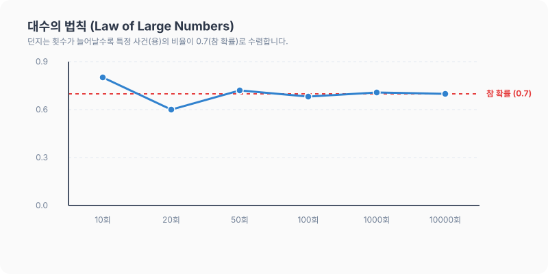

# 02강. 확률의 뜻과 실험적 확률

**그림 02-2** 동전을 직접 백 번 던지며 앞뒷면이 나오는 횟수를 장부에 적는 도로시와 시간의 경과에 따른 수렴을 설명하는 지니

확률이란 불확실한 결과를 객관적으로 파악하기 위한 수단입니다. 특히 주사위나 동전을 무수히 많이 던지는 실험을 통해 얻은 비율인 **실험적 확률**과, 시행 횟수가 끝없이 많아질수록 이론적인 진짜 확률에 가깝게 수렴한다는 **대수의 법칙**을 도로시의 동전 던지기 기록장과 함께 직관적으로 배워봅시다!

---

## 1. 학습 목표
- 확률의 기본적인 의미를 이해한다.
- 실험이나 관찰을 통해 얻어지는 실험적 확률(통계적 확률)의 개념을 이해한다.
- 대수의 법칙(Law of Large Numbers)의 의의를 파악한다.

---

## 2. 핵심 개념

### (1) 확률의 의미
- **확률 (Probability)**: 어떤 사건이 일어날 수 있는 가능성을 수치로 나타낸 것입니다. 보통 $0$과 $1$ 사이의 값(또는 $0\%$와 $100\%$ 사이)으로 표현합니다.
  - 표현 방식: 분수, 소수, 백분율 등.

### (2) 실험적 확률 (Empirical Probability / 통계적 확률)
- 동일한 조건 아래에서 어떤 실험이나 관찰을 $N$번 반복할 때, 사건 $A$가 일어난 횟수를 $r$이라 하면, $N$을 충분히 크게 함에 따라 상대도수 $\frac{r}{N}$가 일어나는 비율이 일정한 값 $P$에 한없이 가까워집니다. 이 일정한 값 $P$를 사건 $A$의 **실험적 확률(통계적 확률)** 이라고 합니다.
$$P(A) \approx \frac{r}{N} \quad (\text{단, } N\text{은 충분히 큰 수})$$

### (3) 대수의 법칙 (Law of Large Numbers)
- 실험이나 시행의 횟수 $N$이 커질수록, 실험을 통해 얻어지는 상대도수 $\frac{r}{N}$는 수학적으로 계산된 참 확률에 수렴한다는 법칙입니다.
  - *주의*: 시행 횟수가 적을 때는 우연성이 크게 작용하여 참 확률과 격차가 생길 수 있으나, 시행 횟수가 매우 많아지면 결국 참 확률로 수렴합니다.

* 동전을 던지는 횟수가 적을 때는 앞면이 나오는 비율이 $0.8$이나 $0.2$처럼 극단적으로 나올 수 있지만, 던지는 횟수를 $800$번 이상 늘릴수록 결국 수학적 확률인 $0.5$(50%) 근처로 안정되게 수렴하게 됩니다.

---

## 3. 시각 자료: 대수의 법칙 수렴 도식

---

## 4. 실전 예제

### 예제 1 (실험적 확률과 상대도수)
> **문제**: 토토가 주머니에서 특이하게 생긴 동물 복사뼈(네 면에 각각 태양, 달, 사자, 용이 그려짐)를 여러 번 던져서 '용' 그림이 나오는 횟수를 기록했습니다. 기록한 표는 다음과 같습니다.
>
> | 던진 횟수 ($N$) | 용이 나온 횟수 ($r$) | 용이 나온 비율 ($\frac{r}{N}$) |
> | :---: | :---: | :---: |
> | $10$ | $8$ | $\frac{8}{10} = 0.8$ |
> | $100$ | $68$ | $\frac{68}{100} = 0.68$ |
> | $1000$ | $709$ | $\frac{709}{1000} = 0.709$ |
> | $10000$ | $7000$ | $\frac{7000}{10000} = 0.7$ |
>
> 던지는 횟수가 늘어남에 따라 '용'이 나올 실험적 확률은 어떤 값에 가까워지고 있나요?
>
> **풀이**:
> 던지는 횟수 $N$이 $10 \to 100 \to 1000 \to 10000$으로 커질수록, 비율 $\frac{r}{N}$가 $0.8 \to 0.68 \to 0.709 \to 0.7$로 변화하며 특정 값인 $0.7$에 수렴하고 있습니다. 따라서 대수의 법칙에 의해 실험적 확률은 $0.7$($70\%$)로 수렴합니다.
> **정답**: $0.7$

### 예제 2 (실생활에서의 확률 비교)
> **문제**: 토토와 새로 전학 온 농구선수 친구의 자유투 성공률을 비교하려고 합니다.
> - 농구선수 친구: 작년 경기에서 자유투 총 $100$개를 던져 $60$개 성공
> - 토토: 연습 상황에서 자유투 총 $50$개를 던져 $10$개 성공
> 두 사람의 자유투 성공 확률을 비교해 보세요.
>
> **풀이**:
> - 농구선수 친구의 성공 확률: $P(\text{친구}) = \frac{60}{100} = 0.6$
> - 토토의 성공 확률: $P(\text{토토}) = \frac{10}{50} = 0.2$
>
> 두 사람의 성공 확률을 비교했을 때, 농구선수 친구($0.6$)가 토토($0.2$)보다 자유투를 성공시킬 확률이 월등히 높음을 알 수 있습니다.
> **정답**: 농구선수 친구가 더 높음 (친구: $0.6$, 토토: $0.2$)

---

## 5. 핵심 요약
1. **확률**은 어떤 사건이 발생할 가능성을 수치화한 것이다.
2. **실험적 확률**은 실제 여러 번의 실험이나 관찰을 통해 나타난 비율을 이용해 확률을 정의하는 방식이다.
3. **대수의 법칙**에 의하여 시행 횟수 $N$이 충분히 커질 때 실험적 확률은 실제 참 확률에 수렴한다.
