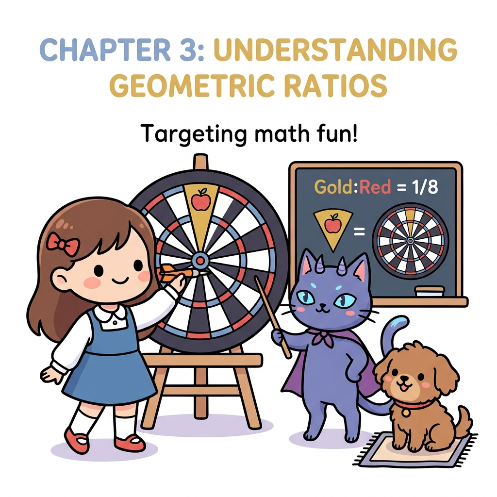
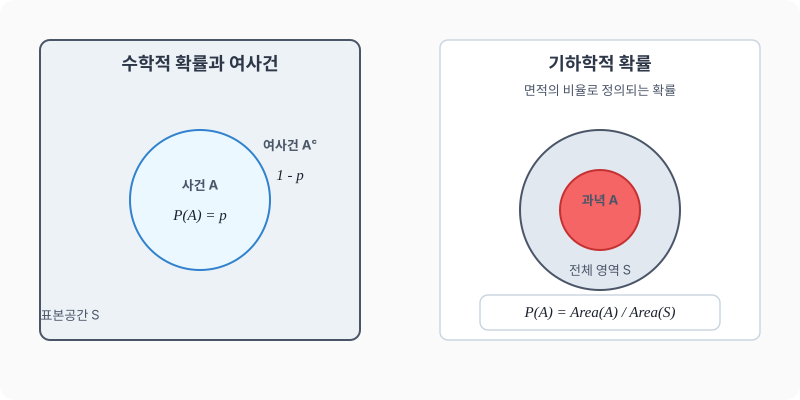

# 03강. 수학적 확률과 기하학적 확률

**그림 02-3** 다트 과녁판의 사과 명중 부위 면적을 활용하여 기하학적 비율과 확률을 강의하는 지니와 도로시

수학적 확률은 일어날 수 있는 모든 경우의 수에 대해 특정 사건이 일어나는 경우의 수의 비율입니다. 더불어 선의 길이, 영역의 넓이, 부피의 비율로 확률을 다루는 **기하학적 확률**의 개념까지 지니의 마법 다트판을 통해 입체적으로 마스터해 봅시다!

---

## 1. 학습 목표
- 수학적 확률의 정의를 알고 이를 구할 수 있다.
- 확률의 기본 성질을 이해한다.
- 여사건의 확률과 확률의 덧셈정리(배반사건)를 활용할 수 있다.
- 기하학적 확률의 개념을 이해하고 적용할 수 있다.

---

## 2. 핵심 개념

### (1) 수학적 확률 (Mathematical Probability)
어떤 시행에서 일어날 수 있는 모든 경우의 수가 $N$가지이고, 각 경우가 일어날 가능성이 모두 같을 때, 사건 $A$가 일어나는 경우의 수가 $a$가지이면 사건 $A$가 일어날 확률 $P(A)$는 다음과 같습니다.
$$P(A) = \frac{n(A)}{n(S)} = \frac{a}{N}$$
- $S$: 표본공간 (전체 사건의 집합)
- $A$: 특정 사건

### (2) 확률의 기본 성질
임의의 사건 $A$에 대하여:
1. 사건 $A$가 일어날 확률 $P(A)$는 항상 $0$ 이상 $1$ 이하입니다.
   $$0 \le P(A) \le 1$$
2. 반드시 일어나는 사건(전체사건 $S$)의 확률은 $1$입니다.
   $$P(S) = 1$$
3. 절대로 일어날 수 없는 사건(공사건 $\emptyset$)의 확률은 $0$입니다.
   $$P(\emptyset) = 0$$

### (3) 여사건의 확률 (Complementary Probability)
사건 $A$가 일어나지 않을 사건을 $A$의 여사건이라 하고 $A^c$로 나타냅니다. 사건 $A$가 일어날 확률을 $p$라고 할 때, 사건 $A$가 일어나지 않을 확률 $P(A^c)$는 다음과 같습니다.
$$P(A^c) = 1 - P(A) = 1 - p$$

### (4) 확률의 덧셈정리 (배반사건)
두 사건 $A$, $B$가 동시에 일어나지 않을 때(즉, 배반사건 $A \cap B = \emptyset$ 일 때), 사건 $A$ 또는 사건 $B$가 일어날 확률은 각각의 확률의 합과 같습니다.
$$P(A \cup B) = P(A) + P(B)$$

### (5) 기하학적 확률 (Geometric Probability)
- 연속적인 변수를 갖는 표본공간에서 어떤 영역 $S$ 안에 영역 $A$가 포함되어 있을 때, 영역 $S$에 임의로 점을 하나 찍을 때 그 점이 영역 $A$에 들어갈 확률은 다음과 같습니다.
  $$P(A) = \frac{\text{영역 } A\text{의 크기 (길이, 넓이, 부피)}}{\text{전체 영역 } S\text{의 크기}}$$

* 일정한 규격의 격자 타일 바닥에 동전을 임의로 던질 때, 동전이 특정 타일 영역(예: 녹색 영역) 안에 완벽하게 들어갈 확률은 전체 영역에 대비한 해당 영역의 면적 비율로 결정됩니다. 이렇게 무한한 경우의 수가 존재하는 연속적 공간에서는 경우의 수 대신 **영역의 넓이 비율**을 이용해 기하학적 확률을 구합니다.

---

## 3. 시각 자료: 확률의 영역과 기하학적 확률

---

## 4. 실전 예제

### 예제 1 (수학적 확률)
> **문제**: 서로 다른 두 개의 주사위를 동시에 던질 때, 두 눈의 수의 합이 $10$ 이상일 확률을 구하세요.
>
> **풀이**:
> - 일어날 수 있는 모든 경우의 수 $n(S) = 6 \times 6 = 36$가지
> - 합이 $10$ 이상인 사건 $A$: $(4,6), (5,5), (5,6), (6,4), (6,5), (6,6)$으로 총 $6$가지
> - 따라서 구하고자 하는 확률 $P(A)$는:
>   $$P(A) = \frac{n(A)}{n(S)} = \frac{6}{36} = \frac{1}{6}$$
> **정답**: $\frac{1}{6}$

### 예제 2 (여사건의 확률)
> **문제**: 전체 인원이 $40$명인 학급에서 교탁 바로 앞의 두 자리를 배정받는 제비뽑기를 하려고 합니다. 토토가 교탁 바로 앞자리리에 앉지 않게 될 확률을 구하세요.
>
> **풀이**:
> - 교탁 바로 앞자리에 앉게 될 사건 $A$의 확률: $P(A) = \frac{2}{40} = 0.05$
> - 교탁 바로 앞자리에 앉지 않을 사건 $A^c$의 확률은 여사건의 성질을 이용합니다:
>   $$P(A^c) = 1 - P(A) = 1 - 0.05 = 0.95$$
> **정답**: $0.95$ ($95\%$)

### 예제 3 (기하학적 확률)
> **문제**: 오른쪽 그림과 같이 반지름의 길이가 각각 $1$, $2$인 동심원으로 이루어진 과녁이 있습니다. 이 과녁에 화살을 쏠 때, 화살이 빨간색 안쪽 과녁(반지름 $1$인 원)에 맞을 확률을 구하세요. (단, 화살은 반드시 과녁 안에 맞고, 영역에 맞을 확률은 면적에 비례합니다.)
>
> **풀이**:
> - 전체 영역 $S$(반지름 $2$인 원)의 넓이: $\pi \times 2^2 = 4\pi$
> - 표적 영역 $A$(반지름 $1$인 원)의 넓이: $\pi \times 1^2 = \pi$
> - 따라서 기하학적 확률은:
>   $$P(A) = \frac{\text{영역 } A\text{의 넓이}}{\text{전체 영역 } S\text{의 넓이}} = \frac{\pi}{4\pi} = \frac{1}{4}$$
> **정답**: $\frac{1}{4}$ ($25\%$)

---

## 5. 핵심 요약
1. **수학적 확률**은 모든 근원사건이 일어날 가능성이 같을 때, $\frac{\text{사건 } A\text{의 경우의 수}}{\text{전체 경우의 수}}$로 계산한다.
2. 어떤 사건 $A$가 일어날 확률 $P(A)$는 항상 $0 \le P(A) \le 1$이다.
3. '적어도 ~가 아닐 확률' 등 반대의 경우를 구할 때는 **여사건의 확률 ($1 - P(A)$)**을 적용하면 편리하다.
4. 연속적인 영역에서의 가능성은 **기하학적 확률 (넓이의 비)**을 이용해 구한다.
