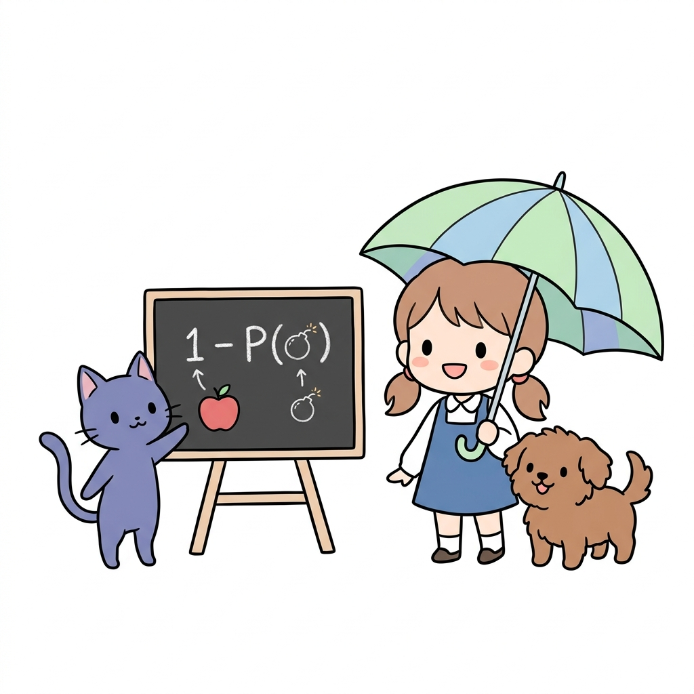
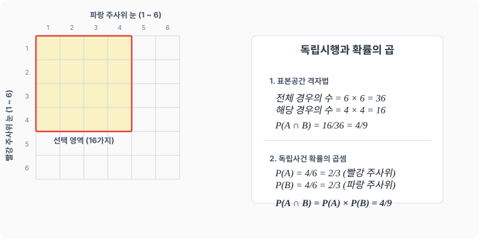

# 04강. 독립사건과 확률의 곱셈

**그림 02-4** 전체 확률(1)에서 폭탄 확률 P(A)를 소거한 여사건 우산 아래에서 안심하는 도로시와 토토, 그리고 지니

서로 영향을 전혀 주지 않는 **독립사건**의 개념과, 연이어 독립사건이 터질 때의 계산 법칙인 **확률의 곱셈정리**를 배웁니다. 폭탄이 터질 확률을 소거하고(여사건) 남은 안전 구역의 우산 밑에 서 있는 도로시와 지니의 비유식처럼, 확률의 빈틈없는 곱셈 법칙을 재미있게 내 것으로 만들어봅시다!

---

## 1. 학습 목표
- 독립사건의 뜻을 이해한다.
- 독립사건이 연이어 발생할 때의 확률 계산(확률의 곱셈정리)을 할 수 있다.
- 사건을 수치와 가능성으로 엄밀하게 비교하고 분석할 수 있다.

---

## 2. 핵심 개념

### (1) 독립사건 (Independent Events)
두 사건 $A$와 $B$가 일어날 때, 한 사건이 일어나는 것이 다른 사건이 일어날 확률에 영향을 주지 않는 경우, 두 사건 $A$, $B$를 서로 **독립(Independent)** 이라고 합니다.
- *예시*: 첫 번째 던진 주사위의 눈과 두 번째 던진 주사위의 눈은 서로에게 영향을 미치지 않으므로 독립사건입니다.

### (2) 독립사건의 확률의 곱셈
두 사건 $A$, $B$가 서로 독립일 때, 두 사건이 동시에(또는 연이어) 일어날 확률 $P(A \cap B)$는 각 사건이 일어날 확률의 곱과 같습니다.
$$P(A \cap B) = P(A) \times P(B)$$
- *활용*: 표본공간을 직접 그려서 모든 조합을 세지 않아도, 개별 확률의 곱을 통해 손쉽게 전체 확률을 계산할 수 있습니다.

* 여러 개의 독립사건이 일어날 때 '적어도 한 번 성공할 확률'을 직접 구하려면 복잡해집니다. 이럴 때는 곱셈법칙을 이용해 '모두 실패할 확률'을 먼저 구한 뒤, 전체 확률 $1$에서 이를 빼는 **여사건의 방법**을 결합하면 계산이 극적으로 간단해집니다.

### (3) 큰 수의 법칙과 수학적 확률의 수렴
시행 횟수 $N$이 매우 커지면, 실제 실험을 통해 나타나는 실험적 확률 $\frac{r}{N}$는 수학적으로 유도된 참 확률(수학적 확률) $P$에 점점 수렴합니다.
- 시행 횟수가 적을 때는 우연히 높은 승률(예: $10$번 중 $7$번 성공)이 나와 왜곡될 수 있으므로, 많은 횟수의 실험으로 참 확률을 교정해야 합니다.

---

## 3. 시각 자료: 독립사건의 확률 격자 및 곱셈 도식

---

## 4. 실전 예제

### 예제 1 (주사위 내기의 함정)
> **문제**: 프로드가 토토에게 다음과 같은 내기를 제안했습니다.
> - 토토는 주사위 눈 중에서 $4$개의 숫자($1, 2, 3, 4$)를 고릅니다.
> - 주사위 두 개(빨강, 파랑)를 동시에 던져 두 주사위에서 모두 토토가 고른 숫자가 나오면 토토가 이깁니다.
> - 그렇지 않으면(적어도 하나가 $5$나 $6$이 나오면) 프로드가 이깁니다.
> 이 내기는 누구에게 유리한가요?
>
> **풀이 1 (격자 세기)**:
> - 전체 경우의 수: $6 \times 6 = 36$가지
> - 두 주사위에서 모두 $1, 2, 3, 4$가 나오는 경우의 수: $4 \times 4 = 16$가지
> - 토토가 이길 확률:
>   $$P(\text{토토}) = \frac{16}{36} = \frac{4}{9} \approx 0.444$$
> - 프로드가 이길 확률:
>   $$P(\text{프로드}) = 1 - \frac{4}{9} = \frac{5}{9} \approx 0.556$$
>
> **풀이 2 (독립사건 곱셈)**:
> - 사건 $A$: 빨강 주사위에서 $1, 2, 3, 4$가 나올 확률 $\to P(A) = \frac{4}{6} = \frac{2}{3}$
> - 사건 $B$: 파랑 주사위에서 $1, 2, 3, 4$가 나올 확률 $\to P(B) = \frac{4}{6} = \frac{2}{3}$
> - 두 사건은 독립이므로:
>   $$P(A \cap B) = P(A) \times P(B) = \frac{2}{3} \times \frac{2}{3} = \frac{4}{9}$$
>
> **결론**: 토토가 이길 확률은 약 $44.4\%$로 절반($50\%$)보다 작고, 프로드가 이길 확률은 $55.6\%$로 더 높습니다. 따라서 이 내기는 프로드에게 절대적으로 유리합니다.
> **정답**: 프로드가 유리함

### 예제 2 (주머니 속 구슬 꺼내기)
> **문제**: 검은 공 $2$개와 흰 공 $1$개가 들어 있는 상자에서 동시에 두 손을 넣어 공을 $2$개 꺼냅니다. 이때 양손 모두에 검은 공이 들려 나올 확률을 구하세요.
>
> **풀이**:
> 세 개의 공에 번호를 붙입니다: 검은 공(1번, 2번), 흰 공(3번)
> - 공 $2$개를 동시에 꺼내는 전체 경우의 수: $(1,2), (1,3), (2,3)$의 총 $3$가지
> - 양손 모두 검은 공이 되는 경우의 수: $(1,2)$로 총 $1$가지
> - 따라서 확률은:
>   $$P = \frac{1}{3} \approx 0.333$$
>   **정답**: $\frac{1}{3}$

---

## 5. 핵심 요약

1. 두 사건이 서로 영향을 주지 않는다면 **독립사건**이다.
2. 두 독립사건이 함께 일어날 확률은 **각 사건의 확률을 곱하여** 쉽게 구할 수 있다: $P(A \cap B) = P(A) \times P(B)$.
3. 겉보기에 조건이 아홉 개 중 하나를 고르거나($1\sim4$가 나와서 유리해 보이는 등) 가능성이 커 보이는 내기일지라도, 수학적으로 독립사건의 곱셈이나 조합의 격자를 세밀히 계산해 보면 설계자의 함정(사기 행각)을 밝혀낼 수 있다.
