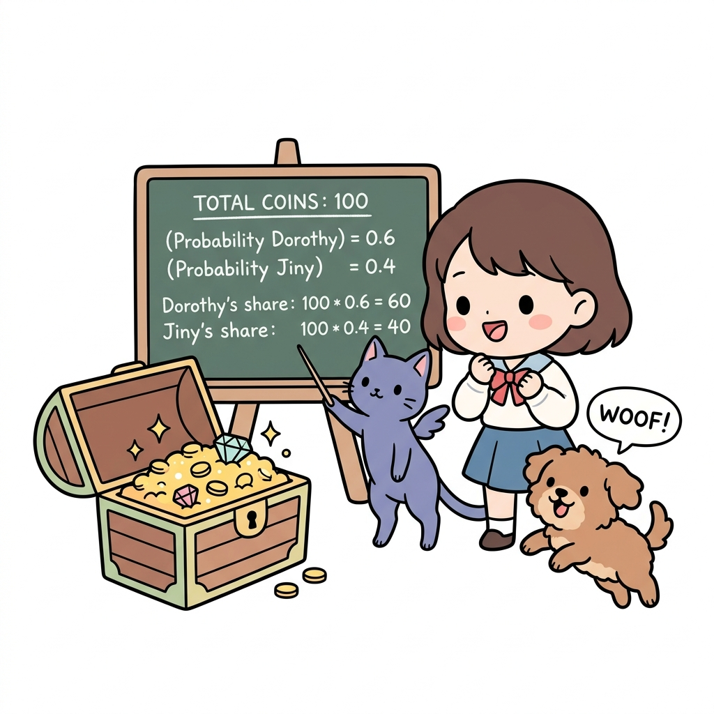
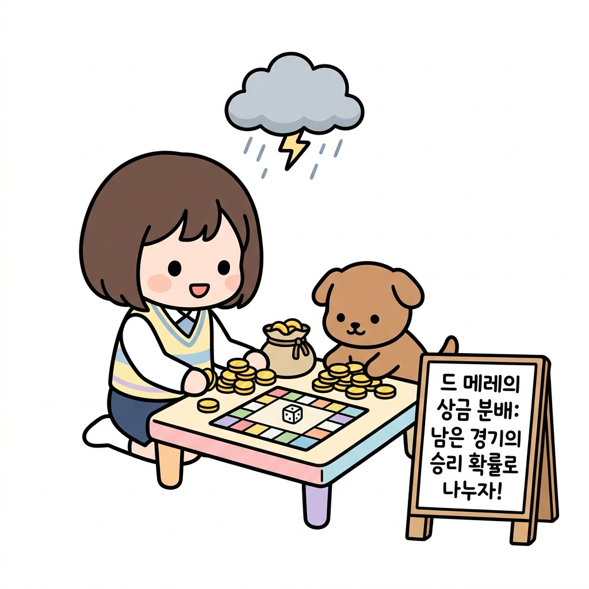
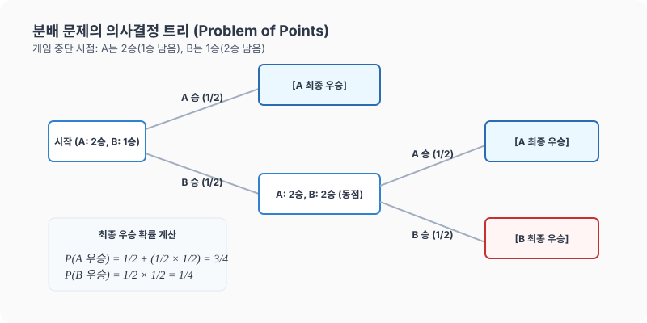

# 05강. 확률의 역사와 상금 분배 문제

**그림 02-5** 중단된 보물 상자 게임의 남은 기대 점수에 맞춰 금화를 공정하게 분배하는 법을 강의해주는 지니와 도로시

수학의 오랜 난제였던 **상금 분배 문제(Problem of Points)**와 확률 이론의 역사적 태동을 알아봅니다. 게임이 도중에 중단되었을 때, 지금까지의 점수가 아닌 '앞으로 이길 기댓값'에 비례하여 금화를 공평하게 나누는 파스칼과 페르마의 명쾌한 해법을 도로시의 보물상자 분배장과 함께 배워봅시다!

---

## 1. 학습 목표
- 확률 이론의 태동과 역사적 배경을 파악한다.
- 파스칼과 페르마가 고민했던 '상금 분배 문제'를 이해하고 설명할 수 있다.
- 기대값과 중단된 게임에서의 공정한 상금 분배 확률을 계산할 수 있다.

---

## 2. 핵심 개념

### (1) 확률의 태동과 역사
- **신탁의 도구**: 고대인들은 동물의 복사뼈나 주사위를 던져 신의 뜻을 묻는 데 사용하였습니다.
- **도박과 확률**: 17세기 유럽에서 도박 문제(특히 중단된 게임의 상금을 어떻게 공정하게 나눌 것인가)를 해결하는 과정에서 현대 확률론이 정립되기 시작했습니다.
- **파스칼과 페르마**: 1654년, 프랑스의 수학자 블레즈 파스칼과 피에르 드 페르마는 편지를 주고받으며 상금 분배 문제를 명쾌하게 풀어냈으며, 이것이 확률론의 시초가 되었습니다.

### (2) 분배 문제 (Problem of Points)
- **개념**: 실력이 비슷한 두 사람 $A$, $B$가 게임을 하여 먼저 특정 횟수(예: $3$승)를 이기는 사람이 상금을 전부 갖기로 했습니다. 그런데 게임이 도중에 중단되었을 때, 지금까지의 전적을 바탕으로 상금을 어떻게 나누는 것이 가장 공평할까요?
- **공정한 분배 기준**: 단순히 지금까지 이긴 횟수의 비율로 나누는 것은 공정하지 않습니다. **"만약 게임을 계속했다면 각자가 최종 우승할 확률"**의 비율로 나누는 것이 공정합니다.

* 야외에서 한창 진행 중이던 게임이 비로 인해 갑자기 중단되었을 때, 지금까지 획득한 점수의 비로 상금을 단순 배분하는 것은 공정하지 못합니다. 카드라노 선생님이 보여주는 공식처럼, 게임을 지속했을 때 남은 게임에서 각 플레이어가 승리하여 최종 우승에 도달할 **수학적 확률**을 계산해 그 비율만큼 나누어야 정의롭습니다.

---

## 3. 시각 자료: 상금 분배 문제 트리 다이어그램

---

## 4. 실전 예제

### 예제 1 (상금 분배 문제 계산)
> **문제**: 도로시와 토토가 먼저 $3$번 이기는 사람이 상금 $100$만 원을 모두 가지는 게임을 하고 있었습니다. 실력이 동등한 상황(매 게임 이길 확률이 각각 $\frac{1}{2}$)에서 현재 도로시는 $2$승, 토토는 $1$승을 거두었습니다. 이 시점에서 게임이 중단되었다면 상금을 각각 어떻게 나누어야 공평할까요?
>
> **풀이**:
> 게임이 계속 진행되었을 때 각각 최종 우승할 확률을 구합니다.
> - 도로시가 우승하려면 $1$승이 더 필요합니다.
> - 토토가 우승하려면 $2$승이 더 필요합니다.
>
> **1. 토토가 우승할 확률 $P(\text{토토})$**:
> 토토가 우승하려면 다음 $2$번의 게임을 연속으로 이겨야 합니다. 두 게임은 독립시행이므로:
> $$P(\text{토토}) = \frac{1}{2} \times \frac{1}{2} = \frac{1}{4}$$
>
> **2. 도로시가 우승할 확률 $P(\text{도로시})$**:
> 여사건의 확률을 활용하여 쉽게 구할 수 있습니다.
> $$P(\text{도로시}) = 1 - P(\text{토토}) = 1 - \frac{1}{4} = \frac{3}{4}$$
>
> **3. 상금의 공정한 분배**:
> 우승 확률의 비인 $P(\text{도로시}) : P(\text{토토}) = \frac{3}{4} : \frac{1}{4} = 3 : 1$로 상금을 배분합니다.
> - 도로시의 몫: $100\text{만 원} \times \frac{3}{4} = 75\text{만 원}$
> - 토토의 몫: $100\text{만 원} \times \frac{1}{4} = 25\text{만 원}$
>
> **정답**: 도로시 $75$만 원, 토토 $25$만 원

---

## 5. 핵심 요약
1. **상금 분배 문제**는 게임이 중단되었을 때, 게임을 계속 진행했다면 각각 최종 우승했을 확률을 구해 그 비율대로 상금을 나누는 문제이다.
2. 각 사건이 독립적일 때, 미래에 연이어 발생할 최종 우승 확률은 **확률의 곱셈**과 **여사건의 확률**을 연립하여 해결한다.
3. 이 분배 문제는 기대값의 원형이 되었으며, 현대 금융 및 의사결정 이론(의사결정 트리)의 시초가 되었다.
