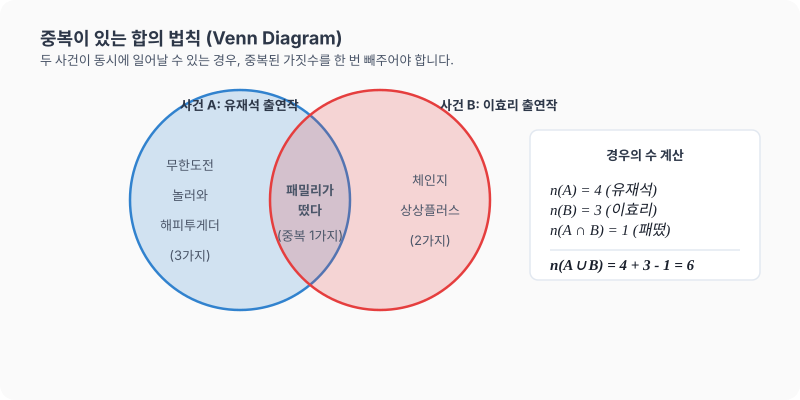

# 06강. 경우의 수 심화: 중복이 있는 합의 법칙과 곱의 법칙

**그림 02-6** 두 벤다이어그램 마법 원반의 겹친 부위를 소거하며 중복합을 계산하는 법을 설명해주는 지니와 도로시

선택지가 서로 완전히 분리되어 있지 않고 **중복**이 존재할 때의 합산 요령을 다룹니다. 두 개의 동그라미(벤다이어그램)가 겹치는 영역을 마법 지우개로 쏙 빼내는 지니와 도로시의 그림 설명처럼, 중복을 확실하게 제어하여 정확한 경우의 수를 계산하는 심화 비법을 정복해보아요!

---

## 1. 학습 목표
- 중복되는 경우가 있을 때 합의 법칙을 보완하여 올바른 경우의 수를 계산할 수 있다.
- 곱의 법칙의 활용 상황(순서쌍의 개수)을 다룰 수 있다.
- 수학적 확률의 분자, 분모를 구성하는 경우의 수를 엄밀히 구하는 훈련을 한다.

---

## 2. 핵심 개념

### (1) 중복이 있는 합의 법칙 (Sum Rule with Overlap)
두 사건 $A$와 $B$가 일어나는 경우의 수가 각각 $m$, $n$이고, 두 사건 $A$, $B$가 동시에 일어나는 경우의 수가 $l$가지 존재할 때, 사건 $A$ **또는** 사건 $B$가 일어나는 경우의 수는 다음과 같습니다.
$$\text{경우의 수} = m + n - l$$
- **집합적 표현 (Venn Diagram)**:
  $$n(A \cup B) = n(A) + n(B) - n(A \cap B)$$
- *주의*: 단순히 두 사건의 가짓수를 더하기만 하면 동시에 겹쳐서 일어나는 원소들을 두 번 세게 되는(중복) 오류가 발생하므로, 겹치는 부분($l$)을 반드시 한 번 빼주어야 합니다.

### (2) 곱의 법칙 (Product Rule)
사건 $A$가 일어나는 경우의 수가 $m$가지이고, 그 각각에 대하여 다른 사건 $B$가 일어나는 경우의 수가 $n$가지일 때, 두 사건 $A$, $B$가 잇달아 일어나는 경우의 수는 다음과 같습니다.
$$\text{경우의 수} = m \times n$$

* 서울에서 대전까지 가는 버스 노선이 $3$가지이고, 대전에서 지리산까지 가는 기차 노선이 $2$가지가 있을 때, 서울에서 대전을 거쳐 지리산까지 가는 총 이동 경로의 가짓수는 $3 \times 2 = 6$가지가 됩니다. 이는 첫 번째 선택의 각 경우의 수($3$가지)마다 두 번째 선택의 경우의 수($2$가지)가 결합하기 때문에 곱의 법칙이 성립하는 대표적인 예입니다.

---

## 3. 시각 자료: 벤 다이어그램을 통한 합의 법칙 도식

---

## 4. 실전 예제

### 예제 1 (중복이 있는 합의 법칙)
> **문제**: 케이블 방송의 편성표를 보니 유재석이 출연하는 프로그램은 $4$개(무한도전, 놀러와, 해피투게더, 패밀리가 떴다)이고, 이효리가 출연하는 프로그램은 $3$개(체인지, 상상플러스, 패밀리가 떴다)입니다. 카르다노 선생님이 유재석 **또는** 이효리가 출연하는 프로그램 중 하나를 선택하여 시청하려고 할 때, 선택할 수 있는 경우의 수는 몇 가지인가요?
>
> **풀이**:
> - 유재석 출연 프로그램 개수 $n(A) = 4$
> - 이효리 출연 프로그램 개수 $n(B) = 3$
> - 두 연예인이 동시에 출연하는 프로그램(패밀리가 떴다) 개수 $n(A \cap B) = 1$
>
> 중복이 있는 합의 법칙을 적용합니다.
> $$\text{경우의 수} = n(A) + n(B) - n(A \cap B) = 4 + 3 - 1 = 6\text{가지}$$
> **정답**: $6$가지

### 예제 2 (곱의 법칙)
> **문제**: 저녁 식사 식단을 짜기 위해 찌개 한 가지와 나물요리 한 가지를 준비하려고 합니다. 준비할 수 있는 찌개가 $2$가지(된장찌개, 김치찌개)이고, 나물요리가 $3$가지(콩나물, 시금치나물, 고사리나물)일 때, 구성할 수 있는 총 식단의 경우의 수는 몇 가지인가요?
>
> **풀이**:
> 찌개를 고르는 행위와 나물요리를 고르는 행위는 연이어 완성되는 사건입니다. 따라서 곱의 법칙을 적용합니다.
> $$\text{경우의 수} = 2 \text{ (찌개)} \times 3 \text{ (나물)} = 6\text{가지}$$
> **정답**: $6$가지

---

## 5. 핵심 요약
1. **합의 법칙**을 사용할 때 두 사건이 동시에 일어나는 중복 상황($A \cap B$)이 있는지 반드시 점검하고, 중복이 있다면 **$m + n - l$**로 계산한다.
2. **곱의 법칙**은 두 개의 대상을 각각 짝짓는 순서쌍의 개수를 구하는 데 유용하다: **$m \times n$**.
3. 확률을 계산하기 위해 경우의 수를 정확히 세는 것이 선행되어야 하며, 중복 누락 등의 실수를 피하는 것이 중요하다.
