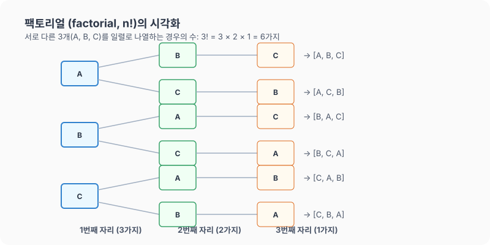

# 07강. 팩토리얼과 순서대로 나열하기

**그림 02-7** 네 마리의 인형을 일렬로 세우며 팩토리얼의 재귀적 곱셈을 설명해주는 지니와 도로시

서로 다른 대상을 빠짐없이 일렬로 세우는 경우의 수인 **팩토리얼(Factorial, 계승)**을 이해하고 활용하는 법을 배웁니다. 도로시가 책상 위에 오즈의 마법사 캐릭터 인형들을 여러 순서로 늘어놓으며 배우는 팩토리얼($n!$)의 마법 같은 곱셈 원리를 지니와 함께 기분 좋게 학습해볼까요?

---

## 1. 학습 목표
- 서로 다른 대상을 일렬로 나열하는 방법의 수를 구하는 원리를 이해한다.
- 계승을 뜻하는 팩토리얼($n!$) 기호와 그 계산 방식을 익힌다.

---

## 2. 핵심 개념

### (1) 일렬로 나열하는 경우의 수 (Ordering Items in a Row)
서로 다른 $n$개의 대상을 일렬로 늘어놓는 경우의 수를 구할 때는 첫 번째 자리부터 순서대로 들어갈 수 있는 대상의 가짓수를 곱해 나갑니다.
- **원리**:
  - $1$번째 자리에 놓을 수 있는 대상: $n$가지
  - $2$번째 자리에 놓을 수 있는 대상: 첫 번째에 놓인 것을 제외한 $(n-1)$가지
  - $3$번째 자리에 놓을 수 있는 대상: 앞선 둘을 제외한 $(n-2)$가지
  - $\dots$
  - 맨 마지막 자리에 놓을 수 있는 대상: 남은 $1$가지
- **곱의 법칙**에 따라 총 경우의 수는 다음과 같습니다:
  $$n \times (n-1) \times (n-2) \times \dots \times 2 \times 1$$

### (2) 팩토리얼 (Factorial, 계승)
$1$부터 $n$까지의 모든 자연수를 곱한 것을 **$n$의 계승**이라 하고, 기호로 **$n!$**과 같이 나타냅니다.
$$n! = n \times (n-1) \times (n-2) \times \dots \times 2 \times 1$$
- *읽는 방법*: 'n 팩토리얼' 또는 'n의 계승'
- *특수한 값*: $0! = 1$로 정의합니다.

* 도로시, 토토, 프로드 세 사람이 영화관 좌석 3개에 앉는 경우의 수를 계산해 봅시다. 1번 자리에 앉을 사람을 고르는 가짓수는 $3$명 중 한 명이고, 2번 자리에는 남은 $2$명 중 한 명, 마지막 3번 자리에는 남은 $1$명이 자동으로 앉게 됩니다. 이 연쇄적인 결정을 수식으로 나타낸 것이 바로 $3! = 3 \times 2 \times 1 = 6$입니다.

---

## 3. 시각 자료: 3가지를 나열하는 트리 도식

---

## 4. 실전 예제

### 예제 1 (기본 줄 세우기)
> **문제**: 도로시, 카르다노, 토토 $3$명이 극장 매표소 앞에 나란히 줄을 서려고 합니다. 이들이 줄을 설 수 있는 총 경우의 수는 몇 가지인가요?
>
> **풀이**:
> 서로 다른 $3$명을 일렬로 세우는 경우의 수이므로 $3!$을 계산합니다.
> $$\text{경우의 수} = 3! = 3 \times 2 \times 1 = 6\text{가지}$$
> **정답**: $6$가지

### 예제 2 (다섯 명의 멤버 배치)
> **문제**: 무한도전 멤버 $5$명(재석, 명수, 형돈, 준하, 홍철)을 무대 위 $5$개의 자리에 왼쪽부터 일렬로 배치하려고 합니다. 이들을 일렬로 세울 수 있는 총 경우의 수는 몇 가지인가요?
>
> **풀이**:
> 서로 다른 $5$명을 일렬로 세우는 경우의 수이므로 $5!$을 계산합니다.
> $$\text{경우의 수} = 5! = 5 \times 4 \times 3 \times 2 \times 1 = 120\text{가지}$$
> **정답**: $120$가지

---

## 5. 핵심 요약
1. 서로 다른 $n$개를 일렬로 줄 세우는 방법의 수는 **곱의 법칙**을 연속으로 적용한 것이다.
2. $1$부터 $n$까지의 자연수를 차례대로 곱한 것을 **$n!$ (n 팩토리얼)** 이라 부르며, 줄 세우기 문제의 대표적인 공식이다.
3. 팩토리얼 연산은 수의 크기가 아주 빠르게 커지는 성질을 가지고 있다 (예: $3! = 6$, $5! = 120$, $10! = 3,628,800$).
