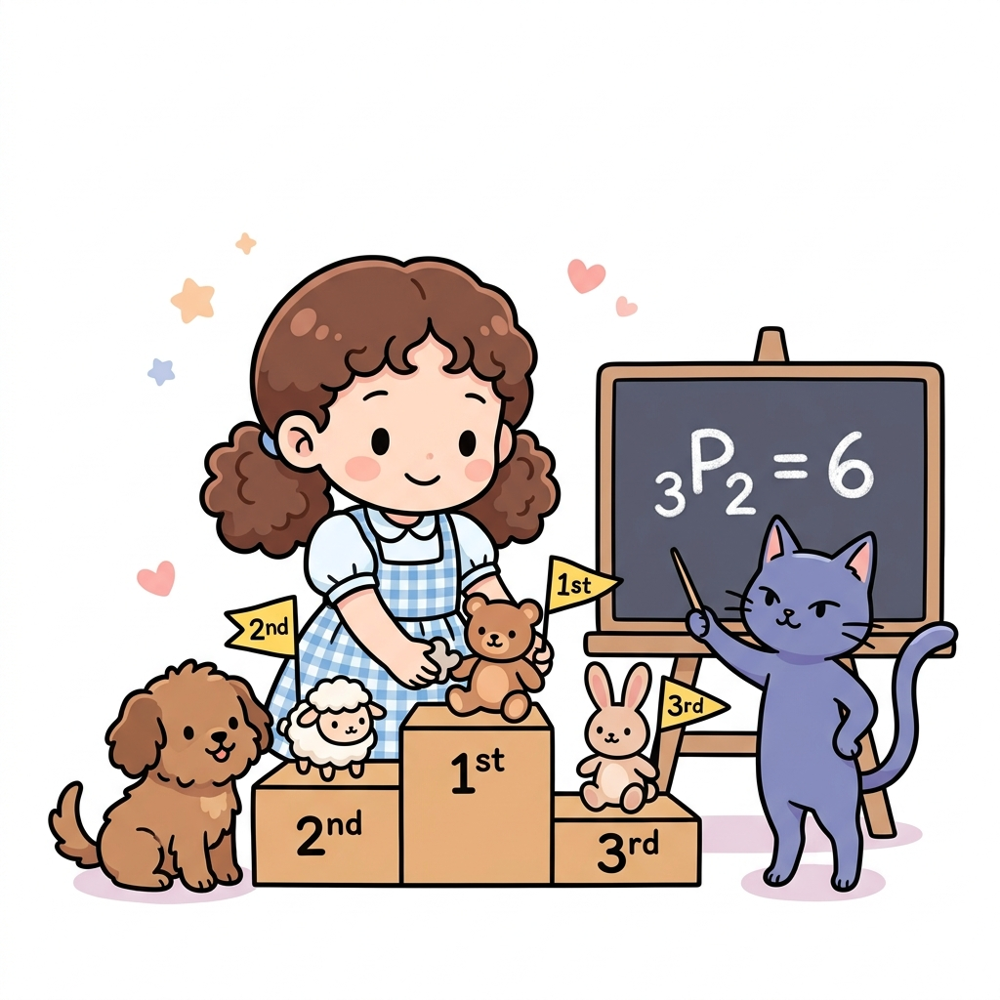
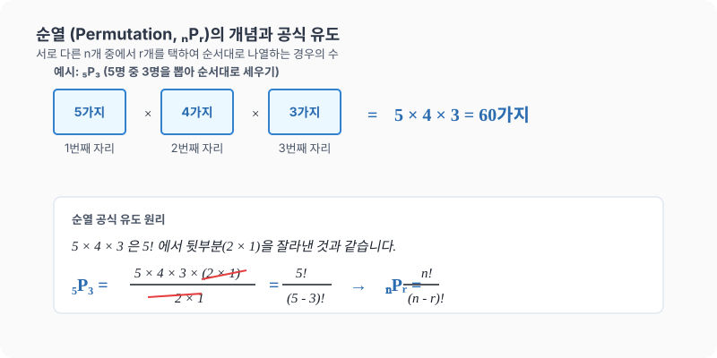

# 08강. 순열: 택하여 줄 세우기

**그림 02-8** 시상대(1등, 2등, 3등 단상)에 인형들을 줄 세우며 순열 기호 $_n\mathrm{P}_r$의 의미를 학습하는 지니와 도로시

서로 다른 n개 중 r개를 선택해 순서를 고려하여 줄 세우는 **순열(Permutation)**을 공부합니다. 시상대의 각 단상에 동물 인형들을 배치하며 가짓수를 계산해내는 도로시와 지니의 놀이 학습처럼, 순열($_n\mathrm{P}_r$)의 원리를 탄탄히 이해해 봅시다!

---

## 1. 학습 목표
- 서로 다른 $n$개 중에서 $r$개를 선택하여 일렬로 배열하는 경우의 수(순열)를 구하는 원리를 이해한다.
- 순열 기호 $_n\mathrm{P}_r$의 의미를 알고, 팩토리얼과의 관계를 이해하며 식을 변형할 수 있다.

---

## 2. 핵심 개념

### (1) 순열 (Permutation)
서로 다른 $n$개 중에서 $r$($0 < r \le n$)개를 택하여 순서대로 나열하는 것을 **순열**이라고 하며, 기호로 **$_n\mathrm{P}_r$**과 같이 나타냅니다.
- *읽는 방법*: 'n P r' 또는 'n 퍼뮤테이션 r'
- **계산식**:
  $$_n\mathrm{P}_r = n \times (n-1) \times (n-2) \times \dots \times (n-r+1) \quad (\text{곱하는 개수가 } r\text{개})$$

### (2) 순열의 공식과 팩토리얼
순열의 계산식에 분자와 분모에 $(n-r)!$을 곱해 주면 다음과 같이 팩토리얼 기호만으로 공식을 나타낼 수 있습니다.
$$_n\mathrm{P}_r = \frac{n!}{(n-r)!}$$
- *의미*: 전체 $n$개를 일렬로 줄 세우는 $n!$ 중에서, 선택되지 않은 $(n-r)$개의 순서 나열(줄 세우기)인 $(n-r)!$을 나누어 제외(약분)하는 구조입니다.
- *특수한 경우*:
  - $_n\mathrm{P}_n = \frac{n!}{0!} = n!$ (서로 다른 $n$개 전체를 일렬로 나열하는 경우)
  - $_n\mathrm{P}_0 = \frac{n!}{n!} = 1$ (아무것도 택하지 않는 것도 1가지 경우로 침)

* 진열대에 놓인 서로 다른 $5$개의 트로피 중 1등, 2등, 3등(순서와 직책이 구분됨)에게 부여할 트로피 $3$개를 순서대로 나열해 고르는 경우의 수는 순열 공식을 사용하여 $_{5}\mathrm{P}_3 = 5 \times 4 \times 3 = 60$가지가 됩니다. 순열은 이처럼 **대상을 선택하는 순서가 최종 결과에 영향을 주는 상황(Order matters)**에 사용합니다.

---

## 3. 시각 자료: 순열의 자리 배치와 공식 유도

---

## 4. 실전 예제

### 예제 1 (올림픽 메달 시나리오)
> **문제**: 올림픽 양궁 단체전 4강에 대한민국, 중국, 영국, 프랑스 $4$개국이 진출했습니다. 이 중 금메달, 은메달, 동메달을 획득하는 국가들의 총 경우의 수는 몇 가지인가요?
>
> **풀이**:
> 서로 다른 $4$개국 중에서 순서를 생각하여(메달 종류) $3$개국을 선택하여 배열하는 순열 문제입니다.
> $$\text{경우의 수} = _4\mathrm{P}_3 = 4 \times 3 \times 2 = 24\text{가지}$$
> **정답**: $24$가지

### 예제 2 (학급 임원 선출)
> **문제**: 학생 수가 $30$명인 학급에서 회장 $1$명, 부회장 $1$명을 선출하는 경우의 수는 몇 가지인가요?
>
> **풀이**:
> 회장과 부회장은 직책(순서)의 구분이 있으므로 서로 다른 $30$명 중 $2$명을 뽑아 나열하는 순열 문제입니다.
> $$\text{경우의 수} = _{30}\mathrm{P}_2 = 30 \times 29 = 870\text{가지}$$
> **정답**: $870$가지

---

## 5. 핵심 요약
1. **순열 ($_n\mathrm{P}_r$)**은 대상을 **뽑고 나서 순서대로 나열**까지 하는 가짓수이다.
2. $_n\mathrm{P}_r$ 계산은 $n$부터 시작해 $1$씩 줄여가며 총 **$r$개의 숫자**를 곱한다.
3. 팩토리얼 기호를 사용하여 순열 공식을 **$_n\mathrm{P}_r = \frac{n!}{(n-r)!}$**로 표현할 수 있으며, 이는 식의 증명이나 약분에 널리 활용된다.
