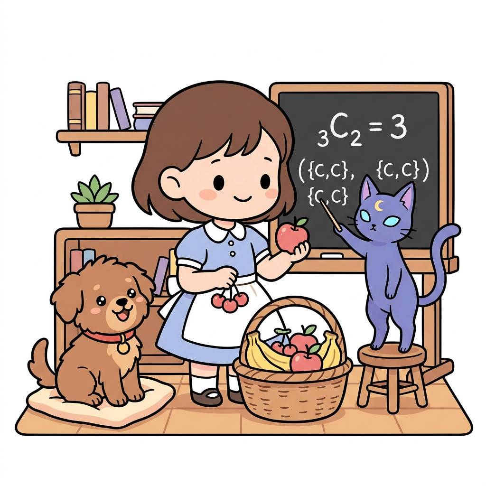
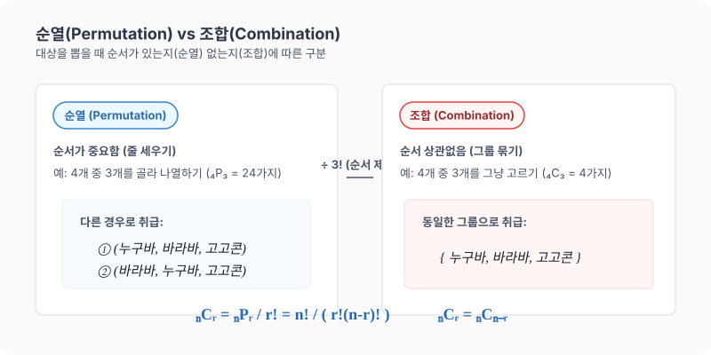

# 09강. 조합: 순서 없이 선택하기

**그림 02-9** 여러 과일 중 두 과일을 순서 없이 양손에 쥐며 조합 기호 $_n\mathrm{C}_r$을 배우는 지니와 도로시

순서와 관계없이 특정 대상을 묶음으로 골라내기만 하는 **조합(Combination)**을 공부합니다. 바구니에 담긴 사과, 바나나, 체리 중 도로시가 순서 없이 과일을 골라 쥐는 직관적인 놀이 과정을 통해 순열과의 명확한 차이점과 조합($_n\mathrm{C}_r$)의 신비로운 대칭 성질을 정복해봅시다!

---

## 1. 학습 목표
- 순열과 조합의 차이점을 파악한다.
- 서로 다른 $n$개 중에서 순서를 생각하지 않고 $r$개를 선택하는 경우의 수(조합, $_n\mathrm{C}_r$)를 구하는 원리를 이해한다.
- 조합의 성질 $_n\mathrm{C}_r = _n\mathrm{C}_{n-r}$을 이해하고 활용하여 복잡한 계산을 단순화한다.

---

## 2. 핵심 개념

### (1) 조합 (Combination)
서로 다른 $n$개 중에서 순서를 생각하지 않고 $r$($0 < r \le n$)개를 택하는 것을 **조합**이라고 하며, 기호로 **$_n\mathrm{C}_r$**과 같이 나타냅니다.
- *읽는 방법*: 'n C r' 또는 'n 콤비네이션 r'
- **순열과의 관계**:
  $_n\mathrm{P}_r$은 대상을 뽑아서 순서대로 나열하는 것이므로, 조합으로 그냥 뽑아 놓은 $r$개의 대상을 일렬로 나열하는 가짓수($r!$)만큼 중복이 생깁니다.
  $$_n\mathrm{C}_r = \frac{_n\mathrm{P}_r}{r!} = \frac{n!}{r!(n-r)!}$$

* 아이스크림 전문점에서 판매하는 $5$가지 맛 중에서 순서와 상관없이 $3$가지를 골라 하나의 큰 컵에 담는 경우를 계산해 봅시다. 콘 위에 차례대로 얹어 순서가 중요한 경우(순열)와 달리, 한 컵에 담기면 최종 결과는 동일하므로 순서가 무의미합니다. 따라서 $_{5}\mathrm{P}_3 = 60$가지 중 $3$개를 줄 세우는 가짓수($3! = 6$)만큼의 중복을 나누어주어 총 $_{5}\mathrm{C}_3 = \frac{60}{6} = 10$가지의 선택을 할 수 있습니다.

### (2) 조합의 유용한 성질
1. **여조합의 성질 (대칭성)**:
   $$_{n}\mathrm{C}_{r} = _{n}\mathrm{C}_{n-r}$$
   - *의미*: $n$명 중에서 초대할 $r$명을 고르는 방법의 수는, 초대하지 않고 제외할 $(n-r)$명을 고르는 방법의 수와 완벽히 같습니다. $r$이 $n$의 절반보다 클 때 이 성질을 쓰면 계산량이 획기적으로 줄어듭니다.
2. **특수한 값**:
   - $_n\mathrm{C}_n = 1$
   - $_n\mathrm{C}_0 = 1$

---

## 3. 시각 자료: 순열과 조합의 차이 및 공식 정리

---

## 4. 실전 예제

### 예제 1 (마트에서 아이스크림 고르기)
> **문제**: 마트에 있는 $10$가지 종류의 아이스크림 중에서 서로 다른 $3$가지를 고르는 경우의 수는 몇 가지인가요?
>
> **풀이**:
> 맛보는 순서는 상관없이 단순히 고르기만 하므로 조합 문제입니다.
> $$_{10}\mathrm{C}_3 = \frac{_{10}\mathrm{P}_3}{3!} = \frac{10 \times 9 \times 8}{3 \times 2 \times 1} = 120\text{가지}$$
> **정답**: $120$가지

### 예제 2 (여조합 성질을 활용한 계산)
> **문제**: 토토네 반 학생 $20$명 중에서 토토의 생일파티에 초대할 친구 $18$명을 선택하는 경우의 수는 몇 가지인가요?
>
> **풀이**:
> $18$명을 순서 없이 선택하므로 $_{20}\mathrm{C}_{18}$을 계산해야 합니다.
> 하지만 조합의 성질 $_n\mathrm{C}_r = _n\mathrm{C}_{n-r}$을 사용해 초대받지 못할 $2$명을 선택하는 문제로 바꾸어 풉니다.
> $$_{20}\mathrm{C}_{18} = _{20}\mathrm{C}_{20-18} = _{20}\mathrm{C}_2$$
> $$_{20}\mathrm{C}_2 = \frac{20 \times 19}{2 \times 1} = 190\text{가지}$$
> **정답**: $190$가지

---

## 5. 핵심 요약
1. **순열**은 순서가 있고(줄 세우기), **조합**은 순서가 없다(대표 뽑기, 묶음 만들기).
2. 조합의 수 $_n\mathrm{C}_r$은 순열의 수 $_n\mathrm{P}_r$에서 대상의 순서 배열 가짓수인 **$r!$**로 나눈 값이다.
3. 계산할 때 아래 첨자 $r$이 클 때에는 **$_n\mathrm{C}_r = _n\mathrm{C}_{n-r}$**을 적극 활용하여 간단하게 계산한다.
