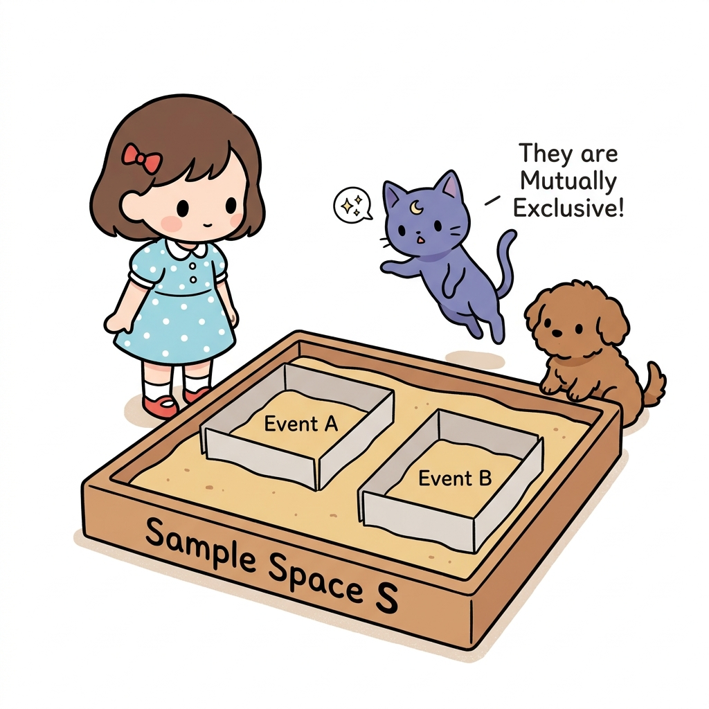
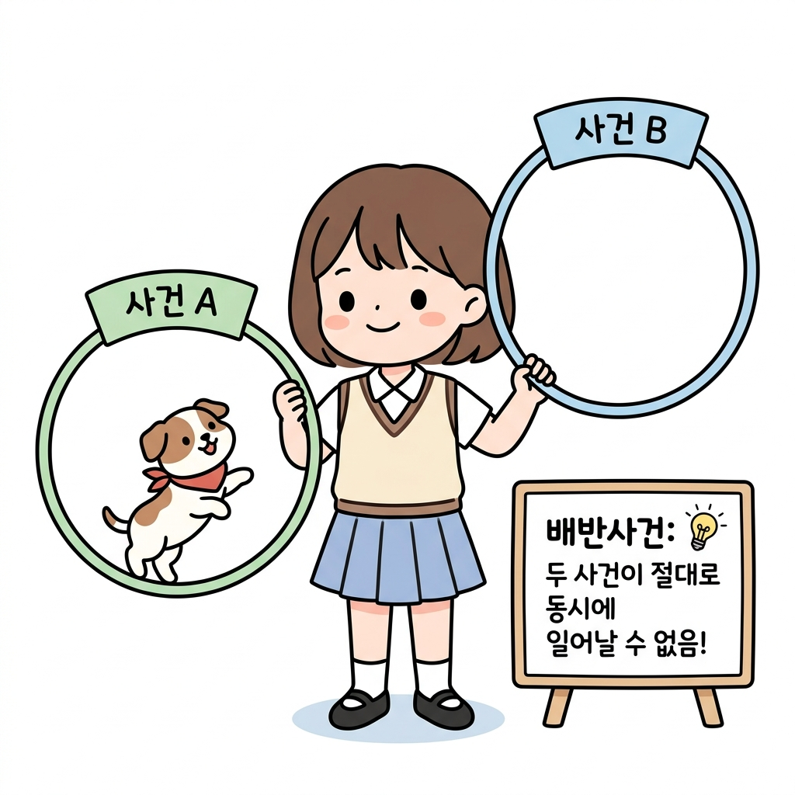
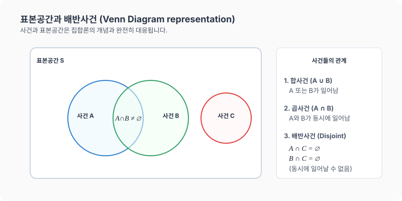

# 10강. 표본공간과 배반사건

**그림 02-10** 거대한 표본공간 S 모래상자 안에 서로 전혀 겹치지 않는 울타리로 분리된 두 사건 A, B를 관찰하는 도로시와 지니

확률 수학의 가장 기본 뼈대인 시행, 사건, 그리고 모든 가능성의 전체 집합인 **표본공간(Sample Space)**을 배웁니다. 더불어 절대 동시에 발생할 수 없어 서로 멀리 떨어져 격리된 **배반사건(Mutually Exclusive Events)**의 원리를 지니와 도로시의 모래상자 집합 비유를 통해 확실하게 머릿속에 각인시켜봅시다!

---

## 1. 학습 목표
- 시행, 사건, 표본공간 등 확률 계산의 기초가 되는 용어를 이해한다.
- 곱사건, 합사건, 여사건, 공사건을 집합 기호와 매칭하여 설명할 수 있다.
- 동시에 일어날 수 없는 사건인 **배반사건**의 개념을 명확히 정의한다.

---

## 2. 핵심 개념

### (1) 시행과 사건
- **시행 (Trial)**: 주사위나 동전을 던지는 것처럼 같은 조건에서 반복할 수 있고, 그 결과가 우연에 의해 결정되는 실험이나 관찰을 뜻합니다.
- **표본공간 (Sample Space, $S$)**: 어떤 시행에서 일어날 수 있는 모든 결과의 집합입니다. (집합론의 전체집합 $U$에 대응)
- **사건 (Event)**: 표본공간 $S$의 부분집합으로, 특정 조건에 의해 나타나는 결과들의 모임입니다.

### (2) 사건의 연산과 종류
- **합사건 ($A \cup B$)**: 사건 $A$ 또는 사건 $B$가 일어나는 사건입니다.
- **곱사건 ($A \cap B$)**: 사건 $A$와 사건 $B$가 동시에 일어나는 사건입니다.
- **여사건 ($A^c$)**: 사건 $A$가 일어나지 않는 사건입니다.
- **공사건 ($\emptyset$)**: 절대로 일어날 수 없는 사건입니다. (확률은 항상 $0$)

### (3) 배반사건 (Mutually Exclusive Events)
두 사건 $A$와 $B$가 동시에 일어날 수 없을 때, 즉 곱사건이 공사건일 때($A \cap B = \emptyset$), 두 사건 $A$, $B$를 서로 **배반사건**이라고 합니다.
- *예시*: 어떤 사람이 '남학생일 사건'과 '여학생일 사건'은 동시에 일어날 수 없으므로 서로 배반사건입니다.

* 교실에 앉아 있는 학생들을 "안경을 쓴 학생 집합(Group A)"과 "안경을 쓰지 않은 학생 집합(Group B)"으로 나누었을 때, 한 학생이 동시에 안경을 썼으면서 동시에 안경을 쓰지 않을 수는 없습니다. 따라서 두 집합은 서로 겹치는 원소가 없는 **배반사건($A \cap B = \emptyset$)** 관계가 됩니다.

---

## 3. 시각 자료: 벤 다이어그램을 통한 사건의 관계 도식

---

## 4. 실전 예제

### 예제 1 (주사위 던지기에서의 사건 분석)
> **문제**: 한 개의 주사위를 던지는 시행에서 홀수의 눈이 나오는 사건을 $A$, $4$ 이하의 눈이 나오는 사건을 $B$, $6$의 약수의 눈이 나오는 사건을 $C$라 할 때, 세 사건 $A$, $B$, $C$ 중 서로 배반사건인 두 사건은 무엇인가요?
>
> **풀이**:
> - 표본공간 $S = \{1, 2, 3, 4, 5, 6\}$
> - 사건 $A = \{1, 3, 5\}$
> - 사건 $B = \{1, 2, 3, 4\}$
> - 사건 $C = \{1, 2, 3, 6\}$
>
> 두 사건의 교집합이 공집합인지를 확인합니다.
> - $A \cap B = \{1, 3\} \ne \emptyset$ (배반 아님)
> - $B \cap C = \{1, 2, 3\} \ne \emptyset$ (배반 아님)
> - $A \cap C = \{1, 3\} \ne \emptyset$ (배반 아님)
>
> 이번에는 새로운 사건 $D = \{6\}$(6의 눈이 나올 사건)를 정의해 봅시다.
> - $A \cap D = \{1, 3, 5\} \cap \{6\} = \emptyset$이므로 사건 $A$와 사건 $D$는 배반사건입니다.
> **정답**: 사건 $A$와 사건 $D$는 배반사건

### 예제 2 (기본 확률 구하기)
> **문제**: 빨간 주사위와 파란 주사위를 동시에 던질 때, 두 주사위에서 나온 눈의 차가 $1$일 확률을 구하세요.
>
> **풀이**:
> - 표본공간 $S$의 총 원소의 수 (모든 경우의 수): $6 \times 6 = 36$가지
> - 두 눈의 차가 $1$이 되는 사건 $E$:
>   $(1,2), (2,1), (2,3), (3,2), (3,4), (4,3), (4,5), (5,4), (5,6), (6,5)$의 총 $10$가지
> - 따라서 수학적 확률 $P(E)$는:
>   $$P(E) = \frac{10}{36} = \frac{5}{18}$$
> **정답**: $\frac{5}{18}$

---

## 5. 핵심 요약
1. **표본공간**은 전체 결과의 집합, **사건**은 특정 결과들의 부분집합이다.
2. 두 사건이 동시에 발생할 수 없는 관계($A \cap B = \emptyset$)일 때, 이들을 **배반사건**이라 칭한다.
3. 확률적 계산을 원활하게 수행하기 위해서는 실생활의 문제 상황을 집합과 표본공간 개념으로 치환(모델화)하는 것이 필요하다.
