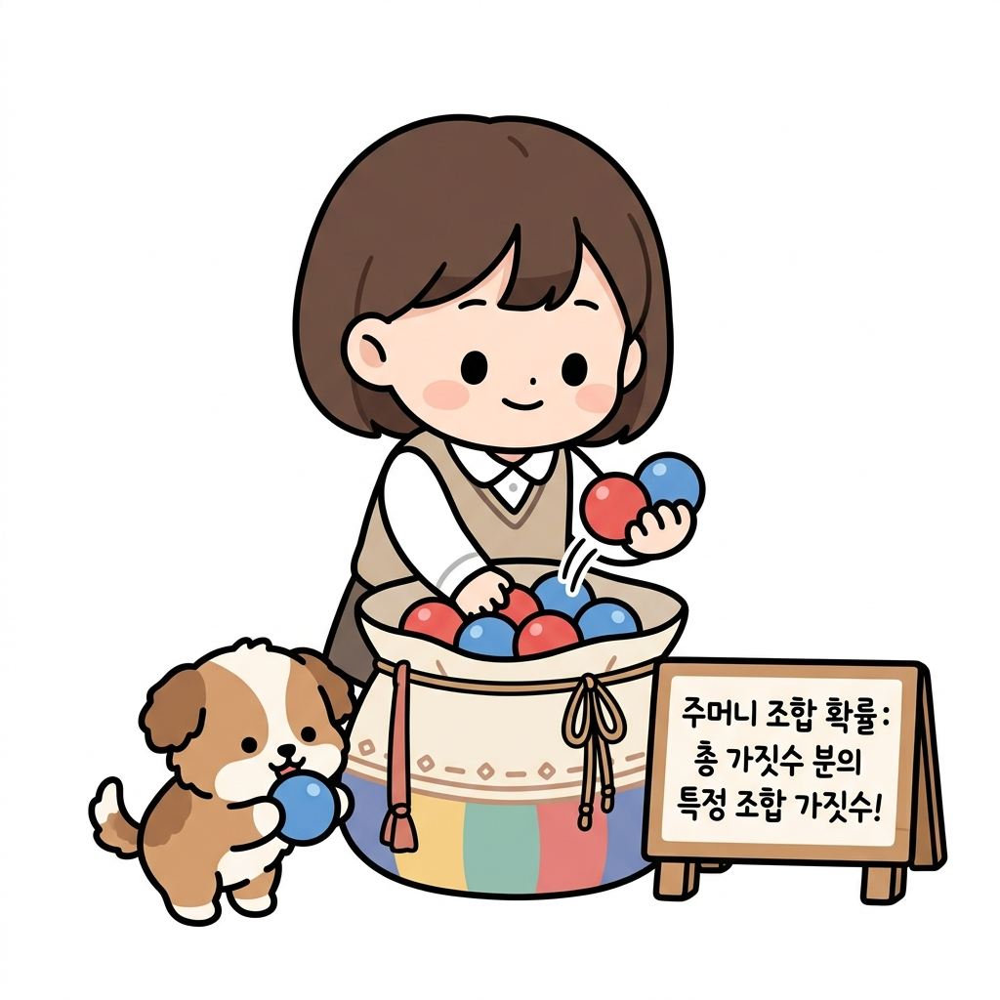
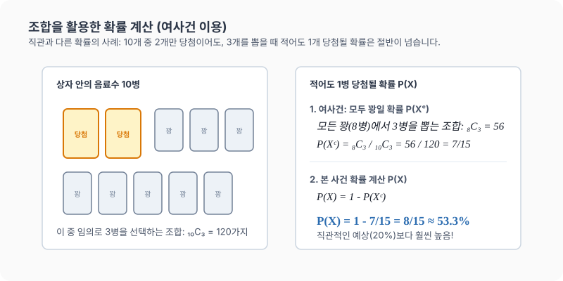

# 11강. 조합을 이용한 확률 계산

**그림 02-11** 구슬 주머니에서 무작위로 여러 구슬을 꺼낼 때 조합 공식과 분수로 정확한 확률을 계산해주는 지니와 도로시

주머니에서 여러 개의 바둑돌이나 구슬을 한꺼번에 꺼낼 때의 확률처럼, 실제 강화학습에서도 복잡하게 얽힌 상태 전이 확률을 정확히 구해내기 위해 **조합($_n\mathrm{C}_r$)을 이용한 확률 계산법**이 자주 사용됩니다. 구슬 주머니를 털어 수학 공식을 칠판에 적어내는 도로시와 지니의 조언을 통해 조합 기반 확률 계산을 정교하게 훈련해봅시다!

---

## 1. 학습 목표
- 확률의 기호적 표시법($P(A)$)과 여사건의 확률($P(A^c) = 1 - P(A)$)을 능숙하게 사용한다.
- 조합($_n\mathrm{C}_r$) 기호를 이용하여 복잡한 수학적 확률을 정확히 계산한다.
- 직관적인 판단이 실질적인 확률 계산과 어떻게 다를 수 있는지 설명할 수 있다.

---

## 2. 핵심 개념

### (1) 확률의 기호적 표현과 성질
어떤 시행에서 사건 $A$가 일어날 확률을 **$P(A)$**로 나타냅니다. (Probability의 앞 글자 $P$에서 따옴)
- 사건 $A$가 일어나지 않을 사건(여사건)은 $A^c$로 표시하며, 그 확률은 다음과 같습니다.
  $$P(A^c) = 1 - P(A)$$
- 이 성질을 활용하면 '적어도 한 번 ~일 확률'처럼 직접 계산하기 복잡한 문제 상황을 간단히 풀 수 있습니다.

### (2) 조합을 이용한 확률의 정의
표본공간 $S$의 원소의 개수가 $n(S)$, 사건 $A$의 원소의 개수가 $n(A)$일 때, 조합을 이용해 각 경우의 수를 구하여 다음과 같이 확률을 정의하고 계산합니다.
$$P(A) = \frac{n(A)}{n(S)} = \frac{A\text{가 일어나는 조합의 수}}{\text{전체 선택의 조합의 수}}$$

* 흰 공 $3$개와 검은 공 $5$개가 들어 있는 주머니에서 동시에 $3$개의 공을 꺼낼 때, 흰 공 $1$개와 검은 공 $2$개가 나올 확률을 계산해 봅시다. 
  - 분모(전체 경우의 수)는 전체 $8$개 중 $3$개를 선택하는 조합인 $_{8}\mathrm{C}_3 = 56$가지입니다.
  - 분자(사건 경우의 수)는 흰 공 $3$개 중 $1$개를 고르는 조합 $_{3}\mathrm{C}_1 = 3$가지와, 검은 공 $5$개 중 $2$개를 고르는 조합 $_{5}\mathrm{C}_2 = 10$가지를 곱한 $3 \times 10 = 30$가지입니다.
  - 따라서 최종 확률은 $\frac{_{3}\mathrm{C}_1 \times _{5}\mathrm{C}_2}{_{8}\mathrm{C}_3} = \frac{30}{56} = \frac{15}{28}$가 됩니다.

---

## 3. 시각 자료: 조합과 여사건을 이용한 확률 계산

---

## 4. 실전 예제

### 예제 1 (주머니에서 공 꺼내기)
> **문제**: 주머니 속에 공 $4$개가 들어 있습니다. 이 중 $1$개의 공에만 '꽝'이 적혀 있습니다. 주머니에서 동시에 $2$개의 공을 꺼낼 때, '꽝'이 아닌 공만 $2$개 꺼낼 확률을 구하세요.
>
> **풀이**:
> - 전체 경우의 수 (분모): 공 $4$개 중 $2$개를 동시에 꺼내는 조합
>   $$n(S) = _4\mathrm{C}_2 = \frac{4 \times 3}{2 \times 1} = 6\text{가지}$$
> - 꽝이 아닌 공만 $2$개 꺼내는 경우의 수 (분자): 꽝이 아닌 공 $3$개 중 $2$개를 꺼내는 조합
>   $$n(A) = _3\mathrm{C}_2 = _3\mathrm{C}_1 = 3\text{가지}$$
> - 따라서 구하고자 하는 확률 $P(A)$는:
>   $$P(A) = \frac{n(A)}{n(S)} = \frac{3}{6} = \frac{1}{2}$$
> **정답**: $\frac{1}{2}$ ($50\%$)

### 예제 2 (당첨 음료수 문제 - 직관의 파괴)
> **문제**: 음료수 $10$병이 들어 있는 한 상자 속에 '한 병 더'(당첨) 음료수가 $2$병 섞여 있습니다. 이 상자에서 임의로 $3$병의 음료수를 살 때, 당첨 음료수를 적어도 $1$병 이상 구매하게 될 확률을 구하세요.
>
> **풀이**:
> '적어도 $1$병 이상 당첨 음료수를 구매할 사건'을 $X$라 하면, 그 여사건 $X^c$는 '구매한 $3$병 모두 꽝(당첨이 아님)일 사건'입니다.
>
> 1. 모든 경우의 수 (분모): $10$병 중 $3$병을 고르는 조합
>    $$n(S) = _{10}\mathrm{C}_3 = \frac{10 \times 9 \times 8}{3 \times 2 \times 1} = 120\text{가지}$$
> 2. 모두 꽝인 병만 뽑는 경우의 수 (분자): 꽝인 병 $8$병($10 - 2$) 중 $3$병을 고르는 조합
>    $$n(X^c) = _8\mathrm{C}_3 = \frac{8 \times 7 \times 6}{3 \times 2 \times 1} = 56\text{가지}$$
> 3. 여사건의 확률 $P(X^c)$ 계산:
>    $$P(X^c) = \frac{56}{120} = \frac{7}{15}$$
> 4. 본 사건의 확률 $P(X)$ 계산:
>    $$P(X) = 1 - P(X^c) = 1 - \frac{7}{15} = \frac{8}{15} \approx 53.3\%$$
>
> **결론**: 전체 10병 중 당첨이 2병(20%)밖에 안 되지만, 3병을 고를 때 적어도 1병 당첨될 확률은 절반이 넘는 $53.3\%$나 됩니다.
> **정답**: $\frac{8}{15}$

---

## 5. 핵심 요약
1. **$P(A)$**는 사건 $A$가 일어날 확률을 의미한다.
2. '적어도 ~일 확률'을 구할 때는 전체 확률 $1$에서 반대 사건의 확률을 빼는 **여사건의 확률 ($1 - P(A^c)$)**을 적용하는 것이 훨씬 간편하다.
3. 확률은 직관(20% 당첨이니 3개 사도 낮겠지 하는 생각 등)과 실제 계산 결과가 매우 다를 수 있으므로 반드시 **조합($_n\mathrm{C}_r$)** 등의 도구로 정확히 수치화해야 한다.
