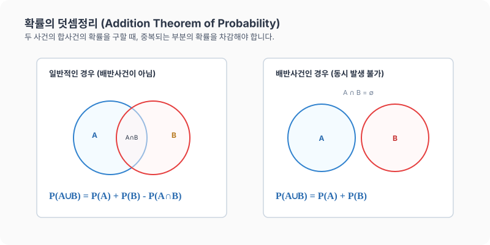

# 12강. 확률의 덧셈정리

**그림 02-12** 두 겹쳐진 원형 융단 위를 페인트 롤러로 칠하며 덧셈공식에서 중복 부위를 삭감하는 과정을 판서해주는 지니와 도로시

두 사건 중 하나가 터질 확률인 합사건의 확률 $P(A \cup B)$를 정확히 합산해내는 **확률의 덧셈정리**를 공부합니다. 겹쳐진 두 웅덩이 영역을 롤러로 덧칠할 때 두 번 칠해진 중복 교집합($P(A \cap B)$)을 콕 빼주는 도로시와 지니의 미술 시간 비유를 따라 직관적이고 경쾌하게 이해해봅시다!

---

## 1. 학습 목표
- 합사건의 확률을 구하는 기본 원리인 **확률의 덧셈정리**를 이해한다.
- 배반사건인 경우와 배반사건이 아닌 경우를 구분하여 각각의 공식에 맞추어 해결할 수 있다.
- 하나의 확률 문제를 여사건을 이용한 방법과 덧셈정리를 이용한 방법 두 가지로 유연하게 해결한다.

---

## 2. 핵심 개념

### (1) 확률의 덧셈정리 (Addition Theorem of Probability)
임의의 두 사건 $A$, $B$에 대하여 사건 $A$ 또는 사건 $B$가 일어날 확률 $P(A \cup B)$는 다음과 같습니다.
$$P(A \cup B) = P(A) + P(B) - P(A \cap B)$$
- *원리*: 경우의 수 합의 법칙 $n(A \cup B) = n(A) + n(B) - n(A \cap B)$의 양변을 표본공간의 크기 $n(S)$로 나누어 유도됩니다.

* 학교 축구 동아리($A$)와 농구 동아리($B$) 명단을 조사했더니, 두 동아리 전체 학생의 가짓수를 구할 때 각각의 가짓수를 단순히 더하기만 하면 두 동아리에 모두 가입해 있는 학생들($A \cap B$)이 중복 계산(더블 카운팅)됩니다. 따라서 전체 가짓수를 구할 때는 반드시 중복 가입자($A \cap B$)의 수를 한번 차감해 주어야 정확한 수치가 됩니다.

### (2) 배반사건일 때의 덧셈정리
두 사건 $A$, $B$가 동시에 일어날 수 없는 배반사건일 때(즉, $A \cap B = \emptyset$ 이므로 $P(A \cap B) = 0$), 공식은 다음과 같이 단순화됩니다.
$$P(A \cup B) = P(A) + P(B)$$

---

## 3. 시각 자료: 일반 사건과 배반사건의 덧셈정리 벤 다이어그램

---

## 4. 실전 예제

### 예제 1 (주사위 던지기)
> **문제**: 한 개의 주사위를 던질 때, 짝수의 눈 또는 $3$의 배수의 눈이 나올 확률을 구하세요.
>
> **풀이**:
> - 홀수/짝수 및 배수 사건을 다음과 같이 정의합니다.
>   - 사건 $A$: 짝수 눈이 나오는 사건 $\to A = \{2, 4, 6\}$ 이므로 $P(A) = \frac{3}{6} = \frac{1}{2}$
>   - 사건 $B$: $3$의 배수 눈이 나오는 사건 $\to B = \{3, 6\}$ 이므로 $P(B) = \frac{2}{6} = \frac{1}{3}$
> - 사건 $A$와 $B$의 교집합(곱사건): $A \cap B = \{6\}$ 이므로 $P(A \cap B) = \frac{1}{6}$
>
> 두 사건이 배반사건이 아니므로 확률의 덧셈정리를 사용합니다.
> $$P(A \cup B) = P(A) + P(B) - P(A \cap B) = \frac{3}{6} + \frac{2}{6} - \frac{1}{6} = \frac{4}{6} = \frac{2}{3}$$
> **정답**: $\frac{2}{3}$

### 예제 2 (음료수 당첨 확률 - 덧셈정리로 직접 구하기)
> **문제**: 당첨 음료수 $2$병과 꽝 음료수 $8$병이 섞인 상자에서 임의로 $3$병을 고를 때, 적어도 $1$병 이상 당첨될 확률을 확률의 덧셈정리를 이용하여 구하세요.
>
> **풀이**:
> 적어도 $1$병 이상 당첨되는 사건 $X$는 다음 두 사건의 합사건입니다.
> - 사건 $A$: 당첨 $1$병, 꽝 $2$병을 꺼내는 사건 $\to n(A) = _2\mathrm{C}_1 \times _8\mathrm{C}_2 = 2 \times 28 = 56$가지
>   $$P(A) = \frac{56}{_{10}\mathrm{C}_3} = \frac{56}{120} = \frac{7}{15}$$
> - 사건 $B$: 당첨 $2$병, 꽝 $1$병을 꺼내는 사건 $\to n(B) = _2\mathrm{C}_2 \times _8\mathrm{C}_1 = 1 \times 8 = 8$가지
>   $$P(B) = \frac{8}{_{10}\mathrm{C}_3} = \frac{8}{120} = \frac{1}{15}$$
>
> 꺼낸 $3$병 중에서 당첨 음료수가 $1$병이면서 동시에 $2$병일 수는 없으므로, 두 사건 $A$와 $B$는 **배반사건**입니다.
> $$P(X) = P(A \cup B) = P(A) + P(B) = \frac{7}{15} + \frac{1}{15} = \frac{8}{15}$$
> **정답**: $\frac{8}{15}$ (여사건으로 계산한 결과 $1 - \frac{_8\mathrm{C}_3}{_{10}\mathrm{C}_3} = \frac{8}{15}$와 동일함)

---

## 5. 핵심 요약
1. 두 사건 $A$, $B$가 동시에 일어날 가능성이 있다면 중복 계산을 피하기 위해 반드시 **$P(A \cap B)$**를 빼주어야 한다.
2. 두 사건이 **배반사건**이라면 동시 발생 확률이 $0$이므로 단순히 두 확률을 합한다: **$P(A) + P(B)$**.
3. 확률 문제를 풀 때, 여사건으로 푸는 방법과 배반사건의 덧셈정리로 나누어 푸는 방법 둘 다 활용하여 교차 검증할 수 있다.
