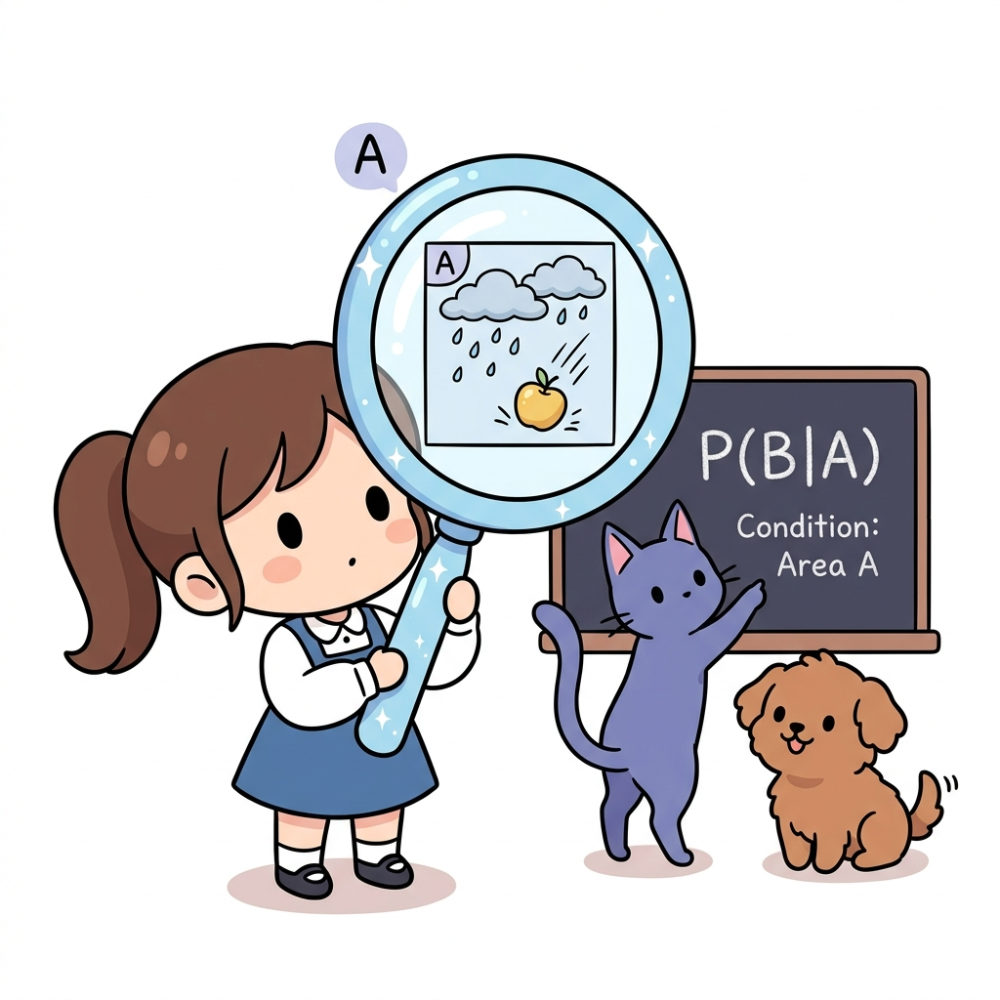
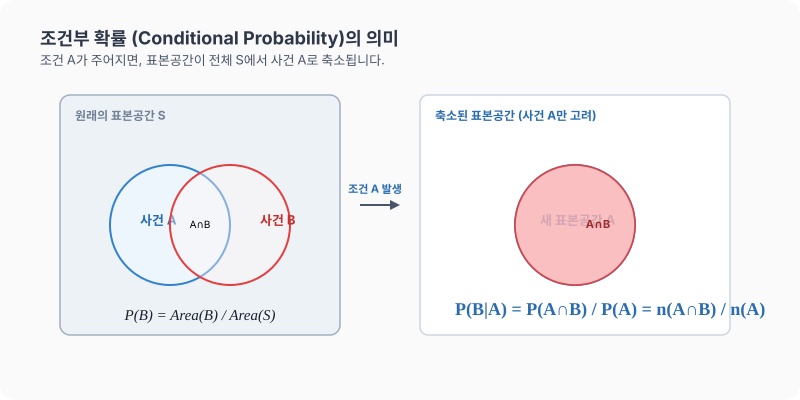

# 13강. 조건부 확률과 독립/종속 사건

**그림 02-13** 특정 조건 구역 A의 비를 돋보기로 보며 조건부 확률 P(B|A)를 설명해주는 지니와 도로시

어떤 사건이 이미 일어났다는 가정하에 다른 사건이 터질 비율인 **조건부 확률($P(B|A)$)**과, 두 사건의 연계 관계(독립/종속)를 배웁니다. 지니가 칠판에 적어준 조건부 영역 분석 공식과 도로시가 돋보기로 빗속에서 사과를 관찰하는 비유를 통해 조건부 확률의 진수를 깔끔하게 학습해봅시다!

---

## 1. 학습 목표
- **조건부 확률**의 정의와 표기법($P(B|A)$)을 이해하고 이를 계산할 수   있다.
- **독립사건**과 **종속사건**의 정의를 명확히 알고, 어떤 사건들이 독립인지 종속인지 수식으로 판별할 수 있다.
- 표(분할표)를 활용하여 실생활 조건부 확률 문제를 쉽게 구하는 방법을 익힌다.

---

## 2. 핵심 개념

### (1) 조건부 확률 (Conditional Probability)
어떤 사건 $A$가 일어났다는 전제하에(가정했을 때) 사건 $B$가 일어날 확률을 **조건부 확률**이라 하고, 기호로 **$P(B|A)$**로 나타냅니다.
$$P(B|A) = \frac{P(A \cap B)}{P(A)} \quad (\text{단, } P(A) > 0)$$
- **원리**: 조건 $A$가 주어짐에 따라, 관심 대상인 표본공간이 전체 $S$에서 사건 $A$로 축소(제한)됩니다. 따라서 $P(B|A) = \frac{n(A \cap B)}{n(A)}$로도 계산할 수 있습니다.

* 오늘 비가 올 단순 확률은 $30\%$이지만, 만약 '하늘에 구름이 잔뜩 껴 있다'는 조건($A$)이 먼저 주어지면 비가 올 확률($B$)은 $80\%$로 달라질 수 있습니다. 조건부 확률 $P(B|A)$는 이처럼 **이전 조건의 발생에 따라 대상 확률이 업데이트되는 원리**를 설명해 줍니다.

### (2) 독립사건과 종속사건
1. **독립사건 (Independent Events)**:
   사건 $A$가 일어나든 일어나지 않든, 사건 $B$가 일어날 확률에 아무런 영향을 주지 않을 때 두 사건 $A$, $B$는 서로 **독립**이라고 합니다.
   $$P(B|A) = P(B|A^c) = P(B)$$
   - *독립사건의 필요충분조건*:
     $$P(A \cap B) = P(A) \times P(B)$$
2. **종속사건 (Dependent Events)**:
   한 사건이 일어나는 것이 다른 사건이 일어날 확률에 영향을 미칠 때, 즉 두 사건이 독립이 아닐 때 두 사건을 **종속**이라고 합니다.
   $$P(B|A) \ne P(B)$$

---

## 3. 시각 자료: 조건부 확률의 표본공간 축소 원리

---

## 4. 실전 예제

### 예제 1 (표를 이용한 조건부 확률 계산)
> **문제**: 볼풀장 안에 다음과 같이 $300$개의 공이 들어 있습니다.
> 
> | 구분 | 신상공 ($N$) | 구상공 ($O$) | 합계 |
> |:---:|:---:|:---:|:---:|
> | **빨간공 ($R$)** | $20$ | $160$ | $180$ |
> | **파란공 ($B$)** | $80$ | $40$ | $120$ |
> | **합계** | $100$ | $200$ | $300$ |
> 
> 임의로 공을 $1$개 꺼냈더니 **파란 공**이었습니다. 이 공이 **신상공**일 확률 $P(N|B)$를 구하세요.
>
> **풀이 1 (축소된 경우의 수 이용)**:
> 파란 공이라는 조건이 주어졌으므로 전체 경우의 수는 파란 공의 총 개수인 $120$가지입니다. 이 중 신상공은 $80$가지이므로:
> $$P(N|B) = \frac{n(N \cap B)}{n(B)} = \frac{80}{120} = \frac{2}{3}$$
>
> **풀이 2 (공식 이용)**:
> - 전체 공 중에서 파란 공일 확률: $P(B) = \frac{120}{300} = \frac{2}{5}$
> - 전체 공 중에서 신상 파란 공일 확률: $P(N \cap B) = \frac{80}{300} = \frac{4}{15}$
> - 공식 적용:
>   $$P(N|B) = \frac{P(N \cap B)}{P(B)} = \frac{\frac{4}{15}}{\frac{2}{5}} = \frac{4}{15} \times \frac{5}{2} = \frac{2}{3}$$
> **정답**: $\frac{2}{3}$

### 예제 2 (독립과 종속의 판별)
> **문제**: 한 개의 주사위를 던질 때, 홀수의 눈이 나오는 사건을 $A = \{1, 3, 5\}$, $3$ 이상의 눈이 나오는 사건을 $B = \{3, 4, 5, 6\}$이라 합시다. 두 사건 $A$, $B$는 독립인가요, 종속인가요?
>
> **풀이**:
> - $P(A) = \frac{3}{6} = \frac{1}{2}$
> - $P(B) = \frac{4}{6} = \frac{2}{3}$
> - 두 사건의 곱사건: $A \cap B = \{3, 5\} \to P(A \cap B) = \frac{2}{6} = \frac{1}{3}$
> - 두 확률의 곱 계산:
>   $$P(A) \times P(B) = \frac{1}{2} \times \frac{2}{3} = \frac{1}{3}$$
> - 판별: $P(A \cap B) = P(A) \times P(B) = \frac{1}{3}$이 성립하므로, 두 사건 $A$와 $B$는 서로 독립입니다.
> **정답**: 독립사건

---

## 5. 핵심 요약
1. **조건부 확률 $P(B|A)$**는 사건 $A$가 이미 일어났을 때 $B$가 발생할 확률로, 전체 영역(표본공간)이 **사건 $A$의 영역**으로 좁혀진다.
2. 두 사건이 서로 영향을 주고받지 않는다면 **독립사건**이고, 영향을 미친다면 **종속사건**이다.
3. 수식적으로 $P(A \cap B) = P(A) \times P(B)$가 성립하면 두 사건은 무조건 **독립**이다.
