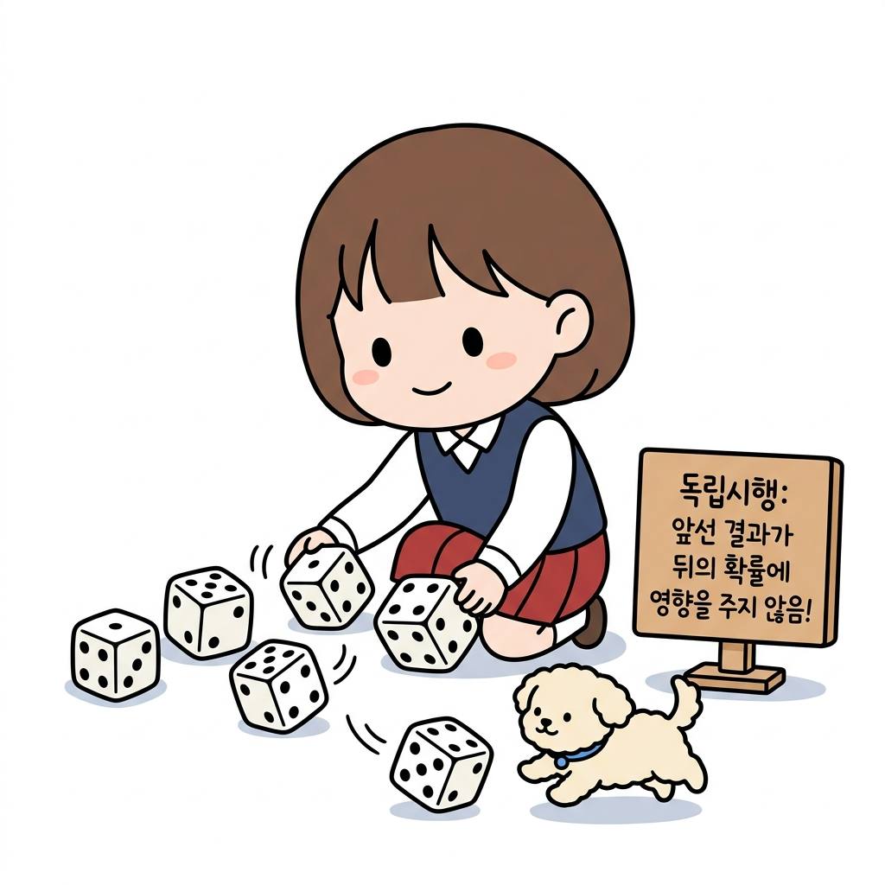
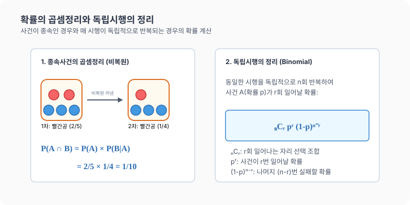

# 14강. 확률의 곱셈정리와 독립시행의 정리

**그림 02-14** 여러 번 화살을 쏘아 과녁을 맞추는 독립시행의 반복을 공식을 통해 설명해주는 지니와 도로시

서로 영향을 끼치지 않는 무작위 행동(시행)을 계속해서 반복할 때의 가짓수 법칙인 **독립시행의 정리**와 **곱셈정리**를 공부합니다. 활을 쏘아 과녁을 수차례 명중시키는 도로시의 양궁 연습 놀이와 칠판에 수식($P(X=k) = _n\mathrm{C}_k \cdot p^k \cdot (1-p)^{n-r}$)을 아름답게 판서하며 설명해주는 지니의 가이드를 통해 완전히 학습해봅시다!

---

## 1. 학습 목표
- **확률의 곱셈정리**를 이해하고 종속사건과 독립사건의 경우에 맞추어 활용할 수 있다.
- **독립시행**의 뜻을 알고, **독립시행의 정리** 공식을 유도하고 문제에 적용할 수 있다.
- 여러 단계의 사건이 복합적으로 일어날 때의 확률을 구조적으로 계산한다.

---

## 2. 핵심 개념

### (1) 확률의 곱셈정리 (Multiplication Theorem of Probability)
두 사건 $A$, $B$가 동시에 일어날 확률 $P(A \cap B)$는 다음과 같이 조건부 확률을 활용하여 구합니다.
$$P(A \cap B) = P(A) \times P(B|A) = P(B) \times P(A|B)$$
- **독립사건의 경우**:
  두 사건 $A$, $B$가 독립이면 $P(B|A) = P(B)$이므로 다음과 같이 간단한 곱으로 나타납니다.
  $$P(A \cap B) = P(A) \times P(B)$$

### (2) 독립시행의 정리 (Theorem of Independent Trials)
매회 동일한 조건에서 반복되는 시행에서 각 시행의 결과가 서로 독립적인 시행을 **독립시행**이라고 합니다.
- **정리**:
  어떤 시행에서 사건 $A$가 일어날 확률이 $p$ (단, $0 \le p \le 1$)일 때, 이 시행을 독립적으로 $n$회 반복하는 독립시행에서 사건 $A$가 정확히 $r$회 일어날 확률은 다음과 같습니다.
  $$P(X=r) = {}_n\mathrm{C}_r p^r (1-p)^{n-r} \quad (r = 0, 1, 2, \dots, n)$$
  - ${}_n\mathrm{C}_r$: $n$번의 시행 중 사건 $A$가 일어날 $r$개의 위치(순서)를 선택하는 조합의 수
  - $p^r$: 사건 $A$가 $r$번 일어날 확률
  - $(1-p)^{n-r}$: 나머지 $(n-r)$번 실패할 확률

* 주사위를 한 번 던져서 $6$의 눈이 나오는 사건($p = \frac{1}{6}$)은 이전 시행들의 결과가 무엇이었든 전혀 영향을 받지 않고 매 던지기마다 독립적으로 유지됩니다. 이렇게 매회 확률이 똑같이 주어지는 사건을 여러 번 시도할 때 특정 횟수만큼 성공할 확률은 **독립시행의 정리** 공식($_{n}\mathrm{C}_r p^r (1-p)^{n-r}$)을 사용해 깔끔하게 계산할 수 있습니다.

---

## 3. 시각 자료: 확률의 곱셈정리와 독립시행 도식

---

## 4. 실전 예제

### 예제 1 (비복원추출에서의 곱셈정리)
> **문제**: 주머니 속에 빨간 공 $2$개와 파란 공 $3$개가 들어 있습니다. 이 주머니에서 공을 한 개씩 연속해서 두 번 꺼낼 때(꺼낸 공은 다시 넣지 않음), 두 번 모두 빨간 공이 나올 확률을 구하세요.
>
> **풀이**:
> - 사건 $A$: 첫 번째에 빨간 공을 꺼내는 사건 $\to P(A) = \frac{2}{5}$
> - 사건 $B$: 두 번째에 빨간 공을 꺼내는 사건
> 첫 번째 빨간 공을 뽑았으므로 남은 공은 빨간 공 $1$개와 파란 공 $3$개(총 $4$개)입니다.
> - 첫 번째 빨간 공이 나왔다는 전제하에 두 번째 빨간 공이 나올 확률: $P(B|A) = \frac{1}{4}$
> - 곱셈정리에 따라 두 번 모두 빨간 공이 나올 확률은:
>   $$P(A \cap B) = P(A) \times P(B|A) = \frac{2}{5} \times \frac{1}{4} = \frac{1}{10}$$
> **정답**: $\frac{1}{10}$ (꺼낸 공을 다시 넣는 **복원추출**이라면 독립사건이 되므로 $\frac{2}{5} \times \frac{2}{5} = \frac{4}{25}$가 됩니다.)

### 예제 2 (독립시행의 정리 - 시험 문제 찍기)
> **문제**: 오지선다형($5$개의 보기 중 정답이 $1$개) 객관식 문제 $5$개가 있습니다. 이 중 임의로 답을 적어 넣을(찍을) 때, 정확히 $2$문제를 맞힐 확률을 구하세요.
>
> **풀이**:
> 각 문제를 맞히는 시행은 정답률 $p = \frac{1}{5}$인 독립시행이며, 총 $n=5$번 반복합니다. 이 중 $r=2$번 맞힐 확률은 독립시행의 정리를 이용합니다.
> - 식: ${}_5\mathrm{C}_2 \times \left(\frac{1}{5}\right)^2 \times \left(1 - \frac{1}{5}\right)^{5-2}$
> - 계산:
>   $$10 \times \left(\frac{1}{25}\right) \times \left(\frac{4}{5}\right)^3 = 10 \times \frac{1}{25} \times \frac{64}{125} = \frac{128}{625} \approx 0.2048$$
> **정답**: $\frac{128}{625}$ ($20.48\%$)

---

## 5. 핵심 요약
1. **곱셈정리**는 두 사건이 연속해서(동시에) 발생할 때, 순차적인 조건부 확률의 곱 **$P(A) \times P(B|A)$**로 해결한다.
2. 두 사건이 **독립사건**일 때는 조건부 확률을 고민할 필요 없이 각 확률을 단순 곱하면 된다: **$P(A) \times P(B)$**.
3. 동일한 조건의 확률 $p$가 독립적으로 $n$회 반복될 때 특정 횟수 $r$번 성공할 확률은 **독립시행의 정리 (${}_n\mathrm{C}_r p^r (1-p)^{n-r}$)**로 구한다.
