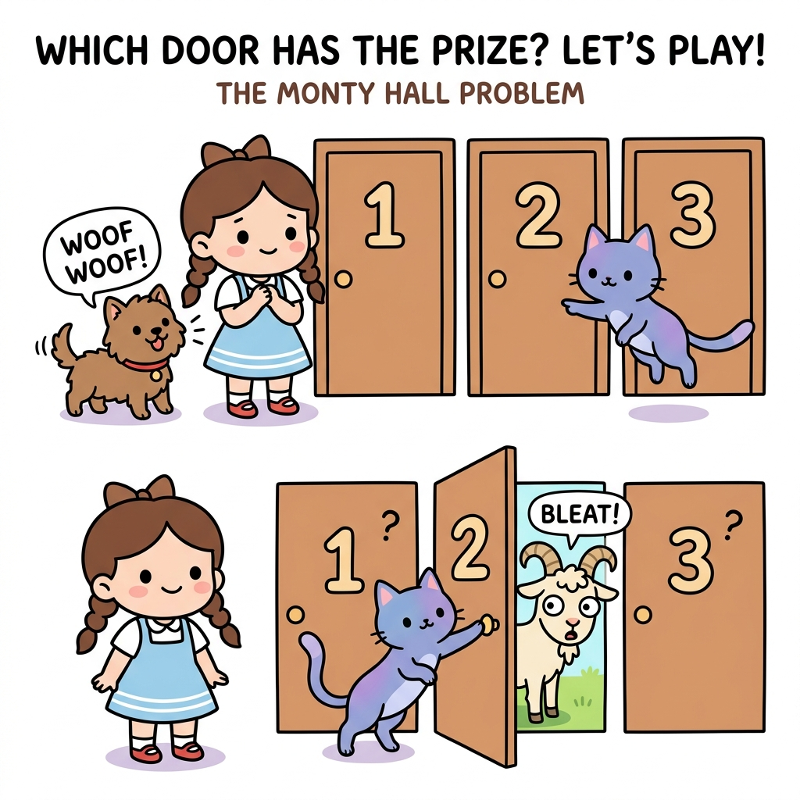
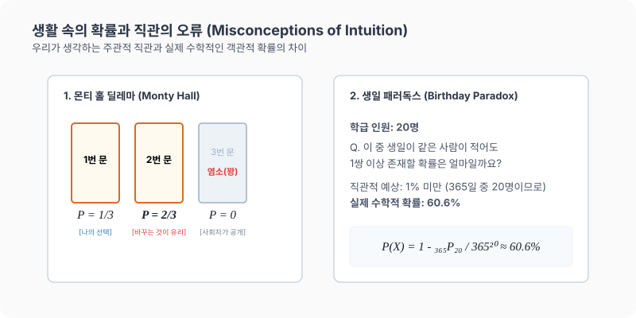

# 15강. 생활 속의 확률과 직관의 오류

**그림 02-15** 세 개의 굳게 닫힌 몬티 홀 마법의 문 앞에서 선택을 바꾸는 전략의 유불리를 토론하는 지니와 도로시

인간의 본능적인 느낌이 실제 정밀한 수학 계산과 어떻게 어긋나는지 **직관의 오류**와 실생활 확률(생일 패러독스, 몬티 홀 문제 등)을 알아봅니다. 요정 지니가 2번 문을 슬며시 열어 염소(꽝)를 보여주며 도로시에게 1번과 3번 문 중 어느 쪽을 택하는 것이 진정한 잭팟(자동차)의 기댓값을 높이는지 물어보는 몬티 홀 퍼즐을 통해, 조건부 확률의 매혹적인 세계관을 함께 정리해봅시다!

---

## 1. 학습 목표
- 실생활의 여러 현상(도전, 만남, 게임 등) 속에서 어떻게 확률이 작동하는지 알아본다.
- 우리의 직관적인 확률 판단이 실제 계산 결과와 어떻게 다른지(직관의 오류) 배운다.
- **몬티 홀 문제**와 **생일 패러독스**를 통해 조건부 확률과 여사건의 유용성을 체득한다.

---

## 2. 핵심 개념

### (1) 주관적 확률과 드 피네티 게임 (De Finetti Game)
- **주관적 확률**: 사람들이 직관적으로 느끼는 일어날 가능성입니다. (예: "내일 우승할 확률이 99%다")
- **드 피네티 게임**: 주관적 확률을 정량적인 객관적 확률로 바꾸어 파악하는 게임입니다.
  - *방법*: 확실한 확률을 가진 복권(예: 빨간 공이 $x$개인 주머니)과 주관적 예측 사건(예: 수학 100점 받기)을 저울질하게 하여, 어느 시점에서 선택이 바뀌는지를 찾아 실제 마음속의 예상 확률을 측정합니다.

### (2) 직관에 반하는 확률 모델들

#### 1) 몬티 홀 딜레마 (Monty Hall Problem)
- **상황**: 3개의 문 중 하나 뒤에는 자동차가 있고, 나머지 둘 뒤에는 염소(꽝)가 있습니다. 참가자가 문을 하나 고른 후, 사회자가 남은 두 문 중 염소가 있는 문 하나를 열어 보여줍니다. 이때 참가자는 선택을 바꾸는 것이 유리할까요?
- **진실**: 선택을 **바꾸는 것이 2배 유리**합니다.
  - 처음 선택한 문에 자동차가 있을 확률: $\frac{1}{3}$
  - 남은 문에 자동차가 있을 확률: $\frac{2}{3}$ (사회자가 꽝인 문을 열어 제거해 줬으므로 남은 한 개의 문이 $\frac{2}{3}$의 확률을 전부 상속받음)

#### 2) 생일 패러독스 (Birthday Paradox)
- **상황**: 한 반에 $20$명의 학생이 있을 때, 생일이 같은 학생이 적어도 한 쌍 이상 있을 확률은 얼마나 될까요?
- **진실**: 직관적으로는 매우 드문 일처럼 보이지만, 실제 계산해 보면 약 **$60.6\%$**로 절반이 넘는 높은 확률을 보입니다.

* $20$명이 모인 교실에서 생일이 같은 두 사람이 있을 확률은 우리의 일반적인 직관($20/365 \approx 5.4\%$)을 완전히 깨트리고, 여사건의 누적 곱셈 연산을 통해 **무려 $60.6\%$라는 압도적으로 높은 확률**을 보입니다. 이처럼 직관에만 의존하는 확률 판단은 심각한 오류를 낳을 수 있으므로 수학적 검증이 중요합니다.

---

## 3. 시각 자료: 몬티 홀 딜레마와 생일 패러독스의 직관 오류 분석

---

## 4. 실전 예제

### 예제 1 (생일 패러독스 계산)
> **문제**: $20$명의 사람이 한 방에 모여 있을 때, 생일이 같은 사람이 적어도 $1$쌍 이상 존재할 확률의 계산식을 세우고 그 결과를 설명하세요. (단, 1년은 365일로 가정하고 윤년은 고려하지 않음)
>
> **풀이**:
> '생일이 같은 사람이 적어도 $1$쌍 이상 있을 사건'의 여사건은 '$20$명 모두의 생일이 서로 다를 사건'입니다.
> - $20$명의 생일이 모두 다를 확률:
>   $$P(\text{모두 다름}) = \frac{_{365}\mathrm{P}_{20}}{365^{20}} = \frac{365 \times 364 \times 363 \times \dots \times 346}{365^{20}}$$
> - 여사건의 성질을 이용하여 적어도 $1$쌍의 생일이 같을 확률 $P$를 구합니다:
>   $$P = 1 - P(\text{모두 다름}) = 1 - \frac{_{365}\mathrm{P}_{20}}{365^{20}} \approx 0.606 \quad (60.6\%)$$
> **결론**: 생일이 같은 사람이 존재할 확률이 $60.6\%$나 되므로, $20$명만 모여도 생일이 같은 사람이 나올 가능성이 그렇지 않을 가능성보다 큽니다.
> **정답**: $60.6\%$

### 예제 2 (로또의 수학적 당첨 확률)
> **문제**: $1$부터 $45$까지의 숫자 중 순서와 관계없이 서로 다른 $6$개의 숫자를 선택하는 로또 1등에 당첨될 확률을 계산식으로 표현하세요.
>
> **풀이**:
> 전체 조합의 수 중에서 1등 당첨 번호 세트는 단 $1$개뿐입니다.
> - 전체 번호 선택 조합의 수: $_{45}\mathrm{C}_6$
> - 1등 당첨 확률 $P$는:
>   $$P = \frac{1}{_{45}\mathrm{C}_6} = \frac{1}{8,145,060}$$
> **결론**: 로또 1등 당첨 확률은 약 $814$만 분의 $1$(대략 $0.000012\%$)로, 번개에 맞을 확률보다 낮습니다.
> **정답**: $\frac{1}{_{45}\mathrm{C}_6}$

---

## 5. 핵심 요약
1. 확률은 실생활에서 발생하는 수많은 우연의 메커니즘을 객관적으로 분석해 주는 강력한 **의사결정 도구**이다.
2. 몬티 홀 문제나 생일 패러독스처럼 사람의 **직관(주관적 확률)**은 실제 **객관적 확률**과 다를 수 있으므로, 항상 엄밀한 수학적 계산을 통해 판단을 바로잡아야 한다.
3. 아무리 낮은 확률의 사건이라도 독립적으로 수없이 많이 반복한다면 언젠가는 실현된다. 다만 복권이나 도박처럼 대가를 지불해야 하는 경우에는 계산상 무조건 손실을 입게 됨을 잊지 말아야 한다.
