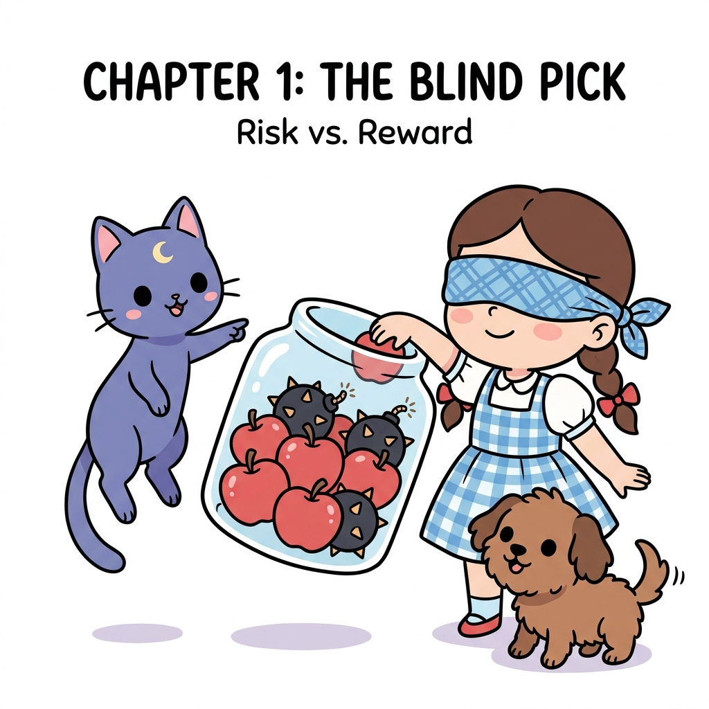

# 중학생을 위한 강화학습 기초: 확률과 통계

**그림 02-0** 안대를 끼고 투명 유리 단지 안에서 사과와 폭탄을 무작위로 뽑으려는 도로시와 이를 조언하는 지니

강화학습에서 '선택'이란 100% 보장된 성공만을 가져다주지 않습니다. 요정 고양이 지니가 건넨 투명 유리 항아리 속 사과(보상)와 폭탄(감점)처럼, 매 순간 우리는 불확실한 결과를 마주하게 되죠. 이 불확실성을 수학적으로 계산하고 가장 유리한 결정을 내릴 수 있도록 돕는 비밀 열쇠, **확률과 통계**의 기초를 재미있게 탐험해봅시다!

---

이 강의 자료는 강화학습을 배우기 전에 꼭 알아야 하는 필수 수학 개념인 **확률과 통계**를 중학생 눈높이에 맞추어 핵심 위주로 정리한 핵심 강의록입니다. 경우의 수부터 시작하여 독립시행, 조건부 확률 등 필수 개념들을 직관적인 도식과 함께 학습할 수 있습니다.

## 강의 목차

- **01강**: [경우의 수와 합/곱의 법칙](./01_chapter1/index.md)
- **02강**: [확률의 정의와 실험적 확률](./02_chapter2/index.md)
- **03강**: [수학적 확률과 기하학적 확률](./03_chapter3/index.md)
- **04강**: [확률의 성질과 여사건](./04_chapter4/index.md)
- **05강**: [확률의 역사와 상금 분배 문제](./05_chapter5/index.md)
- **06강**: [경우의 수 심화: 중복이 있는 합의 법칙과 곱의 법칙](./06_chapter6/index.md)
- **07강**: [팩토리얼과 순서대로 나열하기](./07_chapter7/index.md)
- **08강**: [순열: 택하여 줄 세우기](./08_chapter8/index.md)
- **09강**: [조합: 순서 없이 선택하기](./09_chapter9/index.md)
- **10강**: [표본공간과 배반사건](./10_chapter10/index.md)
- **11강**: [조합을 이용한 확률 계산](./11_chapter11/index.md)
- **12강**: [확률의 덧셈정리](./12_chapter12/index.md)
- **13강**: [조건부 확률과 독립/종속 사건](./13_chapter13/index.md)
- **14강**: [확률의 곱셈정리와 독립시행의 정리](./14_chapter14/index.md)
- **15강**: [생활 속의 확률과 직관의 오류](./15_chapter15/index.md)
