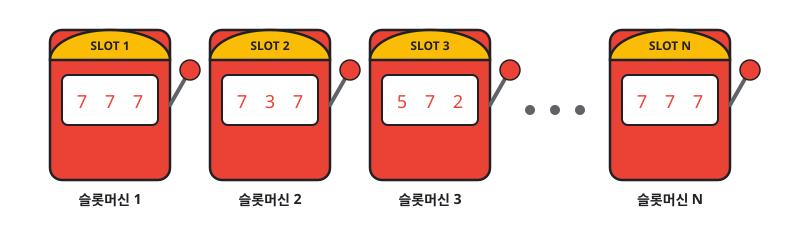
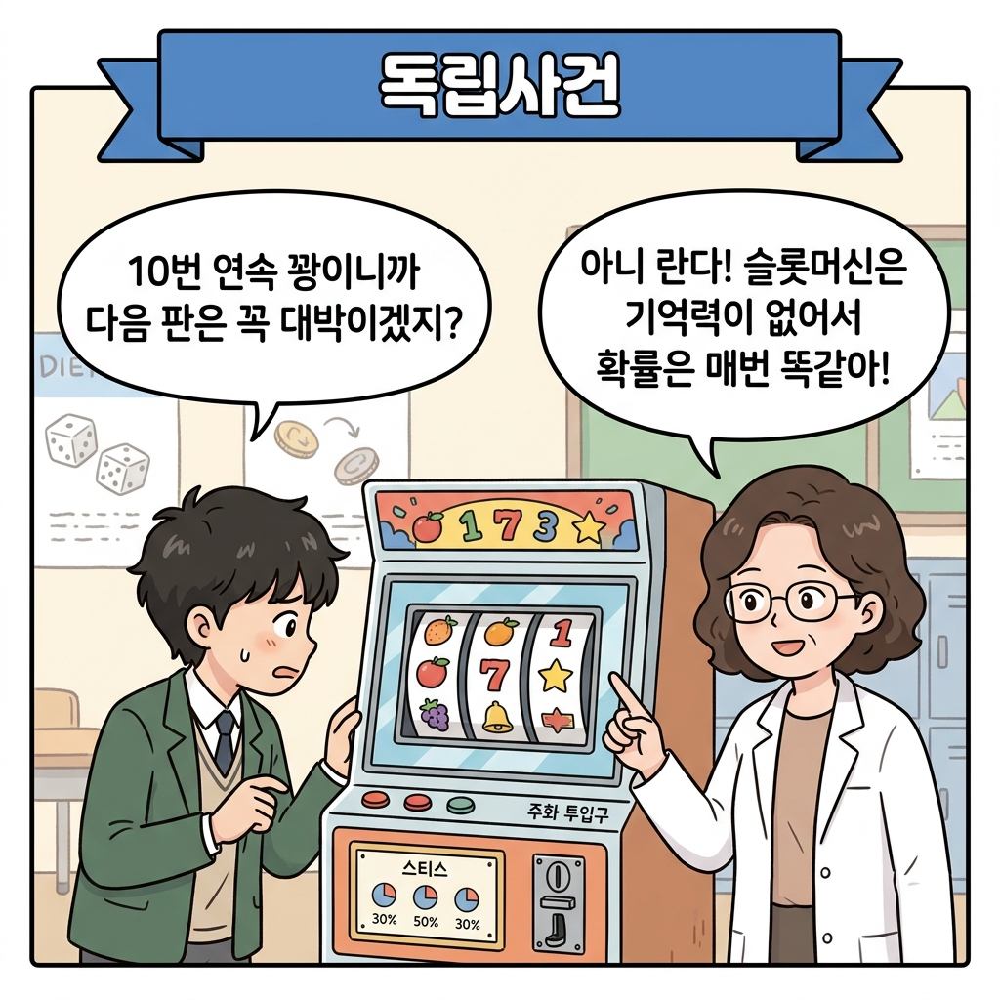
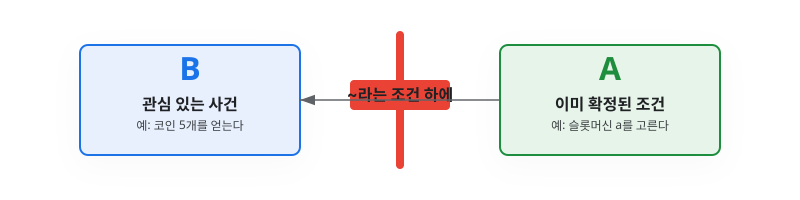
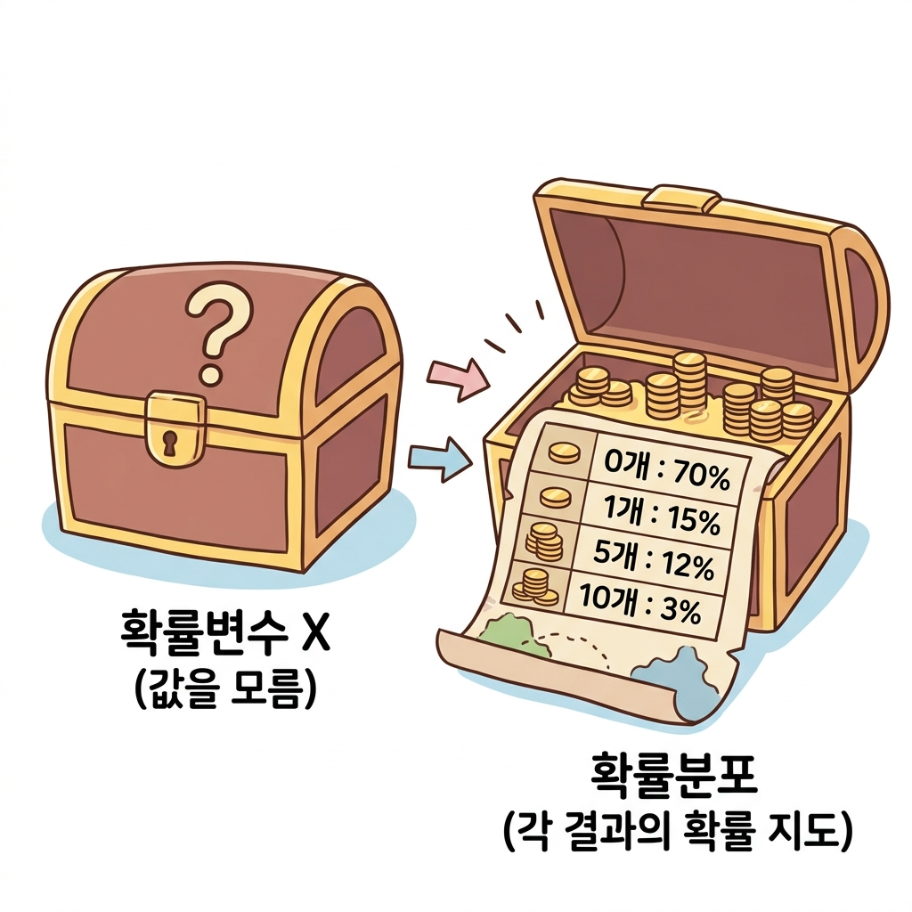
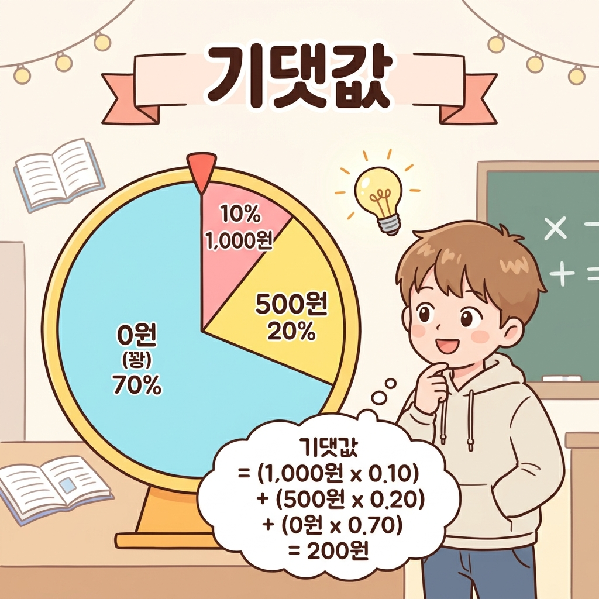
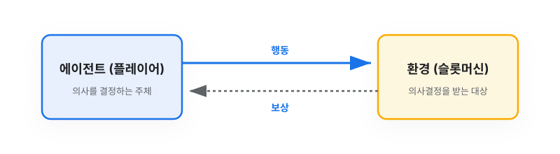

# 3.2 밴디트 문제

**그림 03-2** 슬롯머신 레버를 직접 당기며 점수 기댓값을 확인해 나가는 도로시와 칠판에 누적 평균 연산을 풀어주는 지니

이제부터는 강화 학습에서 다루는 구체적인 문제를 살펴보겠습니다. 처음이니 가장 간단하면서도 강화 학습의 본질을 고스란히 품고 있는 **밴디트 문제**bandit problem를 만나보죠. 지니가 칠판에 적어주는 동적 당첨 기댓값과 도로시의 실시간 기계 탐색 비유를 통해, 밴디트의 기본 보상 구조를 명쾌하게 이해해봅시다!

---

이제부터는 강화 학습에서 다루는 구체적인 문제를 살펴보겠습니다. 처음이니 가장 간단하면서도 강화 학습의 본질을 고스란히 품고 있는 **밴디트 문제**bandit problem를 만나보죠. 

이 문제를 함께 해결해 가면서 강화 학습이 어떻게 문제를 바라보고 수식화하는지 명확하게 이해하게 될 것입니다.

---

## 3.2.1 밴디트 문제란 무엇일까요

**밴디트**bandit는 오락실이나 카지노에서 흔히 볼 수 있는 **'슬롯머신'**의 또 다른 이름입니다. 

슬롯머신 옆에 달린 손잡이(레버)를 당기면 내부 릴이 무작위로 돌아가다가 멈추며, 멈춰 선 그림 조합에 따라 플레이어가 획득하는 코인의 개수가 정해집니다.

### 밴디트의 정의와 유래

#### 단어의 원래 뜻
밴디트bandit의 원래 의미는 영어로 **'도적'** 혹은 **'산적'**입니다. 

#### 외팔이 도적
그런데 도박꾼들 사이에서 슬롯머신을 **'외팔이 도적one-armed bandit'**이라고 부르기 시작했습니다. 손잡이가 옆에 단 하나만 달려 있어 '외팔이' 같고, 한 번 빠지면 돈을 도둑맞은 것처럼 전부 잃게 된다고 해서 붙은 재미있는 별명입니다.

#### 멀티-암드 밴디트
강화 학습에서 다루는 진짜 문제는 **멀티-암드 밴디트 문제**multi-armed bandit problem라고 부릅니다. 직역하면 '팔이 여러 개 달린 도적'이라는 뜻이죠. 

이는 한마디로 아래 그림과 같이 **여러 대의 슬롯머신이 일렬로 놓여 있는 상황**을 의미합니다.

**그림 3-5** 멀티-암드 밴디트는 슬롯머신이 여러 대인 문제와 같다.

---

## 3.2.2 초보자를 위한 확률 기초 다지기 (주사위 비유)

수학이나 확률을 배워본 적이 없어도 괜찮습니다! 우리가 매일 접할 수 있는 **주사위 던지기**를 가지고 확률의 가장 핵심적인 두 가지 개념인 **독립사건**과 **조건부 확률**을 완벽하게 마스터해 보겠습니다.

### 1. 주사위로 독립사건 이해하기

우리가 주사위를 한 번 던졌을 때 숫자 **6**이 나올 확률은 얼마일까요? 전체 눈이 6개이므로 당연히 **1/6 (약 16.6%)**입니다.

그렇다면, 방금 주사위를 던져서 아주 운 좋게 **6**이 나왔다고 해봅시다. 다음 판에 다시 주사위를 던졌을 때 또다시 **6**이 나올 확률은 이전보다 떨어지거나 올라갈까요? 

정답은 **"그대로 1/6"**입니다. 이전에 대박이 터졌든 꽝이 나왔든 간에, 주사위를 새로 굴릴 때마다 과거의 기억은 깨끗이 잊혀지고 매번 동일한 확률(1/6)로 처음부터 다시 굴려집니다. 

이처럼 **"이전에 무슨 결과가 나왔든지 간에, 지금 일어나는 결과에는 0.0001%도 영향을 주지 않고 매번 리셋되는 독립적인 사건"**을 **독립사건(Independent Events)**이라고 부릅니다.

> **NOTE_** **확률의 총합은 항상 1입니다**
> 주사위를 던졌을 때 나올 수 있는 눈은 {1, 2, 3, 4, 5, 6} 총 6가지입니다. 각각의 눈이 나올 확률은 전부 *1/6*로 동일합니다. 이 모든 확률을 전부 더해보면 어떻게 될까요?
>
> $$
> \frac{1}{6} + \frac{1}{6} + \frac{1}{6} + \frac{1}{6} + \frac{1}{6} + \frac{1}{6} = \frac{6}{6} = 1
> $$
>
> 합이 정확히 **1** (백분율로는 100%)이 됩니다. 왜 그럴까요? 주사위를 던지면 1부터 6까지의 눈 중 **어느 하나는 반드시(100% 확률로) 나오기 때문**입니다. 이처럼 어떤 실행에서 **발생 가능한 모든 개별 확률을 다 더하면, 그 합은 언제나 예외 없이 정확히 1**이 됩니다.

### 2. 주사위로 조건부 확률과 칸막이 기호 '|' 이해하기

이번에는 주사위를 굴린 뒤 손으로 컵을 덮어 가렸습니다. 친구가 컵 안을 살짝 보더니 힌트를 줍니다.
> **"어! 굴려진 주사위 눈이 '짝수'네!"**

이 말을 들은 상태에서, 주사위 눈이 **6**일 확률은 얼마일까요?

친구가 힌트를 주기 전에는 전체 6가지 눈 중에서 6이 나와야 하므로 확률이 1/6이었습니다. 하지만 **"짝수가 나왔다"는 새로운 조건**을 알게 되는 순간, 전체 세상이 홀수(1, 3, 5)는 싹 제외되고 오직 **짝수 집합 {2, 4, 6}**이라는 3가지 가능성으로 좁아집니다!

그 좁아진 3가지 가능성 중에서 우리가 알고 싶어 하는 목표 눈인 **6**은 단 1개뿐입니다. 따라서 확률은 **1/3 (약 33.3%)**로 껑충 뛰게 됩니다.

**그림 3-6** 주사위 비유를 통한 조건부 확률의 필터링 원리

이처럼 **"어떤 선행 조건(힌트)이 주어졌을 때, 다른 사건이 일어날 확률"**을 **조건부 확률(Conditional Probability)**이라고 합니다. 수학에서는 이를 표현하기 위해 수직선 기호 **`|`**를 사용하여 다음과 같이 표기합니다.

$$
P(B \mid A)
$$

여기서 쓰이는 수직선 기호 `|` (수학에서는 '바/bar' 혹은 'given'이라고 읽습니다)는 일종의 **'조건을 나누는 칸막이(벽)'**라고 생각하면 됩니다.

* **오른쪽 영역 (A)**: 이미 알고 있거나 확정된 **'선행 조건 (힌트)'**입니다. (예: "짝수가 나왔다")
* **왼쪽 영역 (B)**: 그 조건 안에서 우리가 **'진짜 관심 있게 구하고자 하는 결과 사건'**입니다. (예: "눈이 6이다")

> **NOTE_** **확률 기호 P의 유래**
> 수학에서 확률을 나타내는 대표적인 기호로 대문자 **P**를 씁니다. 이는 **'확률'**을 뜻하는 영어 단어 **Probability (프로바빌리티)**의 첫 글자에서 딴 것입니다. 이 단어는 라틴어 **probabilitas (프로바빌리타스)**에 뿌리를 두고 있으며, 원래는 '검증할 수 있음', '그럴듯함(개연성)'을 의미했습니다. 즉, 어떤 사건이 일어날 가능성이 얼마나 그럴듯한지를 숫자로 표현한 것이 바로 확률 *P*입니다.

---

## 3.2.3 밴디트 문제 해결을 위한 확률 적용

이제 방금 배운 주사위 확률 개념(독립사건, 조건부 확률)을 **우리가 해결하려는 밴디트 문제(슬롯머신)**에 그대로 적용해 보겠습니다.

### 1. 슬롯머신과 독립사건

오락실이나 카지노의 슬롯머신은 주사위와 마찬가지로 철저히 **독립사건**으로 동작합니다. 

만약 어떤 사람이 "이 슬롯머신에서 방금 10판 연속으로 꽝이 나왔으니까, 독립적으로 이번 11번째 판에는 잭팟이 터질 확률이 엄청 높아졌을 거야!"라고 굳게 믿는다면 이는 수학적으로 완전한 착각입니다. 과거에 돈을 얼마나 잃었든 간에, 이번 손잡이를 당길 때 잭팟이 터질 확률은 여전히 독자적인 확률로 고정되어 있습니다.

**그림 3-7** 독립사건의 오해와 슬롯머신의 작동 원리

### 2. 슬롯머신과 조건부 확률

우리가 일렬로 늘어선 여러 대의 슬롯머신 앞에 서 있을 때, **"내가 어떤 기계를 선택하는가(행동 *A*)"**는 주사위 비유에서 '짝수가 나왔다'와 같은 **'선행 조건'**이 됩니다.

그리고 그 기계에서 **"코인을 몇 개 얻을 것인가(보상 *R*)"**는 조건 하에 일어나는 **'결과 사건'**입니다.

예를 들어, "내가 **슬롯머신 a**를 선택하여 손잡이를 당겼을 때(조건), 

보상으로 **코인 5개**를 얻을 조건부 확률"은 수학 기호로 다음과 같이 아주 세련되게 표현할 수 있습니다.

$$
P(R = 5 \mid A = a)
$$

* **읽는 방법**: "행동 *A*가 *a*일 때(조건), 보상 *R*이 5가 될 조건부 확률"

**그림 3-8** 조건부 확률의 칸막이 기호 `|` 이해하기

이러한 선택 조건에 따른 보상 획득 구조를 트리 다이어그램으로 펼쳐보면 다음과 같습니다.

**그림 3-9** 밴디트 문제에서의 조건부 확률 트리

에이전트(플레이어)는 슬롯머신마다 각 보상 액수(*R* = 0, 1, 5, 10)가 나올 조건부 확률 분포가 서로 다르다는 사실을 인지하고, 어떤 기계를 당겨야 평균 보상이 가장 높을지 조건부 기댓값(가치)을 비교하게 됩니다.

---

## 3.2.4 [사전 학습] 확률변수, 확률분포, 그리고 기댓값

슬롯머신이 코인을 뱉어내는 규칙을 본격적으로 비교하기 전에, 앞으로 계속해서 마주하게 될 세 가지 핵심 확률 용어인 **확률변수**, **확률분포**, 그리고 **기댓값**에 대해 깊이 알아봅시다.

### 1. 확률변수 (Random Variable) - "값이 무작위로 결정되는 특별한 변수"

수학에서 일반적인 변수 *x*는 *x* = 3처럼 우리가 값을 직접 대입하거나 방정식의 해로 풀어내어 딱 정해지는 값입니다. 

하지만 **확률변수 (보통 대문자 *X*로 씁니다)**는 다릅니다. 주사위를 굴리거나 슬롯머신을 당기기 전까지는 그 값이 무엇이 될지 아무도 모르며, 오직 **'확률적으로만 결과가 결정되는 변수'**를 뜻합니다.
- **예시**: 주사위를 던졌을 때 나오는 눈의 수 (*X*는 1, 2, 3, 4, 5, 6 중 하나)
- **예시**: 슬롯머신 한 판을 돌렸을 때 튀어나오는 보상(코인 개수) *R*

이처럼 매 판 결과값이 무작위로 변하는 보상 *R*을 수학적으로는 **확률변수**라고 표현합니다.

### 2. 확률분포 (Probability Distribution) - "확률이 각각 어떻게 흩어져(분포해) 있는지 알려주는 지도"

확률변수 *X*가 가질 수 있는 값들을 나열했다면, 각각의 값이 **몇 퍼센트(%) 확률로 나타나는지 그 구체적인 비율을 표나 그림으로 펼쳐놓은 것**을 **확률분포**라고 합니다.

예를 들어, 일반적인 주사위를 던질 때 나오는 눈 *X*의 확률분포는 다음과 같이 정리할 수 있습니다.

| *X*의 값 | 1 | 2 | 3 | 4 | 5 | 6 |
| :--- | :---: | :---: | :---: | :---: | :---: | :---: |
| **확률** | 1/6 | 1/6 | 1/6 | 1/6 | 1/6 | 1/6 |

이 표가 바로 **"확률변수 *X*의 확률분포"**입니다. 슬롯머신도 마찬가지로, 어떤 보상(0개, 1개, 5개, 10개)이 각각 몇 % 확률로 터지는지 정리한 지도를 해당 슬롯머신의 확률분포라고 부릅니다.

**그림 3-10** 확률변수와 확률분포의 개념 비유

### 3. 기댓값 (Expected Value) - "무한히 반복했을 때 평균적으로 얻을 수 있는 값"

**기댓값(Expected Value, 보통 𝔼[*X*] 또는 E[*X*]로 표기)**은 쉽게 말해 **"평균적으로 이 정도 값이 나올 것이라 기대하는 가치"**를 뜻합니다.

기댓값을 구하는 방법은 아주 직관적입니다. **"나올 수 있는 각각의 보상 값에 그 보상이 나올 확률을 곱한 뒤, 이를 전부 더하는 것"**입니다.

이해를 돕기 위해 간단한 추첨 이벤트를 예로 들어보겠습니다.
- **1등 당첨 금액**: 1,000원 (확률 10%, 즉 0.10)
- **2등 당첨 금액**: 500원 (확률 20%, 즉 0.20)
- **꽝일 때 금액**: 0원 (확률 70%, 즉 0.70)

이 이벤트에 참여했을 때 내가 평균적으로 기대할 수 있는 금액은 다음과 같이 계산합니다.

$$
\text{기댓값} = (1,000 \times 0.10) + (500 \times 0.20) + (0 \times 0.70) = 100 + 100 + 0 = 200\text{원}
$$

즉, 이 이벤트의 기댓값은 **200원**입니다. 단 한 번 참여해서는 200원을 정확히 받을 수 없지만(1,000원, 500원, 0원 중 하나만 받으므로), 이 이벤트를 수백, 수천 번 반복해서 참여한다면 한 판당 평균적으로 200원에 가까운 금액을 가져가게 됨을 수학적으로 보장합니다.

**그림 3-11** 추첨 바퀴 비유를 통한 기댓값 개념도

강화 학습 에이전트 역시 각 슬롯머신을 반복 플레이했을 때 보상의 기댓값이 가장 높은 머신을 찾아내도록 설계됩니다.

---

## 3.2.5 좋은 슬롯머신이란 무엇일까요

슬롯머신마다 내부에 설정된 코인 잭팟 확률분포가 다릅니다. 당연히 우리는 승률이 좋고 코인을 많이 주는 슬롯머신을 고르고 싶을 것입니다. 이를 앞서 배운 확률 도구를 사용해 객관적으로 가려내 보겠습니다.

### 1. 두 슬롯머신의 확률분포 비교

예를 들어 두 대의 슬롯머신 a, b가 있고, 보상과 확률이 아래 표처럼 다르게 주어졌다고 가정해 봅시다.

#### 슬롯머신 a의 확률분포표

| 얻을 수 있는 동전 개수 | 0 | 1 | 5 | 10 |
|---|---|---|---|---|
| 확률 | 0.70 | 0.15 | 0.12 | 0.03 |

#### 슬롯머신 b의 확률분포표

| 얻을 수 있는 동전 개수 | 0 | 1 | 5 | 10 |
|---|---|---|---|---|
| 확률 | 0.50 | 0.40 | 0.09 | 0.01 |

보통 우리는 이 확률표를 미리 알 수 없지만, 만약 알 수 있다면 어떤 기계를 플레이해야 코인을 가장 많이 모을 수 있을까요? 

여기서도 앞서 공부한 중요한 확률 법칙이 관찰됩니다. 슬롯머신 a와 b의 모든 확률을 각각 더해보면 다음과 같습니다.
* **슬롯머신 a의 확률 합**: `0.70 + 0.15 + 0.12 + 0.03 = 1.00 (100%)`
* **슬롯머신 b의 확률 합**: `0.50 + 0.40 + 0.09 + 0.01 = 1.00 (100%)`

주사위의 경우와 똑같이, 각 슬롯머신을 돌렸을 때 코인 0개, 1개, 5개, 10개 중 **어느 하나는 반드시(100%) 나오기 때문에** 확률의 합은 언제나 정확히 **1**이 됩니다.

### 2. 두 슬롯머신의 기댓값 계산

두 대의 슬롯머신 중 장기적으로 더 이득이 되는 기계를 객관적으로 비교해 주는 지표가 바로 **기댓값**expectation value입니다. 

두 기계의 기댓값을 공식으로 계산해 보겠습니다.

$$
\text{슬롯머신 a의 기댓값} = (0 \times 0.70) + (1 \times 0.15) + (5 \times 0.12) + (10 \times 0.03) = 1.05
$$

$$
\text{슬롯머신 b의 기댓값} = (0 \times 0.50) + (1 \times 0.40) + (5 \times 0.09) + (10 \times 0.01) = 0.95
$$

* **결과**: 슬롯머신 a를 계속 플레이하면 평균 한 판당 **1.05개**의 코인을 얻고, b는 **0.95개**를 얻습니다.
* **판단**: 비록 슬롯머신 b가 꽝이 될 확률(50%)이 a(70%)보다 낮아 겉보기엔 좋아 보여도, 수학적 기댓값을 따져보면 대박 점수를 시원하게 주는 **슬롯머신 a가 장기적으로 훨씬 이득**인 기계입니다.

> **NOTE_** 밴디트 문제와 같은 강화 학습에서는 행동의 결과로 얻는 보상의 기댓값을 특별히 **행동 가치**action value 또는 그냥 **가치**value라고 부릅니다.

---

## 3.2.6 강화 학습 용어로 정리하는 밴디트 메커니즘

이 문제를 강화 학습 학계의 공식 용어로 매핑해 보겠습니다.

* **에이전트 (Agent)**: 의사결정을 내리고 행동을 취하는 주체인 **플레이어**입니다.
* **환경 (Environment)**: 에이전트가 상호작용하는 대상인 **슬롯머신 기계들**입니다.
* **행동 (Action)**: 여러 대의 기계 중 하나를 골라 손잡이를 당기는 **선택**이며, 기호로는 *A*로 씁니다.
* **보상 (Reward)**: 손잡이를 당긴 결과로 얻는 **코인 개수**이며, 기호로는 *R*로 씁니다.

**그림 3-12** 밴디트 문제의 메커니즘

> **NOTE_** 일반적인 강화 학습에서는 행동을 할 때마다 주변 상황인 **상태(State)**가 계속 변합니다. 하지만 밴디트 문제에서는 슬롯머신의 확률 설정이 도중에 바뀌지 않으므로 상태의 변화를 고려할 필요가 없습니다. (상태가 계속 바뀌는 복잡한 문제는 3장에서 학습합니다.)

---

## 3.2.7 수학 기호와 읽는 방법 총정리

수학 공식에 지레겁먹을 필요 없습니다. 아래 표를 보며 하나씩 한국어로 소리 내어 읽어보면 쉽게 친숙해질 수 있습니다.

| 기호 | 수학적 의미 | 한글로 읽는 방법 | 쉬운 해설 |
|---|---|---|---|
| ***R*** | 보상 (Reward) | **알(R)** | 슬롯머신에서 튀어나오는 코인의 개수입니다. |
| ***R**t*** | *t*번째 시점의 보상 | **알 티(R sub t)** | *t*번째 판을 돌렸을 때 획득한 코인의 개수입니다. |
| ***A*** | 행동 (Action) | **에이(A)** | 내가 취한 선택(a 기계 선택 혹은 b 선택)입니다. |
| **𝔼[*R*]** | 보상 *R*의 기댓값 | **익스펙테이션 알** (또는 보상 R의 기댓값) | 수없이 많이 플레이했을 때 예상되는 평균 코인 개수입니다. |
| **𝔼[*R* \| *A* = *a*]** | 행동이 *a*일 때 보상 *R*의 조건부 기댓값 | **익스펙테이션 알 바 에이 콜론 에이** | **"슬롯머신 a를 골라서 당겼을 때"** 얻을 것으로 예상되는 평균 코인 갯수입니다. |
| ***q*(*A*)** | 행동 *A*의 참 가치 | **큐 에이 (q of A)** | 하늘만이 알고 있는 기계의 실제 기댓값(진짜 가치)입니다. |
| ***Q*(*A*)** | 행동 *A*의 추정 가치 | **대문자 큐 에이** | 플레이어가 실제로 돌려보면서 "이 기계는 평균 이 정도 주는 것 같네" 하고 추측하는 가치입니다. |

### 행동 가치 공식

행동 *A*를 취했을 때 우리가 얻게 될 행동 가치 *q*(*A*)는 다음과 같이 수학적으로 표기할 수 있습니다.

$$
q(A) = \mathbb{E}[R \mid A]
$$

이 공식이 의미하는 바를 각 기호별로 **번호(1~4)**를 매겨 상세하게 뜯어보겠습니다.

1. ***q*(*A*) : 행동 *A*의 '참 가치(True Value)'**
   - 여기서 소문자 *q*는 **실제 정답 가치**를 뜻합니다. 하늘만이 알고 있는 슬롯머신의 진짜 보상 평균값입니다.
   - *A*는 에이전트의 **행동(Action)**을 나타냅니다. 예를 들어 슬롯머신 a를 골라 레버를 당기는 행동입니다.

2. ***R* : 에이전트가 받는 '보상(Reward)'**
   - 레버를 당겨 슬롯머신이 돌려주는 보상(코인 개수)입니다. 0개, 1개, 5개, 10개 중 하나의 값을 가지는 **확률변수**입니다.

3. **`|` : '조건부(~했을 때)' 기호**
   - 칸막이 기호 `|` 뒤에 있는 조건이 일어났을 때의 상황을 한정합니다. 여기서는 **"내가 특정한 행동 *A*를 선택하여 실행했을 때"**라는 전제 조건이 됩니다.

4. **𝔼[ · ] : '기댓값(Expected Value)'**
   - 행동 *A*를 취한 상태에서, 얻게 될 보상 *R*들의 **평균값**을 구하겠다는 의미입니다.
   - 즉, 이 공식은 **"내가 행동 *A*(예: 슬롯머신 a 플레이)를 수없이 반복했을 때 얻게 될 보상(코인)의 참 평균값"**을 뜻합니다.

> **NOTE_** **'보상'과 '가치'는 어떻게 다를까요?**
> * **보상 (Reward)**: 어떤 행동을 딱 한 번 했을 때 돌려받는 **눈앞의 즉각적인 결과**입니다. 운에 따라 코인이 10개 나오기도 하고 꽝이 나오기도 하여 매 판 크게 출렁입니다.
> * **가치 (Value)**: 그 행동을 수없이 많이 반복했을 때 기대할 수 있는 **평균적인 실력**입니다. 예를 들어, 슬롯머신 a의 한 판당 평균 코인 획득량이 1.05개라면, 슬롯머신 a를 고르는 행동의 진짜 '가치'는 1.05가 됩니다.
> 
> 즉, 보상이 **'일시적인 행운과 불운'**이라면, 가치는 **'본질적인 진짜 몸값'**입니다. 에이전트의 목표는 눈앞의 보상에 일희일비하지 않고, 어떤 행동이 진짜 높은 '가치'를 지녔는지 알아내는 것입니다.

에이전트는 이 실제 가치 *q*(*A*) 값을 처음에는 알 수 없기 때문에, 여러 번 당겨보는 시행착오를 거쳐 자신만의 추정 가치 *Q*(*A*)를 계속 업데이트해 나가게 됩니다.

---

## 3.2.8 오늘 공부한 핵심 요약

1. **독립사건과 고정 확률**: 슬롯머신은 이전 판의 결과가 다음 판에 영향을 주지 않는 **독립사건**으로 동작합니다. 따라서 "직전에 꽝이었으니 이번엔 터지겠지" 같은 직관은 수학적으로 오류입니다.
2. **조건부 확률과 기댓값**: 내가 어떤 기계를 선택했는가(*A* = *a*)라는 조건 하에 주어지는 보상의 조건부 확률 트리 구조를 통해, 각 기계의 평균 보상 수준인 **기댓값(행동 가치)**을 정밀하게 평가할 수 있습니다.
3. **가치 추정의 목표**: 강화 학습 에이전트의 궁극적인 목표는 각 기계의 보상 기댓값 식 *q*(*A*) = 𝔼[*R* | *A*]를 플레이를 해보며 스스로 추정(*Q*(*A*))해 내고, 누적 보상을 최대로 만들어 줄 최고의 슬롯머신을 찾아내는 일입니다.
