# 3.3 밴디트 알고리즘

**그림 03-3** 마법의 입체 Epsilon 주사위를 쥐고서 보물 지도의 최적 길(Greedy)과 주사위 굴리기(Exploration) 사이에서 저울질하는 도로시와 지니
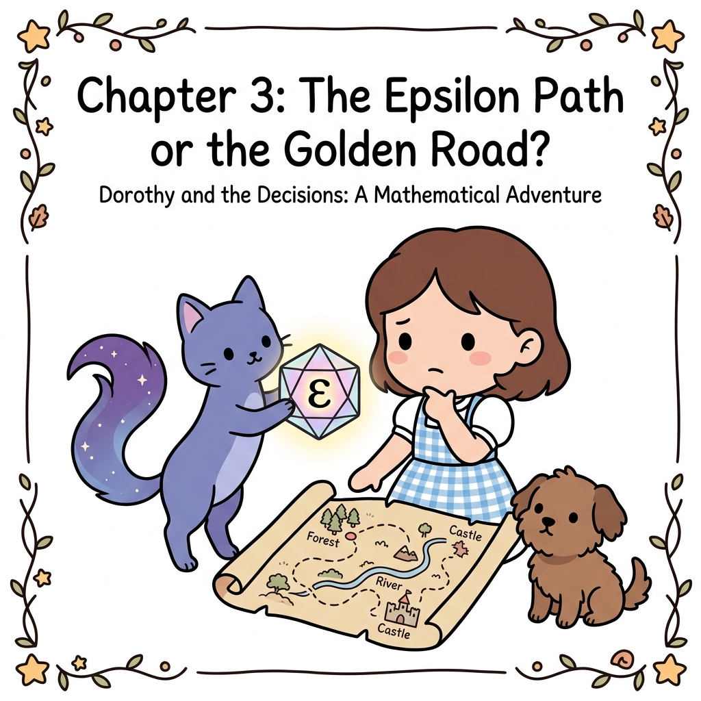

가장 우수한 결과를 내는 기계를 위주로 선택하는 **활용(Exploitation)**과, 더 나은 당첨 확률을 가진 기계가 숨어있을까 봐 새로운 행동을 도전해보는 **탐색(Exploration)**의 적절한 조화법을 알아봅니다. 지니가 선물해준 마법의 엡실론($\epsilon$) 주사위를 굴리며 최적 보물 길을 그려나가는 엡실론-그리디 알고리즘의 비결을 3.3장에서 정복해봅시다!

---

밴디트 문제에서 플레이어는 슬롯머신의 '가치(보상 기댓값)'를 알 수 없습니다. 


이 상황에서 가치가 가장 큰 슬롯머신을 선택해야 하죠. 따라서 플레이어는 실제로 슬롯머신을 플레이하고 그 결과를 토대로 자신의 선택이 얼마나 훌륭했는지 혹은 나빴는지를 추정해야 합니다. 지금까지의 내용을 정리하면 다음과 같습니다.


• 만약 각 슬롯머신의 가치(보상 기댓값)를 알면 플레이어는 가장 좋은 슬롯머신을 고를 수 있다.
• 그러나 플레이어는 각 슬롯머신의 가치를 알 수 없다.
• 따라서 플레이어는 각 슬롯머신의 가치를 (가능한 한 정확하게) 추정해야 한다.


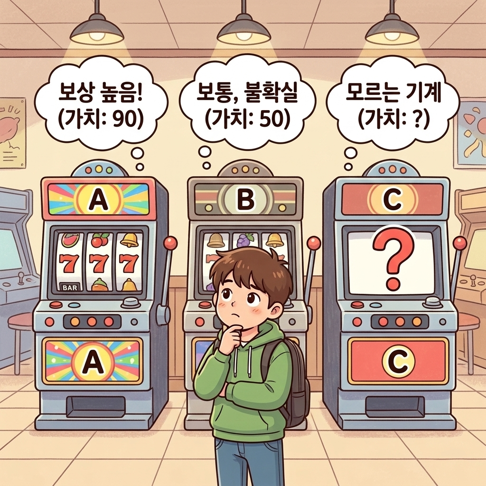


이러한 조건에서 코인을 가장 많이 얻을 수 있는 전략이 필요합니다.


> **NOTE_** 지도 학습에서는 문제의 정답이 준비되어 있습니다. 따라서 학습 중인 모델의 예측이 어긋나더라도 정답은 알 수 있습니다. 강화 학습 관점에서 풀어보면 잘못된 행동을 하더라도 '올바른 행동은 이것이다'라는 정답을 얻을 수 있다는 뜻입니다. 하지만 실제 강화 학습에서의 플레이어는 행동에 대한 결과(보상)만을 얻습니다. 예를 들어 어떤 슬롯머신을 플레이한 후 코인 1개를 얻었다고 해보죠. 이때 코인 1개라는 값은 하나의 단서일 뿐입니다. 정답이 무엇인지, 최선의 행동이 무엇인지는 이 보상을 단서로 삼아 플레이어 스스로 추론하고 판단해야 합니다.


그럼 지금부터 슬롯머신의 가치를 추정하는 방법을 구체적인 예를 들어 알아보겠습니다.


---


## 3.3.1 가치 추정의 원리

슬롯머신의 실제 가치는 알 수 없기 때문에, 우리는 여러 번 플레이하여 얻은 실제 보상의 평균치(표본 평균)를 이용해 기계의 가치를 추정합니다.


### 3.3.1 왜 진짜 가치를 두고 '추정'할 수밖에 없을까요?

강화 학습에서 우리가 궁극적으로 알고 싶어 하는 것은 슬롯머신(행동)의 **'진짜 가치(보상 기댓값)'**입니다. 하지만 플레이어는 이를 직접 관찰할 수 없으며, 오직 실제로 손잡이를 당겨서 튀어나오는 **일시적인 보상(코인 개수)**만을 볼 수 있습니다.


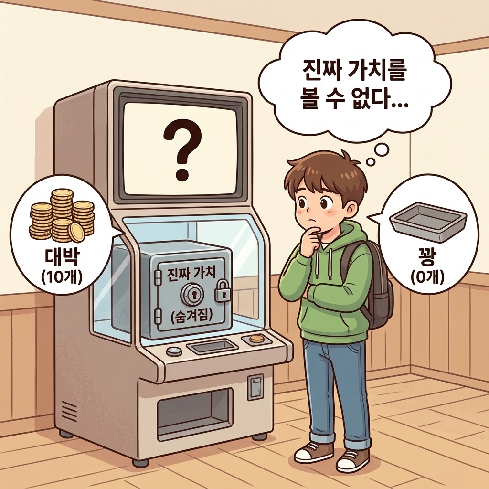


이것이 바로 **가치를 '추정'할 수밖에 없는 이유**이며, 그 본질적인 한계는 다음과 같습니다.


1. **기계의 내부는 '블랙박스'입니다**: 
   
   - 기계 내부에 프로그래밍되어 있는 진짜 평균 승률(예: 참 가치 = 1.0)은 두껍게 닫힌 강철 금고 속에 비밀번호로 잠겨 있는 것처럼 들여다볼 수 없습니다.
   
   
   
2. **보상은 매 판 운에 의해 요동칩니다 (확률적 요인)**:
   
   - 참 가치가 1.0인 아주 좋은 슬롯머신이라도 어떤 판에는 대박(10개)이 나고, 어떤 판에는 꽝(0개)이 납니다. 단 한두 번 당겨서 나온 단편적인 결과만으로는 기계의 진짜 참모습을 판단할 수 없습니다.
   
   

따라서 플레이어는 **"직접 볼 수 없는 진짜 가치를 추정"**할 수밖에 없습니다.


### 3.3.2 플레이 횟수를 최대한 늘려야 하는 이유 (큰 수의 법칙)

우리가 슬롯머신을 한두 번만 당기고 멈추면 안 되고, 가능한 한 많이 플레이해야 하는 이유는 **통계학의 '큰 수의 법칙'** 때문입니다.


* **동전 던지기 비유**:
  
  - 앞면이 나올 확률이 정확히 50%인 동전이 있습니다. 만약 동전을 딱 2번 던졌는데 우연히 둘 다 앞면이 나왔다면, 이 동전의 앞면 확률은 100%일까요? 당연히 아닙니다.
  - 하지만 동전을 1,000번, 10,000번 던진다면 앞면이 나온 비율은 50%에 아주 가까워집니다.
  
* **노이즈의 상쇄**:
  
  - 슬롯머신도 마찬가지입니다. 단 몇 번만 플레이했을 때는 우연(행운이나 불운)이라는 **'노이즈(Noise)'**가 추정값을 왜곡시킵니다.
  - 그러나 플레이 횟수(*n*)를 늘리면 늘릴수록, 가끔 터지는 대박과 가끔 겪는 꽝의 일시적 변동이 서로 상쇄되면서 평균값은 결국 기계 본연의 진짜 가치(기댓값)로 수렴하게 됩니다.
  
  

**그림 3-11** 참 가치와 가치 추정치의 차이 및 큰 수의 법칙

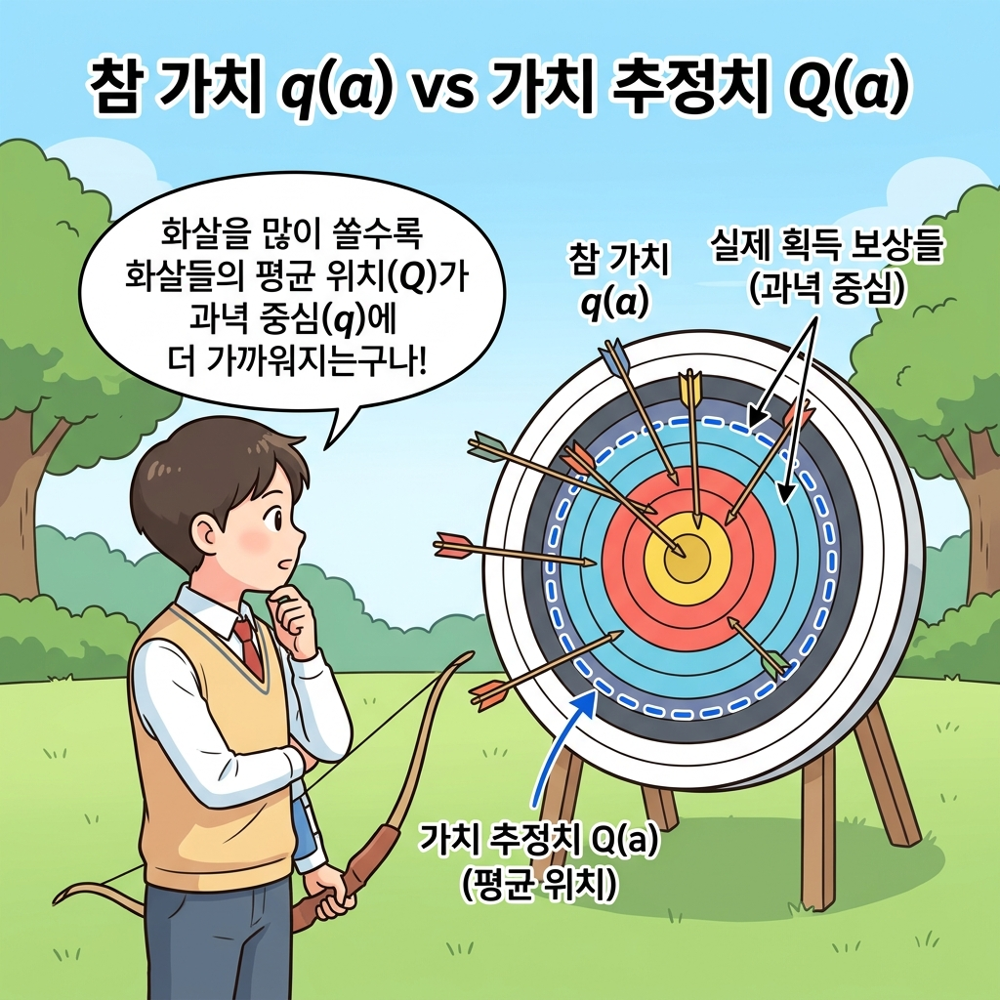

> **NOTE_** 슬롯머신을 실제로 플레이하여 얻은 보상은 어떤 확률 분포에서 생성된 '샘플(표본)'입니다. 따라서 실제 획득한 보상의 평균을 **표본 평균**<sup>sample mean</sup>이라고 할 수 있습니다. 표본 평균은 샘플링 횟수가 늘어날수록 실제값(보상의 기댓값)에 가까워집니다. 큰 수의 법칙<sup>law of large numbers</sup>에 따라 샘플 수를 무한대로 늘리면 표본 평균은 실제값과 같아집니다.


---


## 3.3.2 표본 평균 구하기 구현

이제 표본 평균을 구하는 수식을 알아보고, 이를 파이썬 코드로 어떻게 효율적으로 구현하는지 단계별로 살펴보겠습니다.


### 3.3.3.1 단순 표본 평균 구현

이번에는 슬롯머신 한 대에만 집중하여 총 *n*번 플레이하는 경우를 생각해봅시다.


#### 3.3.3.1 단순 표본 평균의 수식 정의

어떤 하나의 행동만을 *n*번 수행할 때의 행동 가치를 추정하는 것입니다. 


이때 실제로 얻은 보상을 *R*<sub>1</sub>, *R*<sub>2</sub>, ..., *R*<sub>*n*</sub>이라 하면 *n*번 행동했을 때의 행동 가치 추정치 *Q*<sub>*n*</sub>은 다음 수식으로 표현할 수 있습니다.
$$
Q_n = \frac{R_1 + R_2 + \dots + R_n}{n}
$$
[식 3.1]


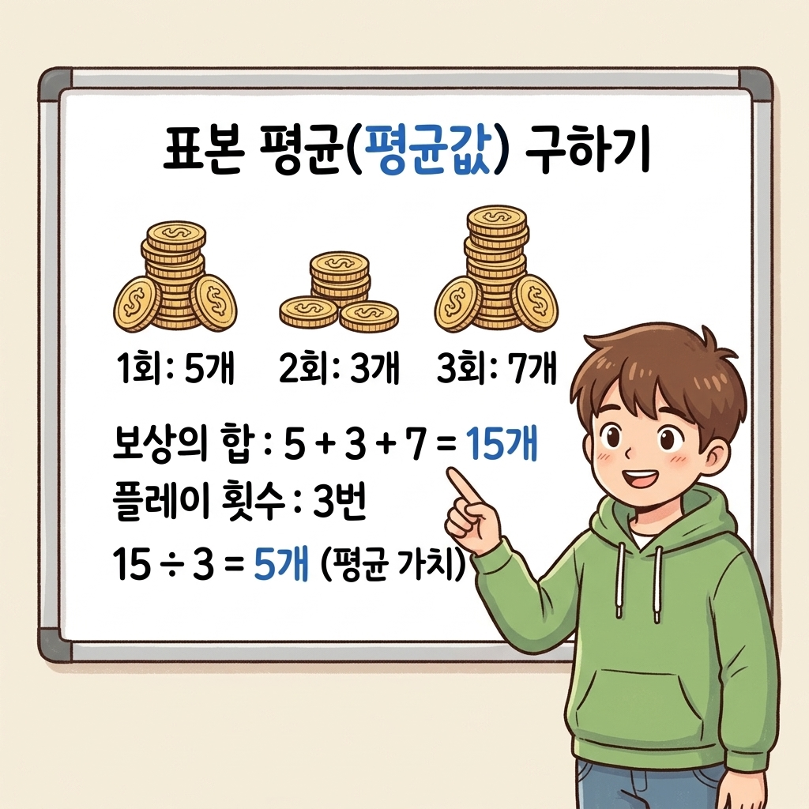

이처럼 *n*번째 행동 가치 추정치 *Q*<sub>*n*</sub>은 *n*개의 보상에 대한 표본 평균으로 구할 수 있습니다.


#### 3.3.3.2 파이썬 단순 구현 코드

표본 평균을 구하는 [식 3.1]을 파이썬 코드로 구현해보죠. 


보상을 10번 연속으로 얻는 경우를 가정하고 보상을 얻을 때마다 추정치를 구하기로 합시다. 

단순히 전체 리스트를 보관하여 구현한 코드는 다음과 같습니다. 

(전체 코드는 같은 디렉터리의 [avg.py](file:///Users/hojin9/dev/jinysite/강화학습/03_밴디트_문제/3_3_밴디트_알고리즘/avg.py) 파일에서도 확인 및 직접 실행이 가능합니다.)

```python
import numpy as np

np.random.seed(0)  # 시드 고정
rewards = []

for n in range(1, 11):  # 10번 플레이
    reward = np.random.rand()  # 보상(무작위 수로 시뮬레이션)
    rewards.append(reward)
    Q = sum(rewards) / n
    print(Q)
```


**출력 결과**

```
0.5488135039273248
0.6320014351498722
...
0.6157662833145425
```

0.0 이상 1.0 미만의 무작위 수를 만들어 보상으로 활용했습니다. 

그리고 얻은 보상을 리스트인 rewards에 추가합니다. 그러면 [식 3.1]의 계산을 그대로 구현할 수 있습니다.


#### 3.3.3.3 단순 구현의 메모리 및 계산량 한계

물론 이 코드로도 표본 평균을 제대로 구할 수 있지만 아직 개선할 부분이 있습니다.


플레이 횟수(*n*)가 늘어날수록 rewards의 원소 수도 늘어나며, 이어서 *n*개의 합을 구하는 `sum(rewards)` 코드의 실행 비용도 함께 증가합니다. 


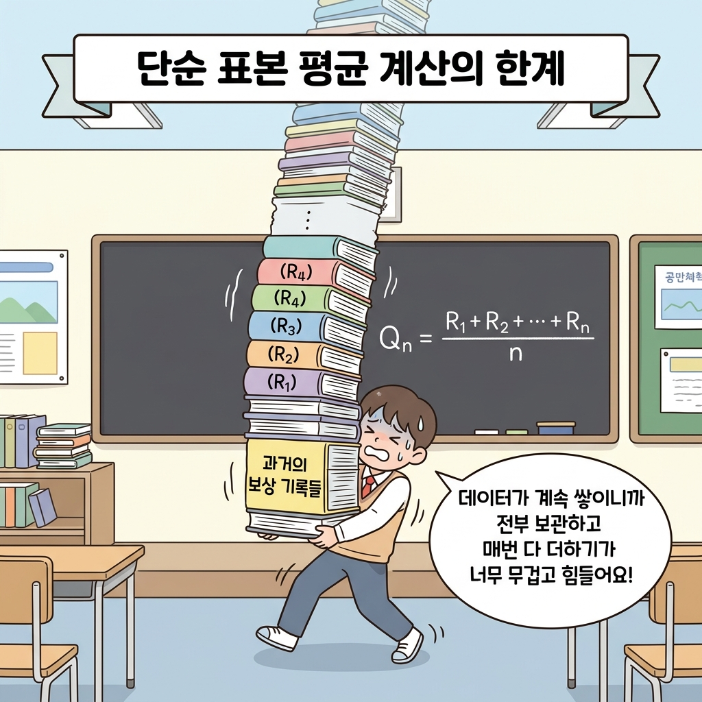


즉, 플레이 횟수가 늘어날수록 메모리와 계산량이 모두 크게 증가합니다.


### 3.3.3.2 증분 수식(Incremental Formula) 유도

표본 평균 계산을 더 효율적으로 구현하려면 어떻게 해야 할까요? 


매번 과거의 모든 보상 데이터를 다시 더하는 고비용 연산을 피하기 위해, **이전 단계의 가치 추정치(*Q*<sub>*n-1*</sub>)**와 **새로 얻은 보상(*R*<sub>*n*</sub>)**만을 사용하여 새로운 가치 추정치(*Q*<sub>*n*</sub>)를 점진적으로 갱신하는 **'증분 공식(Incremental Formula)'**을 유도해보겠습니다.


다음 그림은 수식이 도출되는 과정을 단계별로 나타낸 흐름도입니다.


**그림 3-12** 증분 공식 유도의 단계별 흐름

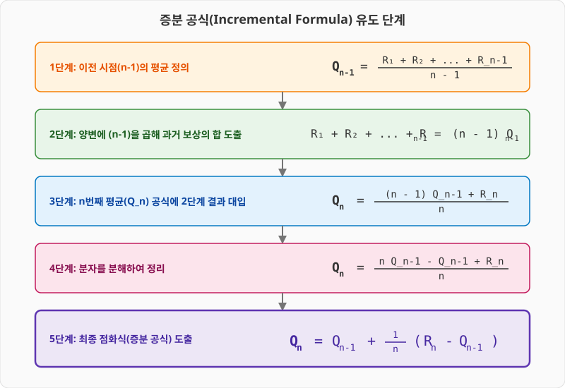


이제 수식 유도 과정을 한 단계씩 살펴보겠습니다. 


먼저 사전 준비로 *n* - 1번째 시점의 행동 가치 추정치인 *Q*<sub>*n-1*</sub>에 주목해보죠. *Q*<sub>*n-1*</sub>의 수식은 다음과 같습니다.
$$
Q_{n-1} = \frac{R_1 + R_2 + \dots + R_{n-1}}{n-1}
$$

이 식의 양변에 *n* - 1을 곱하고 좌우 변을 바꾸면 다음 식이 얻어집니다.

$$
R_1 + R_2 + \dots + R_{n-1} = (n-1)Q_{n-1}
$$
[식 3.2]

그리고 *Q*<sub>*n*</sub>은 다음처럼 표현할 수 있습니다.

$$
Q_n = \frac{R_1 + R_2 + \dots + R_n}{n}
$$

$$
= \frac{1}{n}(R_1 + \dots + R_{n-1} + R_n)
$$
[식 3.3]
$$
= \frac{1}{n}\{(n-1)Q_{n-1} + R_n\}
$$

$$
= (1 - \frac{1}{n})Q_{n-1} + \frac{1}{n}R_n
$$
[식 3.4]


여기서 핵심은 [식 3.3]에서 [식 3.2]를 대입하는 부분입니다. 


그러면 [식 3.4]와 같이 *Q*<sub>*n*</sub>과 *Q*<sub>*n-1*</sub>의 관계가 도출됩니다. 최종적으로 [식 3.4]를 보면 *Q*<sub>*n-1*</sub>, *R*<sub>*n*</sub>, *n*의 값만 알면 *Q*<sub>*n*</sub>을 구할 수 있습니다. 


즉, 지금까지 얻은 모든 보상(*R*<sub>1</sub>, *R*<sub>2</sub>, ..., *R*<sub>*n-1*</sub>)을 매번 사용하지 않고도 계산할 수 있습니다!


이어서 [식 3.4]를 조금 더 변형해봅시다.


$$
Q_n = (1 - \frac{1}{n})Q_{n-1} + \frac{1}{n}R_n
$$
[식 3.4]
$$
= Q_{n-1} + \frac{1}{n}(R_n - Q_{n-1})
$$
[식 3.5]


[식 3.5]에서 주목할 점은 형태가 *Q*<sub>*n*</sub> = *Q*<sub>*n-1*</sub> + ... 라는 것입니다. 


다시 말해 *Q*<sub>*n*</sub>은 *Q*<sub>*n-1*</sub>에 어떤 값을 더해 구할 수 있습니다. *Q*<sub>*n-1*</sub>을 기준으로 우변의 두 번째 항인 *1/n*( *R*<sub>*n*</sub> - *Q*<sub>*n-1*</sub> ) 만큼 갱신되죠. 


이 증분 공식의 구조를 블록 형태로 시각화하면 다음과 같습니다. 

이 구조는 강화 학습 알고리즘 전체를 꿰뚫는 가장 중요한 뼈대이므로 확실히 기억해두는 것이 좋습니다.


**그림 3-13** 증분식(Incremental Equation)의 개념 구조

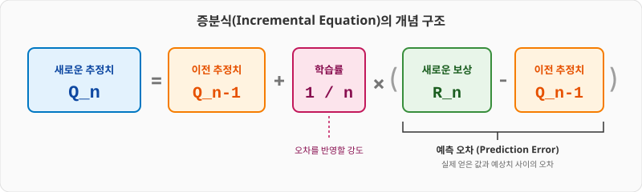


공식 속 각 부분들의 위치 관계를 좌표선 형태로 나타내면 다음과 같습니다.


**그림 3-14** *Q*<sub>*n-1*</sub>, *Q*<sub>*n*</sub>, *R*<sub>*n*</sub>의 위치 관계

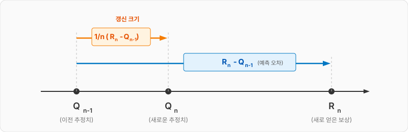

그림에서 보듯 *Q*<sub>*n-1*</sub>이 *Q*<sub>*n*</sub>으로 갱신될 때 *R*<sub>*n*</sub> - *Q*<sub>*n-1*</sub>의 길이에 *1/n*을 곱한 값만큼 이동합니다. 


이때 *R*<sub>*n*</sub> 방향으로 얼마나 진행되느냐는 *1/n* 값이 결정하죠. 

이처럼 *1/n*은 갱신되는 양을 조정하기 때문에 **학습률**<sup>learning rate</sup> 역할을 합니다.


> **NOTE_** 시도 횟수 *n*이 커질수록 *1/n*은 작아집니다. 시도 횟수가 늘어날수록 *Q*<sub>*n*</sub>이 갱신되는 양이 작아진다는 뜻이죠. 예를 들어 *n* = 1이면 *1/n* = 1이므로 *Q*<sub>*n*</sub> = *R*<sub>*n*</sub>이 되어 *Q*<sub>*n*</sub>의 값은 단번에 *R*<sub>*n*</sub>으로 갱신됩니다. 또 다른 극단적인 예로 *n* = ∞이면 *1/n* = 0이므로 *Q*<sub>*n*</sub> = *Q*<sub>*n-1*</sub>이 됩니다. 즉, *Q*<sub>*n*</sub>은 전혀 갱신되지 않습니다.


---


### 3.3.3.3 증분 구현(Incremental Implementation) 코드

이상의 수식을 바탕으로 효율적으로 동작하는 증분식 기반 표본 평균 갱신 코드를 작성하겠습니다.


```python
import numpy as np

Q = 0.0

for n in range(1, 11):
    reward = np.random.rand()
    Q = Q + (reward - Q) / n  # [식 3.5]
    print(Q)
```

[식 3.5]를 구현한 부분이 `Q = Q + (reward - Q) / n` 코드입니다. 


여기서 주의할 점은 [식 3.5]의 *Q*<sub>*n*</sub>과 *Q*<sub>*n-1*</sub>에 해당하는 변수를 모두 Q 하나로 처리한 부분입니다. 변수를 하나만 써도 되는 이유는 [그림 3-15]를 보면 알 수 있습니다.


**그림 3-15** 대입 연산자(=)의 오른쪽과 왼쪽에 있는 Q의 실체

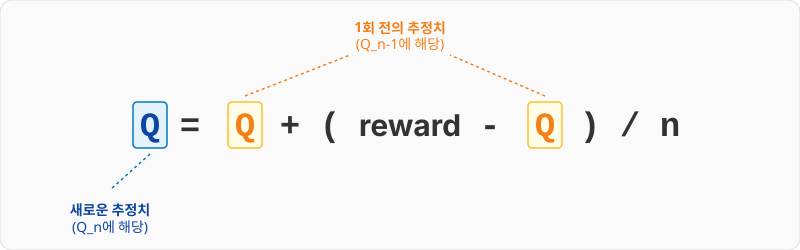

그림과 같이 대입 연산자(=) 오른쪽 of Q는 1회 이전의 추정치를 나타냅니다. 


그리고 오른쪽에서 계산된 결과가 왼쪽의 Q에 새롭게 대입되는 것이죠. 따라서 변수를 하나만 사용하여 이전 추정치를 새로운 추정치로 갱신할 수 있습니다. 


같은 계산을 다음과 같이 `+=` 연산자로도 작성할 수 있습니다.


```python
# Q = Q + (reward - Q) / n
Q += (reward - Q) / n
```

`Q = Q + ...` 처럼 변수의 값을 덮어쓰는 코드는 이와 같이 `Q += ...` 형태로 표현할 수 있습니다.


이상이 표본 평균을 효율적으로 구하는 방법입니다. *Q*<sub>1</sub>, *Q*<sub>2</sub>, *Q*<sub>3</sub> ... 식으로 하나씩 순차적으로 증가시키며 구할 수 있다는 뜻에서 이런 구현 방식을 **증분 구현**<sup>incremental implementation</sup>이라고도 합니다.


---


## 3.3.3 에이전트의 행동 정책

이제 플레이어(에이전트)가 가치가 가장 큰 슬롯머신을 찾기 위해 어떤 전략(정책)을 취해야 하는지 살펴보겠습니다.


### 3.3.3.1 탐욕 정책(Greedy Policy)

가장 직관적인 정책은 실제로 플레이하고 결과가 가장 좋은 슬롯머신을 선택하는 것입니다. 

각각을 플레이해보고 가치 추정치(실제 획득한 보상의 평균)가 가장 큰 슬롯머신을 선택하는 정책이죠. 이러한 정책을 **탐욕 정책**<sup>greedy policy</sup>이라고 합니다.

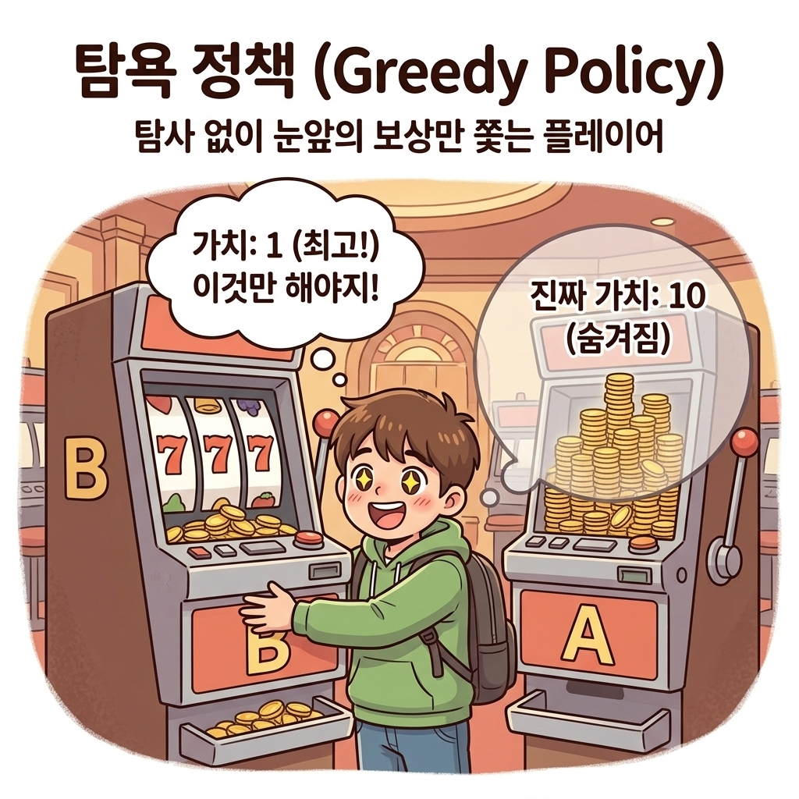


> **NOTE_** greedy는 '탐욕스럽다'라는 뜻입니다. '미래는 생각하지 않고 눈앞의 정보만으로 가장 좋아 보이는 수를 선택한다'라고 해석할 수 있습니다. 밴디트 문제에서 탐욕 정책이란 지금까지 플레이한 경험만으로, 즉 슬롯머신의 가치 추정치만으로 최선의 머신을 선택하는 것을 말합니다.


탐욕 정책은 좋아 보이지만 문제도 있습니다. 

예를 들어 슬롯머신 a와 b를 각각 한 번씩만 플레이하는 경우를 생각해보죠. 이때 슬롯머신 a와 b의 가치 추정치는 각각 0과 1입니다. 이 상태에서 탐욕 정책에 따라 행동하면 이후로는 계속 b만 선택할 것입니다. 하지만 실제로는 a가 더 좋은 슬롯머신일 수도 있습니다.


### 3.3.3.2 활용(Exploitation)과 탐색(Exploration)

슬롯머신의 가치 추정치에 '불확실성'이 스며 있기 때문에 생기는 문제입니다. 


확실하지 않은 추정치를 전적으로 신뢰하면 최선의 행동을 놓칠 수 있죠. 그래서 플레이어는 불확실성을 줄여 추정치의 신뢰도를 높여야 합니다. 여기까지 생각이 닿으면 플레이어에게 다음의 두 가지 행동을 요구하게 됩니다.


• **활용**<sup>exploitation</sup>: 

지금까지 실제로 플레이한 결과를 바탕으로 가장 좋다고 생각되는 슬롯머신을 플레이(탐욕 정책)

  


• **탐색**<sup>exploration</sup>: 

슬롯머신의 가치를 정확하게 추정하기 위해 다양한 슬롯머신을 시도

  


##### 이 두 관계는 일상생활에서도 쉽게 비유해볼 수 있습니다. 

자주 가던 맛있는 단골 맛집을 가는 것(활용)과, 완전히 새로운 음식점에 도전해보는 것(탐색) 사이의 선택 딜레마와 같습니다.

**그림 3-16** 활용 vs 탐색의 선택 딜레마


앞서 설명했듯이 탐욕스럽게만 행동하면 더 나은 선택을 놓칠 가능성이 있습니다. 그래서 탐욕스럽지 않은 두 번째 행동, 즉 탐색을 시도해볼 필요가 생깁니다. 


탐색은 각 슬롯머신의 가치를 더욱 정확하게 추정하도록 해줍니다.

> **NOTE_** 활용과 탐색은 상충관계입니다. 한 번에 둘 중 하나만 선택할 수 있으므로 다른 하나를 희생해야 합니다.


밴디트 문제에서 다음 한 번의 시도만으로 좋은 결과를 얻고 싶다면 '활용'을 택해야 할 것입니다. 하지만 장기적인 관점에서 더 나은 결과를 얻고 싶다면 '탐색'이 필요합니다. 탐색을 하면 더 좋은 슬롯머신을 찾을 가능성이 높아지기 때문입니다. 더 좋은 머신을 찾는 데 성공한다면 이후로는 새로 찾은 머신을 선택하여 장기적으로 더 나은 결과를 얻을 수 있습니다.


### 3.3.3.3 ε-탐욕 정책(Epsilon-Greedy Policy)

강화 학습 알고리즘은 결국 '활용과 탐색의 균형'을 어떻게 잡느냐의 문제로 귀결됩니다. 


이 균형을 맞추는 방법으로 지금까지 다양한 알고리즘이 제안되었습니다. 간단한 것부터 복잡한 것까지 정말 많지만 그중에서도 가장 기본적이고 응용하기 좋은 알고리즘은 **ε-탐욕 정책**<sup>epsilon-greedy policy, 엡실론-그리디 정책</sup>입니다.


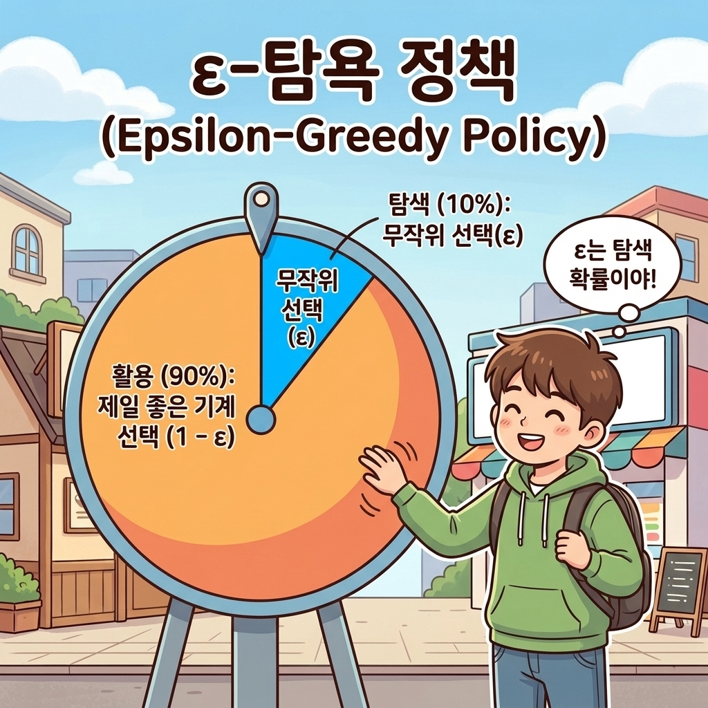


##### ε-탐욕 정책은 간단한 알고리즘입니다. 

ε의 확률, 예컨대 ε = 0.1의 확률(10%)로 '탐색'을 하고 나머지는 '활용'을 하는 방식입니다. 탐색할 차례에서는 다음 행동을 무작위로 선택하여 다양한 경험을 쌓습니다. 

이렇게 함으로써 가능한 모든 행동 각각의 가치 추정치의 신뢰도가 조금씩 높아집니다. 그리고 나머지 1 - ε의 확률로는 탐욕 행동, 즉 활용을 수행합니다.


> **NOTE_** ε-탐욕 정책은 현재까지 얻은 경험을 '활용'할 수 있습니다. 그러면서도 (가끔씩) 탐욕스럽지 않은 행동을 시도해봄으로써 더 나은 행동이 있는지 '탐색'합니다. 밴디트 문제에도 ε-탐욕 정책을 적용하면 효율적으로 해결할 수 있을 것입니다.


이상으로 밴디트 문제 자체와 밴디트 문제의 대표적인 해결법인 ε-탐욕 알고리즘을 설명했습니다. 

다음 절에서는 지금까지 설명한 내용을 파이썬으로 구현해보겠습니다.


---


## 3.3.4 정리 및 요약

이번 절에서는 밴디트 문제를 해결하기 위한 핵심 알고리즘의 기초를 다졌습니다. 핵심 요약은 다음과 같습니다.


1. **가치 추정의 원리**: 플레이어는 슬롯머신의 진짜 가치(보상 기댓값)를 들여다볼 수 없는 '블랙박스' 상황에 직면해 있습니다. 따라서 실제 플레이해서 나온 표본 평균값을 통해 가치를 추정해야 합니다.
2. **증분 구현(Incremental Implementation)**: 과거 데이터를 전부 저장하고 매번 평균을 계산하려면 메모리와 계산량이 폭발합니다. 증분 공식을 사용하면 이전 추정치 *Q*<sub>*n-1*</sub>과 최신 보상 *R*<sub>*n*</sub>, 그리고 시도 횟수 *n*만을 사용하여 효율적으로 새로운 평균 *Q*<sub>*n*</sub>을 갱신할 수 있습니다.
   
   $$
   Q_n = Q_{n-1} + \frac{1}{n}(R_n - Q_{n-1})
   $$

3. **활용(Exploitation)과 탐색(Exploration)**: 눈앞의 최선의 선택을 취하는 '활용'과 새로운 가능성을 시험하는 '탐색'은 서로 상충관계(Trade-off)에 있습니다. 장기적인 수익 극대화를 위해서는 둘 사이의 균형이 필수적입니다.
4. **ε-탐욕 정책(ε-Greedy Policy)**: ε의 확률로 탐색(무작위 선택)을 수행하고, 1 - ε의 확률로 활용(탐욕 선택)을 수행하여 단순하면서도 강력하게 균형을 맞추는 정책입니다.
