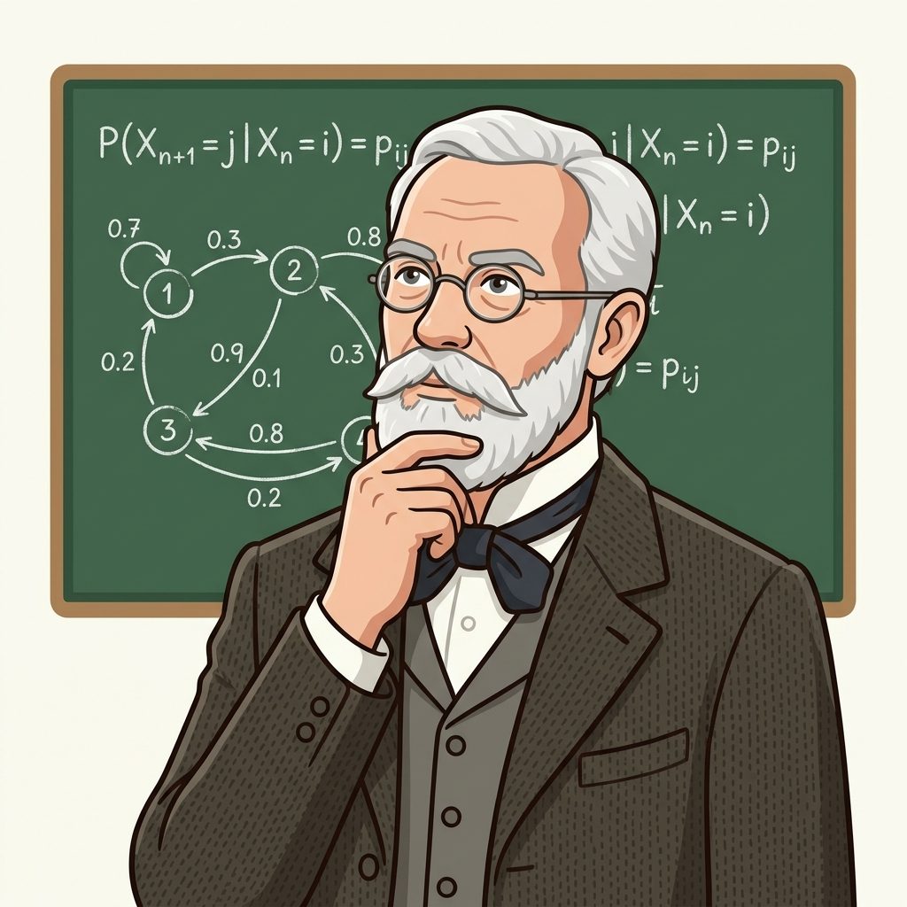
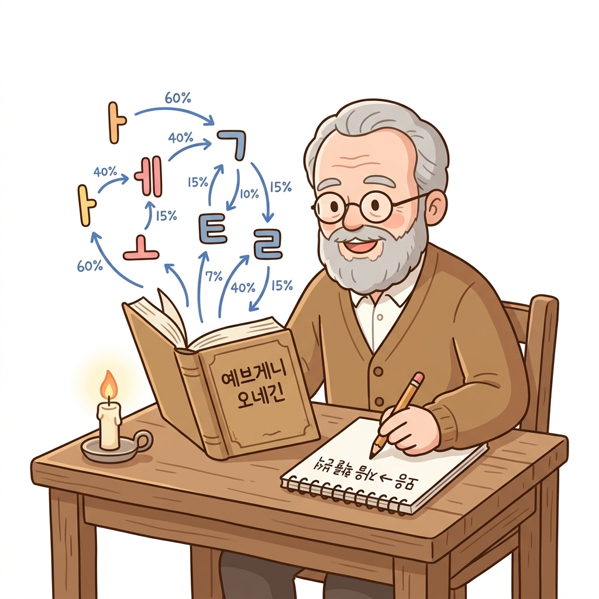
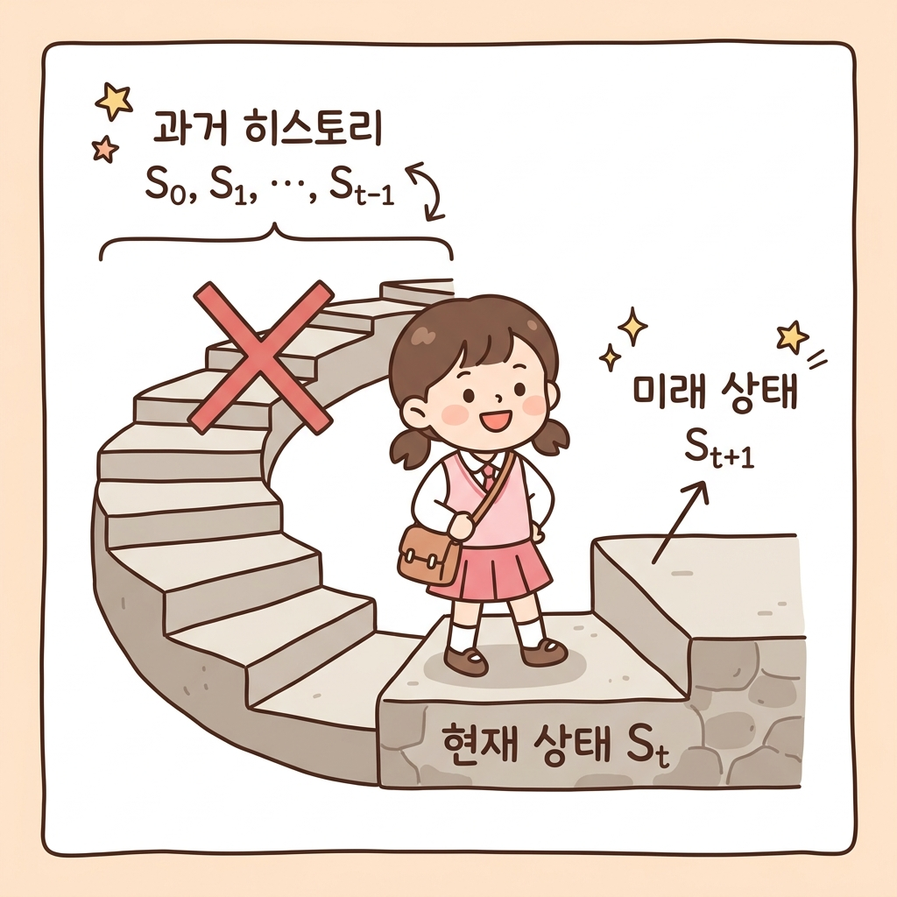

# 04.1 마르코프 인물소개와 마르코프 성질

**그림 04-1** 러시아의 아름다운 마법 글자책에서 떠오르는 자음과 모음을 관찰하며 마르코프 이론의 기원을 배우는 지니와 도로시

러시아의 위대한 수학자 안드레이 마르코프의 생애와 그가 정립한 **마르코프 성질(Markov Property)**의 기원을 배웁니다. 소설 속 글자 전이 관계를 연구하던 그의 발견을 도로시와 함께 흥미롭게 추적해보아요!

---

### 04.1.1 역사 속의 마르코프: 러시아 문학과 수학의 만남

'마르코프 결정 과정'의 **마르코프(Markov)**는 러시아의 저명한 수학자인 **안드레이 마르코프**Andrey Markov, 1856~1922의 이름에서 유래되었습니다. 

당대 수학계는 모든 무작위 사건이 독립적(독립시행)이라고만 믿었습니다. 하지만 마르코프는 문장 속 글자들의 배열처럼 **"이전 상태가 다음 상태에 영향을 주는 종속적인 무작위 과정"**이 존재한다고 믿었습니다. 

그는 이를 증명하기 위해 러시아의 대문호 푸시킨의 소설 *《예브게니 오네긴》*에서 모음과 자음이 어떻게 번갈아 나오는지 20,000자 이상 손으로 세며 분석하였고, 그 결과 과거의 글자 히스토리를 다 몰라도 **오직 바로 전 글자가 모음이냐 자음이냐에 따라 다음 글자의 확률이 결정되는 모델**인 **'마르코프 체인(Markov Chain)'**을 발표하여 확률론의 역사를 새로 썼습니다.

---

### 04.1.2 마르코프 성질(Markov Property)이란 무엇인가요?

이처럼 **"과거의 히스토리와 상관없이, 오직 현재 상태(*S**t*)만이 미래 상태(*S**t*+1)를 결정한다"**는 가정을 **마르코프 성질(Markov Property)**이라고 부릅니다.

수식으로는 다음과 같이 조건부 확률로 우아하게 정의할 수 있습니다:
$$
P(S_{t+1} \mid S_t, S_{t-1}, \dots, S_0) = P(S_{t+1} \mid S_t)
$$

- **과거 무시**: 좌변은 과거부터 현재까지 모든 상태 변화 기록을 다 알 때의 조건부 확률입니다.
- **현재 충분**: 우변은 오직 현재 상태 *S**t*만 알 때의 확률입니다.
- **의의**: 이 두 확률이 같다는 뜻은, **미래를 예측하기 위해 과거의 모든 장부를 들여다볼 필요 없이 오직 '현재 상태' 하나만 알면 충분하다**는 의미입니다!

이 성질 덕분에 강화 학습에서는 차원의 저주를 피하고 엄청나게 가벼우면서도 실시간으로 빠른 계산을 수행할 수 있게 됩니다.
