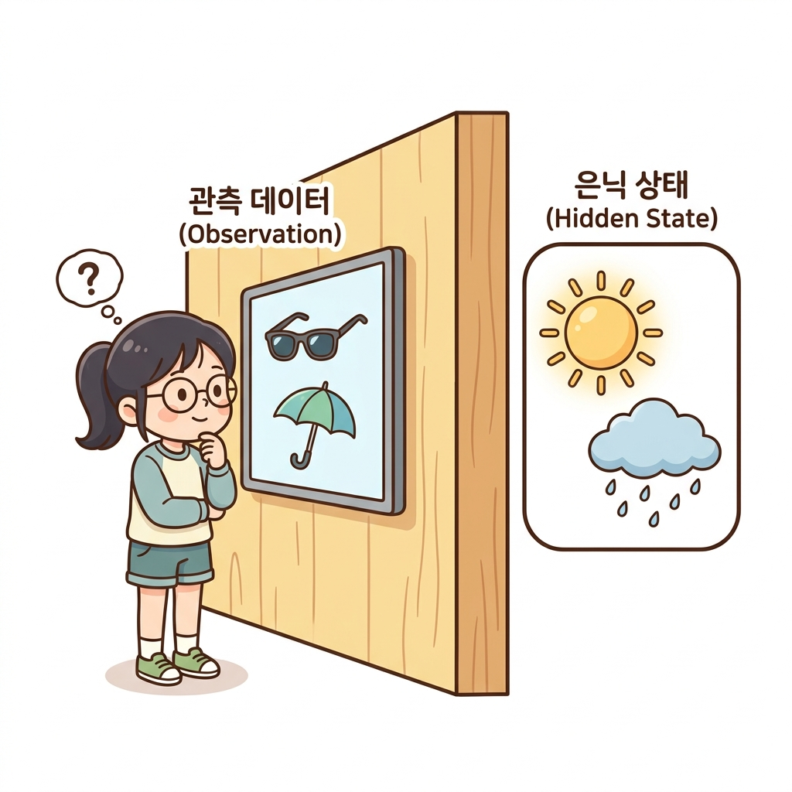
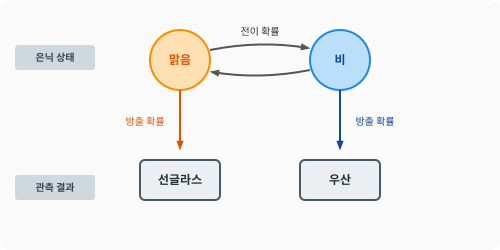
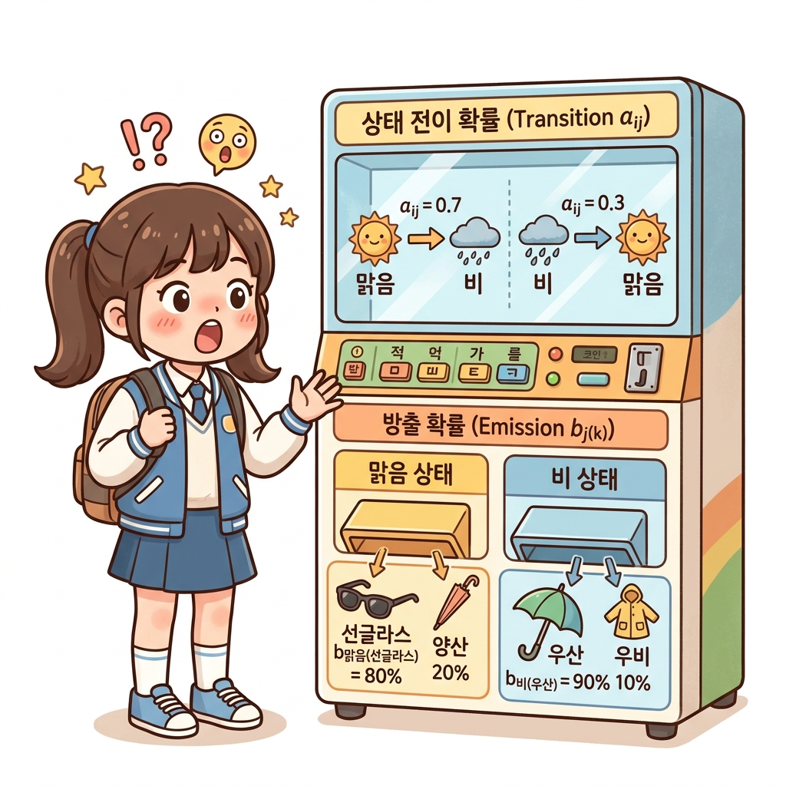
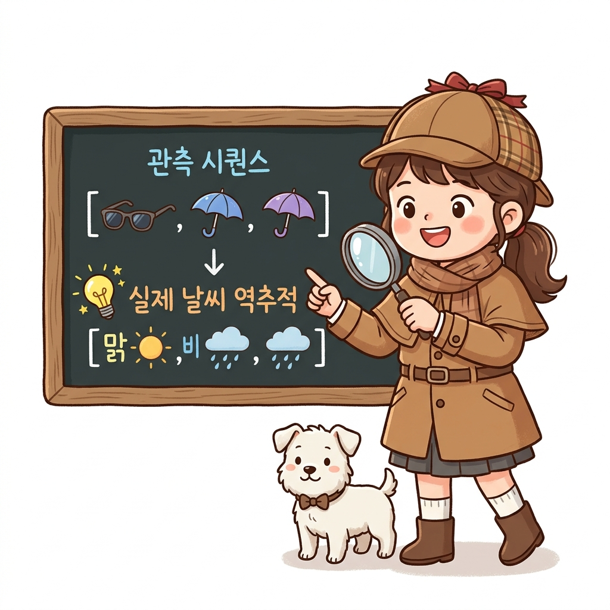

# 04.4 은닉 마르코프 모델 (Hidden Markov Model, HMM)

**그림 04-4** 거대한 물음표 커튼(은닉 상태) 뒤에서 튀어나오는 관찰 카드(사과, 당근)들을 관측하며 내막의 상태를 추정해나가는 도로시와 지니

우리가 찾고자 하는 핵심 상태가 겉으로 드러나지 않고 숨겨져 있을 때, 이로부터 관찰할 수 있는 출력 데이터(방출)를 분석하여 은닉 상태의 변이를 수학적으로 추정하는 **은닉 마르코프 모델(HMM)**을 공부합니다. 지니의 마법 돋보기 분석 비유를 통해, HMM의 3대 핵심 해법(평가, 디코딩, 학습)을 흥미롭고 유연하게 학습해봅시다!

---

---

### 04.4.1 상태가 숨겨져 있다면 어떻게 할까요?

우리가 지금까지 배운 마르코프 체인과 과정에서는 에이전트가 현재 어떤 상태(맑음 혹은 비)에 있는지 실시간으로 직접 완벽하게 알 수 있었습니다. 

하지만 현실에서는 상태가 직접 관찰되지 않고 꽁꽁 숨겨져 있는 경우가 허다합니다. 

이처럼 상태는 눈에 보이지 않지만(은닉, Hidden), 그 상태에 따라 발생하는 간접적인 관측 데이터(Observation)만을 수집할 수 있는 확률 모델을 **은닉 마르코프 모델(Hidden Markov Model, HMM)**이라고 부릅니다.

---

### 04.4.2 방 안의 친구와 우산 비유

이해를 돕기 위해 재미있는 가상 실험을 해봅시다.
- 도로시는 창문이 하나도 없는 단단한 철문 방 안에 들어가 공부하고 있습니다. 따라서 바깥 날씨가 **'맑음'**인지 **'비'**인지(은닉 상태, *X**t*) 알 수 없습니다.
- 하지만 방에 들락날락하는 친구 민우의 차림새(관측 결과, *O**t*)는 볼 수 있습니다. 민우가 손에 **'우산'**을 들고 오거나 머리에 **'선글라스'**를 끼고 들어오는 행동을 관찰하는 것이죠.

이 관계를 도식화한 아래의 구조도를 살펴봅시다.

**그림 04-3** 은닉 마르코프 모델의 2단 레이어 구조

---

### 04.4.3 HMM의 수학적 구성 요소

HMM은 마르코프 체인의 기초 위에 **방출 확률(Emission Probability, 또는 관측 확률)**이라는 개념이 얹어집니다.
1. **상태 전이 확률 (*a**ij*)**: 바깥 날씨 자체가 변할 확률 (맑음 $\to$ 비 등)
2. **방출 확률 (*b**j*(*k*))**: 특정 날씨 상태일 때, 친구가 특정 도구를 들고 나타날 조건부 확률입니다:
   - **맑은 날** 친구가 **선글라스**를 낄 확률: 80%
   - **맑은 날** 친구가 **우산**을 들고 올 확률: 20% (햇빛을 막기 위한 양산 대용 등)
   - **비 오는 날** 친구가 **선글라스**를 낄 확률: 10%
   - **비 오는 날** 친구가 **우산**을 들고 올 확률: 90%

이 방출 확률 수식은 다음과 같이 조건부 확률로 표기됩니다:
$$
P(O_t = \text{우산} \mid X_t = \text{비}) = 0.9
$$

---

### 04.4.4 HMM의 쓰임새와 가치

도로시는 3일 연속으로 민우가 `[선글라스, 우산, 우산]`을 들고 들어온 기록(관측 시퀀스)만을 가지고, 바깥의 실제 3일 날씨가 `[맑음, 비, 비]`였을 확률이 가장 높다는 것을 수학적으로 역추정할 수 있습니다. 

이처럼 관측된 겉보기 데이터를 분석해 숨겨진 실체(상태)를 역추적하는 HMM 알고리즘은 음성 인식, 단어 예측, 그리고 일부 주식 패턴 분석 등 다양한 분야에서 널리 활용되고 있으며, 강화 학습 환경에서 상태의 불완전한 관찰(POMDP)을 다루는 데 소중한 이론적 토대가 됩니다.

