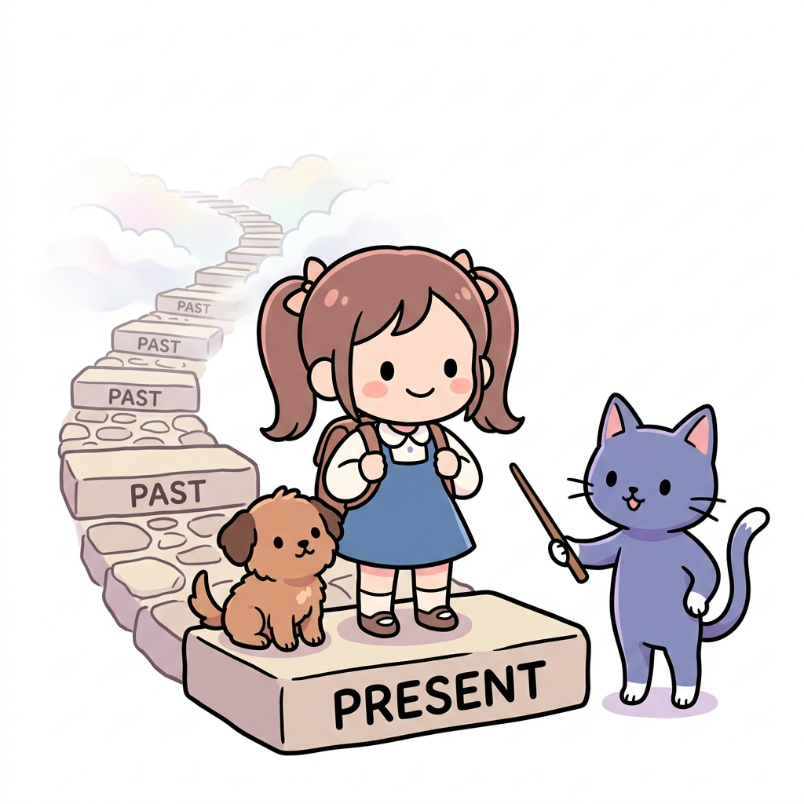

# 4강 마르코프

**그림 04-0** 오직 현재의 돌판(Present) 위만을 디디고 선 채 과거(Past)의 숲길이 구름 속으로 희미하게 잊혀 지워져 가는 것을 바라보는 도로시와 지니

마르코프 성질(Markov Property)은 **"미래는 오직 현재 상태에 의해서만 결정되며, 과거의 복잡한 지나온 길은 전혀 상관하지 않는다"**는 강화학습의 위대한 단순화 가정입니다. 지니가 가리켜준 돌다리 그림처럼, 도로시가 딛고 있는 바로 지금 발밑의 상태만이 미래의 운명을 결정한다는 마르코프 성질의 마법을 4강에서 신나게 익혀봅시다!

---

우리가 5강에서 본격적으로 다룰 **마르코프 결정 과정(MDP)**은 강화 학습에서 에이전트와 환경이 주고받는 복잡한 의사결정 과정을 완벽하게 설명해 주는 중요한 기초 뼈대입니다. 하지만 MDP라는 거대한 산을 오르기 전에, 우리는 먼저 이 모든 수학적 개념의 출발점인 **'마르코프(Markov)'**의 세계를 미리 학습할 필요가 있습니다.

이 4강에서는 MDP의 핵심 가정인 **마르코프 성질(Markov Property)**이 무엇인지 이해하고, 이를 바탕으로 확률적 상태 변화를 다루는 다양한 기본 모델들을 차근차근 배워 봅니다.

---

## 학습 목표

이 단원을 충실히 공부하고 나면 아래 네 가지 중요한 수학적 질문에 기쁘게 대답할 수 있습니다!

1. 과거의 모든 역사 기록을 기억하지 않아도 오직 '현재의 상태'만 알면 미래를 예측할 수 있다는 **마르코프 성질(Markov Property)**의 본질적 의미를 설명할 수 있다.
2. 상태와 상태 사이를 확률적으로 이동하는 **마르코프 체인(Markov Chain)**을 이해하고, 이를 표현하는 **상태 전이 확률 행렬**을 계산할 수 있다.
3. 마르코프 체인이 연속적인 시간과 공간으로 확장된 **마르코프 과정(Markov Process)**의 메커니즘을 구체적 예시와 함께 서술할 수 있다.
4. 실제 상태는 눈에 보이지 않지만 관측되는 정보들을 통해 간접적으로 상태를 추적하는 **은닉 마르코프 모델(Hidden Markov Model, HMM)**의 작동 원리를 직관적으로 비유할 수 있다.

---

## 학습 목차

- [4.1 마르코프 인물소개](./4_1_마르코프_인물소개/index.md)
  - 마르코프의 생애와 그가 왜 러시아 문학 연구를 통해 이 독특한 수학적 아이디어를 정립하게 되었는지 재미있는 이야기를 살펴봅니다.
- [4.2 마르코프 체인](./4_2_마르코프_체인/index.md)
  - 오늘 날씨에 따라 내일 날씨가 결정되는 간단한 일상 문제 상황을 칠판에 그리며, 상태 전이도와 확률 연산법을 배웁니다.
- [4.3 마르코프 과정](./4_3_마르코프_과정/index.md)
  - 주체적인 결정(행동)이 배제된 상태에서 자연적으로 시시각각 변화하는 무작위 확률 시스템의 흐름을 수식화해 봅니다.
- [4.4 은닉 마르코프](./4_4_은닉_마르코프/index.md)
  - 방 안의 친구가 우산을 펴거나 선글라스를 끼는 행동(관측)만을 보고 바깥의 날씨(숨겨진 상태)를 역추적하는 재미있는 퍼즐을 풉니다.
- [4.5 정리](./4_5_정리/index.md)
  - 4강에서 다룬 마르코프 핵심 개념들을 압축하고, 드디어 주인공인 5강 MDP로 나아가기 위한 튼튼한 다리를 놓습니다.
