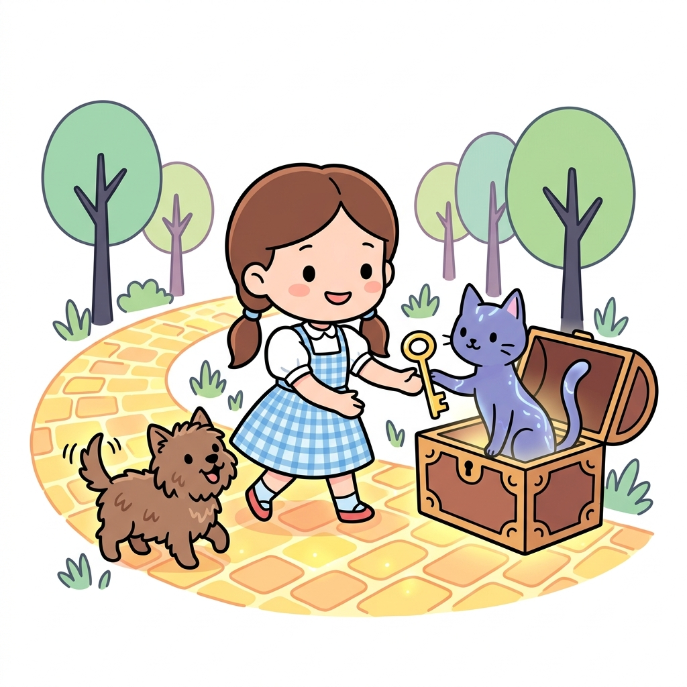
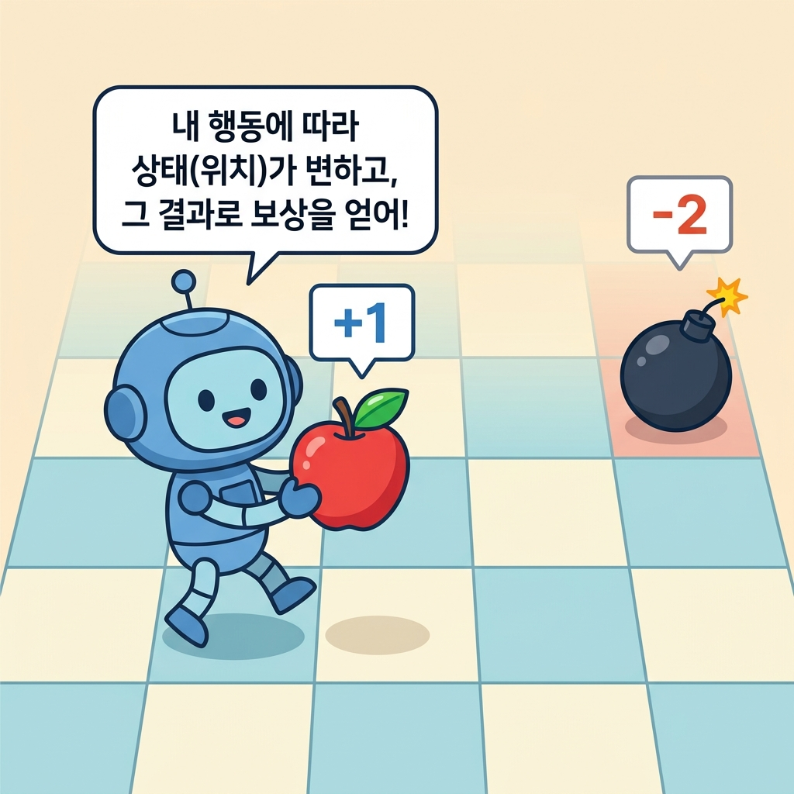
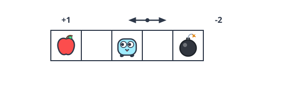
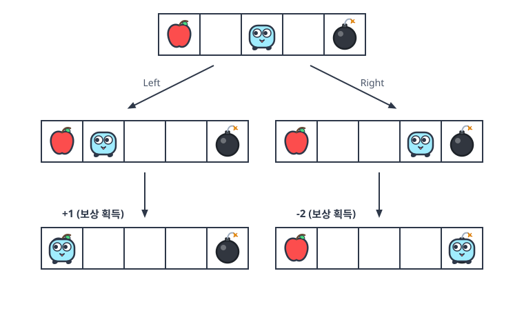
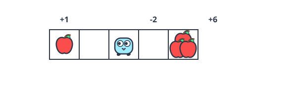
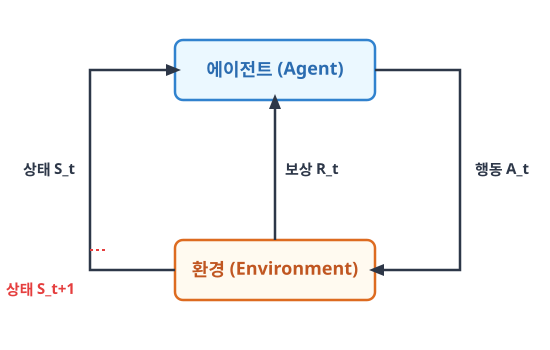

# 05.1 마르코프 결정 과정(MDP)이란?

**그림 05-1** 오즈의 숲길(Environment)에서 상태(노란 벽돌)를 딛고 상자 열기(Action)를 해 보상(금열쇠)을 획득하는 도로시와 지니

마르코프 성질 위에 주체적인 의사결정(Decision)이 결합된 강화학습의 기본 뼈대인 **마르코프 결정 과정(MDP)**을 배웁니다. 에이전트와 환경이 상태, 행동, 보상을 서로 교환하며 상호작용하는 다이내믹 루프를 지니 요정과 도로시의 모험 속 비유를 바탕으로 정복해보아요!

---

우리는 앞서 **4강 마르코프**에서 안드레이 마르코프의 생애와 마르코프 성질의 기초를 학습했습니다. 이번 장부터는 여기에 주체적인 의사결정(Decision)이 개입되는 동적 시스템으로 확장한 수학 프레임워크인 **마르코프 결정 과정(MDP)**을 정의하고 배웁니다.

마르코프 결정 과정Markov Decision Process, MDP에서 '결정 과정'이란 '에이전트가 (환경과 상호작용하면서) 행동을 결정하는 과정'을 뜻합니다. 

---

### 05.1.1 강화 학습과 환경의 변화

구체적인 예와 함께 MDP의 성격을 살펴봅시다.

> '마르코프 성질'의 의미는 05.2.1절 참고

---

### 05.1.2 그리드 월드 구체적 예시

에이전트가 자신의 행동에 따라 환경의 상태를 실시간으로 바꾸어 나가는 문제를 이해하기 위해 구체적인 '그리드 월드' 예시로 시작해 봅시다.

#### 05.1.2.1 에이전트와 환경, 보상의 정의

먼저 [그림 05-1]을 보죠. 

세상은 격자grid로 구분되어 있고 그 안에 로봇이 있습니다. 로봇은 격자 세상에서 오른쪽 또는 왼쪽으로 이동할 수 있습니다. 이 책에서는 그림과 같은 세계를 '그리드 월드'라고 부르겠습니다.

**그림 05-1** MDP 문제 예시: 그리드 월드

강화 학습 용어로 이야기하면 로봇이 에이전트agent이고 주변이 환경environment입니다. 

#### 에이전트는 오른쪽으로 이동하거나 왼쪽으로 이동하는 두 가지 행동을 취할 수 있습니다. 

또한 그림에서 그리드의 가장 왼쪽 칸에는 사과가 있고 가장 오른쪽 칸에는 폭탄이 있습니다. 이들은 로봇에게 주어지는 보상reward입니다. 사과를 얻을 때의 보상은 +1, 폭탄을 얻을 때의 보상은 -2로 하겠습니다. 빈칸의 보상은 0입니다.

#### 05.1.2.2 타임 스텝과 상태 전이 개념

이 문제에서는 에이전트가 행동할 때마다 상황이 변합니다. 

예를 들어 왼쪽으로 두 번 연달아 이동했다고 해보죠. 그러면 에이전트는 +1의 보상을 얻습니다. 반대로 오른쪽으로 두 번 이동하면 -2의 보상을 얻습니다. 

이러한 에이전트의 이동을 [그림 05-2]처럼 나타낼 수 있습니다.

**그림 05-2** MDP의 상태 전이

그림과 같이 에이전트의 행동에 따라 에이전트가 처하는 상황이 달라집니다. 

#### 이 상황을 강화 학습에서는 상태state라고 합니다. 

MDP에서는 에이전트의 행동에 따라 상태가 바뀌고, 상태가 바뀐 곳에서 새로운 행동을 하게 됩니다. 참고로 그림에서도 알 수 있듯이 지금 문제에서 에이전트에게 최선의 행동은 왼쪽으로 두 번 이동하는 것입니다. 그래야 가장 많은 보상을 얻을 수 있습니다.

> NOTE_ MDP에는 '시간' 개념이 필요합니다. 특정 시간에 에이전트가 행동을 취하고, 그 결과로 새로운 상태로 전이합니다. 이때의 시간 단위를 타임 스텝time step이라고 합니다. 타임 스텝은 에이전트가 다음 행동을 결정하는 간격이기 때문에 구체적인 단위는 어떤 문제를 풀려는지에 따라 달라집니다.

이번에는 [그림 05-3]의 문제를 생각해봅시다.

**그림 05-3** 또 다른 세계(환경)

이 그림에서 그리드의 왼쪽 끝에는 보상이 +1인 사과가 있고, 에이전트의 바로 오른쪽에는 보상이 -2인 폭탄이 있습니다. 그리고 그 너머 오른쪽 끝에는 보상이 +6인 사과 더미가 있습니다. 

이 문제에서 오른쪽으로 이동하면 즉시 얻는 보상은 마이너스지만, 한 번 더 오른쪽으로 이동하면 +6짜리 사과 더미를 얻을 수 있습니다. 따라서 이 문제에서 `최선의 행동은 오른쪽으로 두 번 이동`하는 것입니다.

이 예에서 알 수 있듯이 에이전트는 `눈앞의 보상`이 아니라 미래에 얻을 수 있는 보상의 `총합`을 고려해야 합니다. 

즉, 보상의 총합을 극대화하려 노력해야 합니다.

---

### 05.1.3 에이전트와 환경의 상호작용

MDP에서는 에이전트와 환경 사이에 상호작용이 이루어집니다. 

#### 05.1.3.1 MDP 피드백 루프와 사이클

이때 명심해야 할 사실은 에이전트가 행동을 취함으로써 상태가 변한다는 점입니다. 그에 따라 얻을 수 있는 보상도 달라지죠. 

그림으로 표현하면 다음과 같은 관계입니다.

**그림 05-4** MDP의 사이클

[그림 05-4]에서는 시간 *t*에서의 상태가 *S**t*입니다. 

이 상태 *S**t*에서 시작하여 에이전트가 행동 *A**t*를 수행하여 보상 *R**t*를 얻고, 다음 상태인 *S**t+1*로 전환됩니다. 

이러한 에이전트와 환경의 상호작용은 실제로 다음과 같은 전이를 만들어냅니다.

$$
S_0, A_0, R_0, S_1, A_1, R_1, S_2, A_2, R_2, \cdots
$$

이 시계열 데이터는 첫 번째 상태를 *S*0에서 시작합니다. 

상태 *S*0에서 에이전트가 행동 *A*0을 수행하여 보상 *R*0을 얻고, 시간이 한 단위만큼 흘러 상태가 *S*1로 변합니다. 다음 상태인 *S*1에서 에이전트가 행동 *A*1을 수행하여 보상 *R*1을 얻고, 다음 상태인 *S*2로 변하는 흐름이 계속됩니다.

#### 05.1.3.2 보상 획득 시점 정의(R_t vs R_t+1)

강화 학습에서는 다음과 같이 보상의 시점을 *R**t*로 잡기도 하고 *R**t+1*로 잡기도 합니다.

• 상태 *S**t*에서 행동 *A**t*를 수행하고 보상 *R**t*를 받고 다음 상태인 *S**t+1*로 전환
• 상태 *S**t*에서 행동 *A**t*를 수행하고 보상 *R**t+1*을 받고 다음 상태인 *S**t+1*로 전환

이처럼 보상을 *R**t*로 처리할 수도, *R**t+1*로 처리할 수도 있습니다. 

이 강의에서는 프로그래밍하기에 더 편리한 첫 번째 방식(*R**t*)을 택했습니다.

---

### 05.1.4 핵심 요약

이상으로 MDP의 기초를 익혔습니다.

1. **상태 기반 환경**: MDP에서는 에이전트의 행동에 반응하여 환경의 상태가 동적으로 변화합니다.
2. **MDP 사이클**: 에이전트가 상태 *S**t*에서 행동 *A**t*를 수행하면 보상 *R**t*를 받고 다음 상태 *S**t+1*로 넘어가는 피드백 순환 구조를 이룹니다.
3. **타임 스텝**: 시간 단위를 쪼개어 에이전트와 환경이 순차적으로 의사결정을 주고받는 시간 간격을 뜻합니다.

다음 절에서는 MDP를 수식으로 표현해보겠습니다.
