# 05.3 MDP의 목표

**그림 05-3** 미래로 갈수록 기하급수적으로 작아지는 보상 상자들(할인율 gamma)과 반환값 G_t 공식을 판서하며 학습하는 지니와 도로시
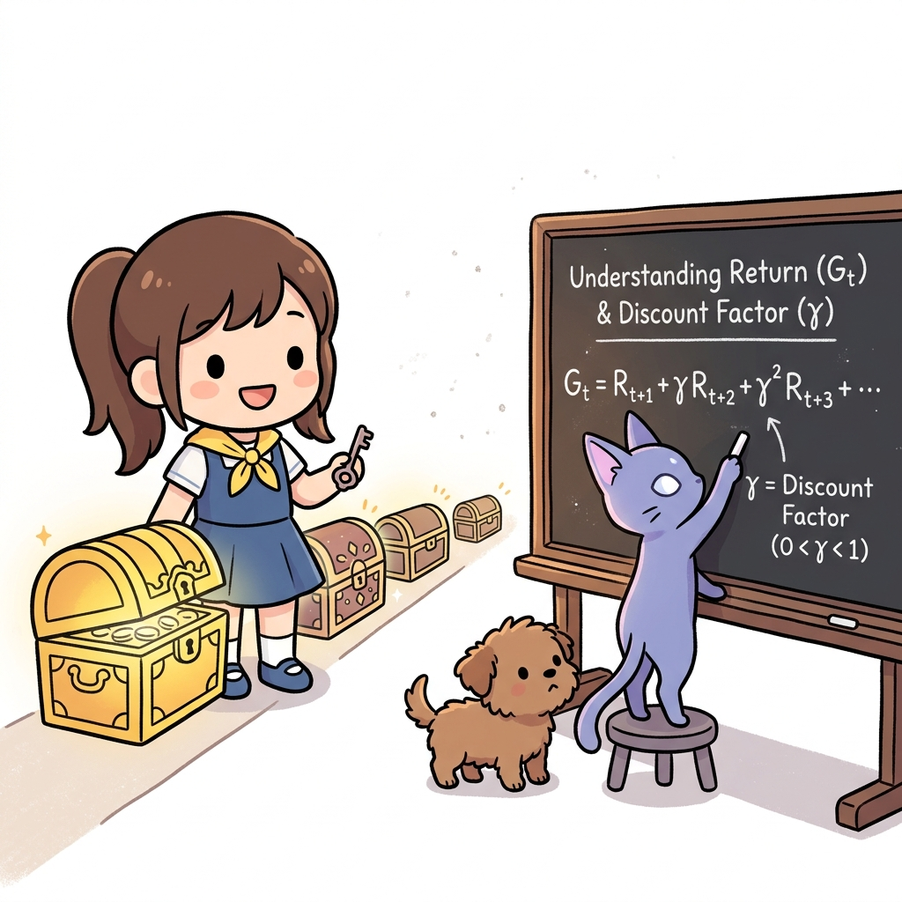

에이전트가 오즈의 세계에서 달성해야 할 최종 골인 지점인 **반환값(Return, G_t)**과 미래 보상의 가치를 조율하는 **할인율(Discount Factor, *γ*)**을 학습합니다. 지니의 명료한 수학 수업 비유를 통해, 미래 보상을 적절히 깎아서 현실의 가치로 통합하는 기법의 본질을 제대로 이해해 봅시다!

---

지금까지는 환경과 에이전트의 행동을 수식으로 표현했습니다.

 간단히 복습하면, 에이전트는 정책 π(*a* | *s*)에 따라 행동합니다.  그 행동과 상태 전이 확률 *p*(*s'* | *s*, *a*)에 의해 다음 상태가 결정됩니다. 그리고 보상은 보상 함수 *r*(*s*, *a*, *s'*)가 결정합니다. 

이 틀 안에서 최적 정책을 찾는 것이 MDP의 목표입니다. 

최적 정책optimal policy이란 수익이 최대가 되는 정책입니다(수익에 대해서는 3.05.2절 참고).

> NOTE_ 에이전트가 결정적 정책을 따른다면 μ(*s*) 함수로 나타낼 수 있습니다. 하지만 결정적 정책은 확률적 정책으로도 표현할 수 있으니 여기서는 확률적 정책 π(*a* | *s*)를 가정하고 진행하겠습니다. 같은 이유로 환경의 상태 전이도 확률적이라고 가정합니다.

---

### 3.05.1 일회성 과제와 지속적 과제

이번 절에서는 최적 정책을 수식으로 정확하게 표현하고자 합니다. 그러려면 먼저 MDP의 문제가 크게 두 가지로 나뉜다는 사실을 알아야 합니다. 

바로 **'일회성 과제'**와 **'지속적 과제'**입니다. 

이 두 과제의 성격 차이를 명확히 시각화한 것이 바로 [그림 05-15]입니다.

그림 05-15 일회성 과제와 지속적 과제의 비교

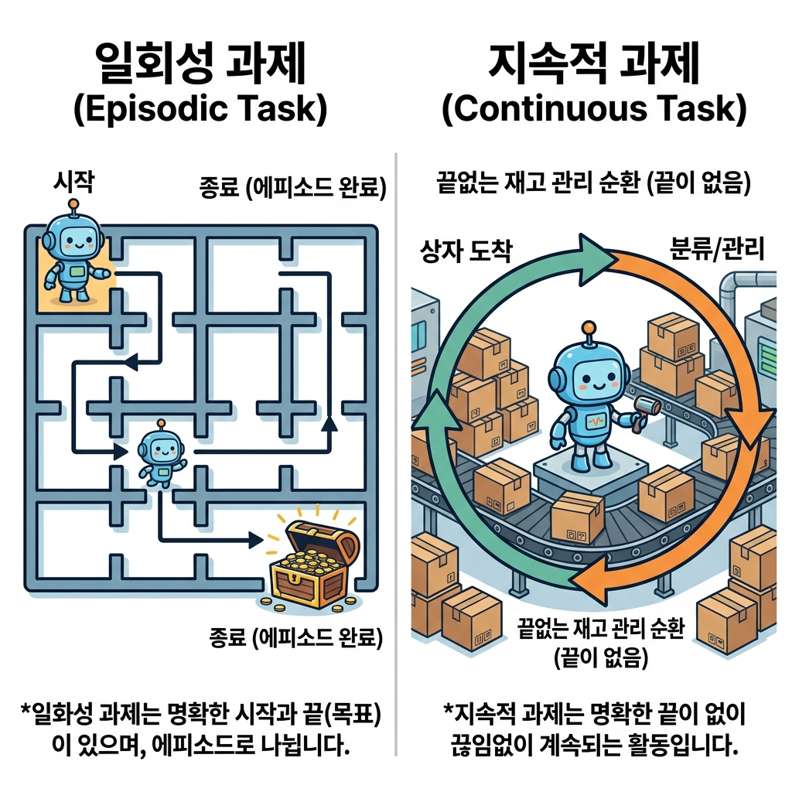

#### 3.05.1.1 일회성 과제와 에피소드(Episode)

[그림 05-15]의 왼쪽과 같이 **일회성 과제**episodic task는 확실한 '시작'과 '끝(목표 상태)'이 존재하는 문제입니다. 

예를 들어 바둑은 대표적인 일회성 과제입니다. 대국이 시작되면 돌을 번갈아 두다가 결국 한쪽의 승리/패배/무승부 중 하나로 끝(종료)이 나며, 다음 게임은 돌이 하나도 없는 초기 상태에서 완전히 새로 시작합니다. 이처럼 일회성 과제에서 처음 시작부터 최종 종료까지 에이전트가 지나간 일련의 모든 경험 과정을 **에피소드**episode라고 정의합니다.

[그림 05-16]과 같은 그리드 월드 문제도 전형적인 일회성 과제입니다.

그림 05-16 끝이 있는 문제의 예

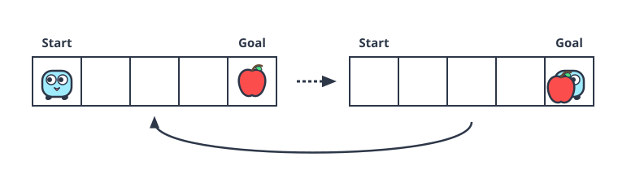

이 그림에서는 특정 위치(목표 상자)가 있어서 에이전트가 그 목표에 도달하면 해당 에피소드가 즉시 끝이 납니다. 그 후에는 다시 처음 시작 상태로 돌아가 새로운 에피소드를 진행합니다.

#### 3.05.1.2 지속적 과제

반면 지속적 과제continuous task는 '끝'이 없는 문제입니다. 

예를 들어 재고 관리가 있겠네요. 재고 관리에서의 에이전트는 얼마나 많은 상품을 구매할지를 결정합니다. 판매량과 재고량을 보고 최적의 구매량을 결정해야 합니다(재고가 너무 많아지지 않게 관리하면서도 상품 판매에 지장이 없도록 해야 합니다). 

이러 유형의 문제는 끝을 정하지 않고 영원히 지속될 수 있습니다.

---

### 3.05.2 수익

다음으로 새로운 용어인 **수익return**을 소개하겠습니다. 

이 수익을 극대화하는 것이 에이전트의 **목표**입니다.

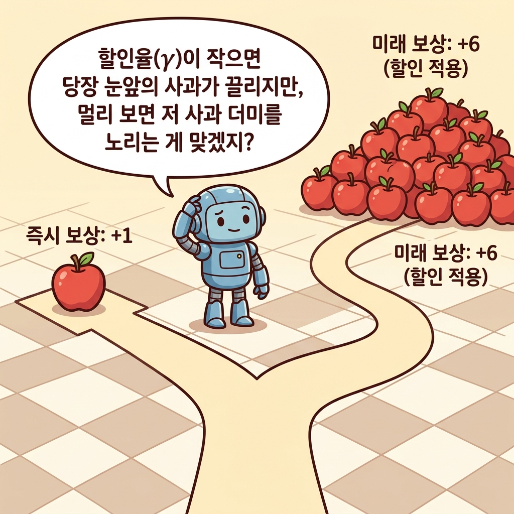

#### 3.05.2.1 누적 보상 수익 G_t 정의

시간 *t*에서의 상태를 *S**t*라고 해보죠(*t*는 임의의 값). 그리고 에이전트가 정책 π에 따라 행동 *A**t*를 하고, 보상 *R**t*를 얻고, 새로운 상태 *S**t+1*로 전이하는 흐름이 이어집니다. 

그림 2-16a MDP의 단일 단계 전이 흐름

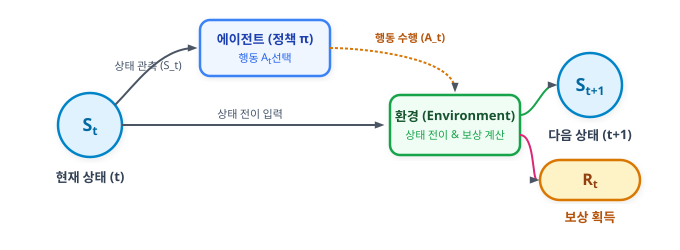

이때 수익 *G**t*는 다음과 같이 정의됩니다.
$$
G_t = R_t + \gamma R_{t+1} + \gamma^2 R_{t+2} + \cdots
$$

[식 05.1]

이 [식 05.1]이 정의하는 할인 누적 보상 수익 *G**t*를 시간의 흐름(타임라인)을 따라 가중치가 매겨지는 과정으로 시각화하면 [그림 05-17]과 같습니다.

그림 05-17 할인 누적 보상 수익 G_t의 타임라인

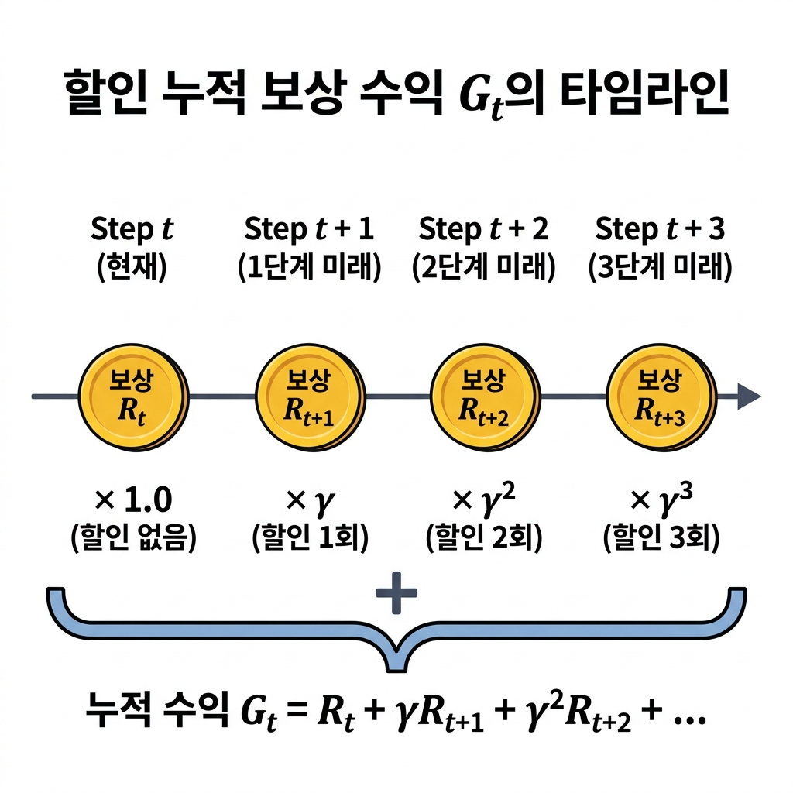

[식 05.1]과 같이 수익은 에이전트가 얻는 보상의 합입니다. 

#### 

하지만 시간이 지날수록 보상은 γ(감마)에 의해 기하급수적으로 줄어듭니다.

이 γ를 할인율discount rate이라고 하며 0.0에서 1.0 사이의 실수로 설정합니다. 

예를 들어 할인율을 0.9로 설정하면 [식 05.1]은 다음처럼 됩니다.
$$
G_t = R_t + 0.9 R_{t+1} + 0.81 R_{t+2} + \cdots
$$

#### 3.05.2.2 할인율 γ 도입 이유와 효과

할인율을 도입하는 가장 주된 이유는 지속적 과제에서 수익이 무한대로 발산하여 계산 불가능해지는 것을 방지하기 위해서입니다. 할인율이 없다면, 즉 γ = 1이라면 영원히 끝나지 않는 지속적 과제에서 누적 보상의 합(수익)이 무한대(∞)가 되어버려 정책 간의 우열을 비교할 수 없게 됩니다.

 

또한, 할인율은 가까운 미래의 보상을 먼 미래의 보상보다 더 중요하게 취급하도록 만듭니다. 이 개념은 일상생활 속 할인율의 효과인 [그림 05-18]을 통해 이해할 수 있습니다.

그림 05-18 할인율의 효과 예시

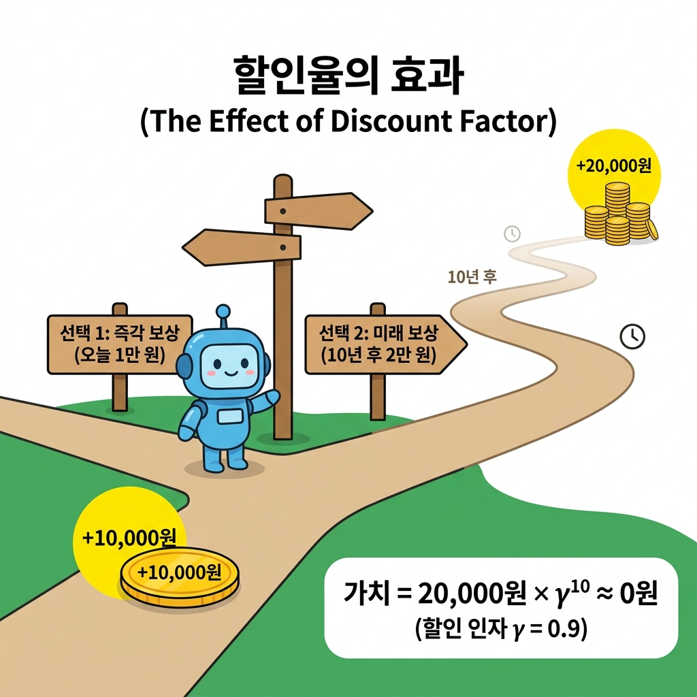

[그림 05-18]에서 보듯 에이전트(혹은 사람)에게 '오늘 당장 1만 원 받기'와 '10년 후에 2만 원 받기'라는 선택지가 주어졌다고 합시다. 비록 절대적인 액수는 미래에 받는 2만 원이 더 크지만, 할인율 *γ* = 0.9를 대입해보면 10년 후 2만 원의 현재 가치는 기하급수적으로 할인되어 0원에 가깝게 수렴합니다. 따라서 에이전트는 즉시 얻을 수 있는 보상인 1만 원을 훨씬 더 매력적인 선택지로 평가하게 됩니다. 이와 같이 할인율은 미래의 불확실성을 모델링하고 합리적인 시간 흐름상의 가치 판단을 내리는 장치 역할을 합니다.

---

### 05.3.3 상태 가치 함수

방금 정의한 '수익'을 극대화하는 것이 에이전트의 목표라고 했습니다. 

여기서 주의할 게 하나 있습니다. 에이전트와 환경이 '확률적'으로 동작할 수 있다는 점입니다.

그림 2-18a 에이전트와 환경의 확률적(stochastic) 선택 예시

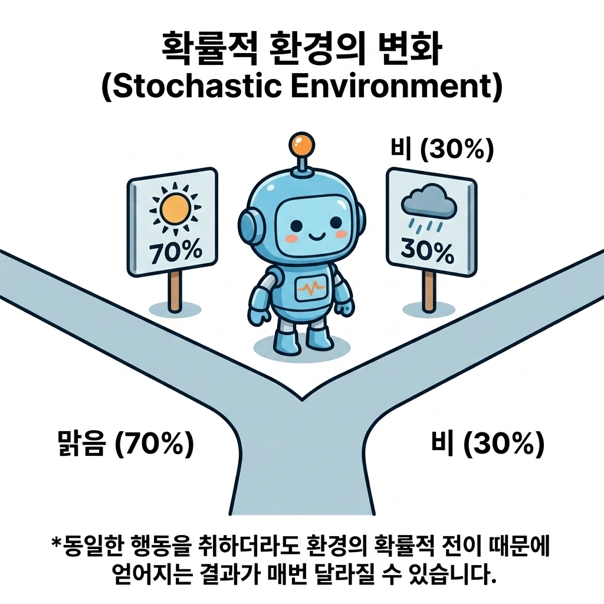

#### 05.3.3.1 수익의 기댓값 정의

에이전트는 다음 행동을 **확률적**으로 결정할 수 있고, 상태 역시 확률적으로 **전이**될 수 있습니다. 그렇다면 얻는 **수익**도 '확률적'으로 매번 달라질 것입니다. 

예를 들어 어떤 에피소드에서는 수익이 10.4이고 다른 에피소드에서는 8.7, 또 다른 에피소드에서는 9.4가 나올 수 있습니다. 비록 똑같은 상태 *s*에서 시작했더라도 무작위성 때문에 매 시도마다 획득하는 수익 *G**t*가 다르게 나타납니다. 

그림 2-18b 에피소드별 무작위 선택에 따른 수익 G_t의 편차

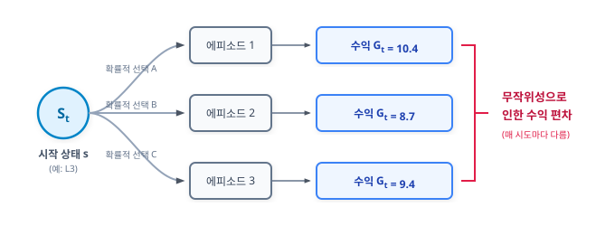

이처럼 무작위적인 확률 분포 형태로 도출되는 보상들을 평가하기 위해서는 통계적 **기댓값**expectation, 즉 '수익의 평균 기댓값'을 성과의 기준 지표로 삼아야 합니다. 

이 개념을 시각화하면 [그림 05-19]와 같습니다.

그림 05-19 상태 가치 함수 v_π(s)와 에피소드별 수익 기댓값의 개념

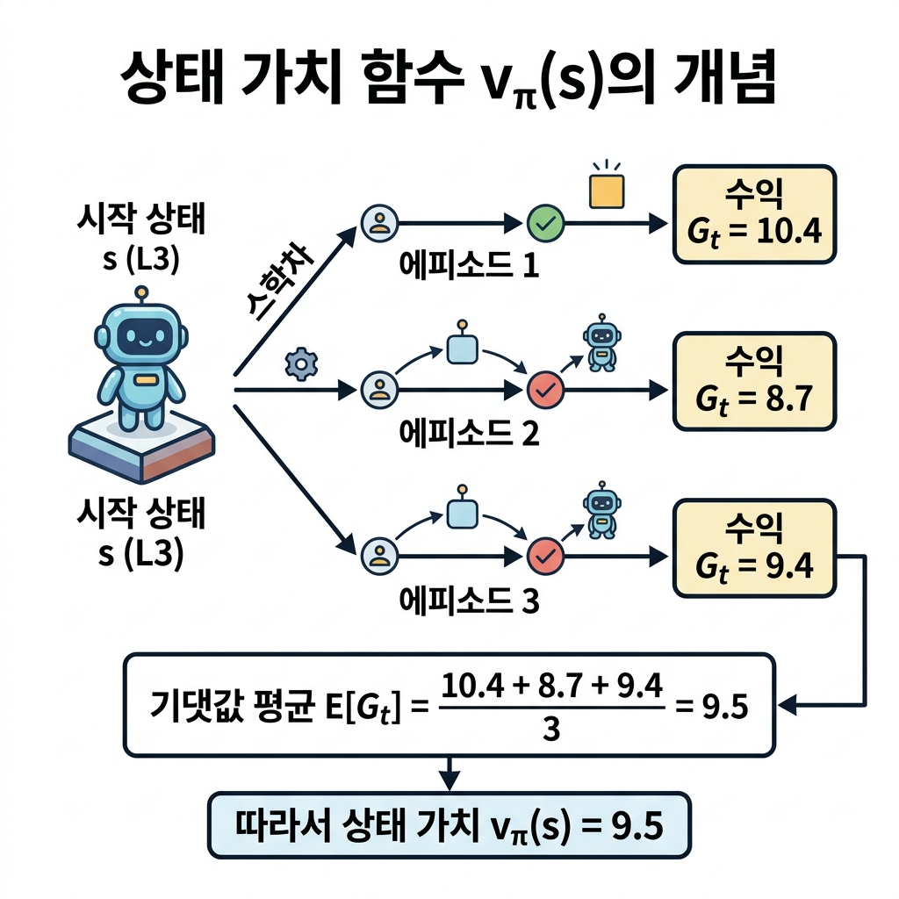

[그림 05-19]와 같이 시작 상태 L3에서 여러 번 에피소드를 수행했을 때 얻은 각 수익들의 **가중 평균(기댓값)**을 계산하면 9.5가 되며, 이 평균값 9.5가 곧 이 상태의 가치가 됩니다. 

수식으로는 상태 *S**t*가 *s*이고, 에이전트가 정책 *π*를 따를 때 얻을 수 있는 기대 수익을 다음 상태 가치 함수식으로 정의합니다.

$$
v_{\pi}(s) = \mathbb{E}[G_t \mid S_t = s, \pi]
$$

[식 05.2]

이처럼 수익의 기댓값을 *v*π(*s*)로 표기하며 *v*π(*s*)를 상태 가치 함수state-value function라고 합니다. 

[식 05.2]의 우변에서 에이전트의 정책 π는 조건으로 주어집니다.

정책 π가 바뀌면 에이전트가 얻는 보상도 바뀌고 총합인 수익도 바뀌기 때문입니다. 이런 특성을 명시하기 위해 상태 **가치 함수는 *v*π(*s*)처럼 π를 *v*의 밑으로 쓰는 방식**을 많이 따릅니다. 

또한 [식 05.2]를 다음처럼 쓰기도 합니다.
$$
v_{\pi}(s) = \mathbb{E}_{\pi}[G_t \mid S_t = s]
$$

[식 05.3]

[식 05.3]에서는 우변에서 π의 위치가 𝔼π로 이동했습니다. 의미는 [식 05.2]에서와 마찬가지로 π라는 정책이 조건으로 주어져 있음을 나타냅니다. 

이 책에서는 [식 05.3] 형태로 쓰겠습니다.

> NOTE_ 기댓값 기호 *𝔼*(E)에 대한 설명과 읽는 방법
> - **의미 및 약어**: *𝔼*(또는 대문자 *E*)는 통계학에서 **기댓값**Expectation(또는 기댓값 함수 **Expected Value**)을 뜻하는 기호입니다. 여러 가능성이 있는 값에 각각의 확률을 곱해 합산한 '가중 평균값'을 의미합니다.
> - **읽는 방법 (발음)**: 한국어로는 보통 **"기댓값"** 또는 영문 명칭 그대로 **"익스펙테이션"**이라고 읽습니다.
> - **수식 읽기**: [식 05.3]의 우변 *𝔼**π*[*G**t* | *S**t* = *s*]는 **"정책 *π*를 따를 때, 시간 *t*에서의 상태 *S**t*가 *s*라는 조건 하에서의 수익 *G**t*의 기댓값"**으로 해석하며, 구어로는 **"정책 파이하에서 상태 에스일 때 수익 지 티의 기댓값(익스펙테이션)"**으로 편하게 읽습니다.

> NOTE_ 상태 가치 함수는 *v*π 말고도 *V*π로 표기하는 경우가 있습니다. 소문자 *v*π는 실제 상태 가치 함수이고, 대문자 *V*π는 추정치로서의 상태 가치 함수를 뜻합니다.

---

### 05.05.4 최적 정책과 최적 가치 함수

강화 학습의 목표는 최적 정책을 찾는 것입니다. 이번 절에서는 **최적 정책**이란 무엇이며 애초에 '최적'을 어떻게 표현할 수 있을지를 생각해보겠습니다.

#### 05.05.4.1 정책의 우열 판정 및 최적 정책 정의

먼저 두 가지 정책 π와 π'가 있다고 가정합시다. 

이때 두 정책에서 상태 가치 함수 *v*π(*s*), *v*π'(*s*)가 각각 결정됩니다. 이번 절에서는 모든 상태에서의 가치 함수가 [그림 05-19]처럼 결정되었다고 가정합니다.

그림 05-19 정책 π와 π' 각 상태에서의 상태 가치 함수 그래프(상태는 L1부터 L5까지 총 5개라고 가정)

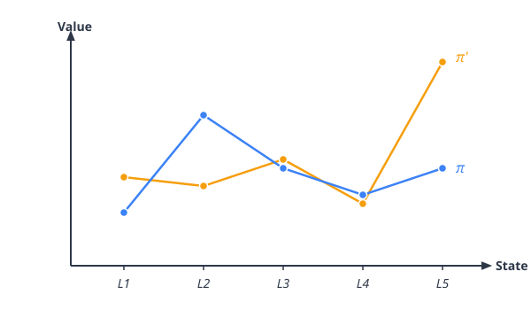

그림에서 주목할 점은 어떤 상태에서는 *v*π'(*s*) > *v*π(*s*)이고, 어떤 상태에서는 *v*π'(*s*) < *v*π(*s*)라는 점입니다. 예를 들어 상태가 L1일 때는 정책 π'에 따라 행동하는 편이 수익의 기댓값이 더 높습니다. 하지만 상태가 L2일 때는 정책 π가 더 좋은 결과를 가져옵니다. 이처럼 상태에 따라 상태 가치 함수의 크고 작음이 달라지는 경우에는 두 정책의 우열을 가릴 수 없습니다.

그렇다면 어떠할 때 두 정책의 우열을 가릴 수 있을까요? 

바로 [그림 05-20]과 같은 경우입니다.

그림 05-20 모든 상태에서 *v*π'(*s*) ≥ *v*π(*s*)인 그래프

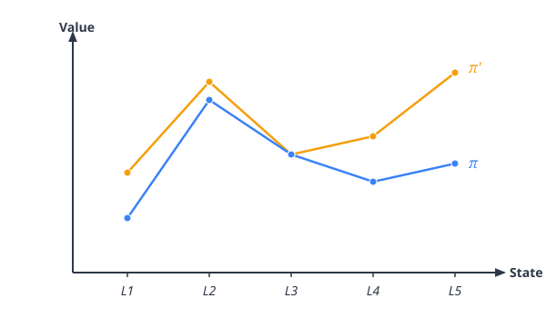

이 그림의 예에서는 모든 상태에서 *v*π'(*s*) ≥ *v*π(*s*)가 성립됩니다. 따라서 π'가 π보다 나은 정책이라고 할 수 있습니다. 어떤 상태에서 시작하더라도 얻을 수 있는 보상의 기댓값 총합이 π' 쪽이 더 크거나 같기 때문입니다.

이렇게 두 정책의 우열을 가리려면 하나의 정책이 다른 정책보다 '모든 상태'에서 더 좋거나 최소한 똑같아야 합니다(만약 모든 상태에서 *v*π'(*s*) = *v*π(*s*)라면 똑같이 좋은 정책입니다).

이제 두 정책의 우열을 가릴 수 있게 되었습니다. 

이 생각을 발전시키면 '최적'인 정책이 무엇인지 정의할 수 있습니다. 최적 정책을 π&#42;로 표현한다면 정책 π&#42;는 다른 정책과 비교하여 모든 상태에서 상태 가치 함수 *v*π&#42;(*s*)의 값이 더 큰 정책이라는 뜻입니다. 

그래프로 표현하면 [그림 05-21]과 같습니다.

그림 05-21 최적 정책 π&#42;와 그 외 정책들

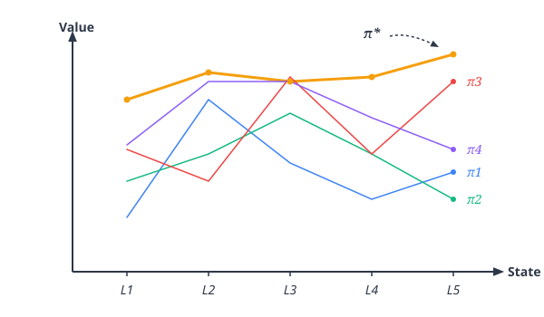

그림과 같이 모든 상태에서 상태 가치 함수의 값이 다른 어떤 정책보다 큰 정책이 최적 정책입니다. 

중요한 사실은 MDP에서는 최적 정책이 적어도 하나는 존재한다는 사실입니다. 그리고 그 최적 정책은 '결정적 정책'입니다. 결정적 정책에서는 각 상태에서의 행동이 유일하게 결정됩니다. 수식으로는 *a* = μ&#42;(*s*)와 같이, 상태 *s*를 입력하면 행동 *a*를 출력하는 함수 **μ&#42;로** 나타낼 수 있습니다.

>  NOTE_ MDP에서 최적의 결정적 정책이 하나 이상 존재한다는 사실은 수학적으로 증명할 수 있습니다. 어떻게 증명하는지 궁금한 분은 다른 문헌[4]을 참고하기 바랍니다. 한편, 최적 정책이 결정적인 이유는 05.4.1절에서 구체적인 예를 들어 설명합니다.

#### 05.05.4.2 최적 상태 가치 함수 v_*(s)와 결정적 최적 정책

최적 정책의 상태 가치 함수를 최적 상태 가치 함수optimal state-value function라고 합니다. 이 가의에서는 최적 상태 가치 함수를 *v*&#42;로 표기합니다.

---

### 05.05.5 핵심 요약

1. **과제 분류**: MDP 문제는 에피소드로 끝나는 일회성 과제와 무한히 전이되는 지속적 과제로 분류됩니다.
2. **할인율(γ)**: 기대 수익의 무한대 발산을 방지하고, 가까운 미래의 보상을 멀리 있는 보상보다 가치 있게 평가하기 위해 도입한 상수(0 ≤ γ < 1)입니다.
3. **상태 가치 함수**: 어떤 상태 *s*에서 시작하여 특정 정책 π에 따라 움직였을 때 획득할 기대 할인 수익 *v*π(*s*) = 𝔼π[*G**t* | *S**t* = *s*] 입니다.
4. **최적 정책**: 모든 상태에서 가치 함수를 극대화하는 최우수 정책 π&#42;이며, MDP에서는 이 최적 정책이 항상 최소한 하나 이상 존재하고 이는 결정적 정책입니다.

