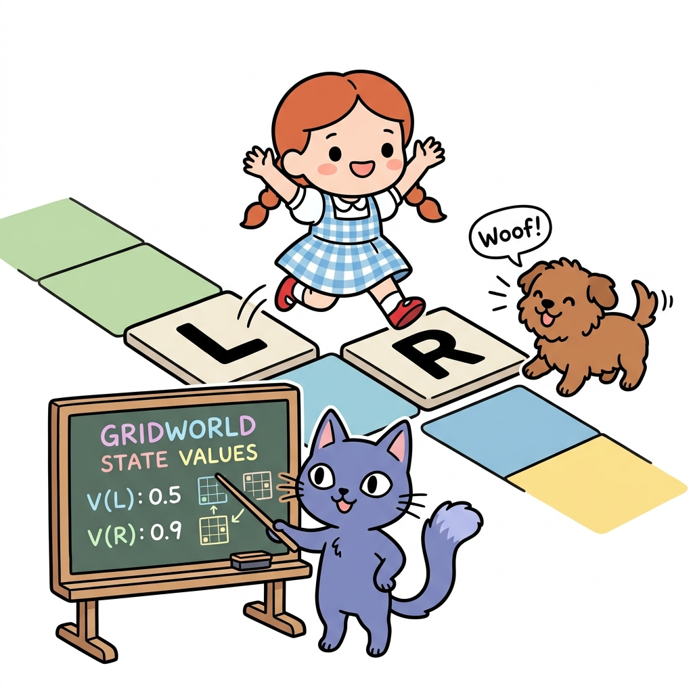
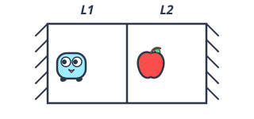
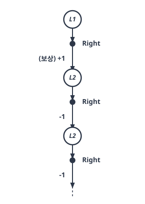
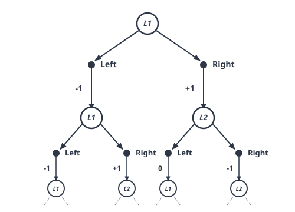
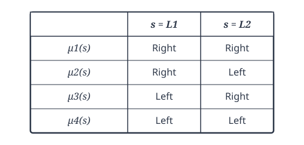
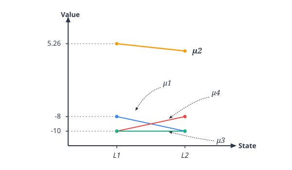
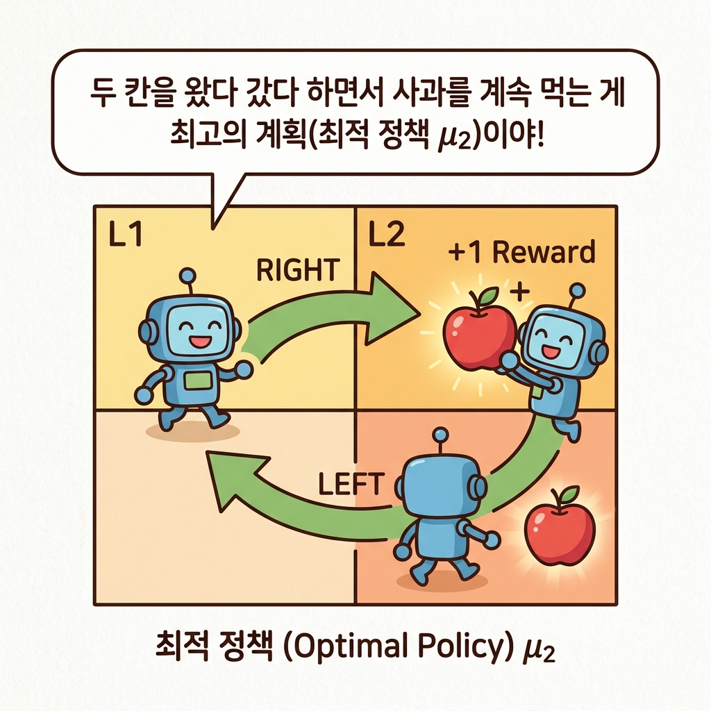

# 05.4 MDP 예제

**그림 05-4** 두 칸짜리 격자 타일(L, R) 위를 점프하며 타일 가치를 수치로 풀어보는 도로시와 지니


가장 직관적이고 쉬운 의사결정 환경인 **두 칸짜리 그리드월드(Gridworld)** 예제를 다룹니다. 상태 가치 함수의 수식 연산을 직접 수작업으로 돌려보며, 에이전트가 어떤 상태에서 어떤 행동을 취하는 정책이 가장 현명한(최적) 선택인지를 도로시와 지니의 격자 징검다리 게임과 함께 차근차근 구해봅시다!

---

이번 절에서는 MDP에 속하는 구체적인 문제를 하나 살펴보겠습니다.


---


### 05.4.1 두 칸짜리 그리드 월드 문제 정의

[그림 05-13]과 같은 두 칸짜리 그리드 월드를 예로 생각해 봅니다.

칸이 두 개이고 좌우 끝은 벽으로 막혀 있습니다. 


그림 05-13 두 칸짜리 그리드 월드




##### 이 문제의 설정은 다음과 같습니다.
• 에이전트는 오른쪽이나 왼쪽으로 이동할 수 있다.
• 상태 전이는 결정적이다.
• 에이전트가 L1에서 L2로 이동하면 사과를 받아 +1의 보상을 얻는다.
• 에이전트가 L2에서 L1로 이동하면 사과가 다시 생성된다.
• 벽에 부딪히면 -1의 보상을 얻는다. 즉, 벌을 받는다. 예를 들어 에이전트가 L1에서 왼쪽으로 이동하면 -1의 보상을, L2에서 오른쪽으로 이동해도 마찬가지로 -1의 보상을 얻는다(이때 사과는 다시 생성되지 않는다).
• 지속적 과제, 즉 '끝이 없는' 문제다.


---


### 05.4.2 백업 다이어그램

이제 문제를 풀어보죠. [그림 05-13]의 문제를 정리하기 위해 백업 다이어그램부터 그려보겠습니다.


#### 05.4.2.1 결정적 행동 및 상태 전이 다이어그램

 백업 다이어그램<sup>backup diagram</sup>은 '방향 있는 그래프(노드와 화살표로 구성된 그래프)'를 활용하여 '상태, 행동, 보상'의 전이를 표현한 그래프입니다. 


[그림 05-14]에 백업 다이어그램의 예를 준비했습니다.


그림 05-14 백업 다이어그램의 예



에이전트가 현재 상태에 상관없이 무조건 오른쪽으로 이동한다고 해봅시다. 이런 조건에서 에이전트의 행동과 상태 전이를 표현한 것이 [그림 05-14]입니다. 이 그림에서 시간은 위에서 아래로 흐릅니다. 첫 번째 상태를 L1로 설정하고 L1부터 시작하는 전이를 그렸습니다.

[그림 05-14]는 에이전트의 정책이 결정적입니다. 즉, 항상 정해진 행동을 취합니다. 게다가 환경의 상태 전이도 결정적이기 때문에 백업 다이어그램의 전이는 일직선으로 뻗어나갑니다.


#### 05.4.2.2 확률적 행동 다이어그램

하지만 만약 에이전트가 50%의 확률로 오른쪽, 나머지 50%의 확률로 왼쪽으로 이동한다면 백업 다이어그램을 [그림 05-15]처럼 그릴 수 있습니다.


그림 05-15 백업 다이어그램의 예(에이전트의 행동이 확률적인 경우)



그림과 같이 각 상태에서 오른쪽 이동과 왼쪽 이동 두 가지로 행동할 가능성이 있기 때문에 백업 다이어그램이 넓게 퍼져나갑니다. 


두 형태의 백업 다이어그램 중 이번 장에서는 더 단순한 [그림 05-14] 쪽에 집중하겠습니다. 


즉, 환경의 상태 전이와 에이전트의 행동이 모두 결정적인 경우입니다(에이전트가 확률적으로 행동하는 경우는 다음 장에서 다룹니다).


---


### 05.4.3 최적 정책 찾기

그렇다면 두 칸짜리 그리드 월드에서 최적 정책은 무엇일까요? 

최적 정책은 결정적 정책으로 존재한다고 알려져 있습니다.


#### 05.4.3.1 네 가지 결정적 정책 패턴 분류

결정적 정책은 *a* = μ(*s*)와 같이 함수로 표현됩니다. 그리고 이번 문제는 상태와 행동의 가짓수가 적기 때문에 존재하는 모든 결정적 정책을 알아낼 수 있습니다. 


상태와 행동이 각 2개씩이므로 결정적 정책은 총 2<sup>2</sup> = 4개가 존재합니다.

그림 05-16 결정적 정책의 패턴




[그림 05-16]에 각 상태에서 취하는 행동을 적어뒀습니다(결정적 정책이므로 각 상태에서 취하는 행동은 하나뿐입니다). 


예를 들어 정책 μ1은 상태 L1에서 오른쪽으로 이동하고, L2에서도 오른쪽으로 이동합니다. 그림의 네 가지 정책 중 최적 정책이 존재합니다(범인은 이 안에 있어!).


#### 05.4.3.2 무한등비급수 합 공식을 활용한 상태 가치 계산

이제 정책 μ1의 상태 가치 함수를 계산해봅시다. 


계산 방법은 다음 장에서 자세히 다루겠지만 지금 상황에서는 환경의 상태 전이와 정책이 모두 **결정적**이기 때문에 간단하게 구할 수 있습니다. 


예를 들어 상태 L1에서 정책 μ1에 따라 오른쪽으로 이동하면 보상 +1을 얻습니다. 

이후로는 오른쪽으로 이동하다가 벽에 부딪히고, 그때마다 -1의 보상을 얻습니다. 이때 할인율을 0.9로 가정하면 상태 가치 함수는 다음처럼 계산할 수 있습니다.


$$
\begin{aligned}
v_{\mu_1}(S = L1) &= 1 + 0.9 \cdot (-1) + 0.9^2 \cdot (-1) + \cdots \\
&= 1 - 0.9(1 + 0.9 + 0.9^2 + \cdots) \\
&= 1 - \frac{0.9}{1 - 0.9} \\
&= -8
\end{aligned}
$$


여기서는 무한등비급수 합 공식을 이용했습니다. 

무한등비급수 합 공식은 1 + *r* + *r*<sup>2</sup> + ... = 1 / (1 - *r*) 입니다(-1 < *r* < 1 일 때). 코드로는 다음과 같이 근사적으로 계산할 수 있습니다.


```python
V = 1
for i in range(1, 100):
    V += -1 * (0.9 ** i)
print(V)
```

출력 결과
```
-7.999734386011124
```

계산을 무한히 계속하는 대신 for문을 이용하여 근사적으로 계산했습니다. 

결과는 대략 -8로, 이론적인 값과 거의 같음을 알 수 있습니다.


다음은 상태 L2에서의 가치 함수입니다(정책은 μ1). 이번에는 오른쪽 벽에 계속 부딪히기 때문에 항상 -1의 보상을 얻게 됩니다. 


따라서 상태 가치 함수는 다음처럼 계산할 수 있습니다.
$$
\begin{aligned}
v_{\mu_1}(s = L2) &= -1 + 0.9 \cdot (-1) + 0.9^2 \cdot (-1) + \cdots \\
&= -1 - 0.9(1 + 0.9 + 0.9^2 + \cdots) \\
&= -1 - \frac{0.9}{1 - 0.9} \\
&= -10
\end{aligned}
$$

이렇게 해서 정책 μ1의 가치 함수를 구했습니다. 


이상의 작업을 다른 정책에도 모두 동일하게 진행하면 [그림 05-17]의 결과를 얻을 수 있습니다.

그림 05-17 각 정책의 상태 가치 함수 그래프



#### 05.4.3.3 최적 정책 결정 및 학습 성과 분석

그래프를 보면 정책 μ2가 모든 상태에서 다른 정책들보다 상태 가치 함수의 값이 더 큽니다. 따라서 정책 μ2가 바로 우리가 찾는 최적 정책입니다.


 정책 μ2는 벽에 부딪히지 않고 오른쪽으로 갔다가 왼쪽으로 돌아오는 행동을 반복합니다. 그러면서 사과를 반복해서 얻는 것이죠. 




최적 정책을 찾았으니 마침내 MDP의 목표를 달성한 것입니다.


---

### 05.4.4 핵심 요약


1. **백업 다이어그램**: 행동과 상태 전이를 방향성 그래프로 그려 가치 계산의 흐름을 직관적으로 시각화해 줍니다.
2. **2칸 그리드 월드 정책 비교**: 결정적 정책 4종을 전부 비교 분석하여, 모든 가치를 극대화하는 최적 정책 μ2가 성립함을 확인했습니다.
3. **무한등비급수 공식 활용**: 지속적 과제에서 정상 상태의 영구 누적 가치를 구하기 위해 고교 수학의 등비급수 합 공식을 사용해 해석적 해를 유도했습니다.

