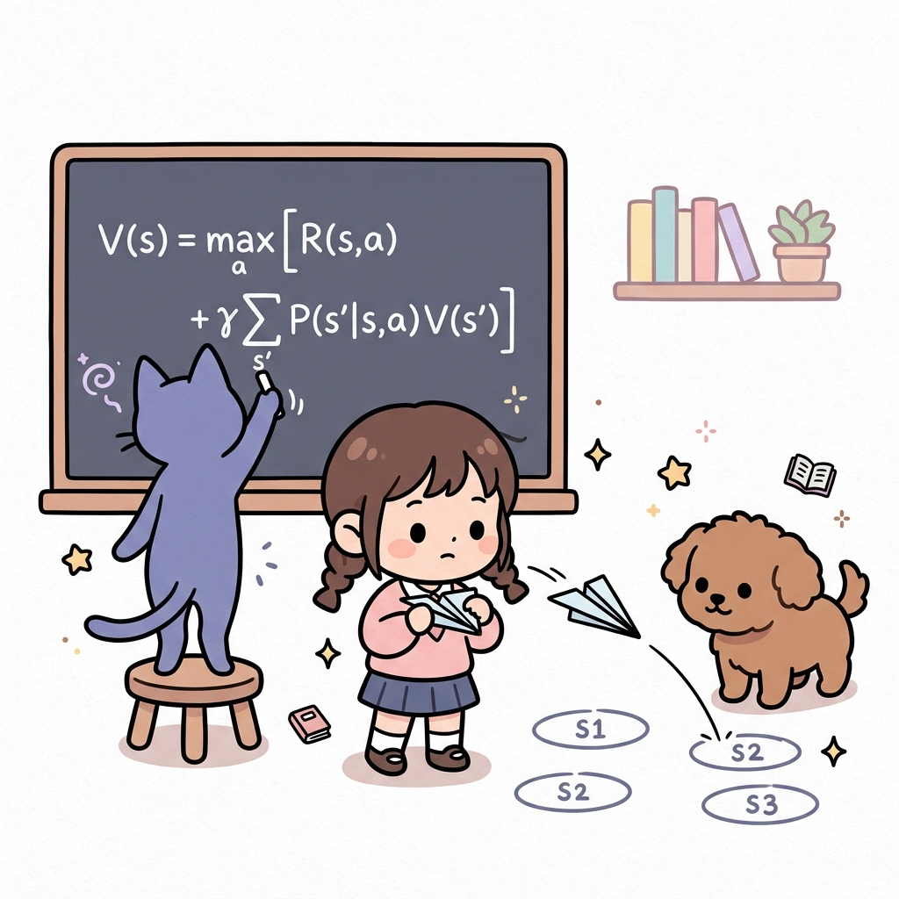
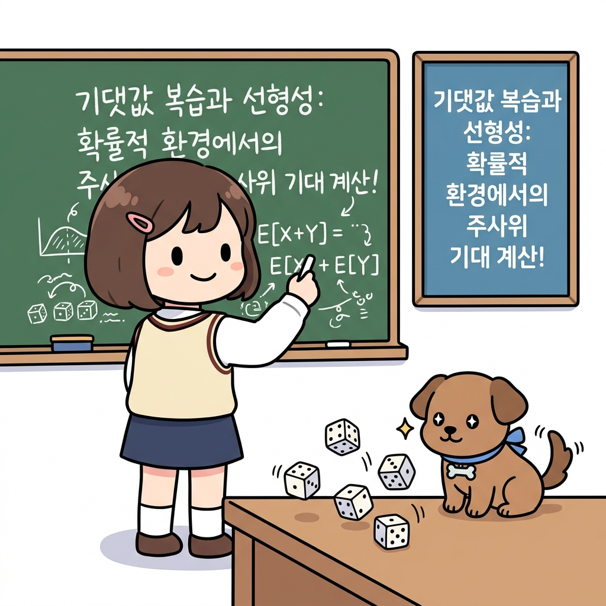
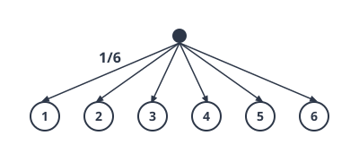
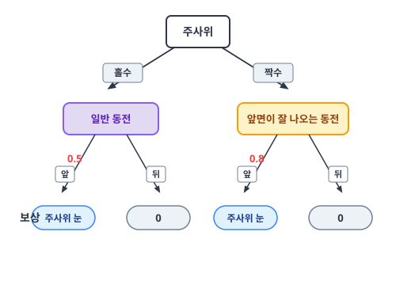
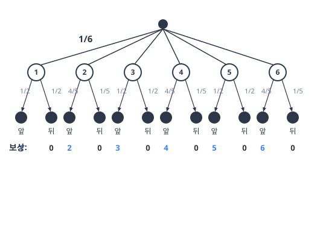
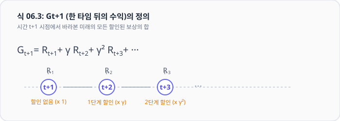
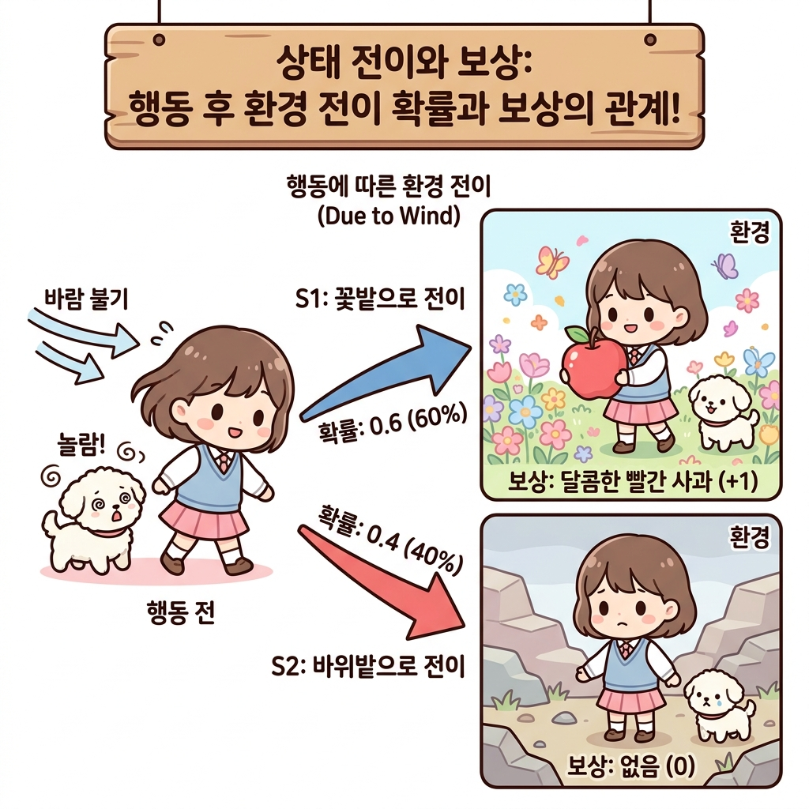
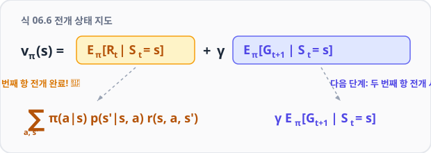

# 06.2 벨만 방정식 도출

**그림 06-2** 칠판에 적어둔 상태 가치 점화식 V(s)을 활용하여 타일 표적 위에 종이비행기를 날려 전이 확률 게임을 시험하는 도로시와 지니

현재 상태의 가치 $V(s)$를 다음 단계 상태들의 가치 $V(s')$와의 순환 점화식으로 연결하여 풀어내는 **벨만 방정식 도출 과정**을 공부합니다. 도로시의 종이비행기 날리기 징검다리 전이 놀이와 지니의 칠판 전개 수식을 통해, 점진적 점화식의 비밀을 경쾌하게 정복해봅시다!

---

이번 절에서는 벨만 방정식을 도출하겠습니다. 하지만 그전에 간단한 예를 이용해 확률과 기댓값에 대해 복습해보죠. 확률과 기댓값에 자신이 있다면 06.2.1절은 건너뛰고 곧바로 06.2.2절로 넘어가도 좋습니다.

### 06.2.1 확률과 기댓값

주사위를 예로 들어 설명하겠습니다. 

#### 이상적인 주사위

각각의 눈이 나올 확률이 정확하게 1/6 씩인 이상적인 주사위라고 가정하죠. 이때 눈 개수를 *x*라는 확률 변수로 표현하면 *x*는 1부터 6까지의 정수가 될 수 있습니다. 

그리고 확률은 모두 1/6 씩이니, 각 눈이 나올 확률을 다음 식으로 표현할 수 있습니다.
$$
p(x) = \frac{1}{6}
$$

#### 주사위 눈의 기댓값
이제 주사위를 굴렸을 때 나올 눈의 기댓값을 구해봅시다. 

> **복습! 기댓값(Expectation)이란 무엇일까요?**
> 기댓값(기대 수익/평균 보상)은 어떤 사건이 일어날 확률과 그때 얻을 수 있는 보상을 곱한 값을 모든 경우에 대해 더해 구한 **평균적인 수익 값**을 의미합니다.
> 
> 
> 

다음처럼 계산하면 됩니다.
$$
\mathbb{E}[x] = 1 \cdot \frac{1}{6} + 2 \cdot \frac{1}{6} + 3 \cdot \frac{1}{6} + 4 \cdot \frac{1}{6} + 5 \cdot \frac{1}{6} + 6 \cdot \frac{1}{6} = 3.5
$$

이와 같이 각각의 '눈 개수'와 '확률'을 곱한 다음, 그 모두를 더합니다.

참고로 합(시그마, Σ) 기호를 쓰면 기댓값을 다음 식으로도 표현할 수 있습니다.
$$
\mathbb{E}[x] = \sum_x x p(x)
$$

#### 백업 다이어그램

백업 다이어그램은 [그림 06-2]와 같이 주사위 눈 개수가 두 번째 줄에 배치된 모습이 됩니다.

그림 06-2 주사위의 백업 다이어그램

#### 주사위와 동전
자, 이번에는 [그림 06-3]과 같은 문제를 생각해봅시다.

그림 06-3 주사위와 동전을 순서대로 던지는 문제

이번 문제는 주사위를 먼저 던지고 이어서 동전을 던지는 방식으로 진행됩니다. 

이때 주사위를 던져 짝수가 나오면 앞면이 잘 나오는 동전(확률 = 0.8)이 주어지고, 홀수가 나오면 일반 동전(확률 = 0.5)이 주어집니다. 그런 다음 주어진 동전을 던져 앞면이 나오면 주사위의 눈 개수만큼을 보상으로 얻습니다. 반대로 뒷면이 나온다면 보상은 0입니다.

예를 들면 다음과 같습니다.

• 주사위 눈이 4개이고 이어서 (앞면이 나오기 쉬운) 동전이 앞면이면 보상은 4이다.  
• 주사위 눈이 5개이고 이어서 (일반) 동전이 뒷면이면 보상은 0이다.  

이 문제의 '보상 기댓값'은 얼마일까요? 먼저 백업 다이어그램을 그려봅시다.

그림 06-4 주사위와 동전을 순서대로 던지는 문제의 백업 다이어그램

그림을 보면, 예컨대 주사위가 1이 나올 확률은 1/6이고 이어서 동전의 앞면이 나올 확률은 1/2입니다. 그리고 이때의 보상이 1이죠. 

다시 말해 다음과 같이 표현할 수 있습니다.
• 1/6 × 1/2 = 1/12의 확률로  
• 보상 1을 얻는다.  

'보상 기댓값'을 구하려면 모든 경우에 대해 똑같이 계산하여 다 더하면 됩니다. 실제로 해보면 다음과 같습니다.
$$
\left(\frac{1}{6} \cdot \frac{1}{2} \cdot 1\right) + \left(\frac{1}{6} \cdot \frac{1}{2} \cdot 0\right) + \left(\frac{1}{6} \cdot \frac{4}{5} \cdot 2\right) + \left(\frac{1}{6} \cdot \frac{1}{5} \cdot 0\right) + \left(\frac{1}{6} \cdot \frac{1}{2} \cdot 3\right) + \left(\frac{1}{6} \cdot \frac{1}{2} \cdot 0\right) +
$$
$$
\left(\frac{1}{6} \cdot \frac{4}{5} \cdot 4\right) + \left(\frac{1}{6} \cdot \frac{1}{5} \cdot 0\right) + \left(\frac{1}{6} \cdot \frac{1}{2} \cdot 5\right) + \left(\frac{1}{6} \cdot \frac{1}{2} \cdot 0\right) + \left(\frac{1}{6} \cdot \frac{4}{5} \cdot 6\right) + \left(\frac{1}{6} \cdot \frac{1}{5} \cdot 0\right)
$$
$$
= 2.35
$$

드디어 보상의 기댓값을 알아냈습니다. 

방법은 [그림 06-4]의 말단 노드가 발생할 **확률**과 그때의 보상을 **곱**하는 계산을 모든 후보에 수행한 다음 다 더하는 것이었습니다.

#### 문자 표현 개선
지금까지 계산한 것을 문자로 표현해봅시다.  주사위의 눈을 *x*, 동전의 결과(앞 혹은 뒤)를 *y*로 표기하겠습니다. 

이번 문제에서는 **주사위 눈 개수**에 따라 **동전 앞면이 나올 확률**이 달라집니다. 

이 설정은 **조건부 확률 *p*(*y* | *x*)**로 표현하며 값은 다음과 같습니다.

$$
p(y = \text{앞} \mid x = 4) = 0.8
$$
$$
p(y = \text{뒤} \mid x = 4) = 0.2
$$

또한 *x*와 *y*가 동시에 일어날 확률, 즉 '동시 확률'은 다음과 같습니다.

$$
p(x, y) = p(x) p(y \mid x)
$$

> [!TIP]
> **친절한 개념 노트: 확률의 곱셈 정리(Multiplication Rule of Probability)**
> 이 수식은 확률론에서 매우 중요한 **확률의 곱셈 정리**를 나타냅니다.
> - **동시 확률 *p*(*x*, *y*)**: 주사위 눈금 *x*가 나오고 동시에 동전 앞/뒷면 *y*가 발생할 확률입니다.
> - **조건부 확률 *p*(*y* | *x*)**: 먼저 일어난 주사위 눈금 *x*의 결과가 고정되어 있을 때, 그 다음 사건인 동전 결과 *y*가 일어날 확률입니다.
> - **곱셈 법칙**: 두 사건이 연달아 일어나는 확률 *p*(*x*, *y*)는 **"첫 번째 사건이 일어날 확률 *p*(*x*)"**에 **"첫 번째 사건이 일어났다는 가정하에 두 번째 사건이 일어날 조건부 확률 *p*(*y* | *x*)"**를 곱해서 구할 수 있다는 원리입니다.
> 
> 예컨대 주사위 눈이 4가 나오고 동전이 앞면이 나올 확률은 다음과 같이 계산됩니다:
> $$
> p(4, \text{앞}) = p(x=4) \times p(y=\text{앞} \mid x=4) = \frac{1}{6} \times 0.8 = 0.133... \text{ (약 } 13.3\% \text{)}
> $$

이번 문제에서 보상은 *x*와 *y*의 값에 의해 결정됩니다. 

따라서 보상을 함수 *r*(*x*, *y*)로 나타낼 수 있습니다.

$$
r(x = 4, y = \text{앞}) = 4
$$
$$
r(x = 3, y = \text{뒤}) = 0
$$

기댓값은 '값 × 그 값이 발생할 확률'의 합입니다. 

그러므로 보상의 기댓값은 다음 식으로 나타낼 수 있습니다.

$$
\mathbb{E}[r(x, y)] = \sum_x \sum_y p(x, y) r(x, y)
$$
$$
= \sum_x \sum_y p(x) p(y \mid x) r(x, y)
$$

이 수식의 형태는 다음 절에서 도출할 벨만 방정식에서도 동일하게 등장합니다.

이로써 벨만 방정식을 맞이할 준비가 끝났습니다. 

여기까지 이해했다면 벨만 방정식 도출도 어렵지 않을 것입니다.

### 06.2.2 벨만 방정식 도출

벨만 방정식을 도출해보겠습니다. 

먼저 복습을 하자면, 앞서 '**수익**'을 다음과 같이 정의했습니다.
$$
G_t = R_t + \gamma R_{t+1} + \gamma^2 R_{t+2} + \cdots
$$

[식 06.2]

이번 절에서는 보상을 무한히 계속 받을 수 있는 **지속적 과제continuous task**를 가정합니다. 

수익 *G**t*는 시간 *t* 이후로 얻을 수 있는 보상의 총합입니다. 

단, 할인율 *γ*에 따라 더 나중에 받는 보상일수록 값이 기하급수적으로 감소합니다. 

그럼 이쯤에서 [식 06.2]의 *t*에 *t* + 1을 대입해보겠습니다. 

그러면 잘 보이지 않던 [식 06.2]의 구조가 또렷하게 드러납니다.
$$
G_{t+1} = R_{t+1} + \gamma R_{t+2} + \gamma^2 R_{t+3} + \cdots
$$

[식 06.3]

[식 06.3]는 시간 *t* + 1 이후에 얻을 수 있는 보상의 합입니다. 

이 식을 적용하여 [식 06.2]을 다음과 같이 변형하겠습니다.
$$
G_t = R_t + \gamma R_{t+1} + \gamma^2 R_{t+2} + \cdots
$$
$$
= R_t + \gamma (R_{t+1} + \gamma R_{t+2} + \cdots)
$$
$$
= R_t + \gamma G_{t+1}
$$

[식 06.4]

[식 06.4]으로부터 수익인 *G**t*와 *G**t*+1의 관계를 알 수 있습니다. 

#### 이 관계는 수많은 강화 학습 이론과 알고리즘에서 사용됩니다.

이어서 [식 06.4]을 상태 가치 함수의 수식에 대입해보겠습니다.

 상태 가치 함수는 수익에 대한 기댓값(기대 수익)이며, 다음 식으로 정의됩니다.
$$
v_{\pi}(s) = \mathbb{E}_{\pi}[G_t \mid S_t = s]
$$

[식 06.5]

[식 06.5]와 같이 상태 *s*의 상태 가치 함수가 *v**π*(*s*)로 표현됩니다. 

이 식의 *G**t*에 [식 06.4]을 대입하면 다음과 같습니다.
$$
v_{\pi}(s) = \mathbb{E}_{\pi}[G_t \mid S_t = s]
$$
$$
= \mathbb{E}_{\pi}[R_t + \gamma G_{t+1} \mid S_t = s]
$$
$$
= \mathbb{E}_{\pi}[R_t \mid S_t = s] + \gamma \mathbb{E}_{\pi}[G_{t+1} \mid S_t = s]
$$

[식 06.6]

마지막 식의 전개는 기댓값의 '선형성' 덕분에 성립됩니다. 

선형성이란 확률 변수 *X*와 *Y*가 있을 때 **E**[*X* + *Y*] = **E**[*X*] + **E**[*Y*]가 성립함을 말합니다.

> NOTE_ 이 책에서는 에이전트의 정책을 확률적 정책 *π*(*a* | *s*)로 가정합니다. 결정적 정책도 확률적 정책으로 표현할 수 있기 때문이죠. 마찬가지로 환경의 상태 전이도 확률적이라고, 즉 수식으로 *p*(*s'* | *s*, *a*)라고 가정합니다.

#### 🔍 구체적인 예제로 [식 06.6]의 의미 파헤치기

그럼 이제 분리해낸 [식 06.6]의 두 항을 하나씩 차근차근 구하며 수식의 비밀을 밝혀봅시다.

먼저 첫 번째 항인 **E***π*[*R**t* | *S**t* = *s*]부터 시작하겠습니다. 

이 식은 **"현재 상태 *s*에서 에이전트가 자신의 정책 *π*에 따라 어떤 행동을 선택했을 때, 즉시 얻게 될 즉각 보상 *R**t*의 평균값(기댓값)"**을 의미합니다. 

이해를 돕기 위해 아래의 상태와 행동 관계도를 함께 보시죠.

그림 06-5 상태와 행동의 관계

먼저 상황을 확인합니다.  현재 상태가 *s*이고, 에이전트는 정책 *π*(*a* | *s*)에 따라 행동합니다. 

예를 들어 다음의 세 가지 행동을 취할 수 있다고 해봅시다.
$$
\pi(a = a_1 \mid s) = 0.2
$$
$$
\pi(a = a_2 \mid s) = 0.3
$$
$$
\pi(a = a_3 \mid s) = 0.5
$$

에이전트는 이 확률 분포에 따라 행동을 선택합니다. 

그러면 상태 전이 확률 *p*(*s'* | *s*, *a*)에 따라 새로운 상태 *s'*로 이동합니다. 

예를 들어 행동 *a*1을 수행했을 때 전이될 수 있는 상태 후보가 두 개라면 다음과 같은 값을 취합니다.
$$
p(s' = s_1 \mid s, a = a_1) = 0.6
$$
$$
p(s' = s_2 \mid s, a = a_1) = 0.4
$$

그리고 마지막으로 보상은 *r*(*s*, *a*, *s'*) 함수로 결정됩니다. 

이상이 우리가 처한 상황입니다.

이제 구체적인 예를 들어 계산해봅시다. 

에이전트가 0.2의 확률로 행동 *a*1을 선택하고 0.6의 확률로 상태 *s*1로 전이한다고 가정하죠. 이 경우 얻게 되는 보상은 다음과 같습니다.
• *π*(*a* = *a*1 | *s*)*p*(*s'* = *s*1 | *s*, *a* = *a*1) = 0.2 × 0.6 = 0.12의 확률로  
• *r*(*s*, *a* = *a*1, *s'* = *s*1)의 보상을 얻는다.  

기댓값을 구하려면 모든 후보에 똑같은 계산을 수행하여 다 더하면 됩니다.
$$
\mathbb{E}_{\pi}[R_t \mid S_t = s] = \sum_{a, s'} \pi(a \mid s) p(s' \mid s, a) r(s, a, s')
$$

이와 같이 '에이전트가 선택하는 행동의 확률' *π*(*a* | *s*)와 '전이되는 상태의 확률' *p*(*s'* | *s*, *a*) 그리고 '보상 함수' *r*(*s*, *a*, *s'*)를 곱합니다. 

이 계산을 모든 후보에 수행한 다음 다 더했습니다. 

잘 생각해보면 앞 절의 '주사위와 동전' 예제에서 보여준 수식과 같은 구조입니다.

이것으로 [식 06.6] 첫 번째 항의 전개는 정복했습니다(그림 06-6).

그림 06-6 전개 중인 식

이제 *γ* **E***π*[*G**t*+1 | *S**t* = *s*]가 남았습니다. 

여기서 *γ*는 상수이므로 **E***π*[*G**t*+1 | *S**t* = *s*]에 대해서만 살펴보죠. 

이 식은 상태 가치 함수의 정의식과 비슷하지만 *G**t*+1 부분이 다릅니다. 상태 가치 함수는 다음과 같이 *G**t*+1이 아니라 *G**t*였습니다.
$$
v_{\pi}(s) = \mathbb{E}_{\pi}[G_t \mid S_t = s]
$$

[식 06.5]

먼저 [식 06.5]의 *t*에 *t* + 1을 대입합니다.
$$
v_{\pi}(s) = \mathbb{E}_{\pi}[G_{t+1} \mid S_{t+1} = s]
$$

이 식은 상태 *S**t*+1 = *s*에서의 가치 함수입니다. 

이제 우리의 관심은 **E***π*[*G**t*+1 | *S**t* = *s*]입니다. 

이 식은 현재 시간이 *t*일 때 한 단위 뒤 시간(*t*+1)의 기대 수익을 뜻합니다. 문제 해결의 핵심은 조건인 *S**t* = *s*를 *S**t*+1 = *s'* 형태로 바꾸는 것입니다. 

즉, 시간을 한 단위만큼 흘려보내는 것입니다.

#### 앞서와 마찬가지로 구체적인 예를 들어 설명하겠습니다. 

지금 에이전트의 상태는 *S**t* = *s*입니다. 그리고 에이전트가 0.2의 확률로 *a*1 행동을 선택하고, 0.6의 확률로 *s*1 상태로 전이한다고 해봅시다. 

그러면 다음과 같이 나타낼 수 있습니다.

• *π*(*a* = *a*1 | *s*)*p*(*s'* = *s*1 | *s*, *a* = *a*1) = 0.2 × 0.6 = 0.12의 확률로  
• **E***π*[*G**t*+1 | *S**t*1 = *s*1] = *v**π*(*s*1)로 전이된다.  

이와 같이 다음 단계의 시간을 '보는' 것으로 다음 상태의 가치 함수를 얻을 수 있습니다. 

이제 기댓값 **E***π*[*G**t*+1 | *S**t* = *s*]를 구하려면 모든 후보에 이 계산을 수행하여 다 더합니다.
$$
\mathbb{E}_{\pi}[G_{t+1} \mid S_t = s] = \sum_{a, s'} \pi(a \mid s) p(s' \mid s, a) \mathbb{E}_{\pi}[G_{t+1} \mid S_{t+1} = s']
$$
$$
= \sum_{a, s'} \pi(a \mid s) p(s' \mid s, a) v_{\pi}(s')
$$

두 번째 항 전개도 마쳤습니다. 

앞서 전개한 식에 대입하면 다음 식이 도출됩니다.
$$
v_{\pi}(s) = \mathbb{E}_{\pi}[R_t \mid S_t = s] + \gamma \mathbb{E}_{\pi}[G_{t+1} \mid S_t = s]
$$
$$
= \sum_{a, s'} \pi(a \mid s) p(s' \mid s, a) r(s, a, s') + \gamma \sum_{a, s'} \pi(a \mid s) p(s' \mid s, a) v_{\pi}(s')
$$
$$
= \sum_{a, s'} \pi(a \mid s) p(s' \mid s, a) \{ r(s, a, s') + \gamma v_{\pi}(s') \}
$$

[식 06.7]이 바로 벨만 방정식입니다. 

벨만 방정식은 '상태 *s*의 상태 가치 함수'와 '다음에 취할 수 있는 상태 *s'*의 상태 가치 함수'의 관계를 나타낸 식으로, 모든 상태 *s*와 모든 정책 *π*에 대해 성립합니다.

이 식을 백업 다이어그램을 활용하여 각 수식의 항들이 의미하는 바를 시각적으로 매칭해 정리하면 다음과 같습니다.

그림 06-6a 벨만 방정식의 백업 다이어그램 상세 구조

위 [그림 06-6a]에서 보듯, 벨만 방정식은 상태 *s*에서 발생할 수 있는 모든 행동 *a*와 그에 따른 다음 상태 *s'*에 대해 **"확률 × (보상 + 할인된 다음 상태 가치)"**를 재귀적으로 합산하여 현재 가치 *v**π*(*s*)를 도출해내는 완벽한 흐름을 표현하고 있습니다.

