# 06.3 벨만 방정식의 예

**그림 06-3** X와 Y 블록이 얹혀 있는 마법 저울들의 수평을 지팡이로 정교하게 맞추어 연립방정식을 연산하는 도로시와 지니
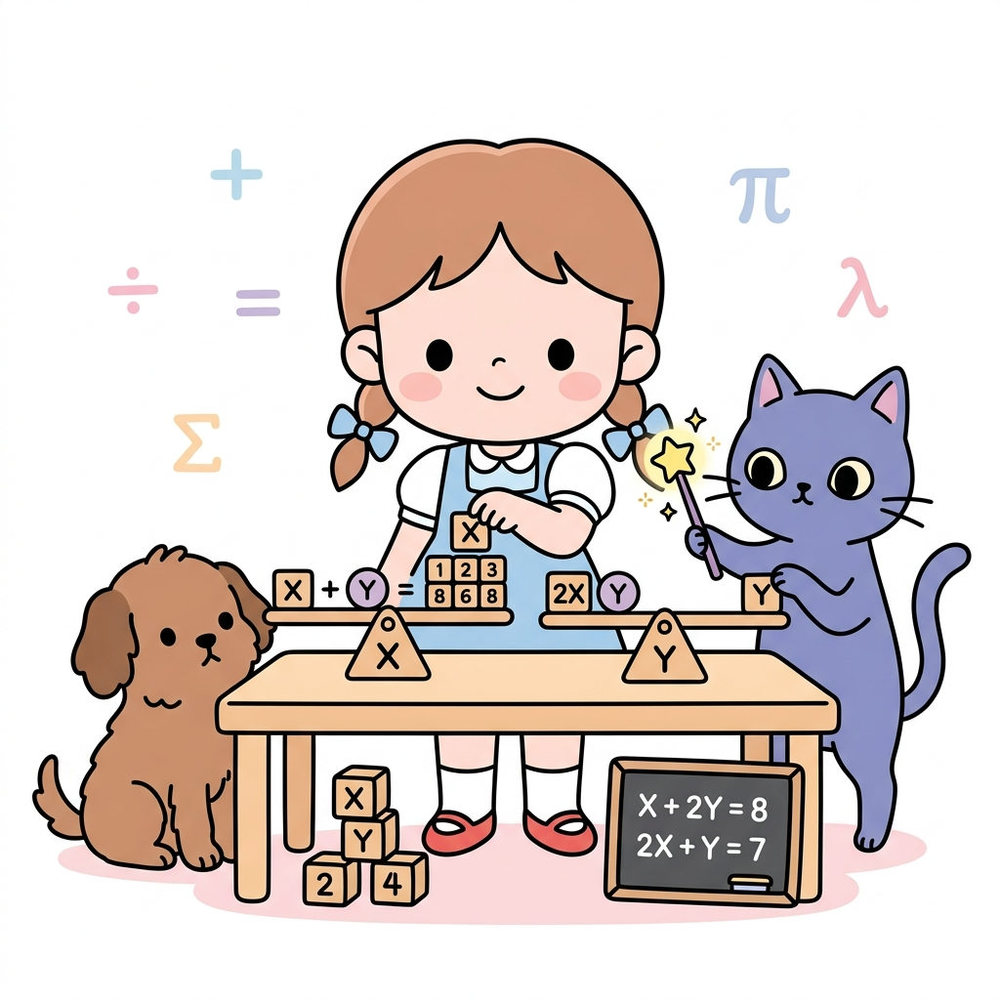

벨만 방정식 점화식을 기반으로 상태 가치 함수들을 구하기 위해 실제로 **연립방정식(Simultaneous Equations)**을 구축하고 해결하는 예제를 배웁니다. 도로시의 블록 저울 조율 마법과 지니의 대수학 칠판 계산법을 통해 벨만 방정식의 수치적 해법을 통쾌하게 정복해봅시다!

---

벨만 방정식은 강화 학습 문제를 풀기 위한 중요한 기초를 제공합니다. 벨만 방정식을 이용하면 상태 가치 함수를 구할 수 있죠. 

이번 절에서는 그 '위력'을 보여주기 위해 벨만 방정식을 이용해 실제로 문제를 풀어보겠습니다.

### 06.3.1 두 칸짜리 그리드 월드

여기서 다룰 문제는 [그림 06-7]의 '두 칸짜리 그리드 월드'입니다. 

그림 06-7 두 칸짜리 그리드 월드(벽에 부딪히면 -1, 사과를 얻으면 +1, 사과는 계속 생성)

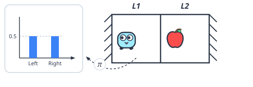

이번에는 에이전트가 무작위로 움직인다고 가정합니다. 

즉 50%의 확률로는 오른쪽, 나머지 50%의 확률로 왼쪽으로 이동합니다.

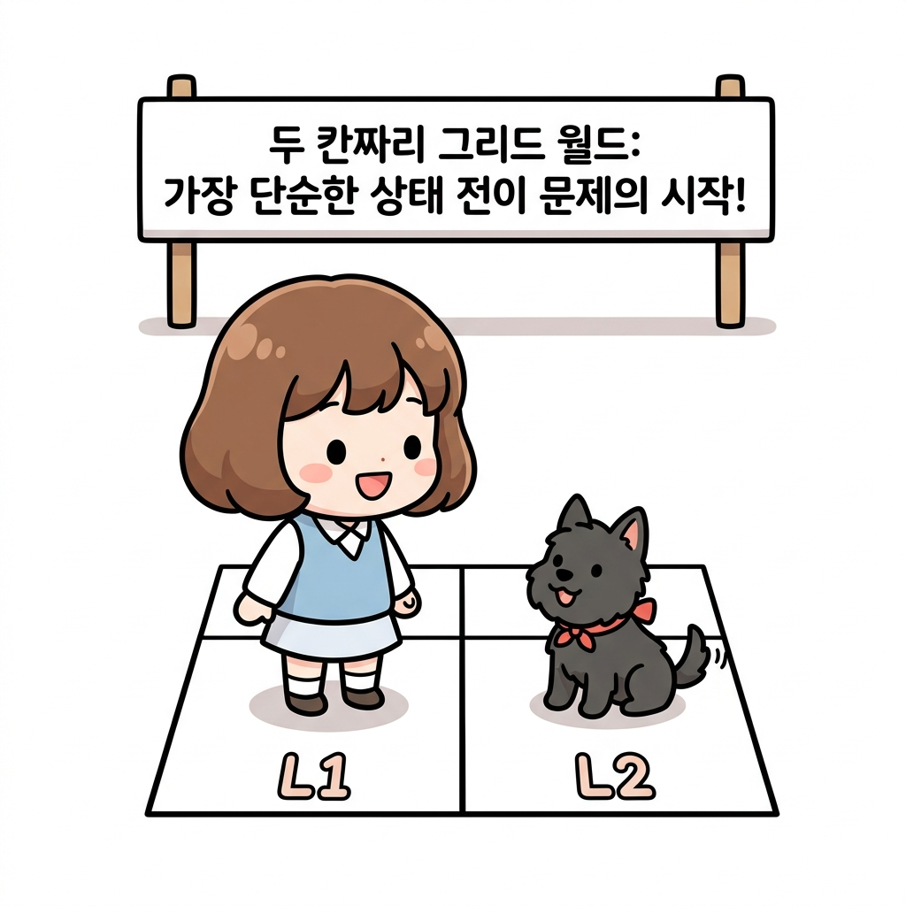

#### L1 기대수익

*v**π*(*L1*)은 상태 *L1*에서 무작위 정책 *π*에 따라 행동했을 때 얻을 수 있는 기대 수익입니다. 

이 기대 수익은 앞으로 **무한히** 지속되는 **보상의 총합**입니다. 

백업 다이어그램부터 살펴보죠.

그림 06-8 넓게 퍼져나가는 백업 다이어그램(이번 문제에서 상태는 결정적으로 전이됨)

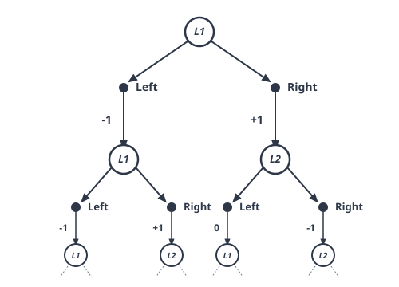

[그림 06-8]과 같이 지금 문제는 무한히 분기되어 뻗어나가는 계산입니다. 

#### 무한한 분기

이처럼 **무한히 분기**하는 계산을 벨만 방정식을 이용하여 구할 수 있습니다. 

그럼 벨만 방정식을 이용하여 *v**π*(*L1*)을 표현해봅시다.

 06.2.2절의 [식 06.7]에서 보았듯이 벨만 방정식은 다음과 같이 나타냅니다.

$$
\begin{aligned}
v_{\pi}(s) &= \sum_{a, s'} \pi(a \mid s) p(s' \mid s, a) \{ r(s, a, s') + \gamma v_{\pi}(s') \} \\
&= \sum_a \pi(a \mid s) \sum_{s'} p(s' \mid s, a) \{ r(s, a, s') + \gamma v_{\pi}(s') \}
\end{aligned}
$$

[식 06.7]

[식 06.7]의 첫 번째 식에서 두 번째 식으로 넘어가는 과정은, 모든 조합에 대한 총합 기호인 *Σ**a*, *s'*를 행동에 대한 합 *Σ**a*와 다음 상태에 대한 합 *Σ**s'*로 분리해 적은 것입니다. 이는 행동과 상태의 결합 기댓값을 단계적으로 계산하기 위한 준비 단계입니다.

또한, 이번 그리드 월드 예제처럼 **상태 전이가 결정적(deterministic)**일 때는 수식이 아주 큰 폭으로 간소화됩니다. 결정적 전이란 상태 *s*에서 행동 *a*를 취했을 때 도달할 다음 상태가 확률적으로 나뉘지 않고, 오직 하나의 상태 *s'* = *f*(*s*, *a*)로 100% 확실하게 정해지는 상황을 뜻합니다. 

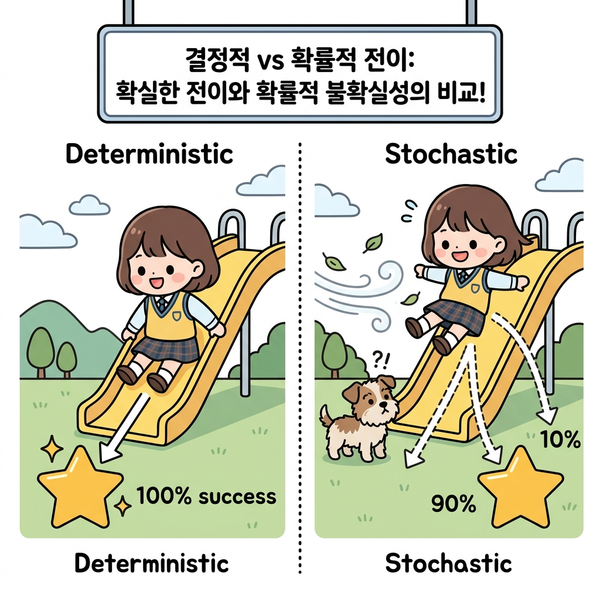

이러한 관계를 상태 전이 확률 *p*(*s'* | *s*, *a*) 대신 **상태 전이 함수 *f*(*s*, *a*)**를 사용하여 대입하면 다음과 같습니다.

이를 [식 06.7]에 대입하면 다음과 같습니다.

*   *s'* = *f*(*s*, *a*)인 표적 상태로 갈 확률: *p*(*s'* | *s*, *a*) = 1
*   그 외의 다른 모든 상태로 갈 확률: *p*(*s'* | *s*, *a*) = 0

따라서 [식 06.7]의 상태 합(*Σ**s'*) 부분에서는 확률이 0인 항들이 모두 사라지고, 오직 *s'* = *f*(*s*, *a*)인 항 하나만 살아남아 합산 기호(*Σ**s'*) 자체가 완전히 사라지게 됩니다. 


결과적으로 식을 다음과 같이 간소화할 수 있습니다.

*s'* = *f*(*s*, *a*) 일 때,

$$
v_{\pi}(s) = \sum_a \pi(a \mid s) \{ r(s, a, s') + \gamma v_{\pi}(s') \}
$$

[식 06.8]

이제 [식 06.8]에 이번 문제를 대입해보죠. 

[그림 06-9]의 백업 다이어그램을 참고하면서 진행하겠습니다.

[그림 06-9] *v**π*(*L1*)을 구하기 위한 백업 다이어그램

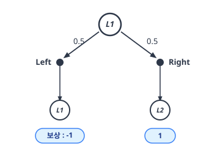

[그림 06-9]를 보면 백업 다이어그램이 두 갈래로 나뉘어 있습니다. 

#### L1의 Left 이동

하나는 0.5의 확률로 행동 Left를 선택하고 **상태는 전이되지 않습니다**. 

보상은 -1입니다. 

이때 할인율 *γ*를 0.9로 설정하면 [식 06.8]에서 Left를 선택하는 경우는 다음과 같습니다.
$$
0.5 \{ -1 + 0.9 v_{\pi}(L1) \}
$$

#### L1의 Right 이동

[그림 06-9]에서 또 다른 가능성은 0.5의 확률로 행동 Right를 선택하여, **상태 *L2*로 전이**하고 보상 1을 얻는 경우입니다. 

이로부터 다음 식을 얻을 수 있습니다.
$$
0.5 \{ 1 + 0.9 v_{\pi}(L2) \}
$$

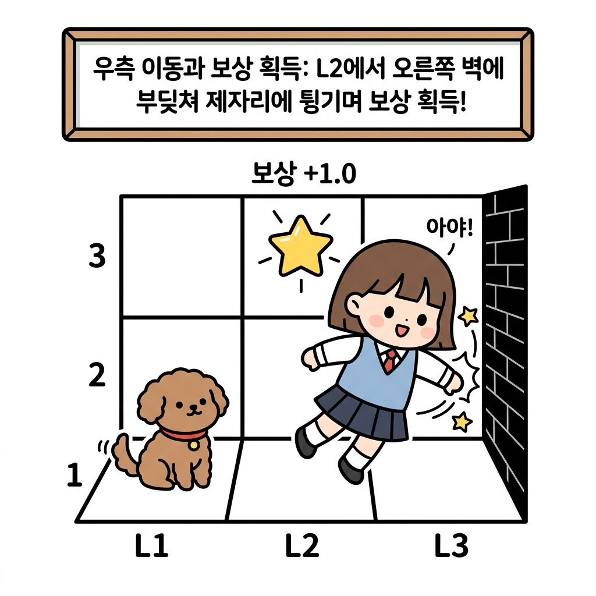

#### *L1*에서의 벨만 방정식

지금까지의 내용을 벨만 방정식으로 나타내면 다음과 같습니다.
$$
v_{\pi}(L1) = 0.5 \{ -1 + 0.9 v_{\pi}(L1) \} + 0.5 \{ 1 + 0.9 v_{\pi}(L2) \}
$$

이 식이 상태 *L1*에서의 벨만 방정식입니다. 

다음과 같이 정리할 수도 있습니다.
$$
-0.55 v_{\pi}(L1) + 0.45 v_{\pi}(L2) = 0
$$

[식 06.9]

#### *L2*에서의 벨만 방정식

이제 상태 *L2*에서의 벨만 방정식을 구해보겠습니다. 

조금 전과 마찬가지로 참고용 백업 다이어그램을 준비했습니다.

그림 06-10 *v**π*(*L2*)를 구하기 위한 백업 다이어그램

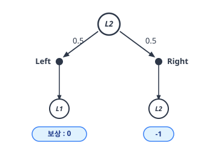

$$
v_{\pi}(L2) = 0.5 \{ 0 + 0.9 v_{\pi}(L1) \} + 0.5 \{ -1 + 0.9 v_{\pi}(L2) \}
$$

이식을 구성하는 두 행동의 흐름은 다음과 같습니다.

##### ① L2에서 왼쪽 행동 수식과 흐름
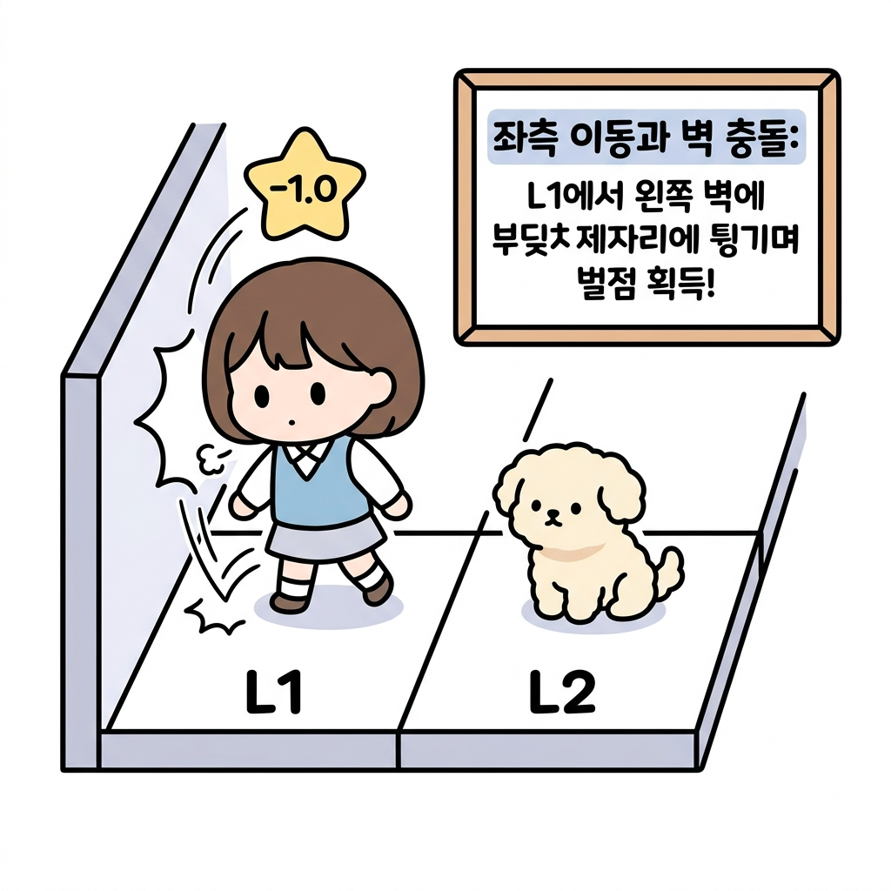

##### ② L2에서 오른쪽 행동 수식과 흐름

이 식을 정리하면 다음과 같습니다.

$$
0.45 v_{\pi}(L1) - 0.55 v_{\pi}(L2) = 0.5
$$

[식 06.10]

#### 벨만 방정식 계산

이렇게 하여 모든 상태에서의 벨만 방정식을 구했습니다. 

이제 알고 싶은 변수는 *v**π*(*L1*)과 *v**π*(*L2*)가 남았습니다. 

그리고 다음의 두 방정식을 얻었습니다([식 06.9]와 [식 06.10]).
$$
\begin{cases}
-0.55 v_{\pi}(L1) + 0.45 v_{\pi}(L2) = 0 \\
0.45 v_{\pi}(L1) - 0.55 v_{\pi}(L2) = 0.5
\end{cases}
$$

보다시피 연립방정식이며, 이번처럼 단순한 문제라면 직접 계산하여 풀 수 있을 것입니다.

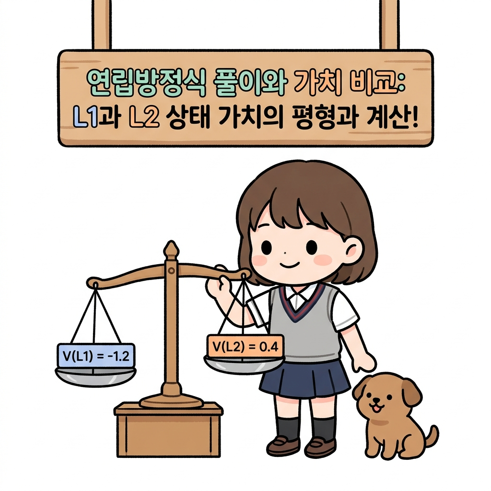

참고로 답은 다음과 같습니다.
$$
\begin{cases}
v_{\pi}(L1) = -2.25 \\
v_{\pi}(L2) = -2.75
\end{cases}
$$

이는 무작위 정책의 상태 가치 함수입니다. 

즉, 상태 *L1*에서 무작위로 행동하면 앞으로 -2.25의 수익을 기대할 수 있다는 뜻입니다. 무작위로 행동하다 보면 벽에 부딪힐 수도 있으니 미래의 보상이 마이너스가 될 수도 있다는 건 충분히 이해할 것입니다. 

또한 *v**π*(*L1*)의 값이 *v**π*(*L2*)보다 큰 이유도 *L1* 옆에 사과가 있고 첫 번째 행동에서 그 사과를 얻을 확률이 50%이기 때문에 역시 이해할 수 있습니다.

----

### 06.3.2 벨만 방정식의 의의

지금까지 살펴본 바와 같이 벨만 방정식을 통해 무한히 계속되는 계산을 유한한 연립방정식으로 변환할 수 있었습니다. 

이번처럼 행동이 무작위로 이루어지더라도 벨만 방정식을 이용하면 상태 가치 함수를 구할 수 있습니다.

> NOTE_ 상태 가치 함수는 기대 수익이며 '무한히 이어지는' 보상의 합으로 정의됩니다. 하지만 [식 06.7]에서 보듯 벨만 방정식에는 '무한'이라는 개념이 없습니다. 벨만 방정식 덕분에 무한의 굴레에서 빠져나온 셈입니다.

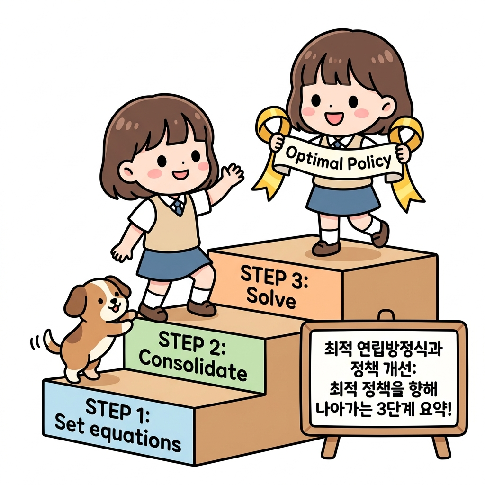

또한 이번 문제는 매우 단순했지만 복잡한 문제라도 벨만 방정식을 이용해 연립방정식으로 표현할 수 있습니다. 그리고 연립방정식을 푸는 알고리즘을 이용하면 자동으로 상태 가치 함수를 구할 수 있습니다.
