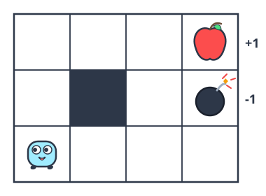
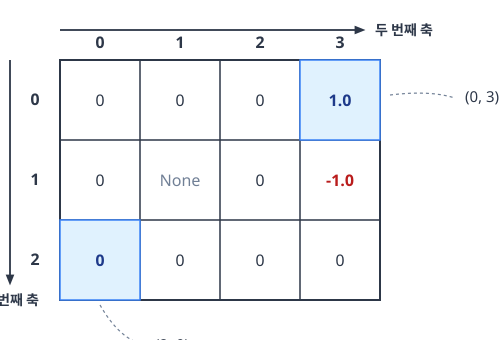
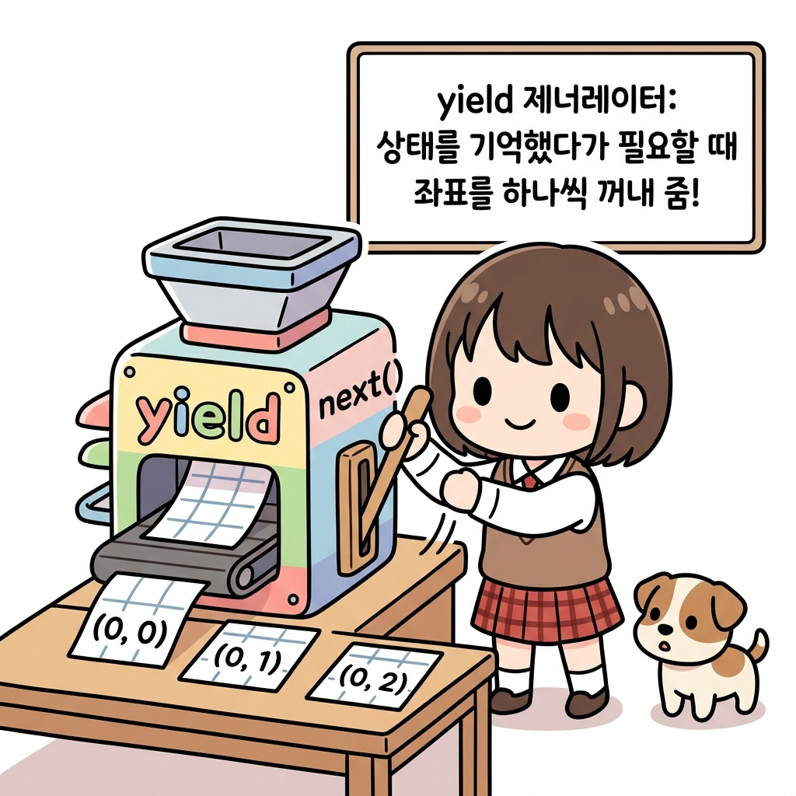
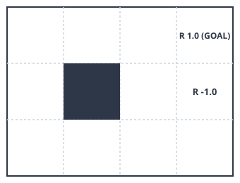
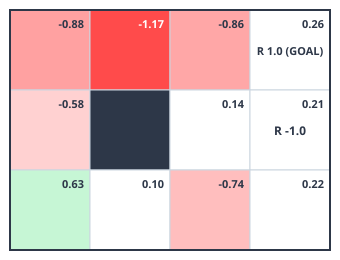
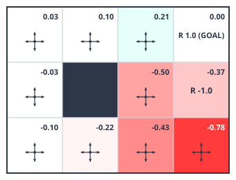
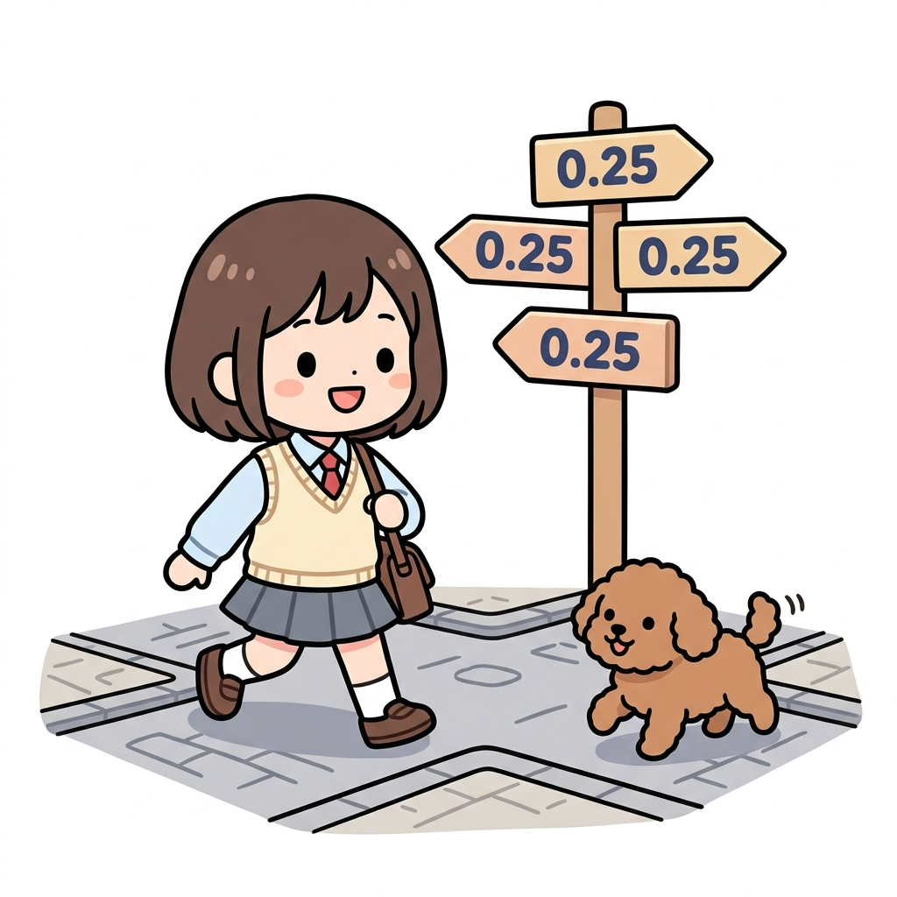
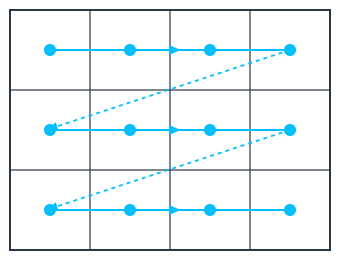

# 07.3 더 큰 문제를 향해

**그림 07-7-1** 좁은 2칸의 방을 벗어나 3x4 격자 숲속으로 모험 영역을 확장하는 지니, 도로시, 토토


이제 도로시와 토토는 지니가 건네준 큰 지도와 함께, 기존의 좁디좁은 2칸짜리 방을 떠나 3x4 격자의 더 넓은 **그리드 월드 숲속**으로 모험을 확장합니다. **반복적 정책 평가 알고리즘**이라는 새로운 마법을 가방에 넣고 가벼운 발걸음으로 더 복잡한 세계를 정복하러 출발해볼까요?

---

**반복적 정책 평가 알고리즘**을 이용하면 **상태**와 **행동** 패턴의 수가 어느 정도 **많아져도** 빠르게 풀 수 있습니다. 


# 07.3.1 좀더 큰 과제

이전에는 두 칸짜리 그리드 월드로 문제를 살펴 보았습니다. 이번에는 좀 더 큰 문제로 반복정책 알고리즘을 알아보고자 합니다.


# 07.3.1.1 3x4 그리드 월드

이번에 준비한 문제는 '3 × 4 그리드 월드'입니다. 2칸 그리드 보다는 복잡하지만, 여전히 아직까지는 간단한 문제입니다.

[그림 07-8] 3 × 4 그리드 월드




# 07.3.1.2 '3 × 4 그리드 월드'의 문제 설정은 다음과 같습니다.

• 에이전트는 **상/하/좌/우** 네 방향으로 이동할 수 있다.
• [그림 07-8]에서 회색 칸은 벽을 뜻하며 벽 안으로는 들어갈 수 없다.
• 그리드 바깥도 벽으로 둘러싸여 더 이상 나아갈 수 없다.
• 벽에 부딪히면 **보상은 0**이다.
• **사과는 보상 +1**, **폭탄은 보상 -1**, 그 외의 보상은 0이다.
• 환경의 상태 전이는 고유하다(**결정적**). 즉, 에이전트가 오른쪽으로 이동하는 행동을 선택하면 (벽만 없다면) 반드시 오른쪽으로 이동한다.
• 이번 문제는 **일회성 과제**로서, 사과를 얻으면 **종료**한다.


---


# 07.3.2 GridWorld 클래스 구현

'3 × 4 그리드 월드'를 파이썬 코드를 이용하여 풀어 보도록 하겠습니다. 먼저,  `GridWorld` 클래스로 구현해 봅니다.


> NOTE_ 그리드 월드는 앞으로 자주 등장하므로 코드 입니다. `common` 폴더에 생성합니다.


#### step1. 초기화 코드

파이썬 클래스를 한번에 만드는 것보다, 단계별로 코드를 작성하도록 합니다. 우선 클래스의 초기화 부분의 코드만 작성합니다.

<div align="right"><b>common/gridworld.py</b></div>

```python
import numpy as np

class GridWorld:
    def __init__(self):
        self.action_space = [0, 1, 2, 3] # 행동 공간(가능한 행동들)
        self.action_meaning = { # 행동의 의미
            0: 'UP',
            1: 'DOWN',
            2: 'LEFT',
            3: 'RIGHT',
        }

        self.reward_map = np.array(  # 보상 맵(각 좌표의 보상값)
            [[0, 0, 0, 1.0],
             [0, None, 0, -1.0],
             [0, 0, 0, 0]]
        )
        self.goal_state = (0, 3)     # 목표 상태(좌표)
        self.wall_state = (1, 1)     # 벽 상태(좌표)
        self.start_state = (2, 0)    # 시작 상태(좌표)
        self.agent_state = self.start_state  # 에이전트 초기 상태(좌표)
```

파이썬 클래스에서 초기화 코드는 `__init__`메소드 안에 작성합니다. `GridWorld` 클래스를 살펴보면 여러 인스턴스 변수를 사용한 흔적을 볼 수 있습니다. 


#### step2 코드설명

먼저 코드 첫줄에 있는 `self.action_space` 변수는 행동 공간 변수로 할당하였습니다. 

즉 '가능한 행동들'을 나타냅니다.

 

이 코드에서 행동은 `[0, 1, 2, 3]`이라는 네 가지 숫자로 표현되며 각 숫자의 의미는 `self.action_meaning`에 정의되어 있습니다.


> [!NOTE]
> **왜 행동을 숫자로 정의하고 다시 의미를 부여하는 단계를 거칠까요?**
> - **컴퓨터와 인공지능의 계산 효율성**: 신경망이나 가치 표 연산(수학적 연산)을 수행할 때는 문자열('UP', 'DOWN')보다 정수 인덱스(`0`, `1`, `2`, `3`)를 사용하는 것이 행렬 인덱싱 및 계산 속도 면에서 압도적으로 효율적입니다.
> - **개발자(사람)의 가독성**: 반면 코드를 디버깅하거나 렌더링 시각화를 진행할 때는 단순 정수보다 텍스트 이름이 훨씬 직관적입니다. 
> 
> 따라서 **컴퓨터의 고속 연산(정수 인덱스)**과 **사람의 코드 이해도(의미 테이블)**를 모두 만족시키기 위해 이와 같은 2단계 매핑 구조를 사용합니다.


예를 들어 0은 위(UP), 1은 아래(DOWN)로 이동을 뜻합니다.


#### step3 보상맵

`self.reward_map`은 보상 맵입니다. 보상 맵은 각 좌표로 이동했을 때 얻는 보상의 크기를 담고 있습니다. 


앞에서 선언한 3 × 4 그리드 월드를 2차원 배열로 선언을 한것입니다.

보상 맵은 넘파이의 2차원 배열(`np.ndarray`)로 만들었으므로 좌표계는 [그림 07-9]와 같습니다.

그림 07-9 보상 맵의 좌표계




#### step4 일회성 과제

07.2.1.3 에서 그리드에 대한 문제를 정의할때 언급했듯이 이 문제는 일회성 과제로 제한 하였습니다. 이는 에이전트가 목표 상태에 도달하면 문제가 끝이 난다는 뜻입니다. 

이렇게 문제를 일회성 과제(Episodic Task)로 제한한 이유는 다음과 같습니다.

> [!NOTE]
> **왜 문제를 '일회성 과제'로 제한하여 설계할까요?**
> 1. **수학적 가치 수렴의 보장**: 에이전트가 목표 지점(사과/폭탄)에 도착하면 모든 모험이 끝나고 추가 보상이 발생하지 않으므로, 미래 보상의 누적 합계가 무한대로 발산하지 않고 명확하게 하나의 값으로 수렴합니다.
> 2. **알고리즘 경계 조건의 단순화**: 목표 지점에 도달한 순간의 상태 가치 함수는 무조건 0으로 고정(`V[goal_state] = 0`)되므로, 정책 평가 알고리즘을 구현할 때 가치를 갱신해 줄 명확한 기준점(경계 조건) 역할을 합니다.
> 3. **학습 루프의 종결성**: 에피소드가 유한한 단계 안에서 끝나기 때문에 컴퓨터 시뮬레이션을 통해 경험을 수집하고 학습을 진행하는 과정이 단순하고 안정적입니다.


#### step5 목표

3x4 그리드에서 도착해야 하는 위치의 목표 상태는 (0, 3)입니다. 코드에서 `self.goal_state = (0, 3)` 으로 설정을 했습니다. 


또한 중심에 있는 벽은 `self.wall_state = (1, 1)`, 에이전트의 초기 위치는 `self.agent_state = (2, 0)`으로 설정을 하고 시작합니다.


# 07.3.2.1 메소드 추가

클래스의 초기화 설정을 하였다면, 이번에는 실제 메소드 들을 추가해 보도록 합니다.

다음과 같이 계속 이어서  `GridWorld` 클래스의 메서드들을 작성해 보겠습니다.

<div align="right"><b>common/gridworld.py</b></div>

```python
class GridWorld:
    ...

    @property
    def height(self):
        return len(self.reward_map)

    @property
    def width(self):
        return len(self.reward_map[0])

    @property
    def shape(self):
        return self.reward_map.shape

    def actions(self):
        return self.action_space # [0, 1, 2, 3]

    def states(self):
        for h in range(self.height):
            for w in range(self.width):
                yield (h, w)
```

 `GridWorld` 클래스에 유용한 인스턴스 변수를 몇 가지 구현했습니다. 


#### step6 데코레이터

코드를 살펴보면 `@property` 데코레이터를 사용한 것을 볼 수 있습니다.


 `@property` 데코레이터를 메서드 이름의 윗줄에 배치하면 해당 메서드를 인스턴스 변수로 사용할 수 있습니다. 


데코레이터를 선언한 메소드를 다음과 같이 사용해 볼 수 있는 예시 입니다. 메소드 호출이 아닌 변수처럼 호출하여 그리드 월드의 크기와 형상을 알아낼 수 있게 출력 합니다.


```python
env = GridWorld()

# env.height() 대신 env.height로 사용 가능
print(env.height) # [출력 결과] 3
print(env.width)  # [출력 결과] 4
print(env.shape)  # [출력 결과] (3, 4)
```


`env.height`와 `env.width`는 2차원 배열 보상 맵(`self.reward_map`)의 0번 축과 1번 축 크기를 계산하여 각각 그리드 월드의 세로 높이(3)와 가로 너비(4)를 반환합니다.


 `env.shape`는 두 값을 모아 튜플 형태 `(3, 4)`로 한 번에 제공합니다. 

데코레이터 덕분에 소괄호 `()` 호출 없이 변수 조회를 하는 기분으로 직관적인 코딩이 가능합니다.


#### step7 actions() , states()

코드에서 `actions()`와 `states()`라는 메서드도 작성을 했습니다. 

이 메서드의 역할은  모든 행동과 모든 상태에 순차적으로 접근할 수 있도록 합니다.

 

다음 코드처럼 사용하면 됩니다.

```python
for action in env.actions():  # 모든 행동에 순차적으로 접근
    print(action)

print('===')

for state in env.states():  # 모든 상태에 순차적으로 접근
    print(state)
```

**출력 결과**

```text
0
1
2
3
===
(0, 0)
(0, 1)
...
(2, 3)
```

이와 같이 `for`문을 사용하여 모든 행동과 모든 상태에 간편하게 접근할 수 있습니다.


> NOTE_ `states()` 메서드에서는 `yield`를 사용했습니다. 
>
> `yield`는 `return`과 마찬가지로 함수의 값을 반환하지만, 함수의 실행을 잠시 멈추고 다른 일을 처리할 기회를 준다는 점에서 차이가 있습니다. 다른 일이 끝나면 멈췄던 부분부터 함수 처리를 다시 시작합니다. 
>
> 이 기능 덕분에 앞의 코드처럼 `for`문과 같은 반복 처리와 함께 사용할 수 있습니다.
>
> 


#### step8 next_state()

다음으로 환경의 상태 전이를 나타내는 메서드인 `next_state()`를 구현합니다.


```python
class GridWorld:
    ...

    def next_state(self, state, action):
        # ❶ 이동 위치 계산
        action_move_map = [(-1, 0), (1, 0), (0, -1), (0, 1)]
        move = action_move_map[action]
        next_state = (state[0] + move[0], state[1] + move[1])
        ny, nx = next_state

        # ❷ 이동한 위치가 그리드 월드의 테두리 밖이나 벽인가?
        if nx < 0 or nx >= self.width or ny < 0 or ny >= self.height:
            next_state = state
        elif next_state == self.wall_state:
            next_state = state

        return next_state # ❸ 다음 상태 반환
```

❶에서는 벽이나 그리드 월드의 테두리는 무시하고 이동 위치(다음 상태)를 계산합니다.

> [!NOTE]
> **action_move_map의 구성과 좌표 연산 동작 원리**
> - **인덱스 매핑**: 리스트 내 원소의 순서는 우리가 앞서 정의한 행동 공간 `[0, 1, 2, 3]` 즉 `[위(UP), 아래(DOWN), 왼쪽(LEFT), 오른쪽(RIGHT)]` 순서와 1대1 매칭됩니다.
>   - `0: (-1, 0)` → 위(UP)로 1칸 이동 (y좌표를 1 감소)
>   - `1: (1, 0)` → 아래(DOWN)로 1칸 이동 (y좌표를 1 증가)
>   - `2: (0, -1)` → 왼쪽(LEFT)으로 1칸 이동 (x좌표를 1 감소)
>   - `3: (0, 1)` → 오른쪽(RIGHT)으로 1칸 이동 (x좌표를 1 증가)
> - **좌표 변화 동작**: 현재 에이전트의 좌표 `state = (y, x)`에 해당 행동이 나타내는 변화량 `move = (dy, dx)`를 더하여 `next_state = (y + dy, x + dx)`라는 가상의 다음 상태를 도출합니다. 행렬 인덱스 좌표계(맨 위가 0행)를 사용하기 때문에 위로 가는 동작이 `-1`이 됨에 유의합시다.


그런 다음 ❷에서 테두리 밖이나 벽으로 이동하지 않았는지 확인하여, 이동이 불가능하다면 현재 위치를 유지합니다(`next_state = state`). 

> [!NOTE]
> **테두리 경계 및 벽 충돌 예외 처리의 동작 원리**
> - **격자 테두리 이탈 방지 (`nx < 0 or nx >= self.width or ny < 0 or ny >= self.height`)**: 
>   - 계산된 임시 좌표가 가로(0~3) 및 세로(0~2) 격자 밖으로 나가면 테두리를 뚫고 나간 비정상 행동으로 간주하여 `next_state = state`로 원복시킵니다.
> - **장애물 충돌 감지 (`next_state == self.wall_state`)**:
>   - 이동 경로에 벽(회색 칸, `(1, 1)`)이 있다면, 벽 안으로 들어가지 못하게 막아 에이전트의 상태를 직전 상태인 `state`로 복귀시킵니다.
> - **물리적 비유**: 에이전트가 격자 벽면에 머리를 쿵 부딪히거나 외곽 낭떠러지를 만나 앞으로 더 나아가지 못하고 그 자리에 멈춰 서 있는 모습을 구현한 안전망 로직입니다.


또한 지금 문제에서는 상태 전이가 결정적이기 때문에 ❸에서 다음 상태를 반환합니다.

> [!NOTE]
> **결정적 상태 전이(Deterministic Transition)와 단일 반환의 의미**
> - **결정적 제약 조건의 이점**: 07.2.1.2의 설정 규칙에서 **"에이전트가 선택한 행동의 결과는 고유하다"**라고 환경을 제한했습니다. 예를 들어 '오른쪽'을 고르면 에이전트는 미끄러짐 없이 반드시 오른쪽 좌표로만 정직하게 이동합니다.
> - **코드 동작과의 연동**: 일반적인 확률적(Stochastic) 강화학습에서는 다음 상태 후보들의 확률 분포(`next_states_probs`)를 딕셔너리로 조밀하게 계산해야 합니다. 하지만 여기서는 결과가 100% 확실하므로 단 하나의 정해진 다음 상태 좌표(`next_state`)만을 곧바로 단일 `return`하여 코드가 파격적으로 단순해집니다.


위 그림처럼 에이전트가 맵 바깥이나 막혀 있는 회색 벽 칸(1, 1)으로 진입하려고 하면 쿵 부딪혀 제자리(`next_state = state`)에 멈춰 서게 됩니다.


#### Step9 reward()

이번에는 보상 함수 메서드인 `reward()`를 구현해봅시다.


```python
class GridWorld:
    ...

    def reward(self, state, action, next_state):
        return self.reward_map[next_state]
```


보상 함수 메서드인 `reward(self, state, action, next_state)`는 수식 *r*(*s*, *a*, *s'*)의 인수에 대응하는 매개변수들을 받습니다. 


하지만 이번 문제에서는 '다음 상태'만으로 보상값을 결정합니다.

> [!NOTE]
> **reward() 메서드의 설계 원리와 좌표 기반 인덱싱**
>
> - **인수와 수식의 일치성**: 메서드의 시그니처 `reward(self, state, action, next_state)`는 강화학습의 수학적 정의인 보상 함수 *r*(*s*, *a*, *s'*)를 정직하게 반영하여 현재 상태(*s*), 행동(*a*), 다음 상태(*s'*)를 모두 전달받도록 선언했습니다.
> - **상태 기반 보상 결정**: 하지만 본 3x4 격자 공간에서는 행동(*a*)의 종류나 시작 상태(*s*)와 무관하게, 에이전트가 최종 도착한 **다음 상태(*s'*)**에 사과(+1)가 있거나 폭탄(-1)이 있는지 여부만으로 보상이 결정됩니다.
> - **배열 매핑 동작**: 따라서 내부 구현에서는 복잡한 분기 조건문 대신, 미리 설정해 둔 2차원 Numpy 배열 보상 지도 `self.reward_map`에 다음 상태의 튜플 좌표(`next_state`)를 인덱스로 삼아 즉각 보상 크기를 딕셔너리처럼 빠르게 조회하여 리턴합니다.


#### step10 시각화 메서드

이외에도 `GridWorld` 클래스에는 시각화용 메서드인 `render_v(self, v=None, policy=None)`도 있습니다. 시각화는 지금 주제가 아니므로 책에서는 사용법만 보여드리겠습니다. 


다음과 같이 호출하면 [그림 07-10]과 같은 그리드 월드가 출력됩니다.

```python
env = GridWorld()
env.render_v()
```


그림 07-10 3×4 그리드 월드 시각화



벽은 회색으로 칠해져 있습니다. 각 칸의 왼쪽 아래에는 보상값이 적혀 있습니다. 다만 보상이 0이면 아무런 값도 출력하지 않습니다.


#### step11

이 `render_v()` 메서드는 **상태 가치 함수**를 **매개변수**로 받을 수 있습니다. 

시험 삼아 더미 상태 가치 함수를 주고 그려보겠습니다.

<div align="right"><b>ch07/gridworld_play.py</b></div>

```python
env = GridWorld()
V = {}
for state in env.states():
    V[state] = np.random.randn() # 더미 상태 가치 함수
env.render_v(V)
```


그림 07-11 3×4 그리드 월드 시각화(상태 가치 함수 입력)



이처럼 `render_v()` 메서드에 가치 함수를 건네면 각 위치의 가치 함수 값이 해당 칸 오른쪽 위에 표시됩니다. 

그리고 값의 크기에 따라 색을 달리 하여 그리드 월드를 히트맵 형태로 그려줍니다. 

값이 작을수록 붉은색이 짙어지고 클수록 녹색이 짙어집니다.


> NOTE_ `render_v()` 메서드는 정책도 받을 수 있습니다. 
>
> 정책을 건네면 각 위치에서 취할 가능성이 가장 큰 행동을 화살표### 07.2.5 무작위 정책 평가 결과

이제 지금까지 구현한 `GridWorld` 클래스와 `policy_eval()` 함수를 사용하여 정책 평가를 수행해봅시다.

<div align="right"><b>ch07/policy_eval.py</b></div>

```python
env = GridWorld()
gamma = 0.9 # 할인율

pi = defaultdict(lambda: {0: 0.25, 1: 0.25, 2: 0.25, 3: 0.25}) # 정책
V = defaultdict(lambda: 0) # 가치 함수

V = policy_eval(pi, V, env, gamma) # 정책 평가
env.render_v(V, pi) # 시각화
```

무작위 정책을 `pi`, 가치 함수를 `V`로 초기화했습니다. 그리고 무작위 정책을 평가하여 가치 함수를 구합니다. 이 코드를 실행하면 다음 그림을 얻을 수 있습니다.

**그림 07-13** 무작위 정책의 가치 함수



[그림 07-13]은 무작위 정책의 가치 함수를 보여줍니다. 예를 들어 시작점인 왼쪽 맨 아래 칸의 가치 함수는 -0.10입니다. 시작점에서 무작위로 움직이면 기대 수익이 -0.10이라는 뜻입니다. 에이전트가 무작위로 움직이기 때문에 폭탄을 (의도치 않게) 얻을 수도 있습니다. 값이 -0.10인 걸 보니 사과(+1)보다 폭탄(-1)을 얻을 확률이 조금 더 큽니다. 또한 맨 아래 줄과 가운데 줄은 모두 마이너스인데, 이 위치들에서는 폭탄의 영향이 더 크다는 뜻입니다.

앞의 코드를 실행하면 결과가 순식간에 나옵니다. DP를 적용하여 정책 평가의 실행 효율을 높였기 때문입니다. 그 덕분에 그리드 월드의 크기가 (어느 정도) 커져도 괜찮습니다. 하지만 아직까지는 정책 평가만을 수행했을 뿐입니다. 다음 절에서는 최적 정책을 찾는 방법을 알아보겠습니다.

> [!NOTE]
> **policy_eval()의 핵심 수렴 루프 메커니즘**
> - **갱신 반복 (`while True`)**: 가치 함수의 상태 값이 수렴하여 변화가 거의 없어질 때까지 `eval_onestep`을 반복 가동합니다.
> - **최대 변화량 추적 (`delta`)**: 갱신되기 직전 가치 표(`old_V`)와 갱신된 가치 표(`V`)의 각 상태별 절댓값 차이(`abs(V[state] - old_V[state])`)를 구한 뒤, 그중 가장 큰 변화 폭을 `delta`에 기록합니다.
> - **임계값 중단 검사 (`threshold`)**: `delta`가 우리가 설정한 아주 미세한 오차 범위 임계값(`threshold = 0.001`)보다 작아지면, 더 이상의 반복 계산이 무의미할 정도로 수렴했다고 판정하여 무한 루프를 탈출(`break`)하고 가치 함수 표를 최종 반환합니다.�� 구현했습니다. 딕셔너리는 `V[key]` 형태로 사용하는데, 딕셔너리 안에 key가 존재하지 않으면 오류가 납니다.

 따라서 앞의 코드처럼 우선 모든 원소를 초기화해야 합니다. 

> [!NOTE]
> **일반 딕셔너리의 한계(KeyError)**
>
> - **일반 딕셔너리의 문제점**: 빈 딕셔너리(`V = {}`)에 존재하지 않는 상태 좌표 키(`(1, 2)`)를 건네면 파이썬은 `KeyError`를 발생시키며 즉시 멈춥니다. 이를 막으려면 모든 상태 좌표를 미리 루프를 돌며 초기값 `0`으로 일일이 집어넣는 사전 등록 작업(`for state in env.states(): V[state] = 0`)을 거쳐야 해서 코드가 번잡해집니다.


#### step14 defaultdict의 마법

이 초기화의 번거로움을 덜어주는 것이 파이썬 표준 라이브러리의 `defaultdict`입니다. 

사용법은 다음과 코드를 변경해도 동일 합니다.

```python
from collections import defaultdict # defaultdict 임포트
from common.gridworld import GridWorld

env = GridWorld()
V = defaultdict(lambda: 0)

state = (1, 2)
print(V[state]) # [출력 결과] 0
```

이와 같이 `defaultdict(lambda: 0)`으로 생성한 `V`는 일반 딕셔너리처럼 사용할 수 있습니다. 

> [!NOTE]
> **defaultdict의 마법**
>
> - **defaultdict의 동작 원리**: `defaultdict(lambda: 0)`은 없는 키로 가치 조회를 하더라도 오류를 내뿜지 않습니다. 대신 지정된 람다 함수(`lambda: 0`)를 동적으로 구동하여 키에 기본값 `0`을 자동 부여해 즉시 딕셔너리에 새 원소로 보강 등록해 줍니다. 
> - **결과**: 이 덕분에 수많은 상태를 미리 돌며 가치 함수를 `0`으로 대량 초기화해 두는 귀찮은 준비 코드를 단 한 줄도 쓰지 않고 생략할 수 있게 됩니다.


만약 딕셔너리에 존재하지 않는 키를 건네면 (주어진 키, 기본값) 형태의 원소를 새로 만들어 넣습니다. 기본값은 딕셔너리를 생성할 때 설정한 값입니다. 


지금 예에서는 `V[state]` 코드가 실행되는 시점에는 state를 키로 하는 원소가 없습니다. 

그래도 오류를 내지 않고 값이 0인 원소를 자동으로 만들어줍니다.


> NOTE_ `defaultdict`의 기본값을 설정하는 방법은 여러 가지가 있지만 `lambda`를 사용하는 방식이 가장 간단합니다. 예를 들어 `defaultdict(lambda: 0)`이나 `defaultdict(lambda: "A")` 형태로 작성합니다.


#### step15

이제부터는 가치 함수 구현에 `defaultdict`를 사용하겠습니다. 정책 역시 `defaultdict`로 구현합니다.


그럼 무작위 정책을 `defaultdict`를 사용하여 구현해보겠습니다. '3 × 4 그리드 월드' 문제에서 에이전트가 취할 수 있는 행동은 네 개이며, 각 행동은 `[0, 1, 2, 3]`으로 표현됩니다. 이 네 개의 행동이 균일하게 무작위로 선택된다면 각 행동이 수행될 확률은 모두 0.25입니다. 행동의 확률 분포는 `{0: 0.25, 1: 0.25, 2: 0.25, 3: 0.25}`로 나타낼 수 있습니다.



> [!NOTE]
> **무작위 정책의 개념과 초기 이정표 비유**
> - **균등 확률 분포**: 에이전트가 격자 판 위의 어떤 상태에 있든 특정 행동(방향)을 편애하지 않고, 위/아래/왼쪽/오른쪽 네 방향으로 발걸음을 뗄 확률이 각각 4분의 1(0.25)로 완벽하게 동일합니다.
> - **이정표 비유**: 삽화 속 네 갈림길 사거리에 꽂힌 이정표마다 예외 없이 `0.25`라는 숫자가 동일하게 적혀 있어, 도로시와 토토가 고민 없이 무작위로 한 발을 디딜 준비를 하는 물리적 상황과 일치합니다.
> - **학습의 출발점**: 아직 맵의 어디에 과일이 있고 어디에 폭탄이 있는지 알지 못하는 탐험 초기 단계이므로, 이러한 공평한 무작위 탐색(Random Exploration) 정책을 첫 디딤돌로 삼아 가치를 갱신해 나가게 됩니다.


따라서 무작위 정책은 다음과처럼 구현할 수 있습니다.

````
pi = defaultdict(lambda: {0: 0.25, 1: 0.25, 2: 0.25, 3: 0.25})
````

```python
state = (0, 1)
print(pi[state]) # [출력 결과] {0: 0.25, 1: 0.25, 2: 0.25, 3: 0.25}
```

> [!NOTE]
> **정책 객체 `pi`의 데이터 타입과 실제 저장되는 값의 구조**
> 1. **`pi` 객체 자체의 데이터 타입**: 
>    - 파이썬 표준 라이브러리의 **`collections.defaultdict`** 클래스입니다.
> 2. **`pi[state]` 반환값의 데이터 타입**: 
>    - 표준 **딕셔너리(`dict`)** 타입입니다.
> 3. **`pi` 내부에 축적되는 데이터 구조**:
>    - **키 (Key)**: 상태를 나타내는 2차원 좌표 튜플 `(y, x)` (예: `(0, 1)`)
>    - **값 (Value)**: 각 행동 인덱스와 그 행동을 선택할 확률을 매핑한 사전 `{행동_인덱스: 선택_확률}` (예: `{0: 0.25, 1: 0.25, 2: 0.25, 3: 0.25}`)
> 
> 즉, `pi[state]`를 호출하여 값을 조회하는 순간, 해당 상태 좌표가 키로 등록되고 그 가치 분포 사전이 매핑되어 `pi` 객체의 내부 사전 메모리에 다음과 같은 구조로 자동 저장·누적됩니다.
> `{(0, 1): {0: 0.25, 1: 0.25, 2: 0.25, 3: 0.25}}`

무작위 정책을 `pi`로 구현했습니다.


 pi는 상태가 주어지면 해당 상태에서 취할 수 있는 행동의 확률 분포를 반환합니다. 지금 예에서는 상태 (0, 1)에서의 행동 확률 분포를 출력했고, 결과는 당연하게도 모든 행동이 똑같이 0.25 확률로 선택되는 분포입니다.


> [!NOTE]
> **defaultdict 무작위 정책의 동작 원리와 삽화 비유**
> - **정책 `pi`의 역할**: 정책은 현재 에이전트의 위치(상태 `s`)가 입력으로 주어지면, 그 자리에서 선택할 수 있는 각 행동들(`UP`, `DOWN`, `LEFT`, `RIGHT`)의 실행 확률 분포를 출력해 주는 지도 역할을 합니다.
> - **defaultdict 매핑 마법**: `pi` 항아리는 처음 방문하는 미지의 좌표 `(0, 1)` 카드를 건네받더라도 당황하지 않고, 우리가 미리 지정해 둔 람다 기본값 `{0: 0.25, 1: 0.25, 2: 0.25, 3: 0.25}`을 꺼내어 돌려줍니다.
> - **시각적 비유**: 삽화처럼 도로시가 `(0, 1)` 상태 푯말을 `pi` 마법 항아리에 집어넣자, 네 개의 행동 방향(상/하/좌/우)을 나풀거리며 날아오르는 나비들이 각각 균등한 0.25의 확률 딱지를 붙이고 나타나는 물리적 원리와 같습니다.


---


# 07.3.4 반복적 정책 평가 구현

이제 **반복적** 정책 평가 알고리즘을 구현하겠습니다. 


#### step16

우선 갱신을 한 단계만 수행하는 함수를 구현합시다. 


여기서 구현할 `eval_onestep()` 함수는 다음과 같이 네 개의 매개변수를 받습니다.

• `pi` (defaultdict): 정책
• `V` (defaultdict): 가치 함수
• `env` (GridWorld): 환경
• `gamma` (float): 할인율


코드를 보겠습니다.

<div align="right"><b>ch07/policy_eval.py</b></div>

```python
def eval_onestep(pi, V, env, gamma=0.9):
    for state in env.states(): # ❶ 각 상태에 접근
        if state == env.goal_state: # ❷ 목표 상태에서의 가치 함수는 항상 0
            V[state] = 0
            continue

        action_probs = pi[state] # probs는 probabilities(확률)의 약자
        new_V = 0

        # ❸ 각 행동에 접근
        for action, action_prob in action_probs.items():
            next_state = env.next_state(state, action)
            r = env.reward(state, action, next_state)
            # ❹ 새로운 가치 함수
            new_V += action_prob * (r + gamma * V[next_state])

        V[state] = new_V
    return V
```

`eval_onestep()` 함수는 `for`문을 **이중**으로 사용하고 있습니다. 


바깥 `for`문인 ❶에서는 모든 상태를 하나씩 추적합니다.  그림으로 표현하면 다음과 같습니다.

그림 07-12 각 상태에 순차적으로 접근하기



이와 같이 모든 상태에 순차적으로 접근합니다. 


그리고 ❷에서 상태 `state`가 목표 상태이면 가치 함수를 0으로 설정합니다. 


에이전트가 목표 지점에 도달하면 에피소드가 곧장 끝나고 그 다음 전개는 아무것도 없기 때문입니다. 따라서 목표 상태에서의 가치 함수 값은 항상 0입니다.


이 함수는 전체 12개 상태(바깥 `for`문)를 하나씩 방문하면서, 각 상태마다 가능한 4가지 방향의 행동(안쪽 `for`문)을 모두 짚어봅니다. 따라서 총 12 × 4 = 48가지의 경로 조합을 훑으며 가치를 갱신하게 됩니다.


#### step17 ❸번과 ❹번의 연산 해설

❸에서는 행동의 확률 분포를 가져옵니다. 


그리고 상태 전이 함수(`env.next_state(state, action)`)로 다음 상태(`next_state`)를 얻습니다. 다음은 이 정보들로 반복적 정책 평가 알고리즘의 갱신식인 [식 07-3]을 계산하면 됩니다. 


코드의 ❹를 [식 07-3]과 비교해보면 대응 관계가 명확하게 보입니다.
$$
\begin{aligned}
&s' = f(s, a) \text{ 일 때} \\
&V_{k+1}(s) = \sum_{a} \pi(a \mid s) \{ r(s, a, s') + \gamma V_k(s') \}
\end{aligned}
\tag{식 07-3}
$$

이상의 `eval_onestep()` 함수로 가치 함수가 한 차례 갱신됩니다. 


#### step18 policy_eval() 구현

이제부터는 이 갱신을 반복해야 합니다. 

반복을 처리하는 함수는 다음처럼 구현할 수 있습니다.


<div align="right"><b>ch07/policy_eval.py</b></div>

```python
def policy_eval(pi, V, env, gamma, threshold=0.001):
    while True:
        old_V = V.copy() # 갱신 전 가치 함수
        V = eval_onestep(pi, V, env, gamma)

        # 갱신된 양의 최댓값 계산
        delta = 0
        for state in V.keys():
            t = abs(V[state] - old_V[state])
            if delta < t:
                delta = t

        # 임계값과 비교
        if delta < threshold:
            break
    return V
```

매개변수 `threshold`는 갱신 시 임계값입니다. 


이 코드에서 알 수 있듯이 `eval_onestep()` 함수를 반복 호출하여 갱신된 양의 **최댓값이 임계값보다 작아지면 갱신을 중단**합니다.


이제 지금까지 구현한 `GridWorld` 클래스와 `policy_eval()` 함수를 사용하여 정책 평가를 수행해봅시다.

> [!NOTE]
> **policy_eval()의 핵심 수렴 루프 메커니즘**
> - **갱신 반복 (`while True`)**: 가치 함수의 상태 값이 수렴하여 변화가 거의 없어질 때까지 `eval_onestep`을 반복 가동합니다.
> - **최대 변화량 추적 (`delta`)**: 갱신되기 직전 가치 표(`old_V`)와 갱신된 가치 표(`V`)의 각 상태별 절댓값 차이(`abs(V[state] - old_V[state])`)를 구한 뒤, 그중 가장 큰 변화 폭을 `delta`에 기록합니다.
> - **임계값 중단 검사 (`threshold`)**: `delta`가 우리가 설정한 아주 미세한 오차 범위 임계값(`threshold = 0.001`)보다 작아지면, 더 이상의 반복 계산이 무의미할 정도로 수렴했다고 판정하여 무한 루프를 탈출(`break`)하고 가치 함수 표를 최종 반환합니다.

---


# 07.3.5 무작위 정책 평가 결과

이제 지금까지 구현한 `GridWorld` 클래스와 `policy_eval()` 함수를 사용하여 정책 평가를 수행해봅시다.

<div align="right"><b>ch04/policy_eval.py</b></div>

```python
env = GridWorld()
gamma = 0.9 # 할인율

pi = defaultdict(lambda: {0: 0.25, 1: 0.25, 2: 0.25, 3: 0.25}) # 정책
V = defaultdict(lambda: 0) # 가치 함수

V = policy_eval(pi, V, env, gamma) # 정책 평가
env.render_v(V, pi) # 시각화
```

무작위 정책을 `pi`, 가치 함수를 `V`로 초기화했습니다. 


그리고 무작위 정책을 평가하여 가치 함수를 구합니다. 이 코드를 실행하면 다음 그림을 얻을 수 있습니다.

**그림 07-13** 무작위 정책의 가치 함수


[그림 07-13]은 무작위 정책의 가치 함수를 보여줍니다. 


예를 들어 시작점인 왼쪽 맨 아래 칸의 가치 함수는 -0.10입니다. 시작점에서 무작위로 움직이면 기대 수익이 -0.10이라는 뜻입니다. 


에이전트가 무작위로 움직이기 때문에 폭탄을 (의도치 않게) 얻을 수도 있습니다. 값이 -0.10인 걸 보니 사과(+1)보다 폭탄(-1)을 얻을 확률이 조금 더 큽니다. 


또한 맨 아래 줄과 가운데 줄은 모두 마이너스인데, 이 위치들에서는 폭탄의 영향이 더 크다는 뜻입니다.


**그림 07-14** 무작위 정책에 따라 격자 세상을 헤매는 도로시와 토토


앞의 코드를 실행하면 결과가 순식간에 나옵니다. DP를 적용하여 정책 평가의 실행 효율을 높였기 때문입니다. 그 덕분에 그리드 월드의 크기가 (어느 정도) 커져도 괜찮습니다.


하지만 아직까지는 정책 평가만을 수행했을 뿐입니다. 

다음 절에서는 최적 정책을 찾는 방법을 알아보겠습니다.


