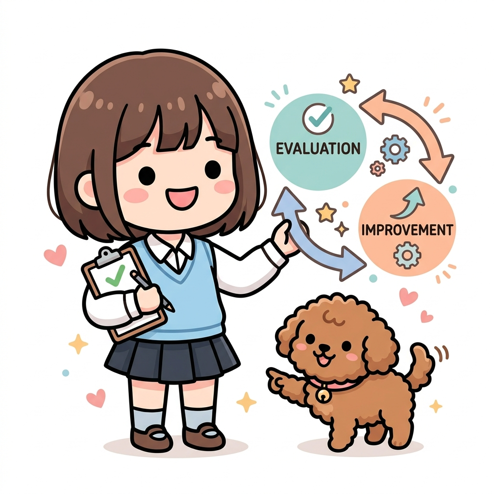
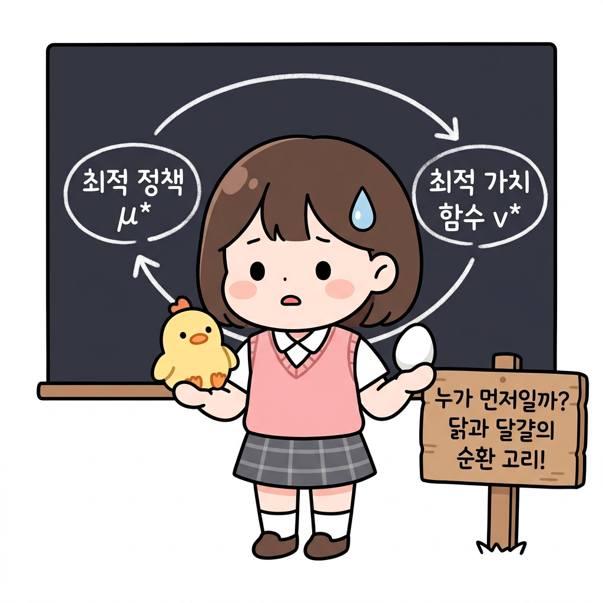
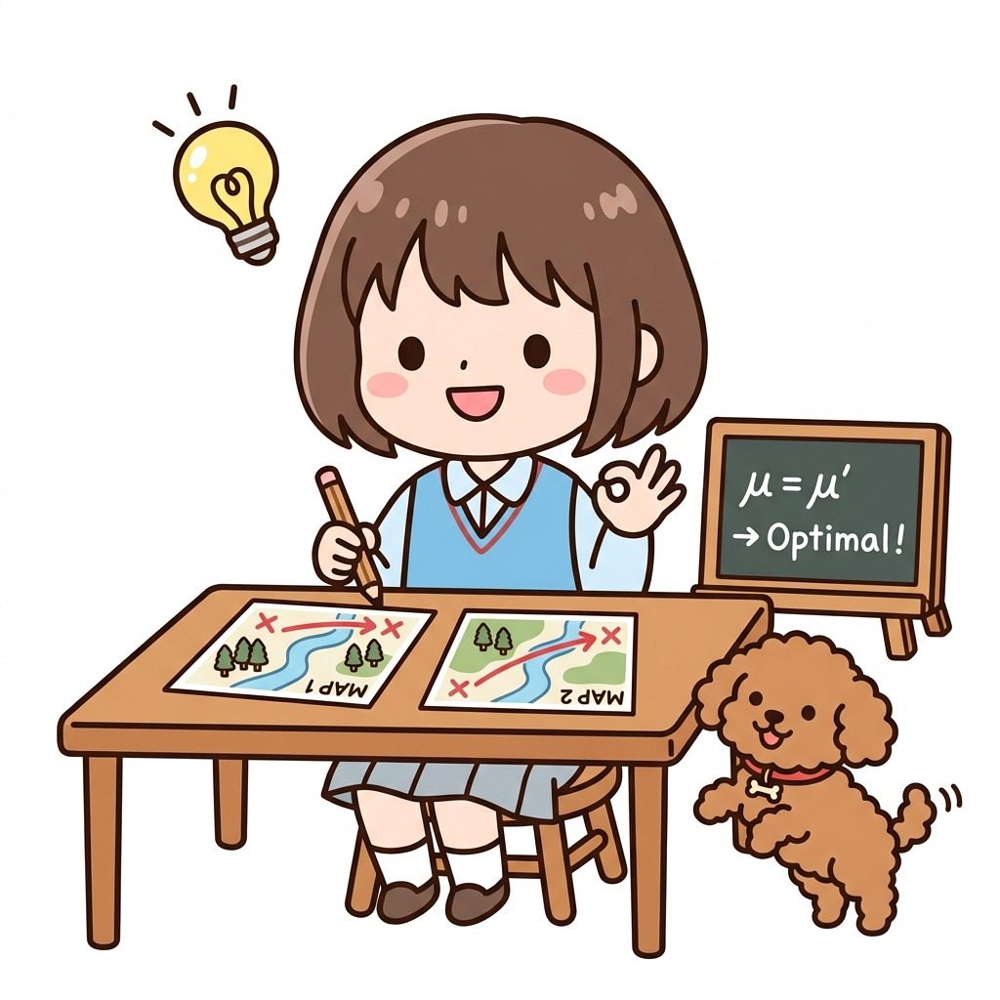
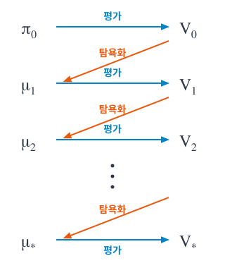
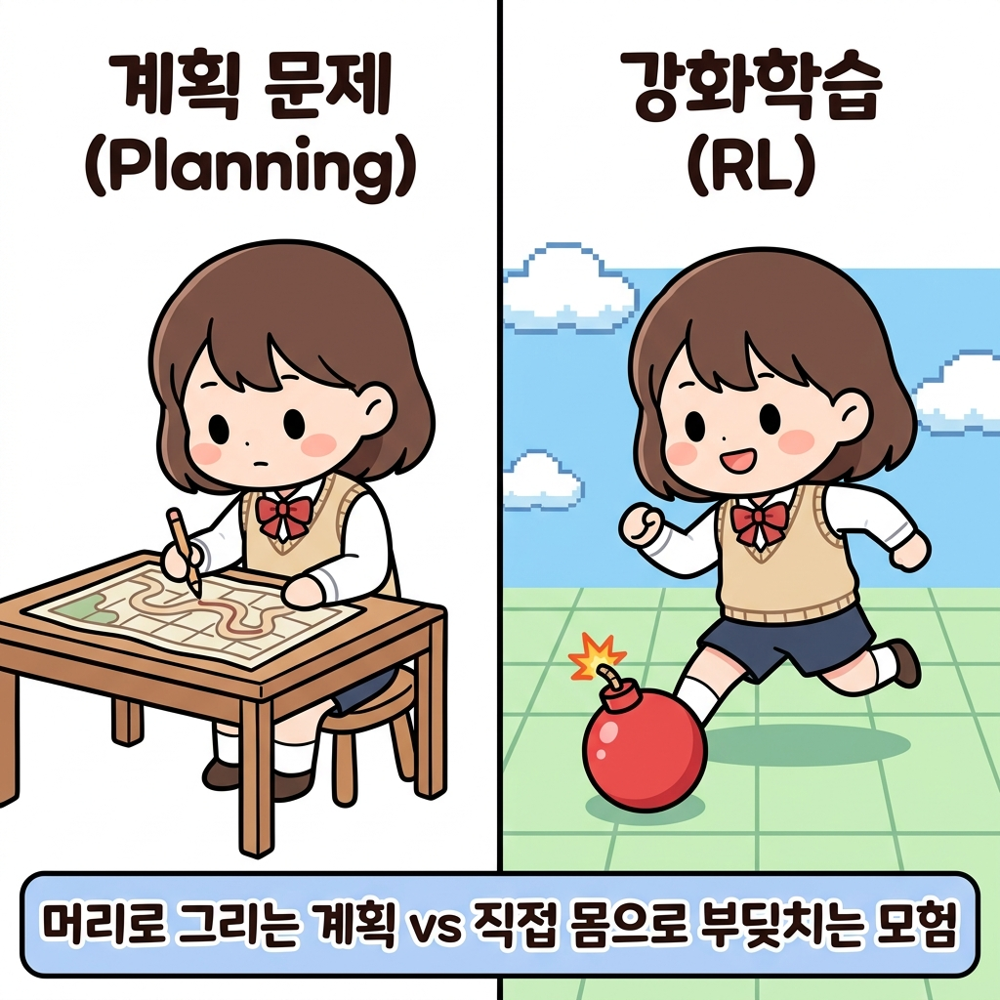

# 07.4 정책 반복법

언제나 최종 목표는 최적 정책 찾기입니다. 

**그림 07-14-0** 정책 평가(Evaluation)와 정책 개선(Improvement)의 핑퐁 탁구 랠리를 이어가는 지니와 도로시

정책 반복법(Policy Iteration)은 한 번에 정답 지도를 완벽하게 구하려 욕심내지 않습니다. 그 대신, 현재 엉성한 지도의 점수를 정직하게 매기는 **'정책 평가'**와, 매겨진 점수를 보고 조금 더 좋은 방향으로 지도를 고치는 **'정책 개선'**의 두 과정을 탁구공(핑퐁)처럼 끊임없이 주거니 받거니 반복하며 결국에는 완벽한 최적 정책 지도로 수렴해 나가는 전략입니다. 지니가 열어준 핑퐁 랠리처럼 두 과정이 어떻게 주거니 받거니 엮이는지 함께 살펴볼까요?

---

벨만 최적 방정식을 만족하는 **연립방정식**을 푸는 방법도 있었습니다. 하지만 계산량이 너무 많았죠. 

상태의 크기를 S, 행동의 크기를 A라고 한다면 ***A**S*만큼의 계산**이 필요합니다. 

그래서 문제가 조금만 복잡해져도 현실적으로는 해결할 수 없게 됩니다.

**그림 07-15** 상태수(S)와 행동수(A)에 따라 계산량이 폭발해 종이 더미에 묻힌 도로시

> NOTE_ 벨만 최적 방정식을 직접 계산하는 방식은 비현실적인 경우가 많습니다. 그래서 첫 번째 단계로 현재의 정책을 평가합니다. 현재의 정책을 제대로 평가할 수 있다면 이를 기초로 '개선'할 수 있기 때문입니다.

앞 절에서는 DP를 사용하여 정책을 평가했습니다. 

**'반복적 정책 평가'**라는 알고리즘이었죠. 우리는 드디어 정책을 '평가'할 수 있게 되었습니다. 평가를 할 수 있게 되었으니 정책을 살짝 수정하여 더 나아지는지 **'비교'**하며 **'개선'**할 수도 있습니다. 

이번 절에서는 정책을 개선하는 방법을 알아보겠습니다.

**그림 07-16** 정책 평가(Evaluation)와 정책 개선(Improvement)의 선순환 구조

---

#### 💡 헷갈림 방지! 도로시의 모험 비유로 보는 강화학습 용어 사전

강화학습의 수학 기호와 개념들이 헷갈릴 때마다 아래의 모험 비유를 떠올려 보세요!

| 수학 기호 | 강화학습 용어 | 도로시의 모험 비유 | 한 줄 핵심 꿀팁 |
| :---: | :--- | :--- | :--- |
| ***π***   (파이) | **확률적 정책**   (Stochastic Policy) | **"동서남북 확률이 적힌 엉성한 지도"**   (예: 동쪽으로 갈 확률 50%, 북쪽 50%) | 처음 시작할 때 쥐고 있는 엉뚱하고 무작위적인 첫 지도입니다. |
| ***μ***   (뮤) | **결정적 정책**   (Deterministic Policy) | **"한 방향만 콕 가리키는 명확한 지도"**   (예: 무조건 남쪽으로 가라!) | 망설이지 않고 오직 한 행동만 100% 선택하도록 업그레이드된 지도입니다. |
| ***v*(*s*)** 또는 ***V*** | **상태 가치 함수**   (State-Value Function) | **"각 땅에 묻힌 보물상자의 값어치"**   (현재 지도를 따라갔을 때 얻을 최종 기대 점수) | 특정 땅(상태 *s*)에 발을 디뎠을 때, 그 땅이 가진 잠재적 가치입니다. |
| ***q*(*s*, *a*)** 또는 ***Q*** | **행동 가치 함수**   (Action-Value Function) | **"그 방향으로 발을 뗐을 때 받는 성적표"**   (상태 *s*에서 행동 *a*를 취했을 때의 점수) | 가치 함수 *v*는 **땅의 점수**이고, *q*는 그 땅에서 **한 걸음 떼는 행동의 점수**입니다. |
| ***R*** | **보상** (Reward) | **"즉시 먹는 달콤한 사과"** | 행동을 하자마자 환경으로부터 얻는 즉각적인 피드백입니다. |
| ***γ***   (감마) | **할인율** (Discount Factor) | **"사과의 유통기한 (시간 할인)"** | 먼 미래에 얻을 보물상자는 오늘 당장 얻는 사과보다 가치가 낮음을 반영합니다. |
| **평가**   (Evaluation) | **정책 평가**   (Policy Evaluation) | **"현재 지도를 따라갔을 때 보물상자의 진짜 점수 매기기"** | 현재의 정책 지도를 바탕으로 가치 함수 *V*를 알아내는 단계입니다. |
| **개선 / 탐욕화**   (Improvement) | **정책 개선**   (Policy Improvement) | **"보물 점수를 보고, 더 점수가 높은 쪽으로 지도 고치기"** | 알아낸 가치 함수 *V*를 토대로 더 나은 지도로 업데이트(*argmax*)하는 단계입니다. |

---

# 07.4.1 정책 개선

정책을 개선하는 힌트는 **'최적 정책'**에서 찾을 수 있습니다. 

이번 절에서는 다음 기호를 사용하여 정책 개선 방법을 설명합니다.

• 최적 정책: *μ*∗(*s*)
• 최적 정책의 상태 가치 함수: *v*∗(*s*)
• 최적 정책의 행동 가치 함수(Q 함수): *q*∗(*s*, *a*)

**그림 07-17** 최적 정책 기호들의 도로시 모험 비유 (나침반, 보물상자, 사과)

복습부터 시작하겠습니다. 

#### 최적정책
3.07.2절에서 설명한 바와 같이 **최적 정책 *μ*∗**는 다음 식으로 표현됩니다.

$$
\mu_*(s) = \operatorname{argmax}_a q_*(s, a) \tag{식 07.4}
$$

$$
\mu_*(s) = \operatorname{argmax}_a \sum_{s'} p(s' \mid s, a) \{ r(s, a, s') + \gamma v_*(s') \} \tag{식 07.5}
$$

#### 💡 수식 07.4에서 07.5로의 치환 과정 쉽게 이해하기

이 두 식은 전혀 다른 식이 아니라, 하나의 기호를 길게 풀어쓴(치환한) 관계입니다.

1. **기호의 약속 (*q*∗ 정의)**:
   *q*∗(*s*, *a*)는 "상태 *s*에서 행동 *a*를 취했을 때 얻는 기대 점수"입니다. 이는 다음과 같이 계산됩니다.
   $$
   q_*(s, a) = \sum_{s'} p(s' \mid s, a) \{ r(s, a, s') + \gamma v_*(s') \}
   $$
   즉, "① 이번에 즉시 얻는 보상 *r*"과 "② 다음 땅(*s'*)의 미래 가치 *v*∗를 시간 할인(*γ*)한 값"을 더한 후, "③ 다음 땅으로 갈 확률 *p*"를 반영하여 평균(기댓값)을 낸 것입니다.

2. **치환 (대입) 과정**:

   **[식 07.4]의 기본 형태**:
   $$
   \mu_*(s) = \operatorname{argmax}_a \mathbf{q_*(s, a)}
   $$

   **행동 가치 함수의 정의 식**:
   $$
   \mathbf{q_*(s, a)} = \sum_{s'} p(s' \mid s, a) \{ r(s, a, s') + \gamma v_*(s') \}
   $$

   **두 식을 합친 [식 07.5] 형태**:
   $$
   \mu_*(s) = \operatorname{argmax}_a \left[ \sum_{s'} p(s' \mid s, a) \{ r(s, a, s') + \gamma v_*(s') \} \right]
   $$

3. **argmax 연산의 적용 과정**:
   도로시는 사방(동서남북)을 둘러보며 각 방향으로 갈 때의 가치인 *q*∗(*s*, *a*)를 계산합니다. 그 후 *argmax*를 통해 가장 가치 점수가 높은 방향(행동)을 최종 선택합니다.

**그림 07-19** 기대 가치가 가장 높은 남쪽(+10)을 argmax(나침반)로 선택하는 도로시와 토토

이 식에서 최적 정책은 *argmax**a* 연산이 찾아줍니다. 

> **argmax란?**
> - **수학적 정의**: *argmax*는 *Argument of the Maximum*의 약자로, 대상 식의 값을 최대로 만드는 **입력값(인자)**을 찾는 연산입니다.
>   - 단순히 최댓값을 뜻하는 *max*가 "가장 큰 보상 점수 자체"를 가리킨다면, *argmax*는 **"그 가장 큰 점수를 얻기 위한 행동(또는 방향)"**을 찾아냅니다.
> - **도로시와 토토의 비유**:
>   - 도로시가 서 있는 자리에서 동, 서, 남, 북 방향을 보았더니 각각의 기대 수익이 `[동: +1, 서: -5, 남: +10, 북: 0]`이 나왔다고 해봅시다.
>   - 이때 **`max`**를 계산하면 가장 높은 점수인 **`+10`**이 됩니다.
>   - 반면 **`argmax`**를 계산하면 `+10`을 주는 행동 방향인 **`남(South)`**을 가리킵니다.
>   - 즉, *argmax**a*에서 아래에 붙은 *a*는 "가장 가치 있는 결과를 내는 행동 *a*를 직접 고르라"는 의미입니다.

#### 탐욕 정책

이 연산은 국소적인 후보 중에서 최선의 행동을 선택해주죠. '국소적인' 후보 중 선택한다고 해서 [식 07.4]와 [식 07.5]가 표현하는 정책을 **탐욕 정책**greedy policy이라고 합니다.

> NOTE_ [식 07.5]를 통해 최적 가치 함수 *v*∗를 알면 최적 정책 *μ*∗를 구할 수 있습니다. 
>
> 하지만 *v*∗를 알기 위해서는 최적 정책 *μ*∗가 필요합니다. '닭과 달걀' 문제죠.
>
> 

#### 임의의 결정적 정책 적용

[식 07.4]는 최적 정책 *μ*∗에 대한 식이지만, 여기서는 '임의의 결정적 정책' *μ*에 [식 07.4]를 다음과 같이 적용해봅시다.
$$
\mu'(s) = \operatorname{argmax}_a q_{\mu}(s, a) \tag{식 07.6}
$$

$$
\mu'(s) = \operatorname{argmax}_a \sum_{s'} p(s' \mid s, a) \{ r(s, a, s') + \gamma v_{\mu}(s') \} \tag{식 07.7}
$$

> **💡 잠깐! 왜 최적 정책(*μ*∗)을 설명하다가 갑자기 임의의 정책(*μ*)을 대입하나요?**
> 
> * **최적 정책 *μ*∗은 우리의 '최종 목적지'입니다.** 
>   마치 격자 세상의 모든 보물과 위험을 통달한 **'완벽한 보물 지도'**와 같습니다. 하지만 도로시는 모험을 처음 시작하는 에이전트이므로, 이 완벽한 지도가 어디에 있는지 전혀 모르는 상태입니다.
> * **임의의 정책 *μ*는 도로시가 현재 들고 있는 '엉성한 손그림 지도'입니다.**
>   처음엔 틀린 부분도 많고 엉망인 징검다리 지도입니다.
> * **징검다리 딛고 한 단계씩 올라가기**:
>   보물 지도(*μ*∗)를 단번에 손에 넣는 것은 불가능하기 때문에(닭과 달걀 문제), 도로시는 현실적인 우회로를 선택합니다. 일단 자신이 가진 엉성한 지도(*μ*)로 한 발짝 걸어보며 정보를 수집하고(평가 *v**μ*), 그 정보를 바탕으로 지도를 조금 더 좋은 지도(*μ'*)로 직접 고쳐나가는 일(개선)을 반복합니다.
>   즉, **엉성한 지도를 조금씩 고쳐가면서 완벽한 최적의 지도(*μ*∗)를 향해 한 계단씩 기어 올라가기 위해** 임의의 정책 *μ*에 식을 대입하여 개선 과정을 설계하는 것입니다.
> 
> **그림 07-20** 엉성한 지도(μ)를 직접 고치며 완벽한 최적의 지도(μ*)를 동경하는 도로시
> 

이때 각 개념을 다음 기호로 표기합니다.

• **현 상태**의 정책: *μ*(*s*)
• 정책 *μ*(*s*)의 상태 가치 함수: *v**μ*(*s*)
• **새로운** 정책: *μ'*(*s*)

또한 [식 07.6] 혹은 [식 07.7]에 의한 정책 갱신을 '탐욕화'라고 부르기로 합시다. 

#### 특징

탐욕화된 정책 *μ'*(*s*)에는 재미난 특징이 있습니다. 

모든 상태 *s*에서 *μ*(*s*)와 *μ'*(*s*)가 같다면(정책이 그대로라면), 정책 *μ*(*s*)는 **이미 최적 정책**이라는 것입니다. 

왜냐하면 [식 07.6]에 의해 정책이 갱신되지 않는다면 다음 식을 만족하기 때문입니다.

$$
\mu(s) = \operatorname{argmax}_a q_{\mu}(s, a)
$$

이 식은 최적 정책이 만족하는 식 그 자체입니다. 

따라서 탐욕화를 수행해도 정책이 그대로라면, 달리 말해 모든 상태 *s*에서 *μ'*(*s*)가 **갱신되지 않는다면** *μ*(*s*)는 이미 최적 정책이라는 뜻입니다.

> **💡 도로시의 '연필을 내려놓는 순간' 비유로 이해하기**
> 
> * **상황**: 도로시가 기존 지도(*μ*)를 더 완벽하게 고치기 위해, 각 상태에서 기대 수익(*q**μ*)을 다시 계산하여 지도를 고치려고(탐욕화) 연필을 쥐었습니다.
> * **발견**: 그런데 지도 위의 모든 갈림길에서 다음으로 가야 할 가장 좋은 길을 열심히 계산해보니, 신기하게도 **기존에 지도에 그려둔 방향과 100% 똑같은 길**이 나왔습니다. (즉, 새로운 지도 *μ'*와 기존 지도 *μ*가 완전히 동일함)
> * **결론**: 더 이상 지도를 고칠 필요가 없게 된 도로시는 웃으며 연필을 내려놓습니다. "아하! 이 지도는 이미 이 격자 세상에서 가장 완벽한 **최적의 보물 지도(*μ*∗)**였구나!" 하고 깨달은 것입니다. 
>   이처럼 정책 갱신을 시도했음에도 정책이 전혀 변하지 않는 정지 상태에 도달했다면, 그 정책이 곧 우리가 찾던 **최적 정책**입니다.

**그림 07-21** 기존 지도(MAP 1)와 갱신된 지도(MAP 2)가 똑같음을 깨닫고 기뻐하는 도로시와 토토

#### 그렇다면 탐욕화의 결과로 정책이 갱신되는 경우는 어떤 특징이 있을까요? 

정책 *μ'*가 정책 *μ*와 달라진다면 새로운 정책은 항상 기존 정책보다 개선된다는 사실이 밝혀졌습니다. 

더 구체적으로 말하면, 모든 상태 *s*에서 ***v**μ'*(*s*) &ge; *v**μ*(*s*)**가 성립합니다.

> **도로시의 지도 대조 비유로 이해하기**
> 
> 도로시와 토토의 모험을 통해 수식의 의미를 친근하게 풀어봅시다.
> 
> 1. **상황**: 도로시는 현재 가지고 있는 지도인 **'현재 정책 *μ*'**에 의지해 모험 중입니다. 그리고 모험의 기억들을 기록해 두어, 격자 세상의 각 위치가 가진 값어치인 **'상태 가치 함수 *v**μ*'**도 잘 파악해 둔 상태입니다.
> 2. **지도의 갱신(탐욕화)**: 도로시가 자신이 기록해 둔 가치 함수 정보를 바탕으로 "사방을 다시 꼼꼼하게 둘러보고, 매 순간 가장 이득이 되는 방향으로 지도를 새로 고쳐 볼까?" 하고 결심합니다. 이렇게 다시 그린 새로운 지도가 바로 **'새로운 정책 *μ'*'**입니다.
> 3. **특징 ① (지도가 변하지 않을 때)**: 만약 새로운 지도를 꼼꼼히 그렸음에도 불구하고 기존 지도(*μ*)와 완벽하게 똑같다면 어떨까요? 즉, 동서남북을 다시 따져 봐도 기존에 걷던 길이 여전히 가장 최선인 경우입니다. 이는 도로시가 가진 기존 지도가 이미 더 이상 개선할 구석이 없는 **완벽한 최적의 지도(*μ*∗)**에 도달했음을 의미합니다.
> 4. **특징 ② (지도가 변했을 때 - 정책 개선 정리)**: 만약 새로 그린 지도(*μ'*)가 기존 지도(*μ*)와 어딘가 달라졌다면 어떨까요? 수학적으로는 **"새로 바뀐 지도(*μ'*)를 따라갈 때 얻는 전체 기대 보상(*v**μ'*)이 이전 지도(*μ*)를 따를 때의 보상(*v**μ*)보다 무조건 크거나 같다"**는 사실이 보장됩니다. 즉, 지도를 고치면 모험은 **항상 더 풍요롭고 나은 방향으로만 개선**됩니다.

**그림 07-18** 기존 지도(Old Map)와 새로운 지도(New Map)를 대조하는 도로시와 토토

> NOTE_ 이번 절에서는 [식 07.6] 혹은 [식 07.7]에 의해 정책이 개선된다는 사실만 설명하고 증명은 생략합니다. 정책이 개선된다는 수학적 근거는 **정책 개선 정리**policy improvement theorem에 잘 나와 있습니다. 정책 개선 정리와 증명에 대해서는 다른 문헌[5]을 참고하기 바랍니다.

지금까지의 설명을 종합하면, 정책 탐욕화의 효과를 다음과 같이 정리할 수 있습니다.

• 정책이 항상 개선된다.
• 만약 정책이 개선(갱신)되지 않는다면 그 정책이 곧 최적 정책이다.

---

# 07.4.2 평가와 개선 반복

앞 절에서 탐욕화([식 07.6] 혹은 [식 07.7])로 정책을 개선할 수 있음을 알았습니다. 

> **참고 [식 07.6] 및 [식 07.7]**
> 
> $$
> \mu'(s) = \operatorname{argmax}_a q_{\mu}(s, a) \tag{식 07.6}
> $$
> 
> $$
> \mu'(s) = \operatorname{argmax}_a \sum_{s'} p(s' \mid s, a) \{ r(s, a, s') + \gamma v_{\mu}(s') \} \tag{식 07.7}
> $$

#### 상태 가치 함수

이번 절에서는 상태 가치 함수를 사용한 [식 07.7]을 기준으로 이야기를 진행하겠습니다. 

또한 더 앞서 07.2.3절에서 상태 가치 함수를 평가하는 알고리즘을 구현했습니다. 

이 두 가지가 최적 정책을 찾는 방법의 핵심입니다.  그 방법을 [그림 07-14]에 표현해보았습니다.

**그림 07-14** 정책 개선 과정

> **💡 [그림 07-14] 이해를 돕는 정책 반복법 용어 설명**
> 
> * ***π* (파이, Pi)**: **확률적 정책 지도**입니다. 
>   - 격자 세상에서 어떤 방향으로 갈지 확률(예: 동쪽 50%, 서쪽 50%)로 표기한 지도입니다. 도로시가 모험을 처음 시작할 때 쥐는 가장 엉성하고 무작위적인 첫 지도(*π*0)가 여기에 해당합니다.
> * ***V* (가치, Value)**: **가치 평가 표**입니다.
>   - 현재 들고 있는 지도(*π* 혹은 *μ*)에 따라 걸었을 때, 각 칸이 결국 몇 점짜리 잠재력(기대 보상)을 가졌는지를 수치로 정돈해 둔 가치 표입니다. (예: 반복적 정책 평가로 얻은 가치 표 *V*0, *V*1 등)
> * ***μ* (뮤, Mu)**: **결정적 정책 지도**입니다.
>   - 갈림길에서 망설이지 않고 "오직 이 방향이 제일 좋은 한 길이다!" 하고 100% 한 방향(결정적 행동)만 콕 가리키는 명확한 지도입니다.
>   - 첫 엉성한 지도(*π*0)의 가치 평가 표(*V*0)를 보고 더 좋은 길을 가리키도록 고치면(탐욕화), 확률적 지도가 아닌 명확한 결정적 지도(*μ*1)로 업그레이드됩니다.

그림의 처리 과정을 글로 정리하면 다음과 같습니다.

1. 먼저 *π*0이라는 정책에서 시작한다. 정책 *π*0은 확률적일 수도 있으므로 *μ*0(*s*)가 아닌 *π*0(*s* | *a*)로 표기한다.
2. 다음으로 정책 *π*0의 가치 함수를 평가하여 *V*0을 얻는다. 반복적 정책 평가 알고리즘을 이용하면 된다.
3. 그리고 가치 함수 *V*0을 이용하여 탐욕화를 수행한다([식 07.7]을 적용하여 정책 갱신). 탐욕 정책은 언제나 하나의 행동을 선택하므로 결정적 정책인 *μ*1을 얻을 수 있다.
4. 1~3 과정을 반복한다.

#### 정책 반복법

이 과정을 계속하면 탐욕화를 해도 정책이 더 이상 갱신되지 않는 지점에 도달합니다. 그때의 정책이 바로 최적 정책입니다(그리고 최적 가치 함수입니다). 

이렇게 평가와 개선을 반복하는 알고리즘을 **정책 반복법**policy iteration이라고 합니다.

> NOTE_ 환경은 상태 전이 확률 *p*(*s'* | *s*, *a*)와 보상 함수 *r*(*s*, *a*, *s'*)로 표현됩니다. 강화 학습에서는 이 둘을 가리켜 '환경 모델' 또는 단순히 '모델'이라고 합니다. 
>
> 환경 모델이 알려져 있다면 에이전트는 아무런 행동 없이 가치 함수를 평가할 수 있습니다. 그리고 정책 반복법을 이용하면 최적 정책도 찾을 수 있습니다. 에이전트가 실제 행동을 하지 않고 최적 정책을 찾는 문제를 **계획 문제**planning problem라고 합니다. 
>
> 이번 장에서 다루는 문제는 계획 문제입니다. 반면 강화 학습은 환경 모델을 알 수 없는 상황에서 수행하는 경우가 많은데, 그럴 때는 에이전트가 실제로 행동을 취해 경험 데이터를 쌓으면서 최적 정책을 찾습니다.
>
> 
