# 07.6 가치 반복법

앞에서는 정책 반복법을 사용하여 최적 정책을 찾았습니다. 

**그림 07-20-1** 홀로그램 지도의 각 격자점 가치를 직접 최대(max)로 갱신하는 것을 관찰하는 지니와 도로시


가치 반복법(Value Iteration)은 지도의 화살표(정책)를 수십 번 고쳐가며 가치를 구하는 대신, **각 칸의 가치(보물 점수)를 직접 최대치(max)로 바로 갱신하여 한 번에 완벽한 지도를 찾아내는 놀라운 마법**입니다. 지니가 띄워준 신비로운 홀로그램 격자 위에서 숫자(가치)들이 하나씩 올라가며 완성되는 보물 지도를 먼저 구경해볼까요?

---

#### 정책 반복법

복습해보면, 정책 반복법은 [그림 07-17]과 같이 '평가'와 '개선'이라는 두 과정을 번갈아 반복하는 것입니다.

**그림 07-17** 정책 반복법의 흐름

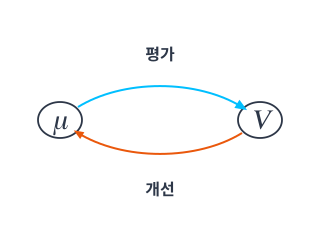

'평가' 단계에서는 정책을 평가하여 가치 함수를 얻습니다. 그리고 '개선' 단계에서는 가치 함수를 탐욕화하여 개선된 정책을 얻습니다. 

> **💡 도로시와 토토의 '톱니바퀴' 비유**
> 
> 도로시가 지도 평가 표(*Evaluation*)를 분석하여 넘겨주면, 토토가 그것을 보고 최선의 화살표를 꾹 그려 지도 개선(*Improvement*)을 수행합니다. 이 두 톱니바퀴가 끊임없이 맞물려 돌아가며 최적 지도를 향해 나아갑니다.
> 
> 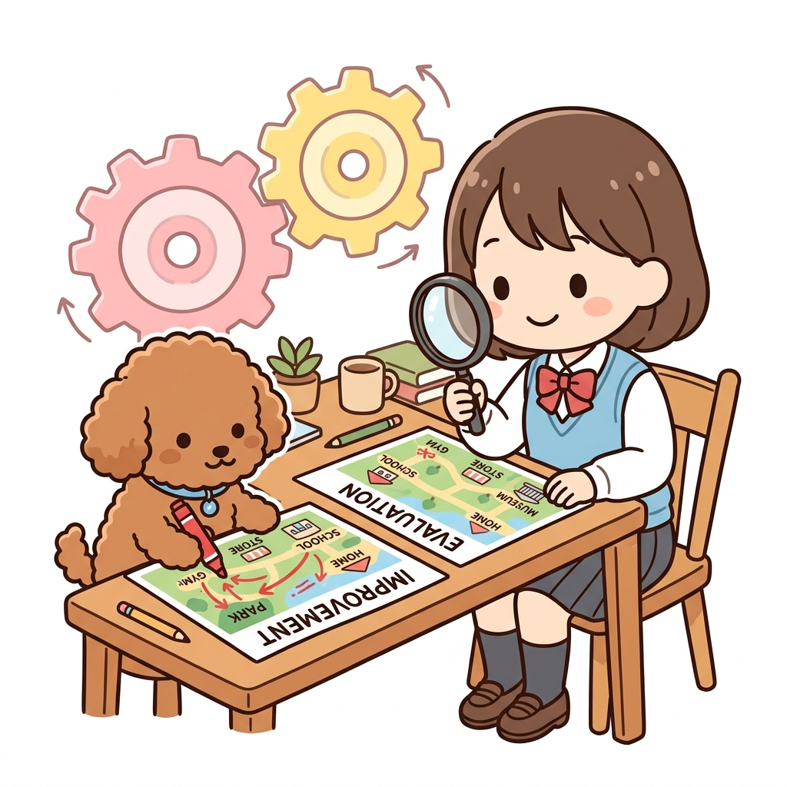


#### 수렴

이를 번갈아 반복하면 최적 정책 *μ*<sub>∗</sub>와 최적 가치 함수 *v*<sub>∗</sub>에 점점 가까워집니다. 

이 과정을 그림으로는 다음처럼 표현할 수 있습니다.

> **💡 도로시의 '지그재그 등산' 비유**
> 
> 완벽한 최적의 지도(*v*<sub>∗</sub>, *μ*<sub>∗</sub>)라는 정상에 도달하기 위해, 도로시와 토토가 지그재그 오솔길을 따라 한 걸음씩 성실하게 올라가는 수렴 과정입니다.
> 
> 

**그림 07-18** 정책 반복법에 의한 가치 함수와 정책의 개선 과정

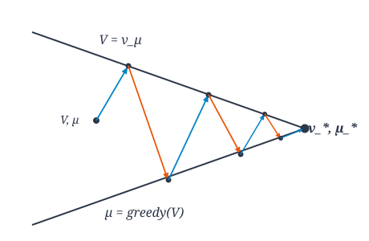

[그림 07-18]에서는 가치 함수 *V*와 정책 *μ*가 취할 수 있는 공간을 2차원으로 표현했습니다. 

본래는 다차원적이고 복잡한 공간이지만, 직관적으로 이해할 수 있도록 2차원으로 단순화했습니다.


이 그림에는 두 개의 직선이 그려져 있습니다. 위쪽 직선은 *V* = *v*<sub>*μ*</sub>를 나타내며, 임의의 가치 함수 *V*와 정책 *μ*의 실제 가치 함수 *v*<sub>*μ*</sub>가 일치하는 곳입니다. 아래쪽 직선은 가치 함수 *V*를 탐욕화하여 얻은 정책과 *μ*가 일치하는 곳입니다.


#### 반복

정책 반복법은 '평가'와 '개선'을 번갈아 반복합니다. 

'평가' 단계에서는 정책 *μ*를 평가하여 *V*<sub>*μ*</sub>를 얻는데, 그림에서 *V* = *v*<sub>*μ*</sub>의 직선 위로 이동하는 것에 해당합니다. 한편 '개선' 단계에서는 *V*를 탐욕화합니다. 그림에서 *μ* = greedy(*V*) 직선 위를 이동하는 것에 해당하죠. 이 두 작업을 번갈아 반복하면 *V*와 *μ*가 갱신되고 결국 두 직선이 만나는 *v*<sub>∗</sub>와 *μ*<sub>∗</sub>에 도달합니다.

> **💡 도로시의 '두 벽 사이 얌체공 튀기기' 비유**
> 
> 도로시가 복도에서 얌체공을 찹니다. 공은 왼쪽의 **평가 벽(*V* = *v*<sub>*μ*</sub>)**과 오른쪽의 **개선 벽(*μ* = greedy(*V*))** 사이를 교대로 지그재그로 바운스하며 통통 튕겨 전진합니다. 이 무수히 튕기는 반복 운동을 거쳐 결국 가장 좁은 골목 끝에 놓인 최적의 보물상자에 도달하게 됩니다.
> 
> 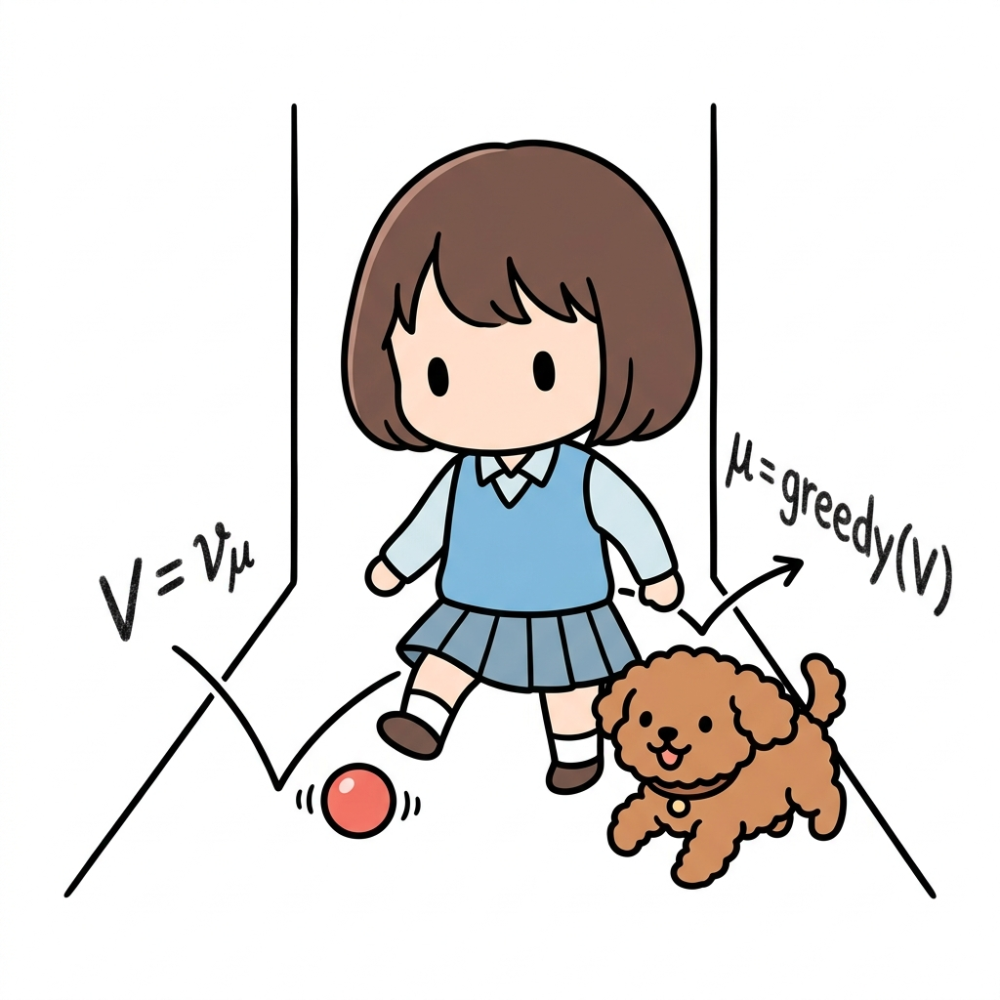

> CAUTION_ 여기서 정책은 확률적 정책 *π*가 아닌 결정적 정책 *μ*로 표현했습니다. 가치 함수를 탐욕화함으로써 각 상태에서의 행동이 단 하나로 결정되기 때문입니다.


정책 반복법은 [그림 07-18]과 같이 목표에 도달하기 위해 두 직선 사이를 지그재그로 이동합니다. 


#### 변형

물론 목표에 도달하기까지 경로에는 여러 변형이 있을 수 있습니다. 

예를 들어 다음 그림과 같은 궤적도 생각해볼 수 있습니다.

**그림 07-19** 가치 함수와 정책 개선 과정(변형)

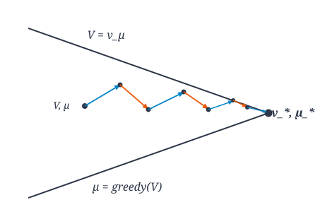

[그림 07-19]에서도 지그재그 궤적을 그리고 있지만 두 직선에 닿기 전에 방향을 전환합니다. 

사실 '평가'와 '개선'이라는 두 작업을 교대로 반복하는 알고리즘에서는 '평가'를 완전히 끝내기 전에 '개선' 단계로 전환하고, '개선'을 완전히 끝내기 전에 '평가' 단계로 전환하면서 [그림 07-19]와 같은 궤적을 만들어냅니다. 

> **💡 도로시의 '공중에서 꺾이는 얌체공' 비유**
> 
> 굳이 공이 벽에 정통으로 쿵 부딪쳐 끝장을 볼 필요는 없습니다. 공이 벽에 닿기도 전에 공중에서 바람이 불거나 도로시가 살짝 손을 대어, 더 부드럽고 가파른 나선형 곡선을 그리며 목적지인 보물 열쇠를 향해 나아갑니다. 즉, 한쪽의 평가나 개선이 100% 끝나지 않아도 대강의 방향만 맞으면 도중에 교대하여 더 빠르게 지름길로 갈 수 있는 변형 궤적입니다.
> 
> 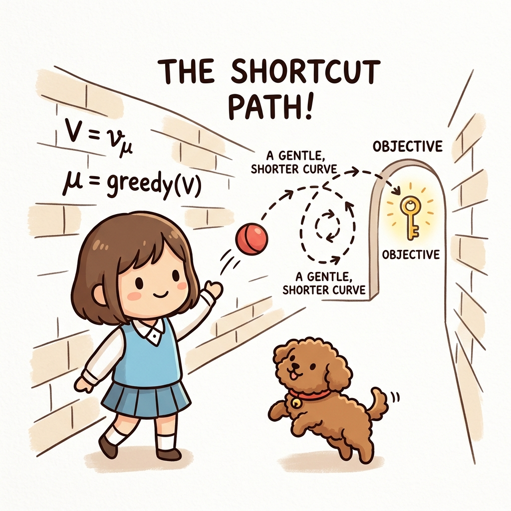


#### 일반화한 정책 반복

이를 **일반화한 정책 반복**<sup>generalized policy iteration</sup>이라고 합니다.

> **💡 도로시의 'GPI 지름길 오솔길' 비유**
> 
> 평가(*Eval*)와 개선(*Improve*)이라는 두 개의 작은 푯말을 번갈아 밟으며, 보물 지도의 완성을 위해 굳이 복잡한 지그재그 복도를 헤매지 않고 자연스럽게 휘어진 지름길로 가볍게 달려 나가는 도로시와 토토의 모습입니다. 평가와 개선을 완벽하게 끝마치지 않고 대강 번갈아 수행해도 최적 가치에 다다르는 강력하고 범용적인 원리입니다.
> 
> 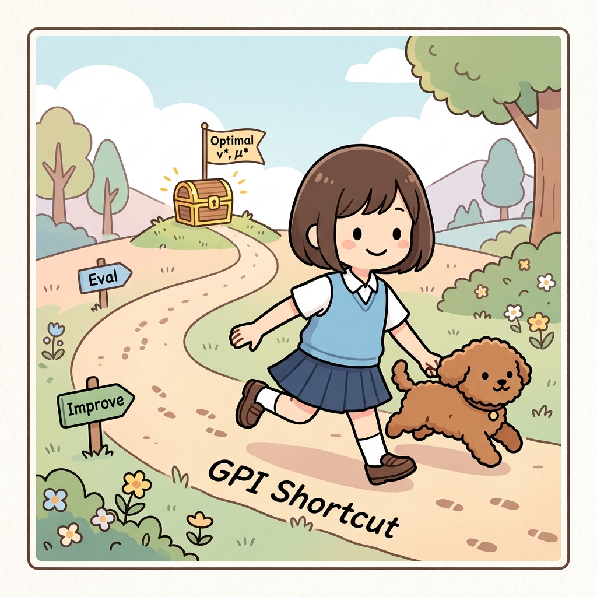

'일반화'라는 단어가 말해주듯이 범용적이라서 광범위하게 활용할 수 있습니다.


> NOTE_ 정책 평가와 정책 개선의 두 과정을 교대로 반복하는 알고리즘에서 평가와 개선의 '정밀도', 즉 얼마나 정확하게 평가(혹은 개선)할 것인가란 자유롭게 조절할 수 있습니다. 예를 들어 '평가' 단계에서는 실제 가치와 일치하게 갱신되지 않더라도 *V*가 *v*<sub>*μ*</sub>의 방향으로 가까워지기만 하면 됩니다. 마찬가지로 '개선' 단계에서는 탐욕화되는 방향으로 향하기만 하면(일부만 탐욕화되면) 됩니다.


정책 반복법에서는 '평가'와 '개선'을 완벽하게 수행했습니다(엄밀하게 말하면 반복적 정책 평가 알고리즘에서는 임곗값을 설정해 도중에 갱신을 중단하기 때문에 완전히 정확한 평가는 아니지만, 그래도 거의 정확한 평가라고 할 수 있습니다). 

정책 반복법은 일반화한 정책 반복을 구현한 하나의 사례입니다.


#### 가치 반복법

정책 반복법에서는 평가와 개선을 각각 '최대한'으로 하고 번갈아 수행합니다. 그렇다면 평가와 개선을 각각 '최소한'으로 수행하면 어떻게 될까요? 이것이 바로 **가치 반복법**<sup>value iteration</sup>에 깔린 아이디어입니다.

> **💡 도로시의 '1단계 탐색 후 큰 점프' 비유**
> 
> 복잡하게 백 번 천 번 지도를 평가하며 헤매는 대신, 돋보기로 바로 앞 한 칸의 점수(1-Step Lookahead)만 딱 한 번 들여다보고 곧바로 보물상자를 향해 껑충 점프해버리는 가치 반복법의 과감한 지름길 방식입니다.
> 
> 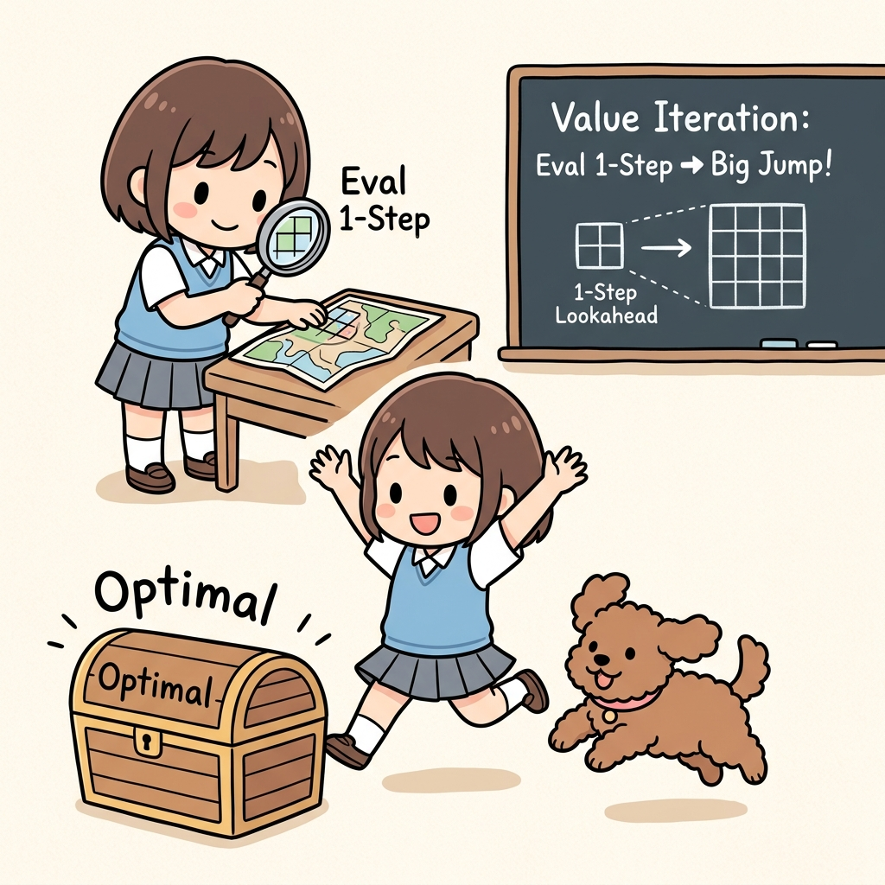 


---


# 07.6.1 가치 반복법 도출

가치 반복법을 알아보기 전에 정책 반복법을 다시 한번 정리해보겠습니다. 


정책 반복법의 '평가' 단계에서는 다음 그림처럼 반복적으로 가치 함수를 갱신합니다.

**그림 07-20** 반복적 정책 평가 알고리즘에 의한 갱신

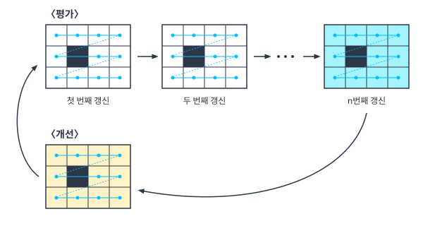

그림과 같이 모든 상태의 가치 함수를 여러 번 갱신합니다. 


#### 이 갱신 작업이 수렴되면 '개선(탐욕화)' 단계로 넘어갑니다.

이와 대조되는 갱신 방식으로, **하나의 상태만 딱 한 번 갱신**하고 곧바로 '개선' 단계로 넘어갈 수도 있습니다. 


이것이 가치 반복법의 핵심 아이디어입니다. 

그림으로 표현하면 다음과 같습니다.

**그림 07-21** 각 상태에서 개선과 평가를 순차적으로 반복

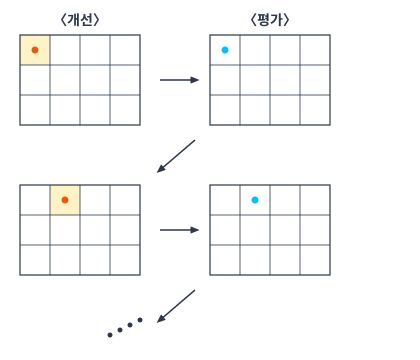

이번 그림에서는 **상태 하나만 개선**하고 곧장 **평가 단계**로 넘어갑니다.

평가 단계에서도 해당 상태 하나의 가치 함수를 한 번만 갱신합니다. 그런 다음 다른 위치(그림에서 왼쪽 위에서 두 번째 칸)를 개선하고 평가하는 흐름으로 진행됩니다.

> **💡 지니의 꿀팁: 왜 딱 '한 번만' 갱신할까요?**
> 
> * **정책 반복법 (완벽주의 도로시)**: 지도의 화살표(정책)를 바꾸기 전에, 격자 세상의 모든 땅의 가치가 소수점 셋째 자리까지 완벽하게 일치할 때까지 수백 번 평가 계산을 돌며 에너지를 낭비합니다.
> * **가치 반복법 (현실주의 고양이 지니)**: "도로시야, 사과 땅의 가치가 완벽한 **+10.0** 점이 될 때까지 백 번 계산해 볼 필요가 있니? 딱 한 번만 계산해서 그 땅이 다른 위험한 칸보다 훨씬 좋다는 **대강의 우열**만 가려지면 화살표는 이미 즉시 사과 방향으로 꺾인단다!"
수> 
> 즉, 가치 함수가 최종 수렴값에 완전히 도달하기 전이라도 **어느 행동이 더 좋은지의 대소 관계는 매우 초기에 결정**됩니다. 따라서 굳이 참값을 얻기 위해 무의미한 덧셈을 돌리지 않고, 한 번만 갱신해 본 뒤 바로 정책 개선으로 넘어가는 것이 계산 효율을 극적으로 올리는 지름길 마법입니다.
> 
> **그림 07-21-1** 저울의 수평(우열)이 한 번의 측정만으로도 명확히 기우는 것을 깨닫는 도로시
> 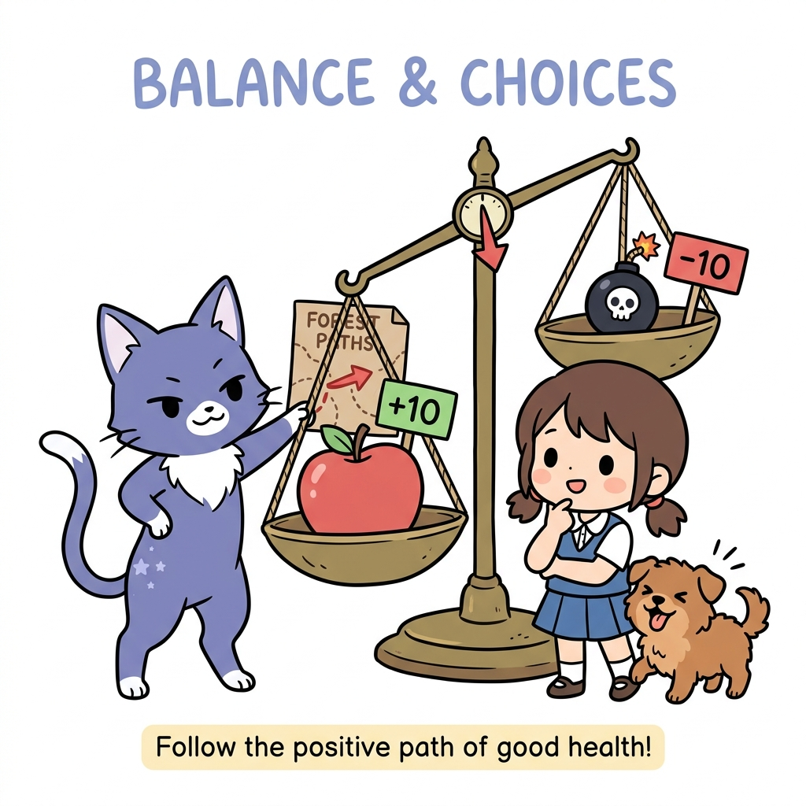

> NOTE_ [그림 07-21]에서는 먼저 왼쪽 위의 위치(상태)를 개선합니다. 지금 예에서는 개선 단계부터 시작했지만, 개선과 평가는 번갈아 진행되므로 어느 단계를 먼저 진행하든 상관없습니다.


[그림 07-21]의 아이디어를 수식으로 정리해보겠습니다. 


#### 개선 단계부터 시작하죠. 

개선 단계에서 하는 탐욕화는 수식으로 다음과 같이 쓸 수 있습니다.
$$
\mu(s) = \operatorname{argmax}_a \sum_{s'} p(s' \mid s, a) \{ r(s, a, s') + \gamma V(s') \} \tag{식 07.8}
$$

현재의 가치 함수는 *V*(*s*)로 표기하겠습니다. [식 07.8]은 다소 복잡해 보이지만, 사실 도로시가 각 갈림길에서 최선의 행동을 고르는 직관적인 마법 지도 공식입니다. 지니가 칠판에 그려준 각 기호의 의미를 하나씩 번역해볼까요?

> **💡 지니의 친절한 공식 번역기 (개선 단계)**
> 
> * **최적 정책 *μ*(*s*) (도로시의 최종 선택)**: 현재 상태 *s*에서 도로시가 걸어갈 **단 하나의 최적 방향(화살표)**을 결정합니다.
> * **최댓값 행동 argmax<sub>*a*</sub> (최선 고르기)**: 동서남북 행동 *a*들 중에서, 뒤에 나오는 기대 보상값이 **가장 큰 방향**을 쏙 골라냅니다.
> * **전이 확률 *p*(*s'* | *s*, *a*) (바람의 방향)**: 내가 행동 *a*를 취했을 때 다음 상태 *s'*로 무사히 이동할 **확률**입니다.
> * **보상 *r*(*s*, *a*, *s'*) (즉시 먹는 사과)**: 그 길로 들어섰을 때 즉각 먹을 수 있는 사과의 맛(**보상**)입니다.
> * **할인 가치 *γV*(*s'*) (미래의 가치)**: 이동한 다음 상태 *s'*에 묻혀 있는 보물의 가치 *V*(*s'*)에, 시간이 흐를수록 가치가 조금씩 깎이는 할인율 *γ*를 곱한 값입니다.
> 
> **그림 07-21-2** 식 07.8의 각 기호 의미를 도로시와 토토에게 친절히 과외해주는 지니
> 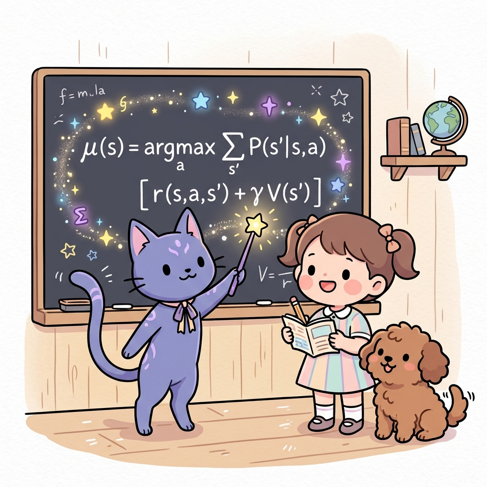

현재의 가치 함수는 *V*(*s*)로 표기하겠습니다. [식 07.8]과 같이 현재 상태와 보상, 그리고 다음 상태를 활용하여 argmax로 계산합니다. argmax는 하나의 행동을 선택해주므로 *μ*(*s*)와 같이 결정적 정책으로 표현할 수 있습니다.


#### 다음은 평가 단계입니다. 

갱신 전의 가치 함수를 *V*(*s*), 갱신 후의 가치 함수를 *V'*(*s*)라고 하면 DP에 의한 갱신식(반복적 정책 평가 알고리즘)은 다음과 같이 표현됩니다.
$$
V'(s) = \sum_{a, s'} \pi(a \mid s) p(s' \mid s, a) \{ r(s, a, s') + \gamma V(s') \} \tag{식 07.9}
$$

[식 07.9]는 확률적으로 행동하는 도로시의 상태 가치를 평가하는 갱신식입니다. 이번에도 지니와 함께 각 기호의 마법 의미를 번역해볼까요?

> **💡 지니의 친절한 공식 번역기 (평가 단계)**
> 
> * **갱신 후 가치 *V'*(*s*)**: 도로시가 현재 상태 *s*에서 행동을 취한 뒤 새롭게 계산될 **상태의 최종 점수(가치)**입니다.
> * **가중 평균 합계 ∑<sub>*a*, *s'*</sub> (모든 경우의 수 더하기)**: 도로시가 선택할 수 있는 모든 행동 *a*와 그에 따라 도착할 수 있는 모든 다음 상태 *s'*의 가치들을 빠짐없이 전부 곱해 더하겠다는 **평균 기댓값**의 상징입니다.
> * **행동 확률 *π*(*a* | *s*) (행동 결정 확률)**: 도로시의 나침반이 동서남북 각 방향을 가리킬 **정책(확률)**입니다. 예를 들어 네 방향의 확률이 모두 똑같이 25%일 수도 있고, 동쪽만 유독 높을 수도 있습니다.
> 
> **그림 07-21-3** 확률적 정책 평가 공식의 의미를 나침반 비유로 고민해 보는 도로시와 지니
> 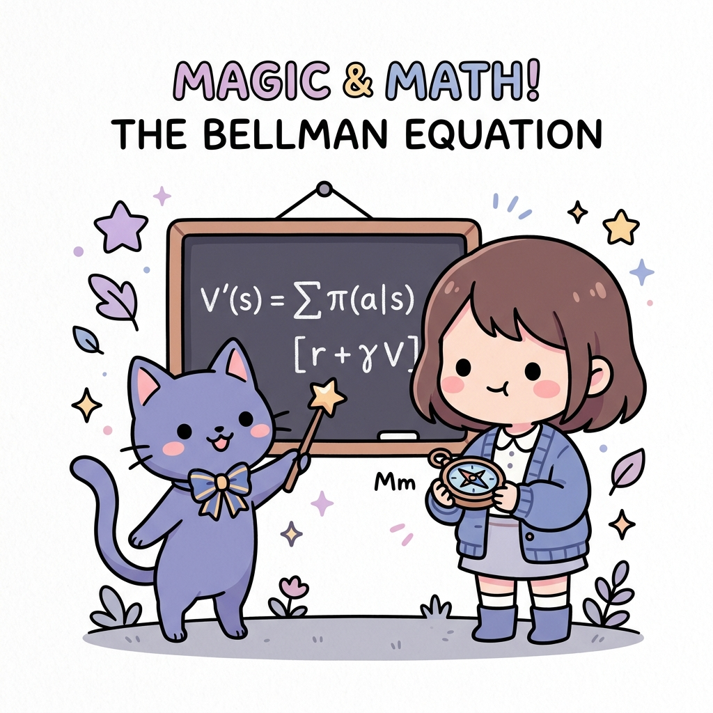

[식 07.9]에서는 정책 *π*(*a* | *s*)가 확률적 정책으로 표기되어 있습니다. 그러나 '개선' 단계를 한 번 거치면 정책이 탐욕 정책으로 바뀝니다. 


#### 탐용정책

탐욕 정책은 값이 최대인 행동 하나만 선택하기 때문에 결정적입니다.

따라서 [식 07.9]의 정책을 결정적 정책 *μ*(*s*)로 취급하여 다음과 같이 단순화할 수 있습니다.

*a* = *μ*(*s*) 일 때
$$
V'(s) = \sum_{s'} p(s' \mid s, a) \{ r(s, a, s') + \gamma V(s') \} \tag{식 07.10}
$$

[식 07.10]은 지니의 마법 지우개 덕분에 엄청나게 가벼워진 수식입니다!

> **💡 지니의 친절한 공식 번역기 (결정적 가치 평가)**
> 
> * **행동 확정 *a* = *μ*(*s*)**: 더 이상 동서남북 사방의 확률 나침반을 보며 헷갈려할 필요가 없습니다. 도로시가 탐욕 행동으로 가야 할 **단 하나의 외길(*a*)**이 정해졌기 때문입니다.
> * **사라진 행동 기호(∑<sub>*a*</sub> *π*(*a* | *s*))**: 여러 방향의 확률을 곱해서 더하던 복잡한 행동 합산 기호가 마법 지우개로 싹 지워졌습니다. 확정된 행동 *a* 하나에 대해서만 미래 가치를 구하면 되므로, 계산량이 압도적으로 줄어듭니다!
> 
> **그림 07-21-4** 정해진 외길을 향해 출발하는 도로시와 복잡한 확률 기호를 지워주는 지니
> 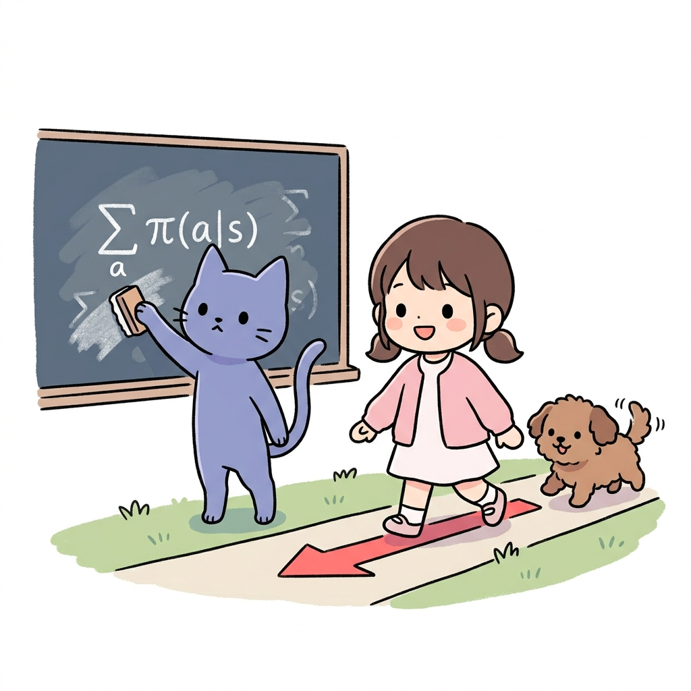

이것이 복잡한 합산 기호를 걷어내고 단순화된 '평가' 단계의 가치 함수 갱신식입니다. 


이제 [식 07.8]과 [식 07.10]을 나란히 써보겠습니다.

**그림 07-22** 개선과 평가 단계에서 수행되는 계산

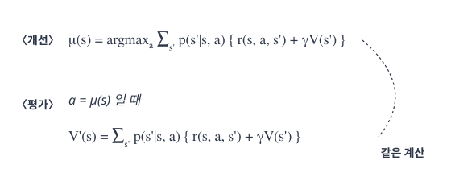

[그림 07-22]를 보면 개선과 평가 단계에서 똑같은 계산이 중복됨을 알 수 있습니다. 


더 정확하게 말하면 개선 단계에서 탐욕 행동을 찾기 위해 계산을 한 후, 평가 단계에서 그 탐욕 행동을 이용하여 똑같은 계산을 다시 수행합니다. 


이 중복된 계산은 물론 하나로 묶을 수 있습니다(식 06.11).

> **💡 지니의 팩트 폭격: "같은 계산을 왜 두 번 하니?"**
> 
> * **개선 단계**: 동서남북 중 가장 큰 보상을 주는 방향(*argmax*)을 찾기 위해 열심히 계산합니다.
> * **평가 단계**: 앞서 찾아낸 방향을 가지고 똑같이 덧셈과 할인율을 곱해가며 가치(*V*)를 다시 계산합니다.
> 
> 지니가 칠판 가득 적어준 수식을 보고 도로시와 토토가 머리를 감싸 쥐고 있네요. 같은 방향의 값을 두 번 계산하는 비효율적인 반복 작업 때문에 피로가 쌓인 상황입니다.
> 
> **그림 07-22-1** 정책 반복법의 평가/개선 중복 계산 피로에 지친 도로시와 토토
> 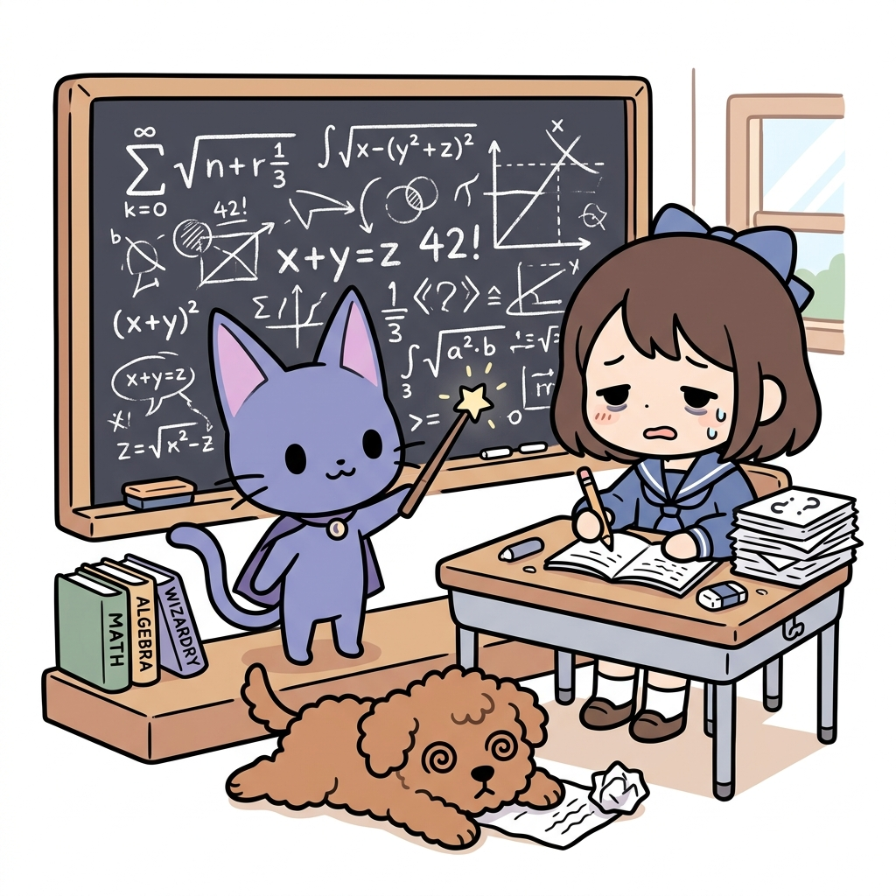


$$
V'(s) = \max_a \sum_{s'} p(s' \mid s, a) \{ r(s, a, s') + \gamma V(s') \} \tag{식 07.11}
$$

[식 07.11]에서는 최댓값을 찾아주는 max 연산자를 사용하여 가치 함수를 직접 갱신합니다. 


이 식에서는 [그림 07-22]의 중복 계산이 사라졌음을 알 수 있습니다.

> **💡 지니의 마법: "수식들을 MAX 깔때기로 묶자!"**
> 
> 굳이 방향을 따로 구하고 지도를 고친 뒤 가치를 구하는 두 단계를 거칠 필요 없이, 지니의 **`MAX` 마법 깔때기**에 동서남북 4방향 가치 수식들을 통째로 집어넣어 버립니다. 그러면 가장 기대치가 큰 맛있는 사과(+10점짜리 보상)가 아래로 곧바로 쏙 떨어집니다. 이 **최댓값(max)** 마법 덕분에 귀찮은 정책 갱신 단계 없이 가치를 바로 갱신할 수 있게 됩니다.
> 
> **그림 07-22-2** 중복 수식을 하나의 `max` 깔때기 마법으로 합쳐버리는 지니
> 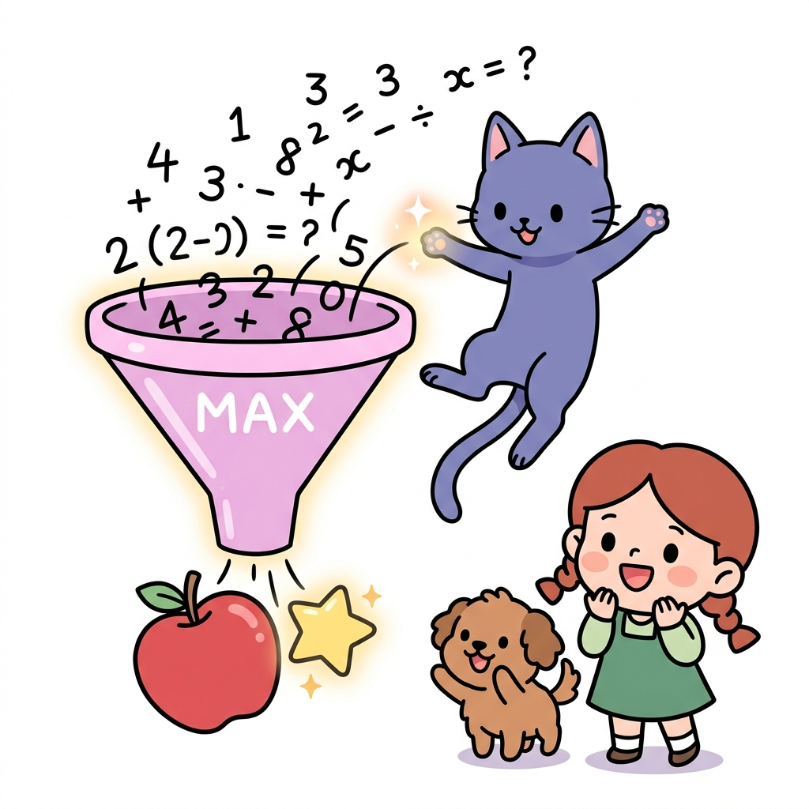


[식 07.11]에서 주목할 점이 하나 더 있습니다. 

바로 정책 *μ*가 등장하지 않는다는 사실입니다. 즉, 정책을 사용하지 않고 가치 함수를 갱신하고 있습니다. 


그래서 [식 07.11]을 활용하여 최적 가치 함수를 구하는 알고리즘을 '가치 반복법'이라고 부릅니다(정책이 필요 없으므로 '정책'이라는 단어를 쓰지 않습니다).

 가치 반복법은 이 하나의 식만을 이용하여 '평가'와 '개선'을 동시에 수행합니다.

> NOTE_ 벨만 최적 방정식의 수식은 다음과 같습니다.
> 
> $$
> v_*(s) = \max_a \sum_{s'} p(s' \mid s, a) \{ r(s, a, s') + \gamma v_*(s') \}
> $$


#### 벨만 최적 방정식과 비교

벨만 최적 방정식과 [식 07.11]을 비교해보죠. 


그러면 [식 07.11]은 벨만 최적 방정식을 '갱신식'으로 표현한 것임을 알 수 있습니다.

또한 [식 07.11]의 갱신식을 다음 형태로도 표현할 수 있습니다.

$$
V_{k+1}(s) = \max_a \sum_{s'} p(s' \mid s, a) \{ r(s, a, s') + \gamma V_k(s') \}
$$

이 식은 보물 지도가 여러 버전을 거치며 점차 똑똑하게 진화하는 과정을 나타냅니다. 지니가 지도의 세대 교체 기호들을 번역해 주었어요!

> **💡 지니의 친절한 공식 번역기 (가치 함수의 세대 교체)**
> 
> * **현재 버전의 지도 *V*<sub>k</sub>**: 지금 손에 쥐고 있는 k번째 보물 지도입니다. 아직은 점수들이 불완전할 수 있습니다.
> * **다음 버전의 지도 *V*<sub>k+1</sub>**: 현재 지도 *V*<sub>k</sub>에 적힌 점수들을 바탕으로, 사방을 둘러보며 더욱 정확하게 계산해낸 새로운 k+1번째 개정판 지도입니다.
> 
> **그림 07-21-5** 빈 백지 지도(k=0)에서 개정판(k=1)을 거쳐 완벽한 골드 지도(k=2)로 진화하는 지도
> 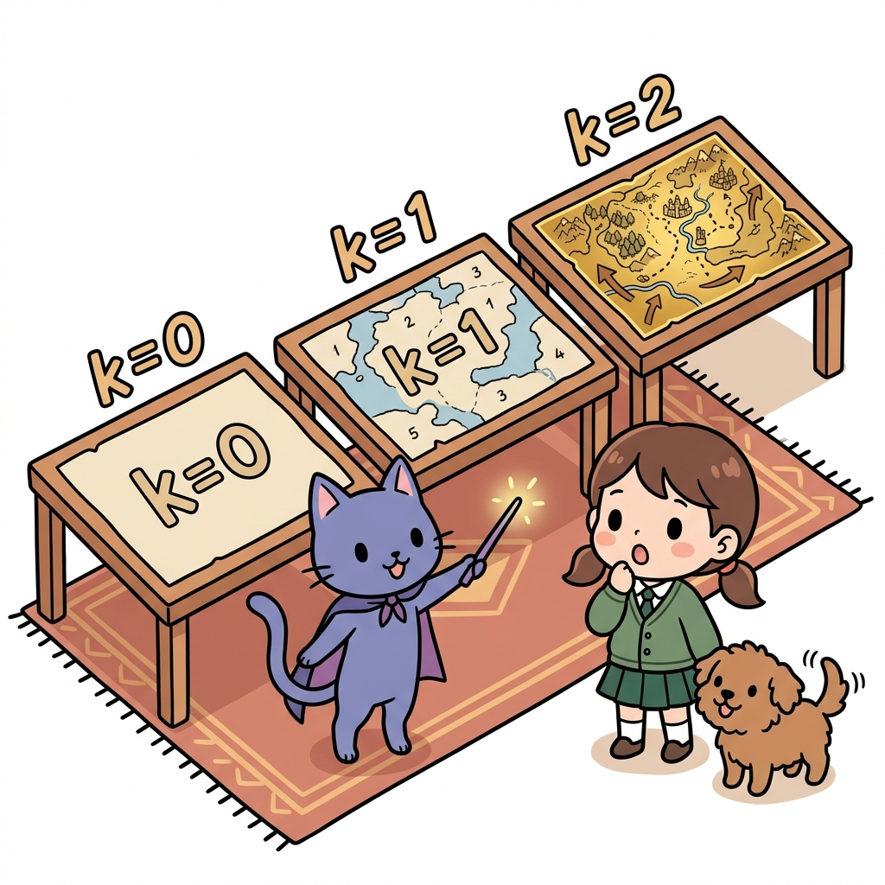 


가치 반복법은 k = 0(모든 땅이 0점인 완전한 백지 상태)부터 시작하여 k = 1, 2, 3... 순서로 가치 함수 *V*<sub>k</sub>를 덧칠해 나가며 진화시키는 알고리즘입니다. DP의 핵심 특징인 '같은 계산을 두 번 하지 않는다'는 조건을 만족하므로, k = 0, 1, 2, 3...에서 각 단계의 지도 *V*<sub>k</sub>는 단 한 번씩만 계산되어 매우 빠르고 효율적입니다.


#### 최적 가치 함수

가치 반복법으로 갱신을 무한히 반복하면 최적 가치 함수를 얻을 수 있습니다. 

하지만 현실에서는 언젠가 멈춰야 합니다. 멈추기 위한 장치로는 역시 임곗값을 이용할 수 있습니다. 임곗값을 정해놓고, 모든 상태의 갱신량이 임곗값 밑으로 떨어지면 갱신을 중단하는 것입니다.


*V*<sub>∗</sub>(*s*)가 주어지면 최적 정책 *μ*<sub>∗</sub>(*s*)는 다음 식으로 구할 수 있습니다.

$$
\mu_*(s) = \operatorname{argmax}_a \sum_{s'} p(s' \mid s, a) \{ r(s, a, s') + \gamma V_*(s') \} \tag{식 07.12}
$$


[식 07.12]

[식 07.12]에서 알 수 있듯이 탐욕 정책을 찾아내면 그것이 곧 최적 정책입니다. 

지금까지 가치 반복법을 알아보았습니다.

> **💡 도로시의 보물 지도 완성: "마지막에 딱 한 번만 argmax!"**
> 
> 지니의 가치 반복법을 통해 모든 격자 세상의 칸들에 최적 가치(보물들의 점수)가 완벽하게 채워졌습니다. 이제 도로시는 마지막에 딱 한 번만 크레파스를 들고, 각 칸에서 가장 점수가 큰 방향을 가리키는 빨간색 화살표(최적 정책 *μ*<sub>∗</sub>)를 꾹 그려 넣으면 멋진 보물 지도가 완전히 완성됩니다!
> 
> **그림 07-22-3** 가치가 가득 찬 보물 지도에 마지막 최적 화살표를 그리는 도로시
> 


---


# 07.6.2 가치 반복법 구현

이어서 가치 반복법을 구현하겠습니다. 이번에도 '3 × 4 그리드 월드'를 풀어보죠. 


이 문제에서는 상태 전이가 결정적이기 때문에 가치 함수의 갱신식은 [그림 07-23]처럼 단순화할 수 있습니다.

**그림 07-23** 상태 전이가 결정적인 경우의 가치 반복법에 의한 갱신식

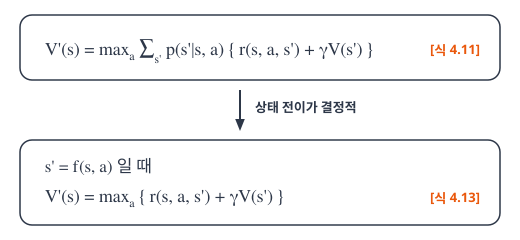

먼저 [식 07.13]을 따라 (한 번만) 갱신하는 `value_iter_onestep()` 함수를 구현하겠습니다.

<div align="right"><b>ch07/value_iter.py</b></div>

```python
def value_iter_onestep(V, env, gamma):
    for state in env.states(): # ❶ 모든 상태에 차례로 접근
        if state == env.goal_state: # 목표 상태에서의 가치 함수는 항상 0
            V[state] = 0
            continue

        action_values = []
        for action in env.actions(): # ❷ 모든 행동에 차례로 접근
            next_state = env.next_state(state, action)
            r = env.reward(state, action, next_state)
            value = r + gamma * V[next_state] # ❸ 새로운 가치 함수
            action_values.append(value)

        V[state] = max(action_values) # ❹ 최댓값 추출
    return V
```

이 함수는 매개변수로 가치 함수 `V`, 환경 `env`, 할인율 `gamma`를 받습니다. 

그리고 ❶에서 모든 상태에 순서대로 접근하고 ❷에서는 모든 행동에 순서대로 접근합니다. 

❸에서는 [식 07.13]의 중괄호 안쪽을 계산하고 ❹에서는 `max()` 함수로 최댓값을 찾아 `V[state]`를 갱신합니다.


이제 갱신이 수렴할 때까지 `value_iter_onestep()` 함수를 반복 호출하면 됩니다. 


이 작업을 다음의 `value_iter()` 함수가 담당합니다.

<div align="right"><b>ch07/value_iter.py</b></div>

```python
def value_iter(V, env, gamma, threshold=0.001, is_render=True):
    while True:
        if is_render:
            env.render_v(V)

        old_V = V.copy() # 갱신 전 가치 함수
        V = value_iter_onestep(V, env, gamma)

        # 갱신된 양의 최댓값 구하기
        delta = 0
        for state in V.keys():
            t = abs(V[state] - old_V[state])
            if delta < t:
                delta = t

        # 임곗값과 비교
        if delta < threshold:
            break
    return V
```

`value_iter()` 함수에서는 앞서 구현한 `value_iter_onestep()` 함수를 반복 호출합니다. 얼마나 반복할지는 가치 함수의 갱신량에 의해 정해집니다. 가치 함수의 갱신량 최댓값이 임곗값(`threshold`)보다 작아질 때까지 계속 갱신하는 것이죠.


또한 `value_iter()` 함수는 매개변수로 `is_render`를 받는데, `is_render = True`이면 `while`문 안에서 갱신되는 가치 함수의 값을 그래프로 그려줍니다.

이제 `value_iter()` 함수를 사용해봅시다.

<div align="right"><b>ch07/value_iter.py</b></div>

```python
from common.gridworld import GridWorld
from ch07.policy_iter import greedy_policy

V = defaultdict(lambda: 0)
env = GridWorld()
gamma = 0.9

V = value_iter(V, env, gamma) # 최적 가치 함수 찾기

pi = greedy_policy(V, env, gamma) # 최적 정책 찾기
env.render_v(V, pi)
```

먼저 `value_iter()` 함수로 최적 가치 함수를 구합니다. 


최적 가치 함수를 알면 이를 탐욕화하여 최적 정책을 얻을 수 있습니다([식 07.12] 참고). 해당 내용은 앞에서 이미 `greedy_policy()` 함수로 구현해뒀습니다. 


이 코드를 실행하면 다음과 같은 그림을 얻을 수 있습니다.

**그림 07-24** 가치 반복법에 의한 처음과 마지막(세 번째) 가치 함수

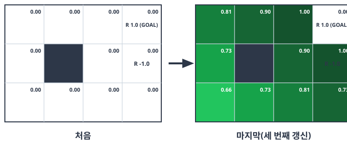

가치 함수는 처음에는 모든 원소가 0인 딕셔너리로 시작합니다. 그리고 세 번의 갱신 결과 가치 함수의 값이 충분히 수렴합니다. 이것이 최적 상태 가치 함수입니다.


또한 최적 상태 가치 함수를 바탕으로 탐욕 정책을 얻으면 [그림 07-25]와 같은 정책을 얻을 수 있습니다.


**그림 07-25** 최적 상태 가치 함수로부터 얻은 최적 정책

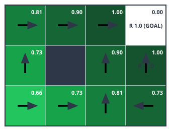

이 그림이 최적 상태 가치 함수를 탐욕화하여 얻은 정책입니다. 


그리고 최적 정책이기도 하죠. 확실히 오른쪽 위의 사과(보상 1.0)를 찾아 이동하는 정책이 만들어졌습니다.


이상으로 가치 반복법을 활용해 효율적으로 최적 정책을 구할 수 있었습니다.
