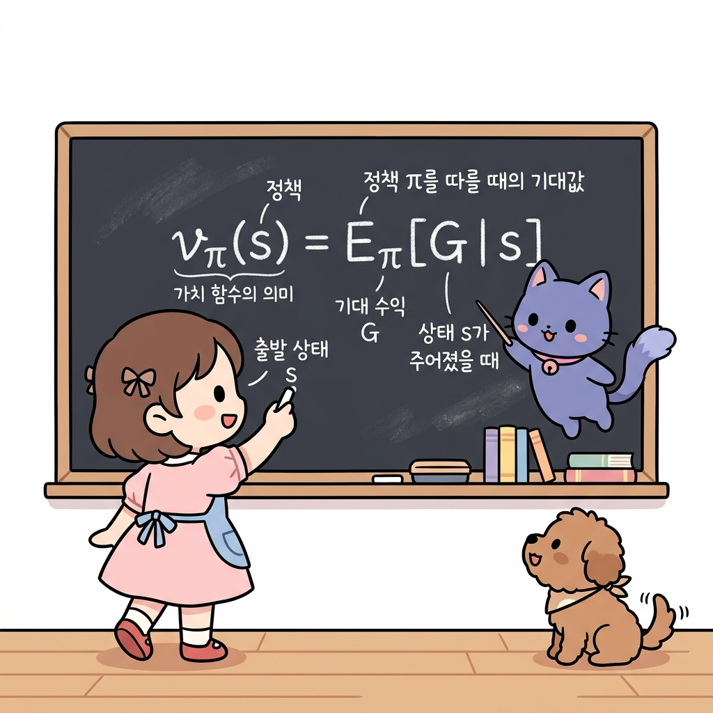
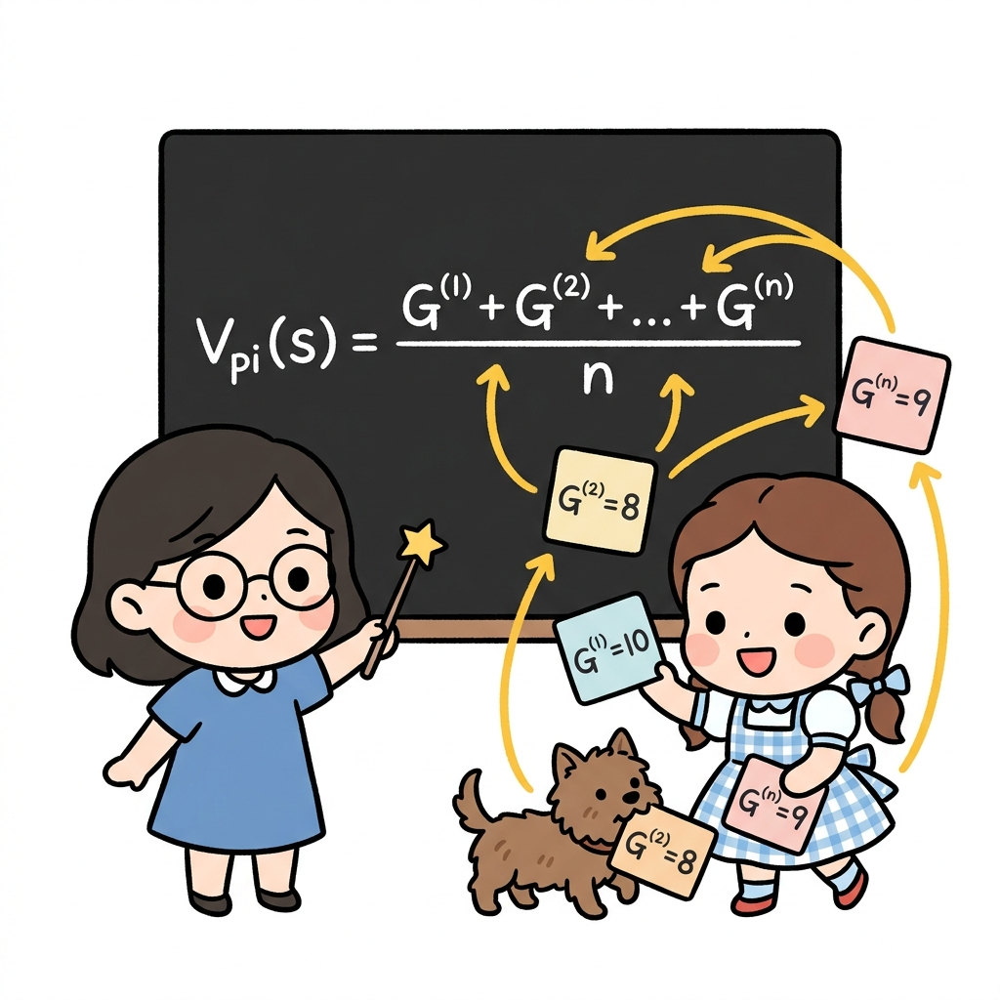
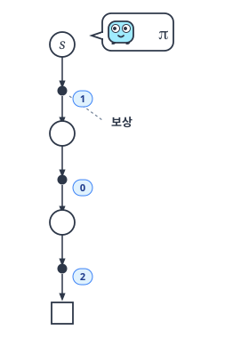
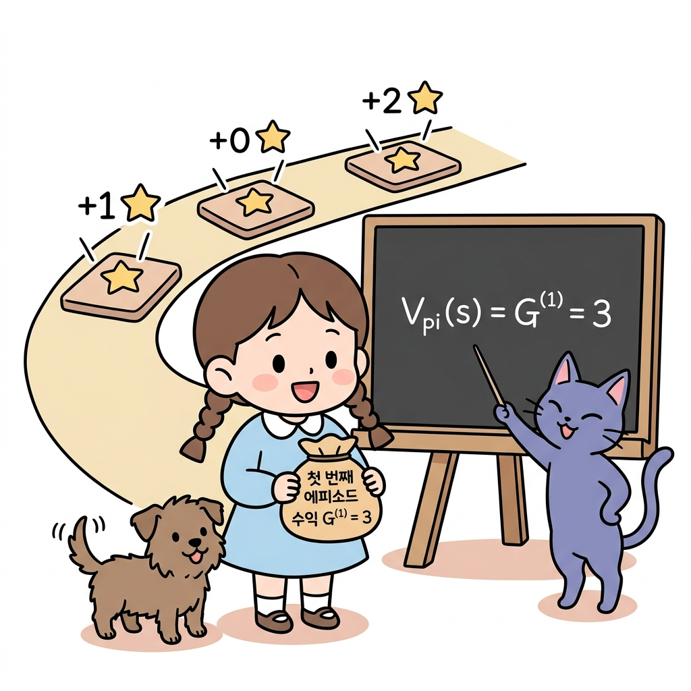
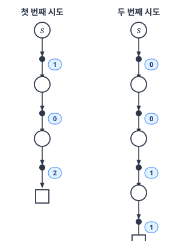
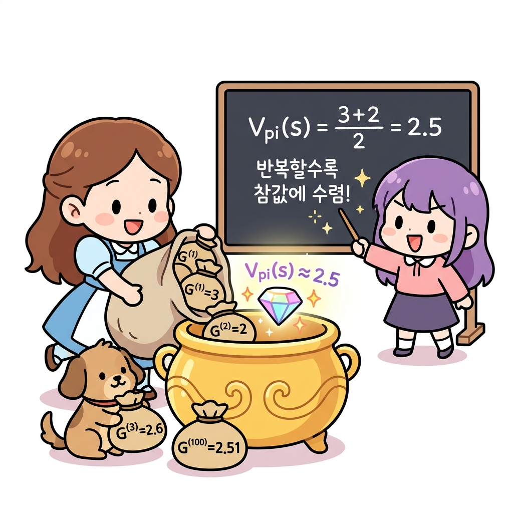
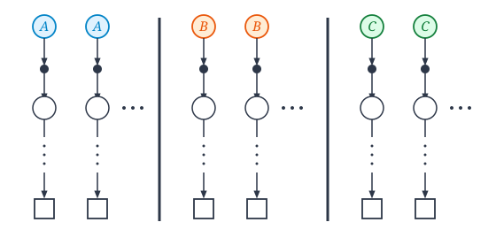
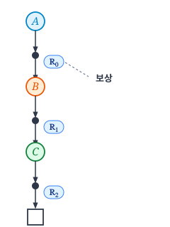
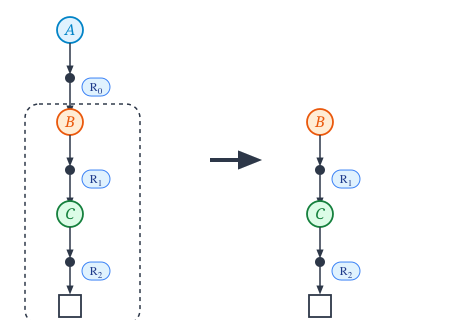

# 09.2 몬테카를로법으로 정책 평가하기

**그림 09-2** 징검다리를 건너가며 에피소드를 완성하고, 지니가 공중에 띄워준 가치 카드 V(s)의 가치를 갱신해나가는 도로시

주어진 정책 *π*에 따라 에피소드 시뮬레이션을 반복하여 상태 가치 함수 *V(s)*를 근사하는 **정책 평가(Policy Evaluation)** 과정을 배웁니다. 징검다리를 끝까지 건너는 다수의 에피소드 표본 데이터를 기반으로, 각 칸의 기대 가치 카드를 완성해 나가는 도로시의 즐거운 모험을 지니와 함께 살펴봅시다!

---

#### 앞서 몬테카를로법에 대해 배웠습니다. 

몬테카를로법은 **실제로 샘플링**을 하고 샘플 데이터로부터 **기댓값**을 계산합니다.

물론 이 방법은 **강화 학습** 문제에도 적용할 수 있습니다. 즉, **에이전트가 실제로 행동**하여 얻은 **경험(샘플 데이터)**으로 **가치 함수**를 **추정**할 수 있습니다. 

**그림 09-2-1** 에이전트가 직접 환경을 탐색하며 수집한 경험 데이터를 기반으로 각 상태의 가치 함수 V(s)를 점진적으로 업데이트하는 몬테카를로 평가 루프
 

이번 절에서는 정책 *π*가 주어졌을 때, 그 정책의 가치 함수를 몬테카를로법으로 계산합니다. 한편 이번 절에서는 '정책 평가'까지만 진행하고 최적 정책을 찾는 '정책 제어'는 5.4절에서 진행합니다.

---

## 09.2.1 가치 함수를 몬테카를로법으로 구하기

#### 먼저 가치 함수를 복습해보죠. 

가치 함수는 다음 식으로 표현됩니다.

$$
v_{\pi}(s) = \mathbb{E}_{\pi} [G \mid s]
$$

[식 6.1]

**그림 09-2-2** 가치 함수 *vπ(s)*의 수학적 정의식과 각 변수(상태 *s*, 기댓값 *E*, 기대 수익 *G*)의 의미

상태 *s*에서 출발하여 얻을 수 있는 수익을 *G*로 나타냈습니다

(수익은 할인율을 적용한 보상들의 합입니다). 

가치 함수 *vπ(s)*는 [식 6.1]과 같이 **'정책 *π*에 따라 행동했을 때 얻을 수 있는 기대 수익'**으로 정의됩니다. 

**그림 09-2-3** 시작 상태 *s*에서 임의의 정책 화살표(*π*)를 따라 모험하며 경로 위의 보상(*R*1, *R*2, *R*3)들을 획득하여 계산되는 기대 수익의 시각화

이번 절에서는 일회성 과제를 가정하여 언젠가는 목표에 도달하는 경우를 알아보겠습니다.

#### 이제 [식 6.1]의 가치 함수를 몬테카를로법으로 계산해보죠. 

이를 위해 에이전트에게 **정책 *π***에 따라 실제로 **행동**을 취하도록 합니다. 이렇게 해서 얻는 실제 수익이 샘플 데이터이고, 이런 샘플 데이터를 많이 모아서 평균을 구하는 것이 몬테카를로법입니다. 

수식으로는 다음과 같습니다.

$$
V_{\pi}(s) = \frac{G^{(1)} + G^{(2)} + \dots + G^{(n)}}{n}
$$

[식 6.2]

**그림 09-2-4** 수집한 여러 에피소드의 실물 수익 카드(G(1), G(2), ..., G(n))들의 누적 합을 총 횟수 n으로 나누어 기댓값 V_pi(s)를 점진적으로 계산하는 표본 평균 연산

상태 *s*에서 시작하여 얻은 수익을 *G*로 표기하고, *i*번째 에피소드에서 얻은 수익을 *G(i)*로 표기했습니다. 

몬테카를로법으로 계산하려면 [식 6.2]와 같이 에피소드를 *n*번 수행하여 얻은 샘플 데이터의 평균을 구하면 됩니다.

> CAUTION_ 몬테카를로법은 일회성 과제에서만 이용할 수 있습니다. 지속적 과제에는 '끝'이 없기 때문에 수익의 샘플 데이터, 즉 [식 6.2]의 *G(1), G(2)* 등이 확정되지 않습니다.

#### 구체적인 예를 보겠습니다. 

에이전트가 [그림 09-5]와 같이 행동하는 경우를 생각해보시다.

**그림 09-5** 에이전트의 시도(○ = 상태, ● = 행동, □ = 목표, 숫자 = 실제 얻은 보상)

[그림 09-5]는 에이전트가 상태 *s*에서 출발하여 정책 *π*에 따라 행동한 결과를 나타냅니다. 

#### 첫번째 시도

그림과 같이 이번 예에서 얻은 보상이 1, 0, 2라고 가정하죠. 할인율 *γ*를 1로 가정하면 상태 *s*에서의 수익을 다음과 같이 구할 수 있습니다.

$$
G^{(1)} = 1 + 0 + 2 = 3
$$

**그림 09-2-3-b** 첫 번째 시도에서 차례대로 획득한 보상(+1, +0, +2)들의 총합으로 계산된 첫 번째 에피소드 수익 G(1) = 3

이것이 첫 번째 샘플 데이터입니다. 

이 시점에서의 가치 함수는 다음과 같이 추정할 수 있습니다.

$$
V_{\pi}(s) = G^{(1)} = 3
$$

#### 두번째 시도

이어서 두 번째 시도는 [그림 09-6]처럼 진행됐다고 해봅시다.

**그림 09-6** 에이전트의 두 번째 시도

**그림 09-2-3-c** 동일한 상태에서 모험을 시작했음에도 매 시도마다 획득 경로와 보상(+0, +0, +1, +1)이 다르게 나타나는 확률적 가치 추정의 세계

이번에는 상태 *s*에서 시작하여 0, 0, 1, 1의 보상을 얻었습니다. 

이처럼 똑같이 상태 *s*에서 시작해도 보상 액수는 다를 수 있습니다. 에이전트의 **정책**이 확률적일 수도 있고 환경의 **상태 전이**가 확률적일 수도 있기 때문이죠. 

둘 중 하나라도 확률적이라면 **시도할 때마다 보상이 확률적**으로 달라집니다. 이처럼 값(보상)이 확률적으로 달라질 때 몬테카를로법을 이용합니다.

[그림 09-6]에서 두 번째 에피소드의 수익은 다음과 같습니다.

$$
G^{(2)} = 0 + 0 + 1 + 1 = 2
$$

1차 수익 *G(1)*이 3이고 2차 수익 *G(2)*가 2이므로, 평균은 2.5입니다.

$$
\frac{G^{(1)} + G^{(2)}}{2} = \frac{3+2}{2} = 2.5
$$

즉, 이 시점의 가치 함수 *Vπ(s)*는 2.5가 됩니다.

이처럼 실제로 행동하여 수익의 평균을 구함으로써 *Vπ(s)*를 근사할 수 있습니다. 

**그림 09-2-3-d** 수많은 에피소드 시도에서 얻은 다양한 수익 주머니들(G(1), G(2), G(3) ...)을 모두 모아 평균을 내어 참 가치값 2.5에 점점 근사해가는 과정

그리고 **시도 횟수**를 늘리면 **근사치**의 정확도가 높아집니다.

---

## 09.2.2 모든 상태의 가치 함수 구하기

지금까지는 하나의 상태에만 주목하여 그 상태에서의 가치 함수를 몬테카를로법으로 구했습니다. 

#### 이번에는 모든 상태에서의 가치 함수를 구해보겠습니다. 

단순하게 생각하면 **시작 상태를 바꿔가며** 앞 절의 과정을 **반복**하면 될 것입니다. 

예를 들어 상태가 총 세 가지(*A, B, C*)라면 각 상태의 가치 함수를 [그림 09-7]처럼 구할 수 있습니다.

**그림 09-7** 각 상태에서 출발하여 수익을 구하는 예

[그림 09-7]과 같이 각 상태에서부터 출발하여 실제로 행동을 수행하고 샘플 데이터를 수집합니다. 

#### 그런 다음 각 상태에서의 수익을 **평균**하면 **가치 함수**를 구할 수 있습니다. 

하지만 **계산 효율이 매우 떨어지는 방법**입니다. 

각 상태의 가치 함수를 **독립적**으로 구한다는 점에서 개선의 여지가 있어 보입니다. 예를 들어 상태 *A*에서 시작하여 얻은 수익(샘플 데이터)은 *Vπ(A)*를 계산하는 데만 사용되며, 다른 가치 함수 계산에는 기여하지 않습니다.

> NOTE_ [그림 09-7]과 같은 방법은 시작 상태를 원하는 대로 설정할 수 있는 문제에만 적용할 수 있습니다. 예를 들어 시뮬레이터를 이용한 문제나 게임에서는 에이전트의 시작 위치를 임의로 설정할 수 있습니다. 하지만 현실 세계의 문제에서는 임의 설정이 불가능할 수 있습니다.

#### 그럼 좀 더 효율적인 방법을 찾아보죠. 

우선 다음 예를 생각해봅시다.

**그림 09-8** 상태 $A$에서 시작하여 정책 *π*에 따라 행동하는 예

[그림 09-8]은 상태 *A*에서 출발하여 정책 *π*에 따라 행동한 결과입니다. 

*A, B, C* 순서로 상태를 거쳐 목표에 도달했다고 가정했습니다. 

도중에 얻은 보상을 *R*0, *R*1, *R*2로 가정했고요. 이 과제의 할인율을 *γ*라고 하면 상태 *A*에서 출발하여 얻는 수익은 다음 식으로 표현됩니다.

$$
G_A = R_0 + \gamma R_1 + \gamma^2 R_2
$$

이것이 상태 $A$를 시작 위치로 했을 때의 수익입니다.

다음으로 [그림 09-9]의 오른쪽, 즉 상태 $B$로부터 아래로의 전이에 주목해보죠.

**그림 09-9** 상태 $B$부터의 전이

그림의 오른쪽 부분은 상태 *B*에서 시작하여 얻은 수익의 샘플 데이터로 볼 수 있습니다. 

보상으로 *R*1과 *R*2를 얻었으므로 상태 *B*에서 시작했을 때의 수익은 다음과 같습니다.
$$
G_B = R_1 + \gamma R_2
$$

마찬가지로 상태 $C$에서 시작했을 때의 수익은 다음과 같습니다.

$$
G_C = R_2
$$

이와 같이 '한 번의 시도'만으로 '세 가지 상태에 대한 수익(샘플 데이터)'을 얻었습니다.

> NOTE_ 에이전트의 시작 위치가 고정되어 있더라도 에피소드를 반복하는 동안 모든 상태를 경유할 수 있다면 모든 상태에 대한 수익 샘플 데이터를 수집할 수 있습니다. 예를 들어 에이전트가 무작위로 행동한다면 에피소드를 반복하면서 다양한 상태로 전이할 것이고, 결국 모든 상태를 경유할 수 있습니다. 그렇다면 에이전트의 시작 상태를 임의 위치에 설정할 필요가 없습니다.

---

## 09.2.3 몬테카를로법 계산 효율 개선

마지막으로 수익을 효율적으로 계산하는 방법에 대해 보충하겠습니다. [그림 09-8]의 예에서 우리는 다음 세 가지 수익을 계산해야 합니다.

$$
\begin{aligned}
G_A &= R_0 + \gamma R_1 + \gamma^2 R_2 \\
G_B &= R_1 + \gamma R_2 \\
G_C &= R_2
\end{aligned}
$$

특별히 어려운 계산은 아니지만 개선의 여지가 있습니다. 먼저 식을 다음과 같이 변형합니다.

$$
\begin{aligned}
G_A &= R_0 + \gamma G_B \\
G_B &= R_1 + \gamma G_C \\
G_C &= R_2
\end{aligned}
$$

주목할 곳은 *G**A* 계산에 *G**B*를 이용하는 부분입니다. 마찬가지로 *G**B* 계산에는 *G**C*를 이용했죠. 이 패턴을 응용하면 중복 계산을 없앨 수 있습니다. 계산을 뒤에서부터, 즉 다음과 같이 *G**C*, *G**B*, *G**A*의 순서로 계산하면 됩니다.

$$
\begin{aligned}
G_C &= R_2 \\
G_B &= R_1 + \gamma G_C \\
G_A &= R_0 + \gamma G_B
\end{aligned}
$$

이와 같이 먼저 *G**C*를 구합니다. 다음으로 *G**C*를 이용하여 *G**B*를 구하고, *G**B*를 이용하여 *G**A*를 구합니다. 이렇게 수익을 뒤에서부터 구하면 중복 계산이 사라집니다.

지금까지 몬테카를로법을 이용한 정책 평가를 알아보았습니다.

