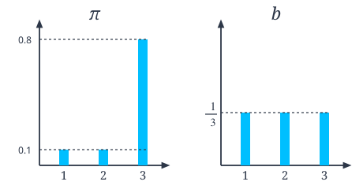
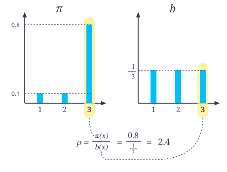

# 09.5 오프-정책과 중요도 샘플링

**그림 09-5** 탐험 지도(Behavior Policy)와 타깃 지도(Target Policy)의 확률 비율을 마법 저울에 올리고 오프-정책을 계산하는 지니와 도로시


에이전트가 '행동하는 정책'과 '학습하려는 대상 정책'이 서로 다를 때 활용하는 **오프-정책(Off-policy)** 학습법을 배웁니다. 다른 에이전트가 수행한 간접 데이터로부터 유용한 정보를 추출하기 위해 두 정책의 확률 비율을 계산하여 곱해주는 **중요도 샘플링(Importance Sampling)** 기법을 요정 지니의 대수적 마법 저울 정산법을 통해 마스터해봅시다!

---

앞서 몬테카를로법에 $\epsilon$-탐욕 정책을 결합하여 최적에 가까운 정책을 얻었습니다. 하지만 그 결과는 완벽한 최적 정책이 아닙니다. 우리는 (할 수만 있다면) Q 함수의 값이 가장 큰 행동만을 수행하도록 하고 싶습니다. 즉, '활용'만 하고 싶은 것입니다. 하지만 그러려면 '탐색'을 포기해야 합니다. 그래서 $\epsilon$이라는 작은 확률로 탐색을 수행했습니다. 말하자면, $\epsilon$-탐욕 정책은 일종의 타협인 셈입니다.

이번 절에서는 몬테카를로법을 이용해 완벽한 최적 정책을 학습하는 방법을 고민해보겠습니다. 이를 위한 준비 과정으로 먼저 온-정책과 오프-정책에 대해 알아봅니다.

## 09.5.1 온-정책과 오프-정책

사람은 다른 사람의 행동을 관찰하여 자신의 능력을 개선할 힌트를 얻기도 합니다. 예를 들어 다른 테니스 선수가 스윙하는 모습을 보고 자신의 스윙 자세를 고치기도 하죠. 강화 학습 용어로는 '자신과 다른 환경에서 얻은 경험을 토대로 자신의 정책을 개선한다'고 표현할 수 있습니다. 이러한 접근 방식을 강화 학습에서는 오프-정책<sup>off-policy</sup>이라고 합니다. 반면 스스로 쌓은 경험을 토대로 자신의 정책을 개선하는 방식은 온-정책<sup>on-policy</sup>이라고 합니다.


> [!NOTE]
> 역할 측면에서 보면 에이전트의 정책은 두 가지입니다. 하나는 평가와 개선의 대상으로서의 정책입니다. 즉, 정책에 대해 평가한 다음 개선합니다. 이러한 정책을 **대상 정책**<sup>target policy</sup>이라고 합니다.<sup>\*</sup> 다른 하나는 에이전트가 실제로 행동을 취할 때 활용하는 정책입니다. 이 정책에 따라 '상태, 행동, 보상'의 샘플 데이터가 생성됩니다. 이러한 정책을 **행동 정책**<sup>behaviour policy</sup>이라고 합니다.

지금까지 이 책에서는 '대상 정책'과 '행동 정책'을 구분하지 않았습니다. 즉, '평가와 개선의 대상인 대상 정책'과 '실제 행동을 선택하는 행동 정책'을 동일시한 것입니다. 이처럼 두 정책이 같은 경우를 온-정책, 따로 떼어서 생각하는 경우를 오프-정책이라고 합니다. 여기서 온/오프는 '연결되어 있다'와 '떨어져 있다'라는 뜻으로 해석하면 됩니다. 즉, 오프-정책은 '대상 정책과 행동 정책이 떨어져 있다'라는 의미입니다.

이번 절의 주제는 '오프-정책'입니다. 테니스 선수의 예처럼 다른 정책(행동 정책)에서 얻은 경험을 토대로 자신의 정책(대상 정책)을 평가하고 개선하는 것이죠. 오프-정책이라면 행동 정책에서는 '탐색'을, 대상 정책에서는 '활용'만을 할 수 있습니다. 다만, 행동 정책에서 얻은 샘플 데이터로부터 대상 정책과 관련된 기대값을 계산하는 방법은 고민을 좀 해야 합니다. 이때 등장하는 것이 바로 중요도 샘플링 기법입니다.

## 09.5.2 중요도 샘플링

**중요도 샘플링**<sup>importance sampling</sup>은 어떤 확률 분포의 기댓값을 다른 확률 분포에서 샘플링한 데이터를 사용하여 계산하는 기법입니다. $\mathbb{E}_{\pi}[x]$라는 기댓값 계산을 예로 중요도 샘플링을 설명해보겠습니다. 여기서 $x$는 확률 변수이며 $x$의 확률은 $\pi(x)$로 표기합니다. 그래서 확률 분포의 기댓값은 다음 식으로 표현됩니다.

$$
\mathbb{E}_{\pi}[x] = \sum x \pi(x)
$$

이 기댓값을 몬테카를로법으로 근사하려면 $x$를 확률 분포 *π*에서 샘플링하여 평균을 내면 됩니다.

---

\* 옮긴이_ '목표 정책'이라고도 많이 번역하지만 '대상 정책'이 본래의 의미(개선 대상)를 더 직관적으로 표현한다고 생각하여 이 책에서는 '대상 정책'으로 옮겼습니다.


$$
\begin{aligned}
&\text{샘플링: } x^{(i)} \sim \pi \quad (i = 1, 2, \cdots, n) \\
&\mathbb{E}_{\pi}[x] \simeq \frac{x^{(1)} + x^{(2)} + \cdots + x^{(n)}}{n}
\end{aligned}
$$

이 수식에서 $x^{(i)} \sim \pi$ 표기는 확률 분포 *π*에서 $i$번째 데이터 $x^{(i)}$가 샘플링되었음을 나타냅니다.

이제 본론으로 들어갑시다. 지금 우리는 $x$가 다른 확률 분포에서 샘플링된 경우의 문제를 풀고자 합니다. 예를 들어 $x$가 (*π*가 아닌) $b$라는 확률 분포에서 샘플링되었다고 가정해봅시다. 이 경우에 기댓값 $\mathbb{E}_{\pi}[x]$는 어떻게 근사할 수 있을까요? 해결의 열쇠는 다음과 같은 식 변형에 있습니다.

$$
\begin{aligned}
\mathbb{E}_{\pi}[x] &= \sum x \pi(x) \\
&= \sum x \frac{b(x)}{b(x)} \pi(x) \\
&= \sum x \frac{\pi(x)}{b(x)} b(x)
\end{aligned}
$$
[식 6.6]

여기서 핵심은 두 번째 줄에서 $\frac{b(x)}{b(x)}$를 끼워넣는 부분입니다. $\frac{b(x)}{b(x)}$는 항상 1이므로 등식이 성립합니다. 그리고 [식 6.6]과 같이 $\sum \cdots b(x)$ 형태로 바꾸면 확률 분포 $b(x)$에서의 기댓값으로 간주할 수 있습니다. 실제로 [식 6.6]을 한 번 더 변형하면 다음 식을 얻을 수 있습니다.

$$
\begin{aligned}
\mathbb{E}_{\pi}[x] &= \sum x \frac{\pi(x)}{b(x)} b(x) \\
&= \mathbb{E}_b \left[ x \frac{\pi(x)}{b(x)} \right]
\end{aligned}
$$
[식 6.7]

이 수식에서 주목할 부분은 $\mathbb{E}_b$입니다. 확률 분포 *π*에 대한 기댓값을 확률 분포 $b$에 대한 기댓값으로 표현해낸 것입니다. 또한 각각의 $x$에 $\frac{\pi(x)}{b(x)}$가 곱해진다는 점도 중요합니다. 여기서 $\rho(x) = \frac{\pi(x)}{b(x)}$라고 하면, 각각의 $x$에는 '가중치'로서 $\rho(x)$가 곱해진다고 볼 수 있습니다($\rho$는 '로우'로 읽습니다).

[식 6.7]에 근거하여 몬테카를로법을 수식으로 표현하면 다음과 같습니다.


$$
\begin{aligned}
&\text{샘플링: } x^{(i)} \sim b \quad (i = 1, 2, \cdots, n) \\
&\mathbb{E}_{\pi}[x] \simeq \frac{\rho(x^{(1)})x^{(1)} + \rho(x^{(2)})x^{(2)} + \cdots + \rho(x^{(n)})x^{(n)}}{n}
\end{aligned}
$$

이제 다른 확률 분포 $b$에서 샘플링한 데이터를 이용하여 $\mathbb{E}_{\pi}[x]$를 계산할 수 있습니다.

그럼 이어서 중요도 샘플링을 코드로 구현해봅시다. [그림 09-19]의 확률 분포를 대상으로 중요도 샘플링을 수행하겠습니다.

**그림 09-19** 확률 분포 *π*와 $b$



지금 목표는 기댓값 $\mathbb{E}_{\pi}[x]$를 구하는 것입니다. 먼저 확률 분포 *π*의 기댓값을 일반적인 몬테카를로법으로 구해보겠습니다.

<div align="right"><b>ch05/importance_sampling.py</b></div>

```python
import numpy as np

x = np.array([1, 2, 3])          # 확률 변수
pi = np.array([0.1, 0.1, 0.8])   # 확률 분포

# 기댓값의 참값 계산
e = np.sum(x * pi)
print('참값(E_pi[x]):', e)

# 몬테카를로법으로 계산
n = 100 # 샘플 개수
samples = []
for _ in range(n):
    s = np.random.choice(x, p=pi) # pi를 이용한 샘플링
    samples.append(s)
mean = np.mean(samples) # 샘플들의 평균
var = np.var(samples)   # 샘플들의 분산
print('몬테카를로법: {:.2f} (분산: {:.2f})'.format(mean, var))
```

**출력 결과**
```
참값(E_pi[x]): 2.7
몬테카를로법: 2.78 (분산: 0.27)
```

먼저 기댓값을 정의식에 맞게 구합니다. 그 결과는 2.7입니다(이 값이 참값입니다).

이어서 몬테카를로법을 이용하여 구합니다. 여기서는 확률 분포 `pi`에서 데이터를 100개만 샘플링하여 평균을 구했습니다(넘파이의 `np.mean()` 메서드 사용). 그 결과는 2.78로, 참값에 가깝게 나왔습니다. 그리고 넘파이의 `np.var()` 메서드를 사용하여 '분산'도 구했습니다. 분산은 0.27로 나왔네요. 이 값은 곧이어 중요도 샘플링의 결과와 비교해볼 것입니다.

참고로 분산은 데이터가 얼마나 흩어져 있는가를 나타냅니다. 기댓값과 분산의 관계를 수식으로 표현하면 다음과 같습니다.

$$
\operatorname{Var}[X] = \mathbb{E}[(X - \mathbb{E}[X])^2]
$$

분산은 '데이터 $X$'와 '$X$의 평균인 $\mathbb{E}[X]$'의 차이를 제곱한 값의 기댓값입니다. 직관적으로는 [그림 09-20]과 같이 데이터의 '흩어진 정도'를 나타냅니다.

**그림 09-20** 각 데이터가 2차원상의 점이라고 가정했을 때의 분산(원의 중심이 평균)


이어서 중요도 샘플링을 이용하여 기댓값을 구해보겠습니다.

<div align="right"><b>ch05/importance_sampling.py</b></div>

```python
b = np.array([1/3, 1/3, 1/3]) # 확률 분포
n = 100 # 샘플 개수
samples = []

for _ in range(n):
    idx = np.arange(len(b))         # b의 인덱스([0, 1, 2])
    i = np.random.choice(idx, p=b)  # b를 사용하여 샘플링
    s = x[i]
    rho = pi[i] / b[i]              # 가중치
    samples.append(rho * s)         # 샘플 데이터에 가중치를 곱해 저장

mean = np.mean(samples)
var = np.var(samples)
print('중요도 샘플링: {:.2f} (분산: {:.2f})'.format(mean, var))
```

**출력 결과**
```
중요도 샘플링: 2.95 (분산: 10.63)
```

이번에는 확률 분포 `b`를 사용하여 샘플링합니다. 단, 샘플링하는 대상은 '`b`의 인덱스(`[0, 1, 2]`)'로 설정했습니다. 가중치 `rho`를 계산할 때 샘플링한 인덱스를 사용하기 때문입니다.

출력 결과를 보겠습니다. 평균은 2.95입니다. 참값인 2.7과는 조금 거리가 있지만 아주 동떨어진 값은 아닙니다. 한편 분산은 10.63으로, 데이터의 '흩어진 정도'가 몬테카를로법 때의 0.27보다 훨씬 큰 것을 알 수 있습니다.

## 09.5.3 분산을 작게 하기

분산이 작을수록 적은 샘플로도 정확하게 근사할 수 있습니다. 반대로 분산이 클수록 샘플을 더 많이 사용해야 합니다. 그래서 이제부터 중요도 샘플링에서 분산을 줄이는 방법을 알아보겠습니다. 먼저 [그림 09-21]을 보면서 중요도 샘플링을 쓰면 분산이 커지는 이유를 설명하겠습니다.


**그림 09-21** 확률 분포 $b$에서 3을 샘플링한 예



[그림 09-21]은 샘플 데이터로 3을 선택한 예를 보여줍니다. 이때 가중치 $\rho$는 2.4입니다. 즉, 3을 뽑았음에도 결과적으로 $3 \times 2.4 = 7.2$를 얻는다는 뜻입니다. 뭔가 잘못됐다고 느껴질 수 있지만 말이 되는 상황입니다. 이유는 다음과 같습니다.

* 확률 분포 *π*를 기준으로 했을 때 3은 대표적인 값이기 때문에 (원래는) 3이 많이 샘플링되어야 한다.
* 하지만 확률 분포 $b$에서는 3이 특별히 많이 선택되지 않는다.
* 이 간극을 메우기 위해 3이 샘플링된 경우, 그 값이 커지도록 '가중치'를 곱하여 조정한다.

이처럼 확률 분포 *π*와 $b$의 차이를 고려하여 샘플링된 값에 가중치를 곱하여 조정하는 일 자체는 의미가 있습니다. 하지만 샘플링된 값은 3인데 7.2로 취급한다면 그리고 만약 지금이 첫 번째 샘플 데이터라면, 현시점의 추정값은 7.2가 된다는 문제가 생깁니다. 참값이 2.7이니 너무 크게 벗어나는 셈입니다. 이처럼 실제 얻은 값에 부여하는 가중치 $\rho$의 보정 효과가 클수록 분산(참값으로부터의 편차)이 커집니다.

그렇다면 어떻게 해야 분산을 줄일 수 있을까요? 두 확률 분포($b$와 *π*)를 가깝게 만들면 됩니다. 이렇게 하면 가중치 $\rho$의 값을 1에 가깝게 만들 수 있습니다.

실험을 해봅시다. 직전 코드에서 확률 분포 $b$의 값만 바꿔보겠습니다.


<div align="right"><b>ch05/importance_sampling.py</b></div>

```python
b = np.array([0.2, 0.2, 0.6]) # 확률 분포 변경 (앞에서는 [1/3, 1/3, 1/3]로 설정)
n = 100
samples = []

for _ in range(n):
    idx = np.arange(len(b)) # [0, 1, 2]
    i = np.random.choice(idx, p=b)
    s = x[i]
    rho = pi[i] / b[i]
    samples.append(rho * s)

mean = np.mean(samples)
var = np.var(samples)
print('중요도 샘플링: {:.2f} (분산: {:.2f})'.format(mean, var))
```

**출력 결과**
```
중요도 샘플링: 2.72 (분산: 2.48)
```

이와 같이 확률 분포 `b`를 `[0.2, 0.2, 0.6]`으로 변경하여 확률 분포 `pi`에 가깝게 만들어봅니다 (`pi = [0.1, 0.1, 0.8]`). 결과는 평균이 2.72로, 참값에 더 가까워졌습니다. 이때 분산은 2.48이며 이전 결과보다 작아졌음을 알 수 있습니다.

이처럼 중요도 샘플링 시 두 확률 분포를 비슷하게 설정하면 분산을 줄일 수 있습니다. 단, 강화 학습에서 핵심은 한쪽 정책(확률 분포)은 '탐색'에, 다른 쪽 정책은 '활용'에 이용하는 것입니다. 이 조건을 염두에 둔 상태에서 두 확률 분포를 최대한 가깝게 조정하면 분산을 줄일 수 있습니다.

이것이 바로 중요도 샘플링입니다. 중요도 샘플링을 이용하면 오프-정책을 구현할 수 있습니다. 즉, 행동 정책이라는 확률 분포에서 샘플링된 데이터를 토대로 대상 정책에 대한 기댓값을 계산할 수 있습니다.

이번 장에서는 설명을 이쯤에서 마치고 더 자세한 방법은 부록 A에서 다룹니다. 한 걸음 더 들어간 주제이니 관심 있는 분은 참고하기 바랍니다.


