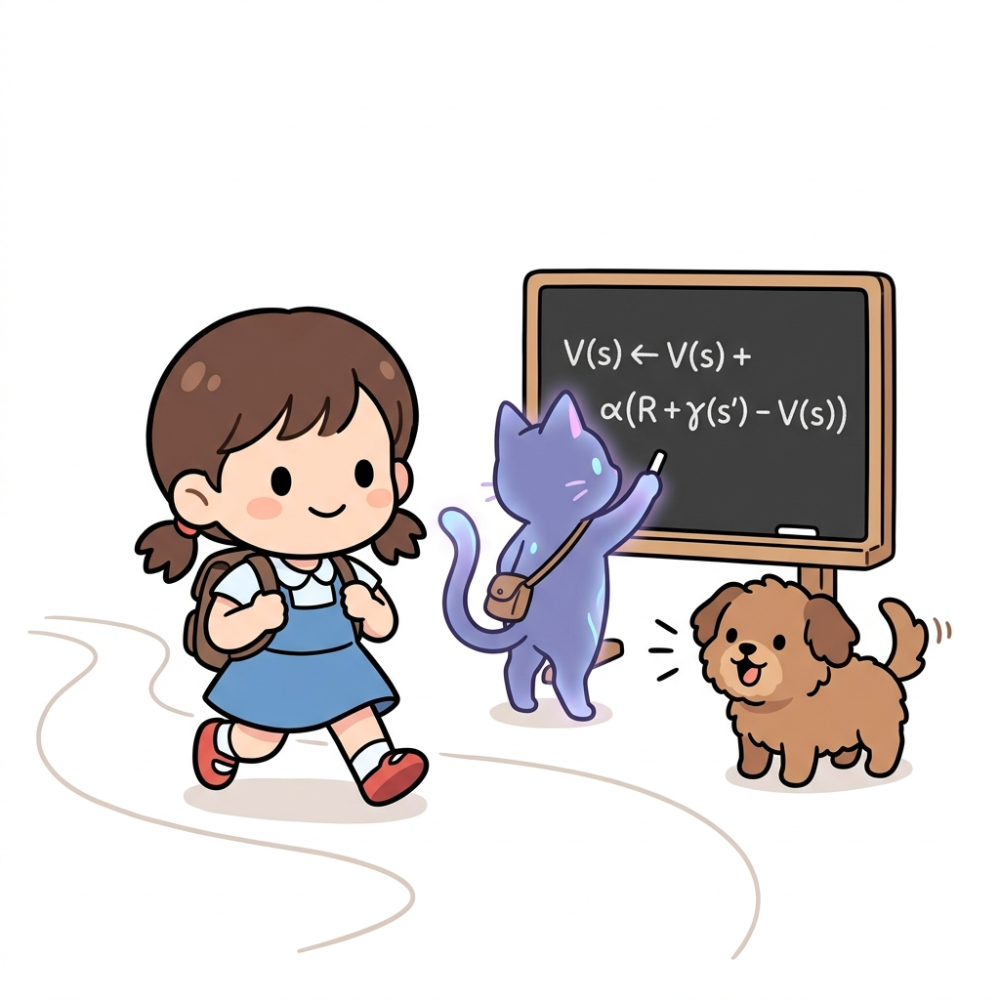
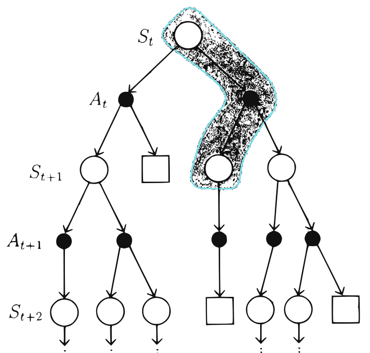
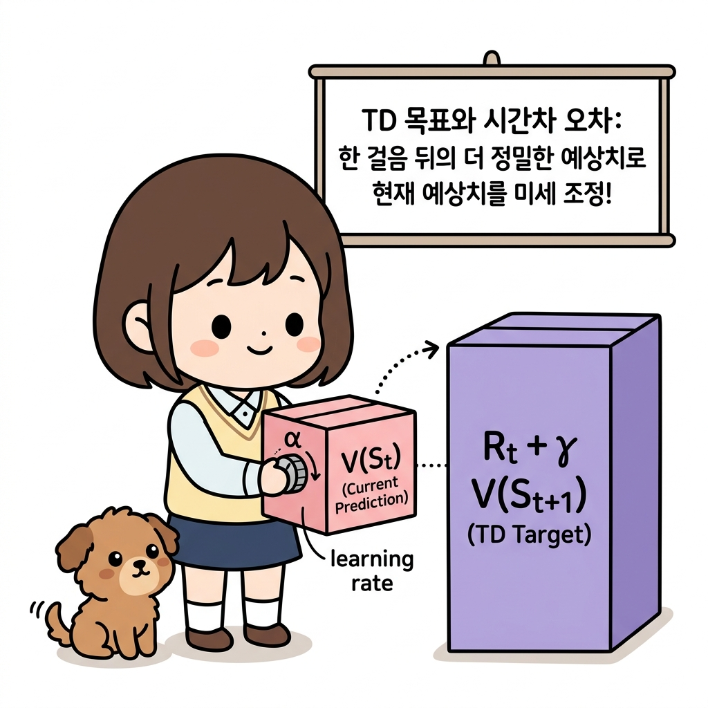
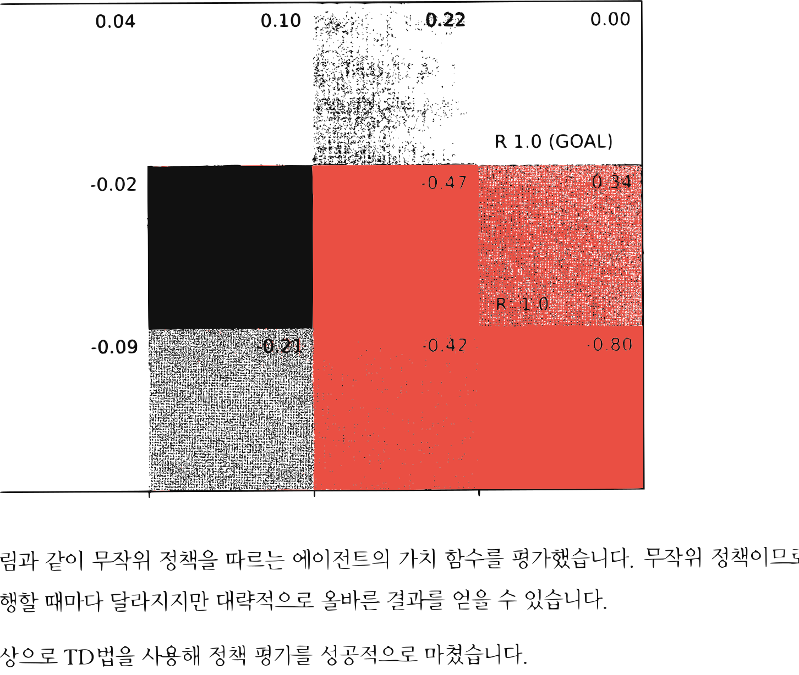

# 10.1 TD법으로 정책 평가하기

**그림 10-1** 도로시가 징검다리를 한 걸음 내딛자마자 칠판의 점화식 공식을 이용해 즉시 상태 가치 V(s)를 갱신해주는 지니


동적 계획법(DP)과 몬테카를로법(MC)의 강력한 장점을 융합하여 탄생한 **TD(시간차, Temporal Difference) 정책 평가** 기법을 공부합니다. 에피소드가 완결되기 전이라도, 행동을 취하자마자 한 단계 뒤의 다음 상태 가치를 이용해 가치 평가 카드를 실시간 갱신하는 공식을 요정 지니의 칠판 필기법으로 통쾌하게 유도해봅시다!

---

TD법은 지금까지 배운 '몬테카를로법'과 '동적 프로그래밍'을 합친 기법입니다. 따라서 먼저 이 두 기법을 복습한 후 TD법을 도출하겠습니다. 이번 장에서는 편의상 몬테카를로법을 'MC법',


동적 프로그래밍을 'DP법'으로 줄여 쓰겠습니다 (동적 프로그래밍은 DP로 쓰는 게 일반적이지만 TD법, MC법과 형식을 통일하고자 DP법으로 표기하겠습니다).

## 10.1.1 TD법 도출

먼저 '수익'에 대해 복습하겠습니다. 우리는 수익을 다음과 같이 정의했습니다.

$$
G_t = R_t + \gamma R_{t+1} + \gamma^2 R_{t+2} + \cdots
$$
[식 7.1]

$$
= R_t + \gamma G_{t+1}
$$
[식 7.2]

시간 *t*부터 시작하여 보상이 $R_t, R_{t+1} \cdots$ 식으로 주어진다면, 수익은 [식 7.1]과 같이 할인율을 적용한 보상들의 총합으로 표현됩니다. 그리고 [식 7.2]처럼 *G*<sub>*t*</sub>를 *G*<sub>*t+1*</sub>을 써서 재귀적으로 표현할 수도 있습니다.

이 수익을 적용하면 '가치 함수'는 다음과 같이 정의됩니다.

$$
v_{\pi}(s) = \mathbb{E}_{\pi}[G_t \mid S_t = s]
$$
[식 7.3]

$$
= \mathbb{E}_{\pi}[R_t + \gamma G_{t+1} \mid S_t = s]
$$
[식 7.4]

가치 함수는 이 식과 같이 기댓값으로 정의됩니다. 이번 절에서 다음의 두 가지를 보여줄 것입니다.

* [식 7.3]으로부터 MC법을 이용하는 기법 도출
* [식 7.4]로부터 DP법을 이용하는 기법 도출

'MC법'부터 살펴보겠습니다. MC법에서는 기댓값을 계산하는 대신 실제 수익의 샘플 데이터를 평균하여 [식 7.3]의 기댓값을 근사합니다. 평균에는 표본 평균과 지수 이동 평균이 있습니다. 지수 이동 평균을 이용하려면 새로운 수익이 발생할 때마다 고정된 값 *α*로 갱신합니다. 수식으로는 다음과 같습니다.

$$
V_{\pi}'(S_t) = V_{\pi}(S_t) + \alpha \{ G_t - V_{\pi}(S_t) \}
$$
[식 7.5]


여기서 *V*<sub>*π*</sub>는 현재의 가치 함수이고 $V_{\pi}'$는 갱신 후의 가치 함수입니다. 그래서 [식 7.5]는 현재의 가치 함수 *V*<sub>*π*</sub>를 *G*<sub>*t*</sub> 쪽으로 갱신하고 있습니다. *G*<sub>*t*</sub> 쪽으로 얼마나 갱신할지는 *α*로 조정합니다.

다음은 'DP법'입니다. DP법은 (MC법과 달리) [식 7.4]의 계산으로 기댓값을 구합니다. 수식으로는 다음과 같습니다.

$$
v_{\pi}(s) = \mathbb{E}_{\pi}[R_t + \gamma G_{t+1} \mid S_t = s]
$$
[식 7.4]

$$
= \sum_{a, s'} \pi(a \mid s) p(s' \mid s, a) \{ r(s, a, s') + \gamma v_{\pi}(s') \}
$$
[식 7.6]

참고로 [식 7.6]은 벨만 방정식입니다. 즉, DP법은 벨만 방정식을 기반으로 가치 함수를 순차적으로 갱신합니다. 갱신식은 다음과 같습니다.

$$
V_{\pi}'(s) = \sum_{a, s'} \pi(a \mid s) p(s' \mid s, a) \{ r(s, a, s') + \gamma V_{\pi}(s') \}
$$
[식 7.7]

[식 7.7]에서 중요한 점은 '현재 상태에서의 가치 함수'를 '다음 상태에서의 가치 함수'로 갱신한다는 것입니다. 이때 모든 전이를 고려하고 있다는 게 특징입니다. MC법과 비교해보면 DP법의 이러한 특징이 더욱 도드라집니다. [그림 10-1]을 보시죠.

**그림 10-1** DP법과 MC법 비교




[그림 10-1]은 상태 *S*<sub>*t*</sub>에서 시작하여 이후의 모든 전이를 표현한 모습입니다. DP법은 다음 가치 함수의 추정치를 이용하여 현재 가치 함수의 추정치를 갱신합니다. 이 원리를 '부트스트랩'이라고 합니다. 반면, MC법은 실제로 얻은 일부 경험만을 토대로 현재의 가치 함수를 갱신합니다. 이 두 방법을 융합한 것이 [그림 10-2]의 TD법입니다.

**그림 10-2** TD법 아이디어


TD법은 [그림 10-2]와 같이 다음 행동과 가치 함수만을 이용하여 현재 가치 함수를 갱신합니다. 중요한 점은 다음 두 가지입니다.

* DP법처럼 부트스트랩을 통해 가치 함수를 순차적으로 갱신
* MC법처럼 환경에 대한 정보 없이 샘플링된 데이터만으로 가치 함수 갱신

이제 TD법을 수식에서 도출해보겠습니다. 먼저 [식 7.6]을 다음과 같이 전개합니다.

$$
v_{\pi}(s) = \sum_{a, s'} \pi(a \mid s) p(s' \mid s, a) \{ r(s, a, s') + \gamma v_{\pi}(s') \}
$$
[식 7.6]

$$
= \mathbb{E}_{\pi} [R_t + \gamma v_{\pi}(S_{t+1}) \mid S_t = s]
$$
[식 7.8]

[식 7.6]은 모든 후보에 대해 $r(s, a, s') + \gamma v_{\pi}(s')$를, 즉 보상과 다음 가치 함수를 계산합니다. 이를 기댓값 $\mathbb{E}_{\pi}$ 형태로 다시 쓰면 [식 7.8]이 됩니다. TD법에서는 [식 7.8]을 이용하여 가치 함수를 갱신하는데, $R_t + \gamma v_{\pi}(S_{t+1})$ 부분을 샘플 데이터에서 근사합니다. 그래서 TD법


갱신식을 수식으로 표현하면 다음과 같습니다.

$$
V_{\pi}'(S_t) = V_{\pi}(S_t) + \alpha \{ R_t + \gamma V_{\pi}(S_{t+1}) - V_{\pi}(S_t) \}
$$
[식 7.9]

[식 7.9]의 *V*<sub>*π*</sub>는 가치 함수의 추정치이고 *R*<sub>*t*</sub> + *γ* *V*<sub>*π*</sub>(*S*<sub>*t+1*</sub>)은 목적지(목표)입니다. 이 목적지를 **TD 목표**<sup>TD target</sup>라고 하며 TD법은 *V*<sub>*π*</sub>(*S*<sub>*t*</sub>)를 TD 목표 방향으로 갱신합니다.



> **도로시와 토토의 비유로 이해하기**:
> 도로시가 현재 예상하는 가치 상자 *V*(*S*<sub>*t*</sub>)를 더 믿을 만한 기준 상자인 *R*<sub>*t*</sub> + *γ* *V*<sub>*S*<sub>*t+1*</sub></sub> (TD 목표)에 도달하도록 조절하려고 합니다. 두 예측 상자의 차이(TD 오차)를 구한 뒤, 학습 속도를 제어하는 *α*(디렉터 다이얼) 만큼만 살짝 갱신 방향으로 당겨주어 크기를 보정해 나가는 비유입니다!

> [!NOTE]
> 여기서는 1단계 앞의 정보를 TD 목표로 사용했습니다. 이 아이디어를 확장하면 2단계 앞, 3단계 앞과 같이 n단계 앞의 정보를 이용하는 것도 생각할 수 있습니다. 이를 **n단계 TD법**이라고 합니다. n단계 TD법은 부록 B에서 설명하니 관심 있는 분은 참고하기 바랍니다.

## 10.1.2 MC법과 TD법 비교

환경 모델을 모를 때 사용할 수 있는 도구로 MC법과 TD법이 있습니다. 그렇다면 둘 중 어느 방법을 사용해야 할까요? 혹은 어느 방법이 더 나을까요? 지속적인 과제에서는 MC법을 사용할 수 없으니 TD법 외에는 대안이 없습니다. 하지만 일회성 과제라면 어떨까요? 안타깝게도 이론적으로 어느 쪽이 항상 더 나은지는 증명되지 않았습니다. 하지만 현실의 많은 문제에서는 TD법이 더 빠르게 학습합니다 (가치 함수 갱신이 더 빠릅니다). MC법과 TD법이 무엇을 목표로 하는지 보면 그 이유를 알 수 있습니다.

**그림 10-3** MC법과 TD법 비교

〈MC법〉 $V_{\pi}'(S_t) = V_{\pi}(S_t) + \alpha \{ G_t - V_{\pi}(S_t) \}$

〈TD법〉 $V_{\pi}'(S_t) = V_{\pi}(S_t) + \alpha \{ R_t + \gamma V_{\pi}(S_{t+1}) - V_{\pi}(S_t) \}$

보다시피 MC법은 *G*<sub>*t*</sub>를 목표로 하여 그 방향으로 *V*<sub>*π*</sub>를 갱신합니다. 여기서 *G*<sub>*t*</sub>는 목표에 도달했을 때 얻을 수 있는 수익의 샘플 데이터입니다. 반면 TD법의 목표는 한 단계 앞의 정보를 이용해 계산합니다. 이 경우 시간이 한 단계씩 진행될 때마다 가치 함수를 갱신할 수 있기 때문에 효율적인 학습을 기대할 수 있습니다.


또한 MC법의 목표는 많은 시간을 쌓아서 얻은 결과이기 때문에 값의 '변동'이 심한 편입니다. 즉, 분산<sup>variance</sup>이 큽니다. 반면 TD법은 한 단계 앞의 데이터를 기반으로 하여 변동이 적습니다. 따라서 [그림 10-4]와 같은 상황이 됩니다.

**그림 10-4** 시간을 거듭할수록 '변동성'이 커진다.


[그림 10-4]는 달리는 자동차의 움직임을 묘사하고 있습니다. 운전자는 확률적으로 핸들을 오른쪽 또는 왼쪽으로 돌리거나 그대로 둘 수 있습니다. 선이 여러 개인 이유는 여러 가지 가능성을 그렸기 때문입니다. 여기서 주목할 점은 시간이 지날수록 이동 경로의 변동이 커진다는 사실입니다. 이 그림이 MC법과 TD법의 목표에도 그대로 적용됩니다. MC법의 목표는 오랜 시간이 쌓인 결과이기 때문에 분산이 큽니다. 반면 TD법의 목표(TD 목표)는 겨우 한 단계 앞의 시간이기 때문에 분산이 작습니다.

TD 목표는 $R_t + \gamma V_{\pi}(S_{t+1})$인데, 잘 보면 추정치인 *V*<sub>*π*</sub>가 사용되고 있습니다. 즉 TD법은 '추정치로 추정치를 갱신'하는 부트스트랩핑입니다. 이처럼 TD 목표는 추정치를 포함하기 때문에 정확한 값이 아닙니다. 학문적으로는 '편향이 있다'라고 합니다. 하지만 편향은 갱신이 반복될 때마다 점점 작아져 결국에는 0으로 수렴합니다.

반면, MC법의 목표에는 추정치가 포함되지 않기 때문에 '편향이 없다'라고 할 수 있습니다.


## 10.1.3 TD법 구현

TD법을 구현해보겠습니다. 여기서 보여드릴 `TdAgent` 클래스는 무작위 정책에 따라 행동하는 에이전트이며 TD법으로 정책을 평가합니다. 코드는 다음과 같습니다.

<div align="right"><b>ch06/td_eval.py</b></div>

```python
class TdAgent:
    def __init__(self):
        self.gamma = 0.9
        self.alpha = 0.01
        self.action_size = 4

        random_actions = {0: 0.25, 1: 0.25, 2: 0.25, 3: 0.25}
        self.pi = defaultdict(lambda: random_actions)
        self.V = defaultdict(lambda: 0)

    def get_action(self, state):
        action_probs = self.pi[state]
        actions = list(action_probs.keys())
        probs = list(action_probs.values())
        return np.random.choice(actions, p=probs)

    def eval(self, state, reward, next_state, done):
        next_V = 0 if done else self.V[next_state] # 목표 지점의 가치 함수는 0
        target = reward + self.gamma * next_V

        self.V[state] += (target - self.V[state]) * self.alpha
```

`TdAgent` 클래스는 지금까지 구현한 에이전트 클래스들(5장에서 구현한 `McAgent` 등)과 공통점이 많습니다. 그래서 다른 코드는 생략하고 TD법을 이용하여 정책을 평가하는 `eval()` 메서드만 설명하겠습니다.

`eval()` 메서드를 매개변수까지 표기하면 `eval(self, state, reward, next_state, done)`입니다. 이 메서드는 상태 `state`에서 행동 `action`을 수행하고, 보상 `reward`를 받고, 다음 상태 `next_state`로 넘어갔을 때 호출됩니다. 또한 에피소드가 끝났는지 여부(`next_state`가 목표인지 여부)를 나타내는 플래그 `done`도 매개변수로 받습니다.


> [!NOTE]
> 가치 함수는 미래에 얻을 수 있는 보상의 총합입니다. 따라서 목표 지점에서의 가치 함수는 항상 0입니다. 이후로 더 얻을 보상이 아무것도 없기 때문입니다.

이제 에이전트를 실제로 행동하도록 시켜 정책을 평가해봅시다. 총 1000번의 에피소드를 실행하겠습니다.

<div align="right"><b>ch06/td_eval.py</b></div>

```python
env = GridWorld()
agent = TdAgent()

episodes = 1000
for episode in range(episodes):
    state = env.reset()

    while True:
        action = agent.get_action(state)
        next_state, reward, done = env.step(action)

        agent.eval(state, reward, next_state, done) # 매번 호출
        if done:
            break
        state = next_state

env.render_v(agent.V)
```

5장에서 본 MC법 코드와 거의 같습니다 (`ch05/mc_eval.py`). 가장 큰 차이는 에이전트의 `eval()` 메서드를 매번 호출한다는 점인데, TD법은 시간이 한 단계씩 진행될 때마다 갱신하기 때문입니다. 반면 MC법에서는 목표에 도달해야만 `eval()` 메서드를 호출합니다.

그럼 코드를 실행해봅시다. 결과는 다음과 같습니다.


**그림 10-5** TD법으로 얻은 가치 함수



그림과 같이 무작위 정책을 따르는 에이전트의 가치 함수를 평가했습니다. 무작위 정책이므로 실행할 때마다 달라지지만 대략적으로 올바른 결과를 얻을 수 있습니다.

이상으로 TD법을 사용해 정책 평가를 성공적으로 마쳤습니다.

