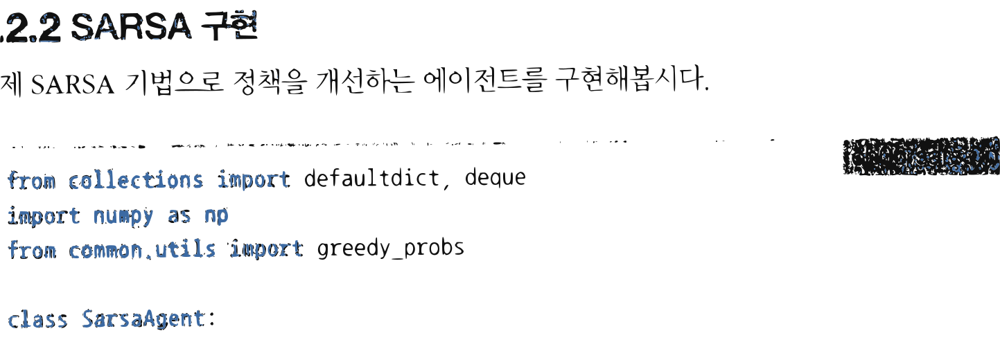
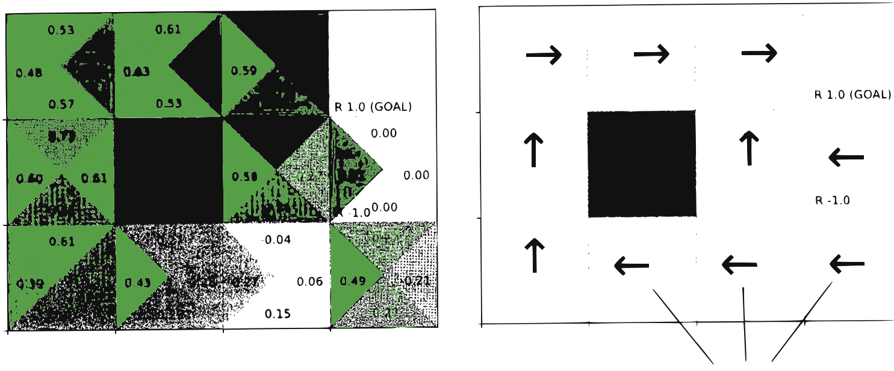

# 10.2 SARSA

**그림 10-2** 온-정책 시간차 제어를 실현하기 위해 다섯 개의 알파벳 문자 블록 S, A, R, S, A를 체인으로 엮어 들고 있는 도로시와 지니


(상태, 행동, 보상, 다음 상태, 다음 행동)의 연속적인 흐름을 뜻하는 **SARSA(살사)** 알고리즘을 공부합니다. 온-정책(On-policy) 제어 루프 하에서 가치 평가와 개선을 한 걸음 단위로 교차 실행하는 구조를 귀여운 스펠링 블록체인 비유를 통해 확실하게 정복해봅시다!

---

앞 절에서는 TD법으로 정책을 평가했습니다. 정책 평가가 끝나면 다음 단계는 정책 제어입니다. 이미 익숙해진 흐름일 겁니다. 이번 절에서도 평가와 개선을 반복하여 최적 정책에 가까워지는 과정을 거칩니다. 특히 이번에는 '온-정책'에 속하는 SARSA 기법을 소개합니다.

> [!NOTE]
> 5.5절에서 설명한 것처럼 정책 제어 방식에는 대상 정책과 행동 정책이 같은 온-정책과 둘이 서로 다른 오프-정책이 있습니다. 이번 절에서는 온-정책 방식을, 다음 절부터는 오프-정책 방식을 다루겠습니다.


## 10.2.1 온-정책 SARSA

앞 절에서는 가치 함수 $V_{\pi}(s)$를 평가했습니다. 하지만 정책을 제어할 때는 상태 가치 함수 $V_{\pi}(s)$가 아닌 행동 가치 함수(Q 함수) $Q_{\pi}(s, a)$가 대상입니다. 개선 단계에서는 정책을 탐욕화해야 하며, $V_{\pi}(s)$의 경우 환경 모델이 필요합니다. 반면, $Q_{\pi}(s, a)$라면 다음 식처럼 계산할 수 있습니다.

$$
\mu(s) = \underset{a}{\operatorname{argmax}} Q_{\pi}(s, a)
$$

보다시피 환경 모델이 필요하지 않습니다. 왜 그런지는 5.4.1절에서 설명했습니다.

앞 절에서 도출한 상태 가치 함수 $V_{\pi}(s)$를 이용하는 TD법의 갱신식은 [식 7.9]로 나타낼 수 있습니다.

$$
V_{\pi}'(S_t) = V_{\pi}(S_t) + \alpha \{ R_t + \gamma V_{\pi}(S_{t+1}) - V_{\pi}(S_t) \}
$$
[식 7.9]

여기서 상태 가치 함수를 Q 함수로 바꿔봅시다. *V*<sub>*π*</sub>(*S*<sub>*t+1*</sub>)을 *Q*<sub>*π*</sub>(*S*<sub>*t+1*</sub>, *A*<sub>*t+1*</sub>)로 대체하고, *V*<sub>*π*</sub>(*S*<sub>*t*</sub>)를 *Q*<sub>*π*</sub>(*S*<sub>*t*</sub>, *A*<sub>*t*</sub>)로 대체하면 다음과처럼 됩니다.

$$
Q_{\pi}'(S_t, A_t) = Q_{\pi}(S_t, A_t) + \alpha \{ R_t + \gamma Q_{\pi}(S_{t+1}, A_{t+1}) - Q_{\pi}(S_t, A_t) \}
$$
[식 7.10]

[식 7.10]이 Q 함수를 대상으로 한 TD법의 갱신식입니다.

다음으로 온-정책 형태의 정책 제어 방식에 대해 설명하겠습니다. 온-정책에서 에이전트는 정책을 하나만 가지고 있습니다. 실제로 행동을 선택하는 정책(행동 정책)과 평가 및 개선할 정책(대상 정책)이 일치하는 것이죠.

> [!NOTE]
> 온-정책의 경우 행동 정책과 대상 정책이 같으므로 개선 단계에서는 완벽하게 탐욕화할 수 없습니다. 완벽하게 탐욕화하면 '탐색'을 포기해야 하기 때문이죠. 그래서 (타협하여) *ε*-탐욕 정책을 이용합니다. 그렇게 하면 이따금 탐색을 하면서도 대부분의 경우에는 탐욕스럽게 행동할 수 있습니다.

에이전트가 정책 *π*에 따라 행동한다고 합시다. 구체적으로 시간 *t*와 $t+1$에서 [그림 10-6]처럼 행동했다고 가정해보죠.


**그림 10-6** 시간 *t*와 $t+1$에서의 상태와 행동 전이



Q 함수는 상태와 행동을 묶은 데이터를 하나의 단위로 삼습니다. 따라서 [그림 10-6]에서는 시간 *t*에서의 상태와 행동 데이터를 $(S_t, A_t)$, 한 단계 다음 시간의 데이터를 $(S_{t+1}, A_{t+1})$로 묶어줬습니다. [그림 10-6]과 같은 데이터, 즉 $(S_t, A_t, R_t, S_{t+1}, A_{t+1})$을 얻었다면 [식 7.10]에 대입하여 *Q*<sub>*π*</sub>(*S*<sub>*t*</sub>, *A*<sub>*t*</sub>)를 즉시 갱신할 수 있습니다. 그리고 이 갱신이 끝나면 바로 '개선' 단계로 넘어갈 수 있습니다. 지금 예에서는 *Q*<sub>*π*</sub>(*S*<sub>*t*</sub>, *A*<sub>*t*</sub>)가 갱신되기 때문에 상태 *S*<sub>*t*</sub>에서의 정책이 바뀔 수 있습니다. 구체적으로 알아보면, 상태 *S*<sub>*t*</sub>에서의 정책은 다음과 같이 갱신될 수 있습니다.

$$
\pi'(a \mid S_t) = \begin{cases} \underset{a}{\operatorname{argmax}} Q_{\pi}(S_t, a) & (1 - \epsilon \text{의 확률}) \\ \text{무작위 행동} & (\epsilon \text{의 확률}) \end{cases}
$$
[식 7.11]

[식 7.11]과 같이 *ε*의 확률로 무작위 행동을 선택하고, 그 외에는 탐욕 행동을 선택합니다. 탐욕 행동으로 정책을 개선하고 무작위 행동으로 탐색이 수행하는 것이죠. 이러한 *ε*-탐욕 정책에 따라 상태 *S*<sub>*t*</sub>에서 행동을 선택하는 방법을 갱신합니다.

이렇게 [식 7.10]에 따른 평가와 [식 7.11]에 따른 갱신을 번갈아 반복하면 최적에 가까운 정책을 얻을 수 있습니다. 이 알고리즘이 바로 SARSA입니다. 참고로 SARSA라는 이름은 TD법에서 사용하는 데이터 $(S_t, A_t, R_t, S_{t+1}, A_{t+1})$에서 따온 것입니다.

## 10.2.2 SARSA 구현

이제 SARSA 기법으로 정책을 개선하는 에이전트를 구현해봅시다.

<div align="right"><b>ch06/sarsa.py</b></div>

```python
from collections import defaultdict, deque
import numpy as np
from common.utils import greedy_probs

class SarsaAgent:
    def __init__(self):
        self.gamma = 0.9
        self.alpha = 0.8
        self.epsilon = 0.1
        self.action_size = 4

        random_actions = {0: 0.25, 1: 0.25, 2: 0.25, 3: 0.25}
        self.pi = defaultdict(lambda: random_actions)
        self.Q = defaultdict(lambda: 0)
        self.memory = deque(maxlen=2) # ❶ deque 사용

    def get_action(self, state):
        action_probs = self.pi[state] # ❷ pi에서 선택
        actions = list(action_probs.keys())
        probs = list(action_probs.values())
        return np.random.choice(actions, p=probs)

    def reset(self):
        self.memory.clear()

    def update(self, state, action, reward, done):
        self.memory.append((state, action, reward, done))
        if len(self.memory) < 2:
            return

        state, action, reward, done = self.memory[0]
        next_state, next_action, _, _ = self.memory[1]
        # ❸ 다음 Q 함수
        next_q = 0 if done else self.Q[next_state, next_action]

        # ❹ TD법으로 self.Q 갱신
        target = reward + self.gamma * next_q
        self.Q[state, action] += (target - self.Q[state, action]) * self.alpha

        # ❺ 정책 개선
        self.pi[state] = greedy_probs(self.Q, state, self.epsilon)
```

`SarsaAgent` 클래스도 지금까지 구현한 에이전트 클래스들과 매우 비슷합니다. 그럼 코드의 ❶~❺ 부분을 순서대로 살펴봅시다.

❶에서는 파이썬 표준 라이브러리인 `collections.deque`를 사용합니다. `deque`는 리스트와


비슷하게 사용할 수 있습니다. 하지만 지정된 최대 원소 수(`maxlen`)를 초과하여 원소가 추가되면 선입선출<sup>first in, first out</sup> 원칙에 따라 가장 오래된 원소를 삭제합니다. 이 특성을 이용하여 가장 최근의 경험 데이터만 보관할 수 있습니다 (지금 코드에서는 최대 2개).

❷ `SarsaAgent` 클래스는 온-정책 방식이므로 정책을 하나만 사용합니다. `get_action(self, state)` 메서드는 `state`에서 행동을 하나 선택해주는데, 이때 유일한 정책인 `self.pi`에서 행동을 선택합니다.

❸ `done` 플래그가 `True`면 목표에 도달했음을 뜻합니다. 목표에서의 Q 함수는 항상 0입니다. Q 함수는 미래에 얻을 수 있는 보상의 총합인데, 이미 목표에 도달했으므로 앞으로 더 받을 게 없기 때문입니다.

❹ SARSA 알고리즘의 [식 7.10]에 따라 `self.Q`를 갱신합니다.

❺ 정책을 개선하기 위해 앞 장에서 구현한 `greedy_probs()` 함수를 사용합니다. 이제 정책 `self.pi`의 상태 `state`에서의 행동은 *ε*-탐욕 정책에 따라 결정됩니다.

이제 `SarsaAgent` 클래스를 실행해봅시다. 이번에도 '3 x 4 그리드 월드' 과제를 풀어보죠. 총 1만 번의 에피소드로 학습하고 마지막에 `env.render_q(agent.Q)`를 호출하여 Q 함수를 시각화하겠습니다.

<div align="right"><b>ch06/sarsa.py</b></div>

```python
env = GridWorld()
agent = SarsaAgent()

episodes = 10000
for episode in range(episodes):
    state = env.reset()
    agent.reset()

    while True:
        action = agent.get_action(state)
        next_state, reward, done = env.step(action)

        agent.update(state, action, reward, done) # ❶ 매번 호출

        if done:
            # ❷ 목표에 도달했을 때도 호출
            agent.update(next_state, None, None, None)
            break
        state = next_state
        break
    state = next_state

env.render_q(agent.Q) # Q 함수 시각화
```

여기서 주목할 점은 `agent.update()` 메서드를 호출하는 시점입니다. ❶ 우선 while 순환문 안에서 매번 호출합니다. 그런데 `agent.update()` 메서드는 두 번의 호출을 한 세트로 정책을 갱신합니다. ❷ 그래서 목표에 도달하면 `agent.update(next_state, None, None, None)` 형태로 한 번 더 호출합니다.

코드를 실행해보면 결과는 다음과 같습니다.

**그림 10-7** SARSA로 얻은 결과


폭탄에서 멀어지는 행동

결과는 실행할 때마다 다르지만 대체로 좋은 결과를 얻을 수 있습니다. [그림 10-7]의 정책에는 탐욕 행동만 화살표로 그려지지만, *ε*만큼의 무작위 행동이 포함됩니다. 정책에 무작위성이 있기 때문에 폭탄에서 가능한 한 멀어지도록 움직이는 걸 볼 수 있습니다.

이상으로 온-정책 SARSA 구현을 마칩니다.


