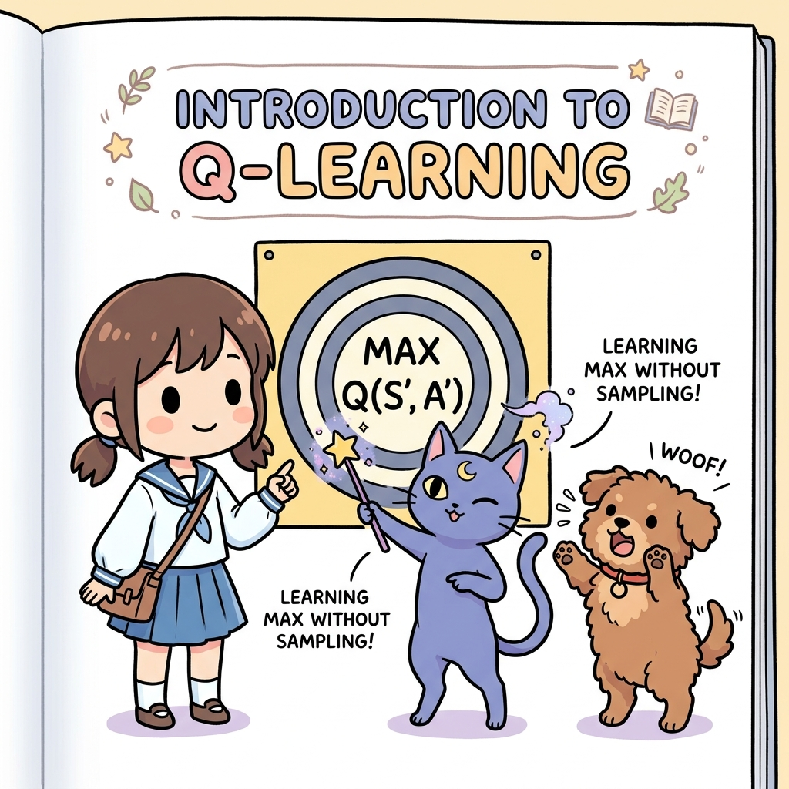
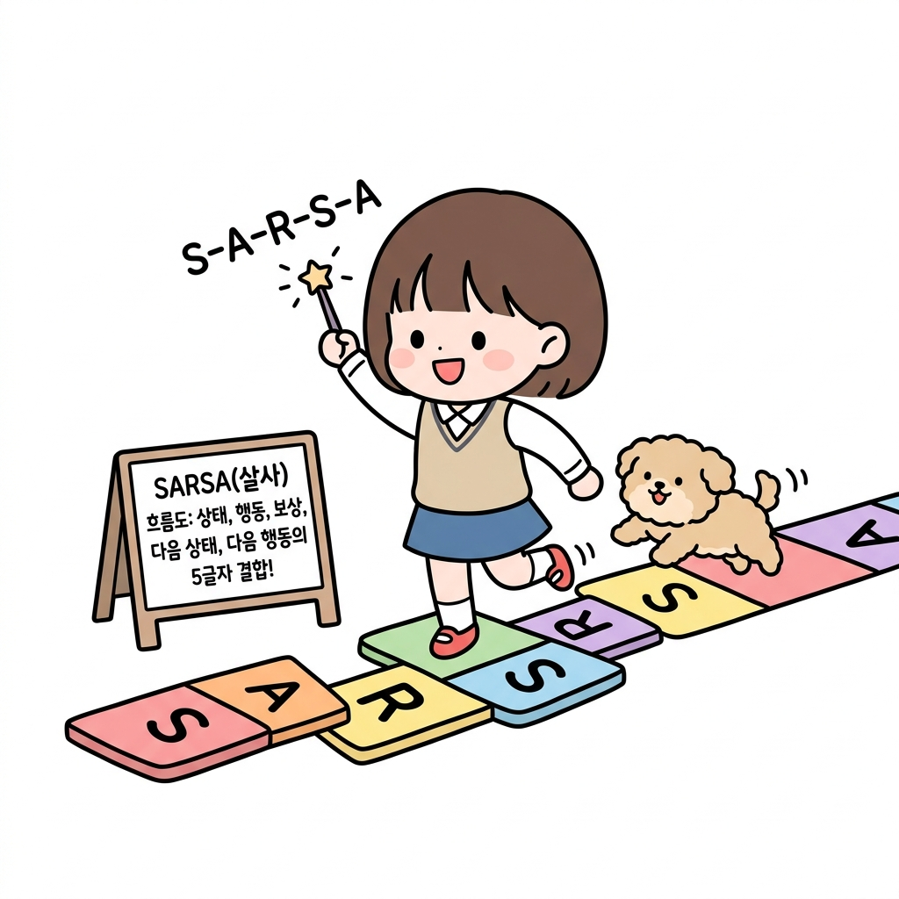
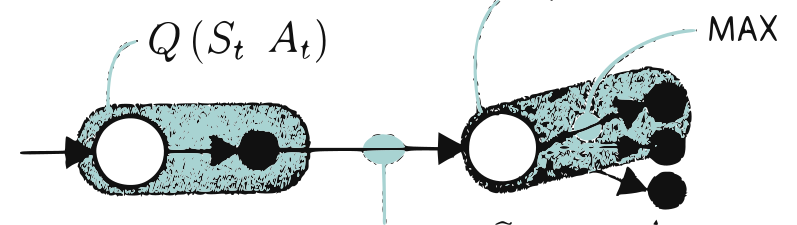
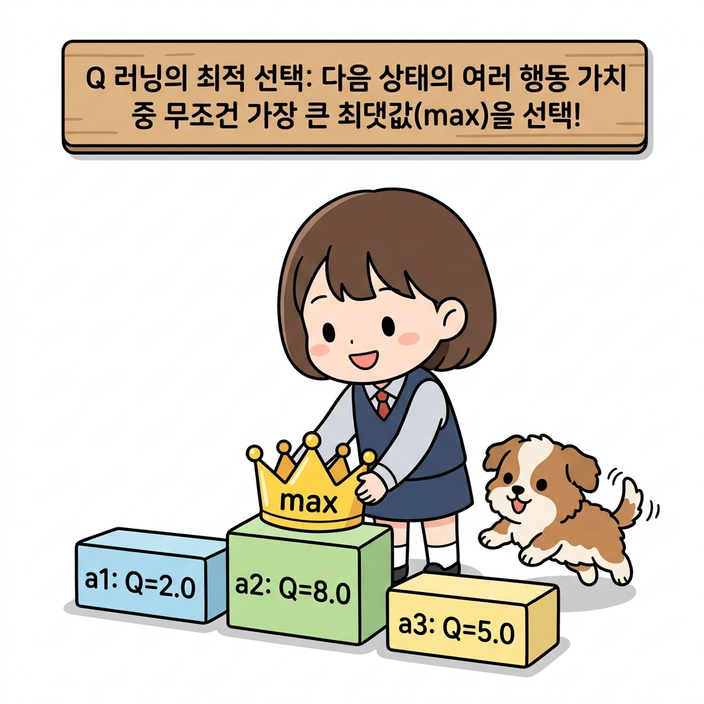
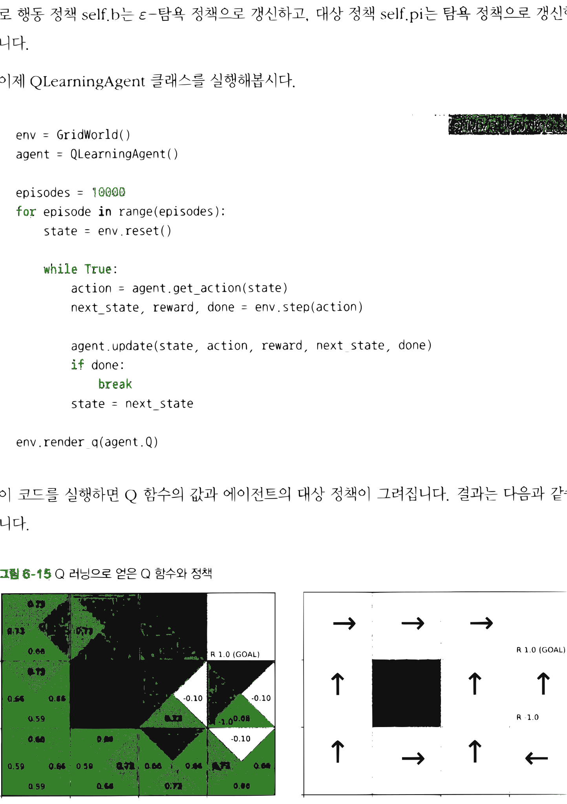

# 10.4 Q 러닝

**그림 10-4** 다음 상태의 행동 후보들 중 최고 가치인 max Q(s',a') 목표판을 지팡이로 직접 가리키는 지니와 집중하는 도로시


강화 학습 역사상 가장 찬란하고 널리 쓰이는 대표 알고리즘 **Q 러닝(Q-Learning)**을 공부합니다. 중요도 샘플링 비율 $w$를 영리하게 소거하기 위해, 다음 상태에서 취할 행동 가치 중 **최댓값(max)**을 평가 타깃으로 삼는 수식 유도 과정을 도로시의 최고 보석 사냥 비유와 지니의 명쾌한 칠판 공식으로 완전 정복해봅시다!

---

앞서 오프-정책 SARSA를 구현했습니다. 오프-정책 방식에서는 에이전트가 행동 정책과 대상 정책을 따로 가지고 있었습니다. 두 정책이 역할을 분담하여 행동 정책으로는 '탐색'을, 대상 정책으로는 '활용'을 수행하도록 하는 것이죠. 이렇게 하면 (바라건대) 최적의 정책을 얻을 수


있습니다. 하지만 오프-정책 SARSA에서는 중요도 샘플링을 이용해야 합니다. 그런데 중요도 샘플링은 가급적이면 피하고 싶은 기법입니다. 왜일까요?

중요도 샘플링은 결과가 불안정하기 쉽다는 문제를 안고 있습니다. 특히 두 정책의 확률 분포가 다를수록 중요도 샘플링에서 사용하는 가중치 *ρ*도 변동성이 커집니다. 이에 따라 SARSA의 갱신식에 등장하는 목표도 변동되기 때문에 Q 함수의 갱신 역시 불안정해집니다.

이 문제를 해결해주는 것이 바로 **Q 러닝**<sup>Q-learning</sup>입니다. Q 러닝의 대표적인 특징은 다음 세 가지로 요약할 수 있습니다.

1. TD법
2. 오프-정책
3. 중요도 샘플링을 사용하지 않음

Q 러닝을 도출하기 위해 먼저 벨만 방정식과 SARSA의 관계부터 확인하겠습니다. 그런 다음 벨만 최적 방정식과 연관된 형태로 Q 러닝을 도출합니다. 즉, 벨만 방정식에서 SARSA를 도출하고, 벨만 최적 방정식에서 Q 러닝을 도출하겠습니다.

**그림 10-10** 벨만 방정식과 SARSA, 벨만 최적 방정식과 Q 러닝의 관계

벨만 방정식 $\rightarrow$ SARSA
벨만 최적 방정식 $\rightarrow$ Q 러닝

## 10.4.1 벨만 방정식과 SARSA

먼저 벨만 방정식과 SARSA의 관계부터 보겠습니다. 앞에서 봤다시피 정책 *π*에서의 Q 함수를 *q*<sub>*π*</sub>(*s*, *a*)라고 했을 때 벨만 방정식은 다음 식으로 표현됩니다.

$$
q_{\pi}(s, a) = \sum_{s'} p(s' \mid s, a) \left\{ r(s, a, s') + \gamma \sum_{a'} \pi(a' \mid s') q_{\pi}(s', a') \right\}
$$

이 벨만 방정식에서 중요한 점은 다음 두 가지입니다.


* 환경의 상태 전이 확률 $p(s' \mid s, a)$에 따른 다음 단계의 '모든' 상태 전이를 고려한다.
* 에이전트의 정책 *π*에 따른 다음 단계의 '모든' 행동을 고려한다.

백업 다이어그램을 보면 무슨 뜻인지 더 명확하게 이해될 것입니다. 먼저 벨만 방정식의 백업 다이어그램을 보겠습니다.

**그림 10-11** Q 함수에서 벨만 방정식의 백업 다이어그램


$q_{\pi}(S_{t+1}, A_{t+1})$
$q_{\pi}(S_t, A_t)$
$p(s' \mid s, a)$
$\pi(a \mid s)$

[그림 10-11]과 같이 벨만 방정식은 다음 상태와 다음 행동의 '모든' 후보를 고려합니다. 따라서 SARSA는 벨만 방정식의 '샘플링 버전'으로 볼 수 있습니다. '샘플링 버전'이란 모든 전이가 아닌 '샘플링된 데이터'를 사용한다는 뜻입니다. SARSA의 백업 다이어그램은 [그림 10-12]와 같습니다.

**그림 10-12** SARSA의 백업 다이어그램


*Q*<sub>*π*</sub>(*S*<sub>*t+1*</sub>, *A*<sub>*t+1*</sub>)
*Q*<sub>*π*</sub>(*S*<sub>*t*</sub>, *A*<sub>*t*</sub>)
$\pi(a \mid s)$에서 샘플링
$p(s' \mid s, a)$에서 샘플링


[그림 10-12]와 같이 SARSA에서 다음 상태 *S*<sub>*t+1*</sub>은 $p(s' \mid s, a)$로부터 샘플링합니다. 그리고 다음 행동 *A*<sub>*t+1*</sub>은 정책 $\pi(a \mid s)$로부터 샘플링합니다. 이때 SARSA의 TD 목표는 *R*<sub>*t*</sub> + *γ* *Q*<sub>*π*</sub>(*S*<sub>*t+1*</sub>, *A*<sub>*t+1*</sub>)이 됩니다. 이 목표 방향으로 Q 함수를 조금만 갱신하면 됩니다.



> **도로시와 토토의 비유로 이해하기**:
> 도로시가 격자판 위를 달릴 때 외우는 5글자 강화학습 마법 주문이 바로 **S-A-R-S-A(살사)**입니다! 
> 현재 상태 **S**에서 어떤 행동 **A**를 취해 즉각 보상 **R**을 얻고 다음 상태 **S'**에 도착한 뒤, 거기서 할 다음 행동 **A'**까지 확실히 샘플링하여 갱신에 직접 활용하는 끈기 있는 갱신 흐름입니다.

자, 이제부터 본론입니다. 벨만 방정식이 SARSA에 대응한다면, 벨만 최적 방정식에 대응하는 개념도 생각할 수 있을 것입니다. 바로 Q 러닝입니다!

## 10.4.2 벨만 최적 방정식과 Q 러닝

앞서 4.5절에서 가치 반복법을 배웠습니다. 가치 반복법은 최적 정책을 얻기 위한 '평가'와 '개선'이라는 두 과정을 하나로 묶은 기법입니다. 가치 반복법의 중요한 점은 벨만 최적 방정식에 기반하여 '단 하나의 갱신식을 반복'함으로써 최적 정책을 얻을 수 있다는 사실입니다. 이번 절에서는 벨만 최적 방정식에 의한 갱신인 동시에 이를 '샘플링 버전'으로 만든 방법을 알아보겠습니다.

먼저 Q 함수의 벨만 최적 방정식을 보겠습니다. 벨만 최적 방정식은 다음 식으로 표현됩니다.

$$
q_*(s, a) = \sum_{s'} p(s' \mid s, a) \left\{ r(s, a, s') + \gamma \max_{a'} q_*(s', a') \right\}
$$

여기서 *q*<sub>\*</sub>(*s*, *a*)는 최적 정책 $\pi_*$에서의 Q 함수를 뜻합니다. 벨만 방정식과 달리 벨만 최적 방정식은 max 연산자를 사용합니다. 벨만 최적 방정식을 백업 다이어그램으로 표현하면 다음과 같습니다.

**그림 10-13** Q 함수에서 벨만 최적 방정식의 백업 다이어그램


$q_*(S_{t+1}, A_{t+1})$ MAX
$q_*(S_t, A_t)$
$p(s' \mid s, a)$


[그림 10-13]과 같이 행동 *A*<sub>*t+1*</sub>은 Q 함수가 가장 큰 행동입니다. 이제 [그림 10-13]을 '샘플링 버전'으로 다시 작성해보죠.

**그림 10-14** 샘플링 버전 벨만 최적 방정식의 백업 다이어그램


$Q(S_t, A_t)$
$Q(S_{t+1}, A_{t+1})$ MAX
$p(s' \mid s, a)$에서 샘플링

[그림 10-14]에 기반한 방법이 **Q 러닝**입니다. Q 러닝에서 추정치 $Q(S_t, A_t)$의 목표는 $R_t + \gamma \max_a Q(S_{t+1}, a)$가 됩니다. 이 목표 방향으로 Q 함수를 갱신하죠. 수식으로는 다음과 같습니다.

$$
Q'(S_t, A_t) = Q(S_t, A_t) + \alpha \{ R_t + \gamma \max_a Q(S_{t+1}, a) - Q(S_t, A_t) \}
$$
[식 7.14]

[식 7.14]에 따라 Q 함수를 반복해서 갱신하면 최적 정책의 Q 함수에 가까워집니다.



> **도로시와 토토의 비유로 이해하기**:
> Q 러닝은 다음 상태 *S*<sub>*t+1*</sub>에서 취할 수 있는 여러 행동 가치(A1, A2, A3) 중에서 항상 가장 가치가 큰 행동(*max a'*)에 황금 왕관을 씌워 다이렉트로 선택해 가져옵니다. 굳이 행동 정책에 의존해 샘플링하지 않고 무조건 최댓값 가치만 골라 갱신하기 때문에, 중요도 샘플링 같은 별도의 골치 아픈 보정이 필요 없습니다!

[그림 10-14]에서 중요한 점은 (다시 한번 강조하지만) Q 함수가 가장 큰 행동으로 *A*<sub>*t+1*</sub>을 선택한다는 것입니다. 특별한 정책에 따라 샘플링하지 않고 max 연산자로 선택합니다. 따라서 (오프-정책 기법임에도) 중요도 샘플링을 이용한 보정이 필요 없습니다.

이쯤에서 Q 러닝에 대해 정리해보죠. Q 러닝은 오프-정책 기법입니다. 대상 정책과 행동 정책을 따로 가지며 행동 정책으로는 '탐색'을 수행합니다. 흔히 사용되는 행동 정책은 현재 추정치인 Q 함수를 *ε*-탐욕화한 정책입니다. 행동 정책이 결정되면 그에 따라 행동을 선택하여 샘플 데이터를 수집합니다. 그리고 에이전트가 행동할 때마다 [식 7.14]로 Q 함수를 갱신합니다. 이상이 Q 러닝입니다.

## 10.4.3 Q 러닝 구현

Q 러닝을 구현해봅시다.


<div align="right"><b>ch06/q_learning.py</b></div>

```python
from collections import defaultdict
import numpy as np
from common.gridworld import GridWorld
from common.utils import greedy_probs

class QLearningAgent:
    def __init__(self):
        self.gamma = 0.9
        self.alpha = 0.8
        self.epsilon = 0.1
        self.action_size = 4

        random_actions = {0: 0.25, 1: 0.25, 2: 0.25, 3: 0.25}
        self.pi = defaultdict(lambda: random_actions)
        self.b = defaultdict(lambda: random_actions) # 행동 정책
        self.Q = defaultdict(lambda: 0)

    def get_action(self, state):
        action_probs = self.b[state] # 행동 정책에서 가져옴
        actions = list(action_probs.keys())
        probs = list(action_probs.values())
        return np.random.choice(actions, p=probs)

    def update(self, state, action, reward, next_state, done):
        if done: # 목표에 도달
            next_q_max = 0
        else: # 그 외에는 다음 상태에서 Q 함수의 최댓값 계산
            next_qs = [self.Q[next_state, a] for a in range(self.action_size)]
            next_q_max = max(next_qs)

        # Q 함수 갱신
        target = reward + self.gamma * next_q_max
        self.Q[state, action] += (target - self.Q[state, action]) * self.alpha

        # 행동 정책과 대상 정책 갱신
        self.pi[state] = greedy_probs(self.Q, state, epsilon=0)
        self.b[state] = greedy_probs(self.Q, state, self.epsilon)
```

여기서 주목할 부분은 `update(self, state, action, reward, next_state, done)`의 매개변수입니다. Q 러닝에서는 state, action, reward, next_state, done이라는 다섯 가지 정보만으로 Q 함수를 갱신합니다. `update()` 메서드는 다음 상태에서 Q 함수의 최댓값을 찾습니


다. 그런 다음 벨만 최적 방정식을 기반으로 [식 7.14]에 따라 Q 함수를 갱신합니다. 마지막으로 행동 정책 `self.b`는 *ε*-탐욕 정책으로 갱신하고, 대상 정책 `self.pi`는 탐욕 정책으로 갱신합니다.

이제 `QLearningAgent` 클래스를 실행해봅시다.

<div align="right"><b>ch06/q_learning.py</b></div>

```python
env = GridWorld()
agent = QLearningAgent()

episodes = 10000
for episode in range(episodes):
    state = env.reset()

    while True:
        action = agent.get_action(state)
        next_state, reward, done = env.step(action)

        agent.update(state, action, reward, next_state, done)
        if done:
            break
        state = next_state

env.render_q(agent.Q)
```

이 코드를 실행하면 Q 함수의 값과 에이전트의 대상 정책이 그려집니다. 결과는 다음과 같습니다.

**그림 10-15** Q 러닝으로 얻은 Q 함수와 정책




결과는 매번 다르지만 대부분의 경우 최적 정책을 얻을 수 있습니다. [그림 10-15]의 결과도 최적 정책입니다. 이것으로 Q 러닝 구현을 마칩니다.

