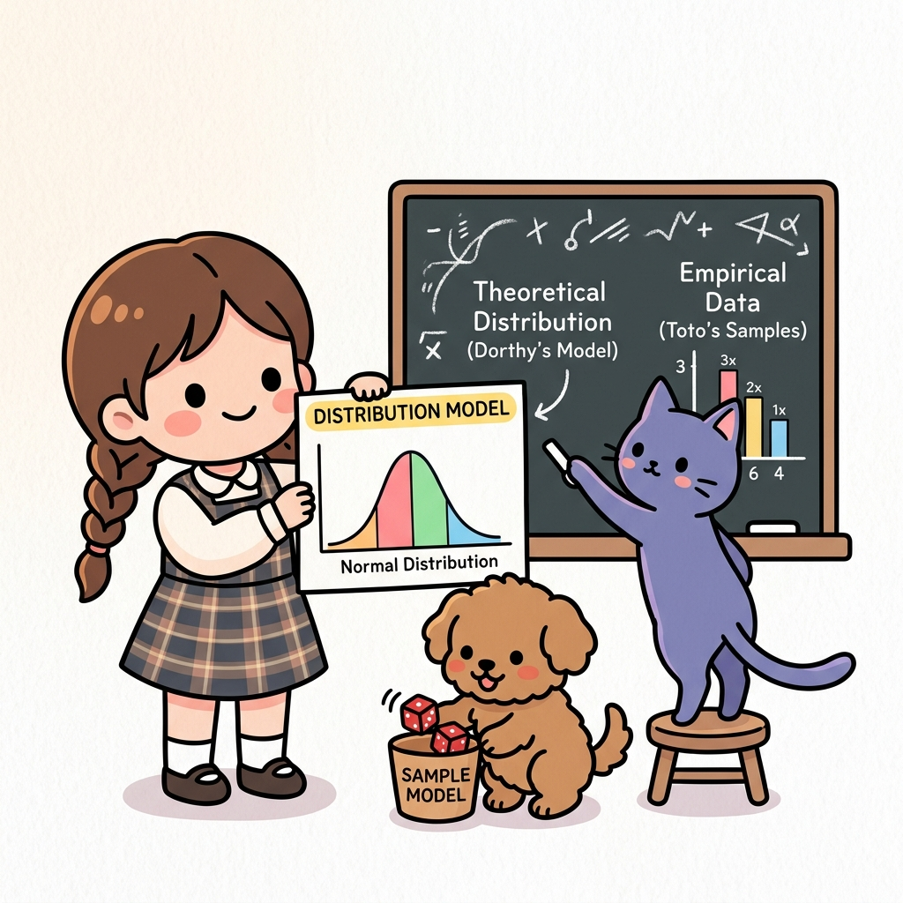

# 10.5 분포 모델과 샘플 모델

**그림 10-5** 칠판에 그려진 이론적 확률 분포(분포 모델)와 토토가 통에 넣고 굴린 주사위 실증 표본들(샘플 모델)의 관계를 분석해 주는 지니와 도로시


동적 계획법(DP), 몬테카를로법(MC), 그리고 TD(시간차) 기법의 핵심 철학을 관통하는 **분포 모델(Distribution Model)**과 **샘플 모델(Sample Model)**의 대조 관계를 총정리합니다. 환경에 대한 사전 지식이 있을 때와 없을 때의 차이 및 샘플링 횟수가 무한히 커질 때의 수학적 수렴 원리를 도로시와 토토의 주사위 경험 법칙 비유로 알차게 복습해봅시다!

---

지금까지는 TD법에 대해 배웠습니다. 구체적인 알고리즘으로는 SARSA와 Q 러닝을 공부했습니다. 7장에서 배우는 강화 학습 알고리즘은 여기까지이고, 이번 절에서는 에이전트를 구현하는 방법에 대해 보충하겠습니다. 에이전트 구현 방법에는 '분포 모델'과 '샘플 모델'이 있습니다. 지금까지 구현한 방식은 분포 모델에 해당합니다. 그런데 샘플 모델을 이용하면 더 간단하게 구현할 수 있습니다.

## 10.5.1 분포 모델과 샘플 모델

확률적 행동을 구현하는 방법에는 '분포 모델'과 '샘플 모델'이 있습니다. 5.1절에서 환경과 관련하여 분포 모델과 샘플 모델이 있다고 설명했는데 에이전트도 마찬가지입니다. 에이전트의 행동을 결정하는 방법도 '분포 모델'과 '샘플 모델' 중 선택하여 구현할 수 있는 것이죠.

분포 모델은 확률 분포를 명시적으로 유지하는 모델입니다. 그래서 무작위로 행동하는 에이전트라면 분포 모델로 다음처럼 구현할 수 있습니다.

```python
from collections import defaultdict
import numpy as np

class RandomAgent:
    def __init__(self):
        random_actions = {0: 0.25, 1: 0.25, 2: 0.25, 3: 0.25} # 확률 분포
        self.pi = defaultdict(lambda: random_actions)

    def get_action(self, state):
        action_probs = self.pi[state]
        actions = list(action_probs.keys())
        probs = list(action_probs.values())
        return np.random.choice(actions, p=probs) # 샘플링
```


이와 같이 각 상태에서의 행동 확률 분포를 `self.pi` 변수에 유지합니다. 그리고 실제 행동을 할 때는 이 확률 분포를 토대로 샘플링합니다. 이것이 에이전트를 분포 모델로 구현하는 방법이며, 이처럼 확률 분포를 명시적으로 유지한다는 점이 분포 모델의 특징입니다.

바로 이어서 샘플 모델을 보겠습니다. 샘플 모델은 '샘플링이 가능하다'라는 조건만 만족하면 되는 모델입니다. 확률 분포를 유지할 필요가 없기 때문에 분포 모델보다 간단하게 구현할 수 있죠. 똑같이 무작위로 행동하는 에이전트를 샘플 모델로는 다음처럼 구현할 수 있습니다.

```python
import numpy as np

class RandomAgent:
    def get_action(self, state):
        return np.random.choice(4)
```

확률 분포 없이 단순히 네 가지 행동 중 하나를 무작위로 선택하도록 구현했습니다. 보다시피 코드의 양이 훨씬 적습니다.

## 10.5.2 샘플 모델 버전의 Q 러닝

그렇다면 샘플 모델 버전의 Q 러닝은 어떤 모습일까요? 먼저 앞에서 구현한 Q 러닝을 복습해보죠. 앞에서는 에이전트를 분포 모델로 구현했습니다. 코드를 다시 한번 보겠습니다.

```python
from collections import defaultdict
import numpy as np
from common.utils import greedy_probs

class QLearningAgent:
    def __init__(self):
        self.gamma = 0.9
        self.alpha = 0.8
        self.epsilon = 0.1
        self.action_size = 4

        random_actions = {0: 0.25, 1: 0.25, 2: 0.25, 3: 0.25}
        self.pi = defaultdict(lambda: random_actions) # 대상 정책
        self.b = defaultdict(lambda: random_actions)  # 행동 정책
        self.Q = defaultdict(lambda: 0)

    def get_action(self, state):
        action_probs = self.b[state]
        actions = list(action_probs.keys())
        probs = list(action_probs.values())
        return np.random.choice(actions, p=probs)

    def update(self, state, action, reward, next_state, done):
        if done:
            next_q_max = 0
        else:
            next_qs = [self.Q[next_state, a] for a in range(self.action_size)]
            next_q_max = max(next_qs)

        target = reward + self.gamma * next_q_max
        self.Q[state, action] += (target - self.Q[state, action]) * self.alpha

        # pi는 탐욕화, b는 epsilon-탐욕화
        self.pi[state] = greedy_probs(self.Q, state, epsilon=0)
        self.b[state] = greedy_probs(self.Q, state, self.epsilon)
```

이 코드에서 주목할 부분은 `self.pi`와 `self.b`라는 두 가지 정책입니다. 두 정책 모두 확률 분포로 유지되고 있습니다. 따라서 이 코드는 분포 모델입니다. 또한 `self.pi`와 `self.b`가 갱신되는 위치가 `update()` 메서드라는 점에도 주목해야 합니다.

> [!NOTE]
> `update()` 메서드에서는 정책의 state에 대한 확률 분포를 갱신합니다. 이때 Q 함수(`self.Q`)를 탐욕스럽게 갱신한 정책이 `self.pi`가 되고 *ε*-탐욕 방식으로 갱신한 정책이 `self.b`가 됩니다.

샘플 모델을 구현하기에 앞서 이 코드를 단순화하겠습니다. 변경 사항은 다음 두 가지입니다.

* `self.pi` 삭제
* `self.b` 갱신을 `get_action()` 메서드에서 수행

코드부터 보겠습니다.

```python
class QLearningAgent:
    def __init__(self):
        self.gamma = 0.9
        self.alpha = 0.8
        self.epsilon = 0.1
        self.action_size = 4

        random_actions = {0: 0.25, 1: 0.25, 2: 0.25, 3: 0.25}
        # self.pi = ... # self.pi는 사용하지 않음
        self.b = defaultdict(lambda: random_actions)
        self.Q = defaultdict(lambda: 0)

    def get_action(self, state):
        # 이때 바로 epsilon-탐욕화
        self.b[state] = greedy_probs(self.Q, state, self.epsilon)

        action_probs = self.b[state]
        actions = list(action_probs.keys())
        probs = list(action_probs.values())
        return np.random.choice(actions, p=probs)

    def update(self, state, action, reward, next_state, done):
        if done:
            next_q_max = 0
        else:
            next_qs = [self.Q[next_state, a] for a in range(self.action_size)]
            next_q_max = max(next_qs)

        target = self.gamma * next_q_max + reward
        self.Q[state, action] += (target - self.Q[state, action]) * self.alpha
```

우선 대상 정책인 `self.pi`를 지웠습니다. `self.pi`는 Q 함수(`self.Q`)를 탐욕화하여 갱신한 정책으로, 지금까지는 `update()` 메서드가 호출될 때마다 갱신했습니다. 하지만 현재 `self.pi`를 이용하는 코드가 없기 때문에 지워도 무방합니다. 만약 대상 정책이 필요하다면 필요한 시점에 Q 함수를 탐욕화하여 언제든 만들어낼 수 있습니다.

다음으로 행동 정책인 `self.b`를 보겠습니다. 이전 코드에서는 `update()` 메서드에서 갱신했으나 여기서는 `get_action()` 메서드가 호출되는 시점에 갱신하도록 수정했습니다. `self.b`는 Q 함수를 *ε*-탐욕화한 정책이므로 Q 함수만 있으면 언제든지 만들 수 있습니다.

이제 앞의 코드를 '샘플 모델'로 변경합니다.


<div align="right"><b>ch06/q_learning_simple.py</b></div>

```python
class QLearningAgent:
    def __init__(self):
        self.gamma = 0.9
        self.alpha = 0.8
        self.epsilon = 0.1
        self.action_size = 4
        self.Q = defaultdict(lambda: 0)

    def get_action(self, state):
        if np.random.rand() < self.epsilon: # ❶ epsilon의 확률로 무작위 행동
            return np.random.choice(self.action_size)
        else:                               # ❷ (1 - epsilon)의 확률로 탐욕 행동
            qs = [self.Q[state, a] for a in range(self.action_size)]
            return np.argmax(qs)

    def update(self, state, action, reward, next_state, done):
        if done:
            next_q_max = 0
        else:
            next_qs = [self.Q[next_state, a] for a in range(self.action_size)]
            next_q_max = max(next_qs)

        target = self.gamma * next_q_max + reward
        self.Q[state, action] += (target - self.Q[state, action]) * self.alpha
```

지난번과 달라진 점은 행동 정책인 `self.b`마저 삭제했다는 것입니다. `get_action()` 메서드에서는 `self.b`를 사용하지 않고 대신 Q 함수를 이용하여 *ε*-탐욕 정책에 따른 행동 선택을 직접 구현했습니다. 구체적으로는 ❶ `self.epsilon`의 확률로 무작위 행동을 선택하고 ❷ 그 외에는 Q 함수의 값이 가장 큰 행동을 선택합니다. *ε*-탐욕 정책을 그대로 코드로 표현한 것이죠.

보다시피 이번 코드에서는 정책을 확률 분포로 유지하지 않습니다. 더 정확히 말하면 정책 자체를 유지하지 않습니다. 이것이 샘플 모델 방식의 구현입니다. 확률 분포를 유지할 필요가 없어서 코드가 훨씬 간결하죠. 다음 장부터는 신경망을 이용하여 Q 러닝을 확장할 예정인데, 방금 제시한 샘플 모델 방식의 구현을 기반으로 진행할 것입니다.


