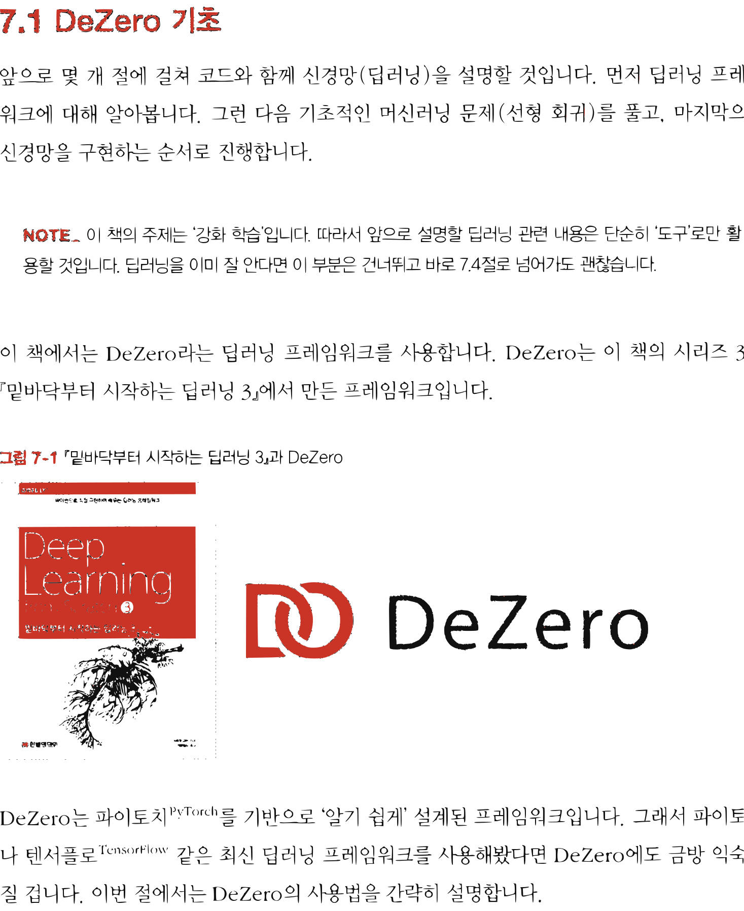

# 11.1 DeZero 기초

**그림 11-1** 지니가 들려주는 DeZero 상자 속의 장난감 블록(Variable, Function) 조각들을 끼워 맞춰 보며 딥러닝 연산을 배우는 도로시와 토토


인공신경망 코딩 실습을 위해 이 책에서 사용할 초경량 딥러닝 프레임워크인 **DeZero**의 핵심 사용법을 공부합니다. 파이토치(PyTorch)와 형제처럼 닮아 매우 직관적인 DeZero의 기본 다차원 배열 변수(Variable) 선용법과 순전파/역전파 계산 메커니즘을 요정 지니의 블록 놀이 비유로 신나게 터득해 봅시다!

---

앞으로 몇 개 절에 걸쳐 코드와 함께 신경망(딥러닝)을 설명할 것입니다. 먼저 딥러닝 프레임워크에 대해 알아봅니다. 그런 다음 기초적인 머신러닝 문제(선형 회귀)를 풀고, 마지막으로 신경망을 구현하는 순서로 진행합니다.

> [!NOTE]
> 이 책의 주제는 '강화 학습'입니다. 따라서 앞으로 설명할 딥러닝 관련 내용은 단순히 '도구'로만 활용할 것입니다. 딥러닝을 이미 잘 안다면 이 부분은 건너뛰고 바로 7.4절로 넘어가도 괜찮습니다.

이 책에서는 DeZero라는 딥러닝 프레임워크를 사용합니다. DeZero는 이 책의 시리즈 3권 『밑바닥부터 시작하는 딥러닝 3』에서 만든 프레임워크입니다.

**그림 11-1** 『밑바닥부터 시작하는 딥러닝 3』과 DeZero


DeZero

DeZero는 파이토치<sup>PyTorch</sup>를 기반으로 '알기 쉽게' 설계된 프레임워크입니다. 그래서 파이토치나 텐서플로<sup>TensorFlow</sup> 같은 최신 딥러닝 프레임워크를 사용해봤다면 DeZero에도 금방 익숙해질 겁니다. 이번 절에서는 DeZero의 사용법을 간략히 설명합니다.


> [!NOTE]
> DeZero는 파이토치의 '사투리'와 같은 프레임워크이므로 DeZero용 코드를 파이토치 코드로 쉽게 변환할 수 있습니다. 그래서 이 책의 예제를 모아둔 깃허브에 파이토치 버전 코드도 준비해뒀습니다. 파이토치를 이용하고 싶은 분은 해당 코드를 참고하기 바랍니다.

## 11.1.1 DeZero 사용법

먼저 DeZero를 설치합니다. 다음과 같이 `pip`로 간단하게 설치할 수 있습니다.

```bash
$ pip install dezero
```

설치가 끝나면 DeZero를 사용해봅시다. 먼저 `Variable` 클래스부터 살펴보겠습니다. `Variable`은 넘파이의 다차원 배열(`np.ndarray`)을 감싸는 클래스입니다. 다음과 같이 사용합니다.

```python
import numpy as np
from dezero import Variable # ❶ dezero 모듈에서 Variable 임포트

x_np = np.array(5.0)
x = Variable(x_np) # ❷ Variable 인스턴스 생성

y = 3 * x ** 2 # ❸ 넘파이 다차원 배열처럼 사용
print(y)
```

**출력 결과**
```text
variable(75.0)
```

❶ dezero 모듈에서 `Variable` 클래스를 가져왔고 ❷ `x = Variable(x_np)` 코드로 `Variable` 인스턴스를 생성했습니다. 이후로는 마치 넘파이 다차원 배열(`np.ndarray`)을 다루듯이 계산식에 바로 쓸 수 있습니다. ❸ 그래서 `y = 3 * x ** 2` 코드가 실행되면 바로 75.0이라는 결과를 얻을 수 있습니다.


이제 미분을 구해보겠습니다. `Variable` 변수에는 미분을 수행하는 `backward()` 메서드가 준비되어 있습니다. 앞의 코드에 이어서 다음 코드를 실행하면 됩니다.

```python
y.backward()
print(x.grad)
```

**출력 결과**
```text
variable(30.0)
```

이 코드에서 `y`는 `Variable` 인스턴스입니다. `Variable` 인스턴스에서 `backward()` 메서드를 호출하면 **역전파**<sup>backpropagation</sup>가 수행되어 각 변수의 미분을 구할 수 있습니다.

참고로 앞의 코드 ❸에서 $y = 3 \times x ** 2$ 계산을 하였는데 수식으로는 $y = 3x^2$에 해당합니다. 이를 미분하면 $\frac{dy}{dx} = 6x$이므로 여기에 $x = 5$를 대입하면 30이 됩니다. 지금의 출력 결과와 똑같은 것을 알 수 있습니다.

## 11.1.2 다차원 배열(텐서)과 함수

머신러닝에서는 일반적으로 다차원 배열(텐서)을 다룹니다. 다차원 배열은 여러 개의 숫자(원소)를 한꺼번에 다루기 위한 데이터 구조입니다. 원소의 배열에는 '방향'이 있으며 그 방향을 '차원<sup>dimension</sup>' 또는 '축<sup>axis</sup>'이라고 합니다. [그림 11-2]는 다차원 배열의 예입니다.

**그림 11-2** 다차원 배열의 예

스칼라
`[ 1 ]`

벡터
`[ 1 | 2 | 3 ]`

행렬
`[ 1 | 2 | 3 ]`
`[ 4 | 5 | 6 ]`

그림에서 왼쪽부터 0차원 배열, 1차원 배열, 2차원 배열입니다. 각각 스칼라, 벡터, 행렬이라고 하죠. **스칼라**<sup>scalar</sup>는 단순히 하나의 숫자를 나타냅니다. **벡터**<sup>vector</sup>는 하나의 축을 따라 숫자들이 나열되어 있고, **행렬**<sup>matrix</sup>은 축이 두 개로 늘어납니다. 참고로 다차원 배열은 **텐서**<sup>tensor</sup>라고도 합니다. 그래서 [그림 11-2]의 예는 왼쪽부터 차례로 0층 텐서, 1층 텐서, 2층 텐서입니다.


다음으로 **벡터의 내적**을 알아보겠습니다. 두 개의 벡터 $a = (a_1, \dots, a_n)$과 $b = (b_1, \dots, b_n)$이 있다고 해보죠. 이때 벡터의 내적은 [식 8.1]과 같이 정의됩니다.

$$
a \cdot b = a_1 b_1 + a_2 b_2 + \dots + a_n b_n
$$
[식 8.1]

이 식과 같이 두 벡터에서 '대응하는 원소의 곱을 모두 더한 것'이 벡터의 내적입니다.

> [!NOTE]
> 수식에서 기호를 표기할 때 스칼라는 $a, b$처럼 표기합니다. 반면 벡터나 행렬은 $\mathbf{a}, \mathbf{b}$처럼 굵게 표기합니다.

마지막으로 **행렬의 곱**에 대해 설명하겠습니다. 행렬 곱은 [그림 11-3]과 같은 절차대로 계산합니다.

**그림 11-3** 행렬 곱 계산 방법


$1 \times 5 + 2 \times 7$
$\mathbf{a} \quad \mathbf{b} = \mathbf{c}$

그림과 같이 행렬 곱에서는 왼쪽 행렬의 '가로 벡터'와 오른쪽 행렬의 '세로 벡터' 사이의 내적을 계산합니다. 그리고 그 결과가 새로운 행렬의 해당 원소가 됩니다. 예를 들어 $\mathbf{a}$의 1행과 $\mathbf{b}$의 1열의 내적이 $\mathbf{c}$의 1행 1열 원소가 되고, $\mathbf{a}$의 2행과 $\mathbf{b}$의 1열의 내적이 $\mathbf{c}$의 2행 1열 원소가 되는 식입니다.

이제 DeZero를 사용하여 벡터의 내적과 행렬 곱을 계산해보죠. 이 계산에는 `dezero.functions` 패키지의 `matmul()` 함수를 사용합니다.

<div align="right"><b>ch07/dezero1.py</b></div>

```python
import numpy as np
from dezero import Variable
import dezero.functions as F # ❶

# 벡터의 내적
a = np.array([1, 2, 3])
b = np.array([4, 5, 6])
a, b = Variable(a), Variable(b) # 생략 가능
c = F.matmul(a, b) # ❷
print(c)

# 행렬 곱
a = np.array([[1, 2], [3, 4]])
b = np.array([[5, 6], [7, 8]])
c = F.matmul(a, b) # ❸
print(c)
```

**출력 결과**
```text
variable(32)
variable([[19 22]
          [43 50]])
```

❶ 가장 먼저 `dezero.functions` 패키지를 `F`라는 이름으로 임포트했습니다. 그러면 DeZero의 함수를 `F.matmul()` 형태로 사용할 수 있죠. 코드에서 보듯이 ❷ 벡터의 내적과 ❸ 행렬 곱 모두 `F.matmul()` 함수로 계산합니다.

> [!NOTE]
> DeZero의 함수들은 `np.ndarray` 인스턴스를 직접 처리할 수 있습니다(DeZero 내부에서 `Variable` 인스턴스로 변환). 따라서 앞의 코드에서 넘파이 배열인 `a`와 `b`를 명시적으로 `Variable` 인스턴스로 변환하지 않고도 `F.matmul()`에 직접 입력할 수 있습니다.

참고로 행렬이나 벡터를 이용한 계산에서는 '형상<sup>shape</sup>'에 주의해야 합니다. 예를 들어 행렬 곱 계산에서는 행렬들 사이에 [그림 11-4]와 같은 관계가 성립합니다.

**그림 11-4** 행렬 곱에서는 해당 차원(축)의 원소 개수를 일치시켜야 한다.

$\quad\quad\mathbf{a} \quad\quad \mathbf{b} \quad = \quad \mathbf{c}$
형상: $(3 \times 2) (2 \times 4) \quad (3 \times 4)$

$3 \times 2$ 행렬 $\mathbf{a}$와 $2 \times 4$ 행렬 $\mathbf{b}$를 곱해 $3 \times 4$ 행렬 $\mathbf{c}$가 만들어졌습니다. 그림과 같이 행렬 $\mathbf{a}$와 $\mathbf{b}$


에 해당하는 차원(축)의 원소 수가 일치해야 계산이 이루어질 수 있습니다.

## 11.1.3 최적화

이번에는 DeZero를 이용하여 간단한 문제를 풀어보죠. 다음 함수의 최솟값을 구해보겠습니다.

$$
y = 100(x_1 - x_0^2)^2 + (x_0 - 1)^2
$$

이 함수를 **로젠브록 함수**<sup>rosenbrock function</sup>라고 합니다. 로젠브록 함수는 진정한 최솟값을 찾기가 어렵고, 함수의 형태가 특징적이기 때문에 최적화 벤치마크 용도로 널리 쓰입니다. 목표는 로젠브록 함수의 출력이 최소가 되는 $x_0$과 $x_1$ 찾기입니다. 정답부터 말하자면 로젠브록 함수의 최솟값은 $(x_0, x_1) = (1, 1)$에 있습니다. 이제부터 DeZero로도 이 최솟값을 찾을 수 있는지 확인해보겠습니다.

> [!NOTE]
> 함수가 최솟값(또는 최댓값)이 되게 하는 '인수(입력)'를 찾는 작업을 **최적화**라고 합니다. 지금 우리의 목표는 DeZero를 사용하여 최적화 문제를 푸는 것입니다.

우선 로젠브록 함수 $(x_0, x_1) = (0.0, 2.0)$의 미분을 구하겠습니다(수식으로는 $\frac{\partial y}{\partial x_0}$와 $\frac{\partial y}{\partial x_1}$).

```python
import numpy as np
from dezero import Variable

def rosenbrock(x0, x1):
    y = 100 * (x1 - x0 ** 2) ** 2 + (x0 - 1) ** 2
    return y

x0 = Variable(np.array(0.0))
x1 = Variable(np.array(2.0))

y = rosenbrock(x0, x1)
y.backward()
print(x0.grad, x1.grad)
```


**출력 결과**
```text
variable(-2.0) variable(400.0)
```

이와 같이 먼저 `Variable`로 수치 데이터 (`np.ndarray` 인스턴스)를 감싸주면, 그다음은 수식에 맞게 코딩만 하면 됩니다. 이후 `y.backward()`를 호출하면 미분이 자동으로 계산됩니다.

이 코드를 실행하면 `x0`과 `x1`의 미분, 즉 $\frac{\partial y}{\partial x_0}$와 $\frac{\partial y}{\partial x_1}$는 각각 $-2.0$과 $400.0$이라고 나옵니다. 이때 두 미분값($-2.0, 400.0$)을 모아 만든 벡터를 **기울기**<sup>gradient</sup> 또는 **기울기 벡터**<sup>gradient vector</sup>라고 합니다. 기울기는 각 지점에서 함수의 출력을 가장 크게 증가시키는 방향을 가리킵니다. 지금 예에서 $(x_0, x_1) = (0.0, 2.0)$ 위치에서 `y`의 값을 가장 크게 증가시키는 방향이 $(-2.0, 400.0)$이라는 뜻입니다. 반대로, 기울기에 마이너스를 곱한 $(2.0, -400.0)$ 방향은 `y`의 값을 가장 크게 '감소'시키는 방향이라는 뜻이기도 합니다.

> [!NOTE]
> 형태가 복잡한 함수라면 기울기가 가리키는 방향에 최댓값이 없을 때도 많습니다. 마찬가지로 기울기의 반대 방향에 최솟값이 없을 수 있습니다. 하지만 좁은 범위로 한정하면 기울기는 함수의 출력을 가장 크게 만드는 방향을 가리킵니다. 따라서 기울기 방향으로 일정 거리만큼 이동하고, 그 지점에서 다시 기울기를 구하는 일을 반복하면 점차 원하는 지점(최댓값이나 최솟값)에 가까워지리라 기대할 수 있습니다. 이것이 바로 **경사 하강법**<sup>gradient descent</sup>입니다.

이제 경사 하강법을 우리 문제에 적용해봅시다. 지금 우리는 로젠브록 함수의 '최솟값'을 찾는 중입니다. 따라서 기울기에 마이너스를 곱한 방향으로 진행해야 합니다. 이 점만 주의하면 다음과 같이 간단하게 구현할 수 있습니다.

<div align="right"><b>ch07/dezero2.py</b></div>

```python
x0 = Variable(np.array(0.0))
x1 = Variable(np.array(2.0))

iters = 10000 # # 반복 횟수
lr = 0.001   # # 학습률

for i in range(iters): # # 갱신 반복
    print(x0, x1)
    y = rosenbrock(x0, x1)
    # 이전 반복에서 더해진 미분 초기화
    x0.cleargrad()
    x1.cleargrad()

    # 미분(역전파)
    y.backward()

    # 변수 갱신
    x0.data -= lr * x0.grad.data
    x1.data -= lr * x1.grad.data

print(x0, x1)
```

먼저 갱신을 반복할 횟수(`iters`)와 기울기에 곱할 학습률(`lr`)을 미리 설정해둡니다. `iters`는 iterations를 줄인 단어이고 `lr`은 learning rate (학습률)의 머리글자를 조합한 것입니다.

실제 변수 갱신은 `x0.data -= lr * x0.grad.data` 코드에서 수행합니다. 여기서 `x0`과 `x0.grad`는 모두 `Variable` 인스턴스라는 점에 주목합시다. 실제 데이터(`np.ndarray`)는 `x0.data`와 `x0.grad.data`처럼 `.data` 속성에 저장되어 있습니다. 그리고 지금은 단순히 데이터를 갱신할 뿐이므로 `.data` 속성으로 직접 계산했습니다. 만약 (.data 속성이 아닌) Variable 인스턴스에 대해 계산하면 나중에 역전파를 하기 위한 계산을 추가로 해줘야 합니다.

> [!NOTE]
> 지금 코드의 for문에서는 Variable 인스턴스인 x0과 x1을 반복해서 사용하며 미분을 구합니다. 이 반복 과정에서 x0.grad와 x1.grad에 미분값이 계속 더해지기 때문에, 새로운 미분을 구할 때는 기존에 추가된 미분을 초기화해야 합니다. 그래서 역전파 전에 각 변수의 `cleargrad()` 메서드를 호출하여 미분을 초기화하고 있습니다.

이제 코드를 실행해봅시다. 그러면 `(x0, x1)`의 값이 갱신되어 최종적으로 다음의 결과를 얻을 수 있습니다.

**출력 결과**
```text
variable(0.9944984367782456)
variable(0.9890050527419593)
```

이번 문제의 정답은 $(1.0, 1.0)$입니다. 출력 결과가 완벽히 정확하지는 않지만 대략적으로 가


까운 값을 얻을 수 있었습니다.

이것으로 DeZero의 기초를 알아보았습니다. 다음 절에서는 DeZero를 사용하여 머신러닝 문제를 풀어보겠습니다.

