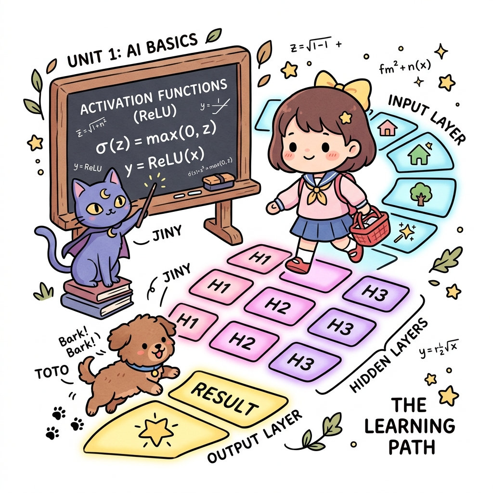
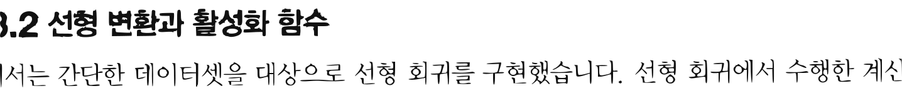
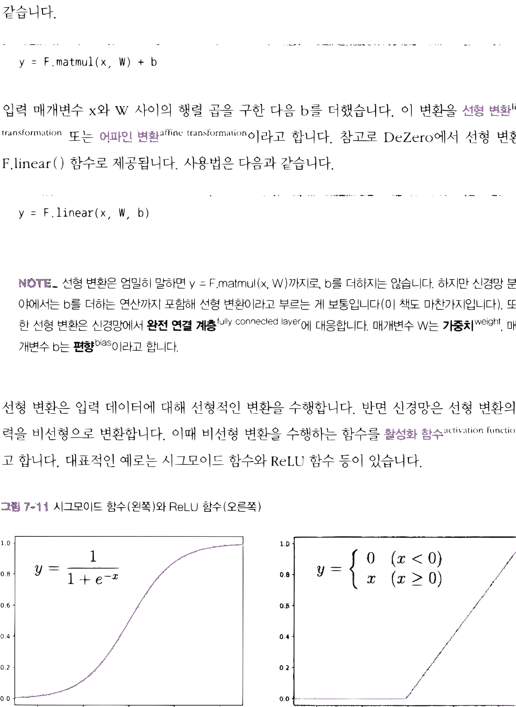
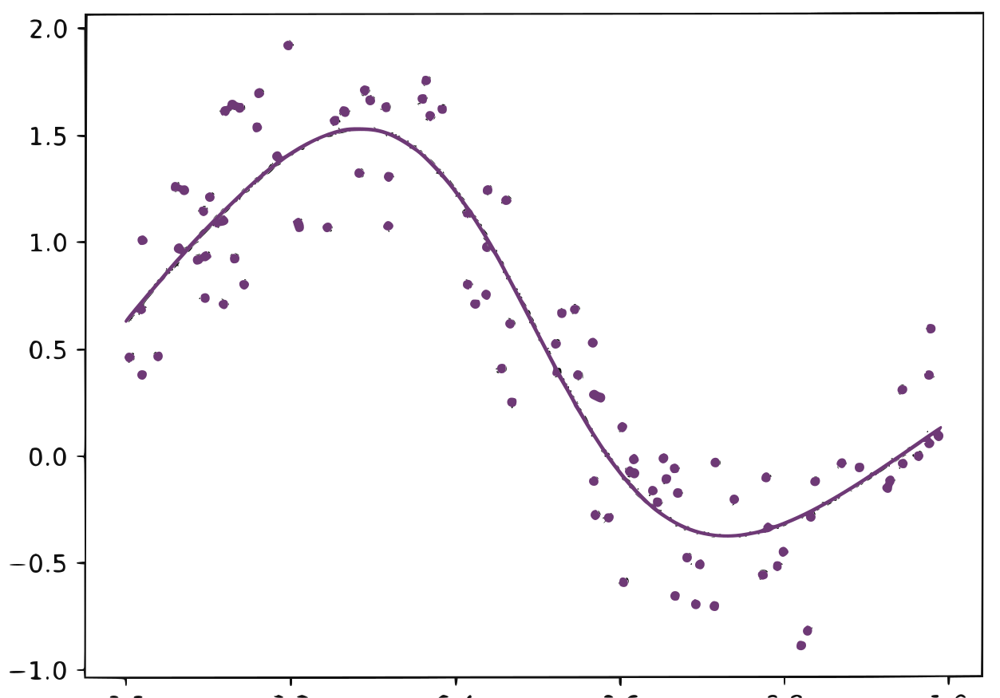

# 11.3 신경망

**그림 11-3** 입력층, 은닉층, 출력층으로 이루어진 마법 전구 발판을 밟아나가며 ReLU 활성화 함수의 특성을 필기하는 도로시와 지니


단순한 직선 예측을 뛰어넘어 복잡한 비선형 관계를 학습해 내는 **다층 인공신경망(Artificial Neural Network)**을 공부합니다. 선형 변환 노드들과 활성화 함수(Activation Function, 예: ReLU)를 결합하여 표현력을 무한히 극대화하는 멀티레이어 신경망의 은밀한 작동 원리를 지니의 마법 전구 발판 징검다리 비유를 통해 확실하게 소화해봅시다!

---

앞에서 DeZero를 사용하여 선형 회귀를 구현하고 올바르게 동작함을 확인했습니다. 선형 회귀를 구현할 수 있다면 이를 신경망으로 확장하는 일은 간단합니다. 이번에는 7.2절의 코드를 수정하여 DeZero를 이용한 신경망을 구현하겠습니다.

## 11.3.1 비선형 데이터셋

앞에서는 선형으로 정렬된 데이터셋을 사용했습니다. 이번에는 다음 코드를 실행하여 조금 더 복잡한 데이터셋을 만들겠습니다.


```python
import numpy as np

np.random.seed(0)
x = np.random.rand(100, 1)
y = np.sin(2 * np.pi * x) + np.random.rand(100, 1)
```

데이터 생성에 `sin()` 함수를 사용했습니다. [그림 11-10]은 이렇게 만든 (x, y) 점들을 2차원 좌표계에 나타낸 모습입니다.

**그림 11-10** 이번 절에서 사용할 데이터셋



그림에서 볼 수 있듯이 x와 y는 선형 관계가 아닙니다. 이러한 비선형 데이터셋은 당연히 선형 회귀로는 대응할 수 없습니다. 신경망이 등장할 시간입니다.

## 11.3.2 선형 변환과 활성화 함수

앞에서는 간단한 데이터셋을 대상으로 선형 회귀를 구현했습니다. 선형 회귀에서 수행한 계산


은 (손실 함수를 제외하면) '행렬 곱'과 '덧셈'뿐이었습니다. 해당 부분 코드를 발췌하면 다음과 같습니다.

```python
y = F.matmul(x, W) + b
```

입력 매개변수 x와 W 사이의 행렬 곱을 구한 다음 b를 더했습니다. 이 변환을 **선형 변환**<sup>linear transformation</sup> 또는 **어파인 변환**<sup>affine transformation</sup>이라고 합니다. 참고로 DeZero에서 선형 변환은 `F.linear()` 함수로 제공됩니다. 사용법은 다음과 같습니다.

```python
y = F.linear(x, W, b)
```

> [!NOTE]
> 선형 변환은 엄밀히 말하면 `y = F.matmul(x, W)`까지로, b를 더하지는 않습니다. 하지만 신경망 분야에서는 b를 더하는 연산까지 포함해 선형 변환이라고 부르는 게 보통입니다(이 책도 마찬가지입니다). 또한 선형 변환은 신경망에서 **완전 연결 계층**<sup>fully connected layer</sup>에 대응합니다. 매개변수 W는 **가중치**<sup>weight</sup>, 매개변수 b는 **편향**<sup>bias</sup>이라고 합니다.

선형 변환은 입력 데이터에 대해 선형적인 변환을 수행합니다. 반면 신경망은 선형 변환의 출력을 비선형으로 변환합니다. 이때 비선형 변환을 수행하는 함수를 **활성화 함수**<sup>activation function</sup>라고 합니다. 대표적인 예로는 시그모이드 함수와 ReLU 함수 등이 있습니다.

**그림 11-11** 시그모이드 함수(왼쪽)와 ReLU 함수(오른쪽)


$y = \frac{1}{1 + e^{-x}}$
$y = \begin{cases} 0 & (x < 0) \\ x & (x \ge 0) \end{cases}$


[그림 11-11]에서 볼 수 있듯이 시그모이드 함수와 ReLU 함수는 비선형 함수, 즉 결과가 '직선'이 아닌 함수입니다. 신경망에서는 이 그림과 같은 비선형 변환이 텐서의 원소마다 적용됩니다. DeZero는 시그모이드 함수를 `F.sigmoid()` 함수로, ReLU 함수를 `F.relu()` 함수로 제공합니다.

## 11.3.3 신경망 구현

일반적인 신경망은 '선형 변환'과 '활성화 함수'를 번갈아 사용합니다. 예를 들어 2층 신경망은 다음과 같이 구현할 수 있습니다(매개변수 생성 코드는 생략).

```python
W1, b1 = Variable(...), Variable(...)
W2, b2 = Variable(...), Variable(...)

def predict(x):
    y = F.linear(x, W1, b1) # 선형 변환
    y = F.sigmoid(y)        # 활성화 함수(시그모이드 함수 사용)
    y = F.linear(y, W2, b2) # 선형 변환
    return y
```

이와 같이 '선형 변환'과 '활성화 함수'를 순서대로 적용합니다. 이것이 바로 신경망 추론<sup>predict</sup>을 위한 코드입니다. 물론 추론을 제대로 하려면 학습<sup>train</sup>이 선행되어야 합니다. 신경망 학습에서는 추론 처리 후에 손실 함수를 추가합니다. 그리고 그 손실 함수의 출력을 최소화하는 매개변수를 찾습니다.

그럼 이제 실제 데이터셋을 사용하여 신경망을 학습시키겠습니다.

```python
import numpy as np
from dezero import Variable
import dezero.functions as F

# 데이터셋
np.random.seed(0)
x = np.random.rand(100, 1)
y = np.sin(2 * np.pi * x) + np.random.rand(100, 1)

# 매개변수 초기화
I, H, O = 1, 10, 1  # I=입력층 차원 수, H=은닉층 차원 수, O=출력층 차원 수
W1 = Variable(0.01 * np.random.randn(I, H)) # 첫 번째 층의 가중치
b1 = Variable(np.zeros(H))                  # 첫 번째 층의 편향
W2 = Variable(0.01 * np.random.randn(H, O)) # 두 번째 층의 가중치
b2 = Variable(np.zeros(O))                  # 두 번째 층의 편향

# 신경망 추론
def predict(x):
    y = F.linear(x, W1, b1)
    y = F.sigmoid(y)
    y = F.linear(y, W2, b2)
    return y

lr = 0.2
iters = 10000

# 신경망 학습(매개변수 갱신)
for i in range(iters):
    y_pred = predict(x)
    loss = F.mean_squared_error(y, y_pred)

    W1.cleargrad()
    b1.cleargrad()
    W2.cleargrad()
    b2.cleargrad()

    loss.backward()

    W1.data -= lr * W1.grad.data
    b1.data -= lr * b1.grad.data
    W2.data -= lr * W2.grad.data
    b2.data -= lr * b2.grad.data

    if i % 1000 == 0: # 1000회마다 출력
        print(loss.data)
```

**출력 결과**
```text
0.8165178492839196
0.24990280802148895
...
0.07618764131185574
```


먼저 ❶에서 매개변수를 초기화합니다. I(=1)은 입력층<sup>input layer</sup>의 차원 수, H(=10)는 은닉층<sup>hidden layer</sup>(중간층)의 차원 수, O(=1)는 출력층<sup>output layer</sup>의 차원 수에 해당합니다. 이때 I와 O의 값은 1인데, 이번 문제 설정에서 자동으로 결정된 값입니다(입력 데이터와 출력 데이터 모두 1차원). H는 하이퍼파라미터입니다. 1 이상의 임의의 정수로 설정할 수 있습니다. 편향은 0 벡터로 초기화하고(`np.zeros(...)`), 가중치는 작은 무작위 값으로 초기화합니다(`0.01 * np.random.randn(...)`).

> [!NOTE]
> 신경망은 가중치 초깃값을 무작위로 설정하는 게 좋습니다. 그 이유는 『밑바닥부터 시작하는 딥러닝』 1권의 '6.2.1 초깃값을 0으로 하면?'을 참고하기 바랍니다.

❷는 신경망 추론을 진행하는 함수이고 ❸에서 학습을 진행하면서 매개변수를 갱신합니다. 특히 ❸은 매개변수가 늘어났다는 점을 제외하면 앞 절의 코드와 똑같습니다.

이 코드를 실행하면 신경망이 학습하기 시작합니다. 그리고 학습을 끝마친 신경망은 [그림 11-12]의 곡선을 예측해냅니다.

**그림 11-12** 학습이 끝난 신경망으로 예측한 곡선




그림과 같이 sin 함수의 곡선을 잘 표현하고 있습니다. 이처럼 활성화 함수와 선형 변환을 반복하니 비선형 관계도 올바르게 학습할 수 있었습니다. 이것이 바로 신경망입니다.

다음 절에서는 방금 구현한 코드를 더 쉽게 작성하도록 도와주는 DeZero 모듈들을 소개하겠습니다. 첫 번째로 '계층'과 '모델'을 알아보죠.

## 11.3.4 계층과 모델

DeZero는 신경망을 쉽게 구현할 수 있도록 편리한 클래스들을 제공합니다. 먼저 `dezero.layers` 패키지에 있는 '계층'에 대해 알아보겠습니다. 계층 클래스는 매개변수 관리, 초기화 등의 기능을 제공합니다. 이번 절에서는 그중 선형 변환을 수행하는 Linear 클래스를 사용해보겠습니다. Linear 클래스는 다음과 같은 매개변수를 받아 초기화됩니다.

```python
Linear(out_size, nobias=False, dtype=np.float32, in_size=None)
```

`out_size`는 출력 크기(출력 데이터의 차원 수), `nobias`는 편향 사용 여부, `dtype`은 입력 데이터 유형, `in_size`는 입력 크기(입력 데이터의 차원 수)입니다.

> [!NOTE]
> Linear 클래스 내부에서는 선형 변환에 사용되는 가중치와 편향을 초기화하여 실제 선형 변환 계산에 사용합니다. 이 가중치와 편향은 Linear 클래스 초기화 시 전달되는 `in_size`와 `out_size`를 기반으로 생성되죠. `in_size`가 None이면 입력 데이터 크기는 데이터를 실제로 흘려보낼 때 정해집니다. 가중치와 편향도 이 시점에 자동으로 초기화됩니다.

그럼 Linear 계층을 사용하는 코드를 보겠습니다.

```python
import numpy as np
import dezero.layers as L

linear = L.Linear(10) # 출력 크기만 지정하여 Linear 계층 생성

batch_size, input_size = 100, 5
x = np.random.randn(batch_size, input_size)
y = linear(x) # 입력 데이터 x에 대해 선형 변환 수행
print('y shape:', y.shape)
print('params shape:', linear.W.shape, linear.b.shape)

for param in linear.params(): # 매개변수들에 접근
    print(param.name, param.shape)
```

**출력 결과**
```text
y shape: (100, 10)
params shape: (5, 10) (10,)
W (5, 10)
b (10,)
```

이와 같이 `linear = L.Linear(10)`으로 생성하면 `y = linear(x)` 형태로 선형 변환을 계산할 수 있습니다. 가중치와 편향은 linear 인스턴스 안에 담겨 있으며, 필요하면 `linear.W`와 `linear.b`로 가져올 수 있습니다. `linear.params()` 메서드로는 모든 매개변수를 가져올 수 있습니다.

이처럼 DeZero에서는 계층들을 마치 '레고 블록'처럼 조합하여 신경망을 구축할 수 있습니다.

또한 다음과 같이 신경망을 클래스 하나로 정의할 수도 있습니다(파이토치에도 도입된 방식입니다).

```python
from dezero import Model
import dezero.layers as L
import dezero.functions as F

class TwoLayerNet(Model):
    def __init__(self, hidden_size, out_size):
        super().__init__()
        self.l1 = L.Linear(hidden_size)
        self.l2 = L.Linear(out_size)

    def forward(self, x):
        y = F.relu(self.l1(x))
        y = self.l2(y)
        return y
```


이와 같이 Model 클래스를 상속받아 모델을 구현합니다. 초기화 시에는 필요한 계층을 생성하고, 실제 처리(신경망 순전파)는 `forward()` 메서드에 작성합니다. Model 클래스를 상속하면 모델이 가지고 있는 모든 매개변수를 손쉽게 관리할 수 있습니다. 예를 들어 다음과 같이 사용할 수 있습니다.

```python
model = TwoLayerNet(10, 1)

# 모든 매개변수에 접근
for param in model.params():
    print(param)

# 모든 매개변수의 기울기 초기화
model.cleargrads()
```

이와 같이 `model.params()`로 모든 매개변수에 순서대로 접근할 수 있습니다. 모든 매개변수의 기울기를 한꺼번에 초기화하는 `model.cleargrads()` 메서드도 준비되어 있습니다.

이쯤에서 sin 함수의 비선형 데이터를 이번에는 dezero.Model과 dezero.layers를 사용하여 학습해봅시다.

```python
import numpy as np
from dezero import Model
import dezero.layers as L
import dezero.functions as F

# 데이터셋 생성
np.random.seed(0)
x = np.random.rand(100, 1)
y = np.sin(2 * np.pi * x) + np.random.rand(100, 1)

lr = 0.2
iters = 10000

class TwoLayerNet(Model): # 2층 신경망
    def __init__(self, hidden_size, out_size):
        super().__init__()
        self.l1 = L.Linear(hidden_size)
        self.l2 = L.Linear(out_size)
    def forward(self, x):
        y = F.sigmoid(self.l1(x))
        y = self.l2(y)
        return y

model = TwoLayerNet(10, 1) # 신경망 모델 생성

for i in range(iters):
    y_pred = model.forward(x) # 또는 y_pred = model(x)
    loss = F.mean_squared_error(y, y_pred)

    model.cleargrads()
    loss.backward()

    for p in model.params():
        p.data -= lr * p.grad.data

    if i % 1000 == 0:
        print(loss)
```

결과는 지난번과 같습니다. 다만 이번에는 신경망이 하나의 클래스로 구현되어 매개변수를 갱신하고 기울기를 초기화하는 코드가 깔끔하게 정리되었습니다.

## 11.3.5 옵티마이저(최적화 기법)

마지막으로 모델의 매개변수를 갱신하는 클래스인 옵티마이저를 소개합니다. 앞서 구현한 코드에 옵티마이저를 적용하면 다음과 같이 됩니다.

<div align="right"><b>ch07/dezero4.py</b></div>

```python
import numpy as np
from dezero import Model
from dezero import optimizers # ❶ 옵티마이저들이 들어 있는 패키지 임포트
import dezero.layers as L
import dezero.functions as F

# 데이터셋 생성
np.random.seed(0)
x = np.random.rand(100, 1)
y = np.sin(2 * np.pi * x) + np.random.rand(100, 1)
lr = 0.2
iters = 10000

class TwoLayerNet(Model):
    def __init__(self, hidden_size, out_size):
        super().__init__()
        self.l1 = L.Linear(hidden_size)
        self.l2 = L.Linear(out_size)

    def forward(self, x):
        y = F.sigmoid(self.l1(x))
        y = self.l2(y)
        return y

model = TwoLayerNet(10, 1)
optimizer = optimizers.SGD(lr) # ❷ 옵티마이저 생성
optimizer.setup(model)         # ❸ 최적화할 모델을 옵티마이저에 등록

for i in range(iters):
    y_pred = model(x)
    loss = F.mean_squared_error(y, y_pred)

    model.cleargrads()
    loss.backward()

    optimizer.update() # ❹ 옵티마이저로 매개변수 갱신
    if i % 1000 == 0:
        print(loss)
```

이전 코드와의 차이점만 설명하겠습니다. ❶ 먼저 optimizers 패키지를 가져옵니다. 이 패키지에는 다양한 옵티마이저가 담겨 있습니다. ❷ 그런 다음 옵티마이저 중 하나인 SGD를 생성합니다. SGD는 '확률적 경사 하강법'이라는 최적화 기법을 구현한 옵티마이저입니다. SGD는 지금까지 해왔던 것처럼 매개변수를 기울기 방향으로 lr만큼 갱신합니다.

> [!NOTE]
> **확률적 경사 하강법**<sup>stochastic gradient descent</sup>에서 말하는 '확률적<sup>stochastic</sup>'이란 대상 데이터 중에서 무작위(확률적)로 데이터를 선택한다는 뜻입니다. 이렇게 선택된 데이터에 경사 하강법을 수행하는 기법이 바로 확률적 경사 하강법이죠. 딥러닝에서 매우 흔하게 쓰이는 최적화 기법입니다.


❸ 바로 이어서 옵티마이저에 모델을 등록합니다. 여기까지 마치면 옵티마이저에 매개변수를 갱신하도록 시킬 수 있습니다. ❹ 매개변수 갱신은 `optimizer.update()`를 (매번) 호출하여 이루어집니다.

기울기를 이용한 최적화에는 다양한 기법이 있습니다. 대표적으로 Momentum, AdaGrad<sup>[6]</sup>, AdaDelta<sup>[7]</sup>, Adam<sup>[8]</sup> 등이 있죠. dezero.optimizers 패키지에도 이러한 기법들이 구현되어 있어서 쉽게 원하는 기법으로 변경할 수 있습니다. 예를 들어, 지금 코드에서 Adam 기법을 사용하고 싶다면 다음과처럼 한 줄만 바꿔주면 됩니다.

```python
# optimizer = optimizers.SGD(lr)
optimizer = optimizers.Adam(lr)
```

이렇게 옵티마이저를 사용하면 최적화 기법을 쉽게 전환할 수 있습니다.

이상으로 DeZero와 신경망에 대한 설명을 마칩니다.

