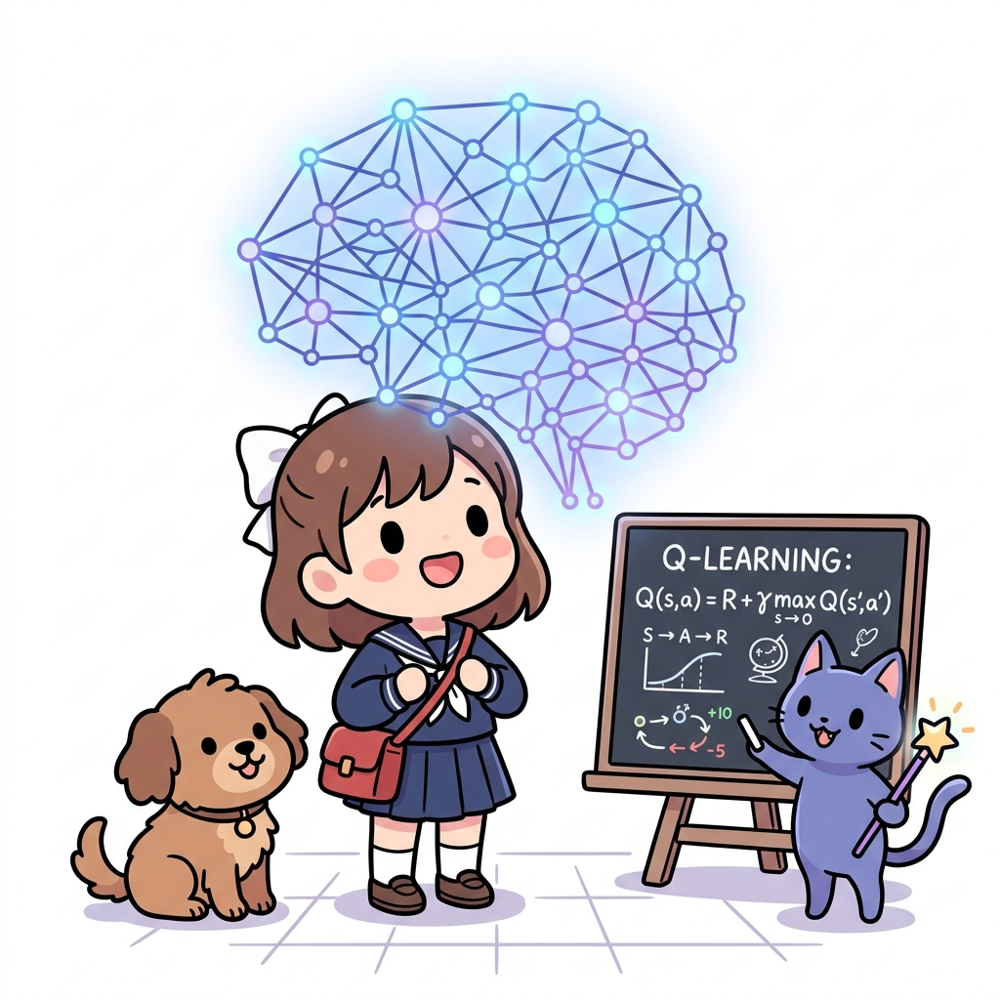

# 11.5 정리

**그림 11-5** 뉴럴 네트워크 형태의 홀로그램을 보며 신경망에 의한 행동 가치 근사를 요점 복습하는 도로시와 지니

11장 인공신경망과 Q 러닝의 긴 여정을 총정리합니다. DeZero 텐서 연산부터 비선형 신경망의 기본 원리, 그리고 테이블을 완전히 걷어치우고 딥러닝 망으로 가치 함수를 근사한 Q 러닝의 의의를 복습하고, 이를 진화시켜 Atari 게임을 정복한 12장 DQN의 관문으로 지니와 함께 힘차게 나아가 봅시다!

---

이번 장에서는 먼저 DeZero 프레임워크의 사용법을 배웠습니다. DeZero는 파이토치와 같은 최신 딥러닝 프레임워크와 똑같은 개념으로 설계된 프레임워크입니다. 데이터를 마치 넘파이의 ndarray처럼 다룰 수 있으며 역전파를 통해 미분을 구할 수 있습니다. 덕분에 미분을 이용해 매개변수를 갱신하는 경사 하강법 등을 쉽게 구현할 수 있습니다.

그런 다음 DeZero를 사용하여 기초적인 머신러닝 문제인 선형 회귀를 풀었습니다. 또한 비선형 데이터셋을 처리하는 신경망을 구현하고 올바르게 학습할 수 있음을 확인했습니다. DeZero에는 계층, 모델, 옵티마이저 등, 신경망 구현에 도움이 되는 클래스들이 다양하게 준비되어 있습니다. 이를 이용하면 신경망을 쉽게 구현할 수 있습니다.

마지막으로 신경망을 이용한 Q 러닝을 구현했습니다. 기본 원리는 앞 장에서 배운 Q 러닝과 같습니다. Q 러닝의 원리를 이해했다면 신경망을 적용하는 일은 그리 어렵지 않습니다.

우리는 드디어 강화 학습과 딥러닝이 결합된 심층 강화 학습의 세계로 들어섰습니다. 이제 상태나 행동의 크기가 커져도 걱정할 게 없습니다.

