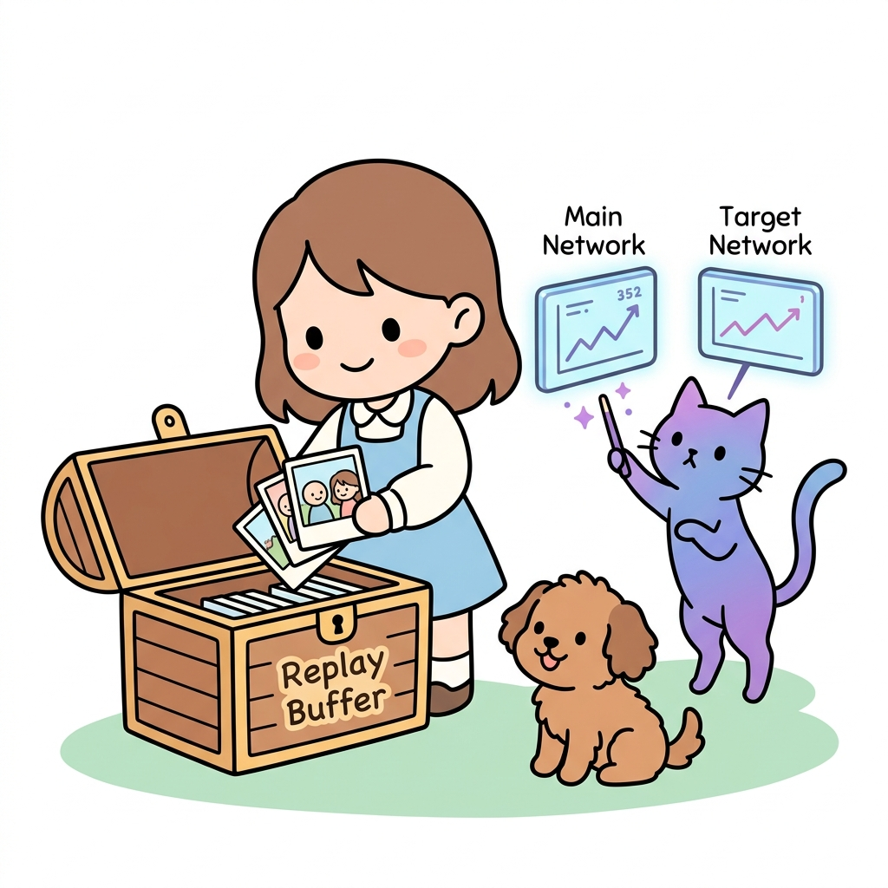
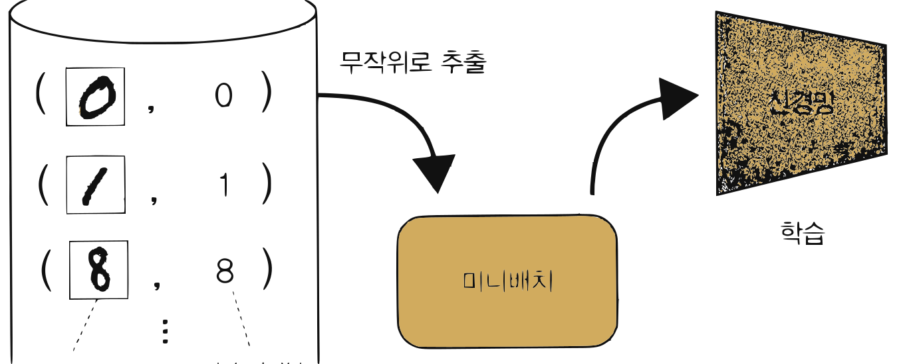
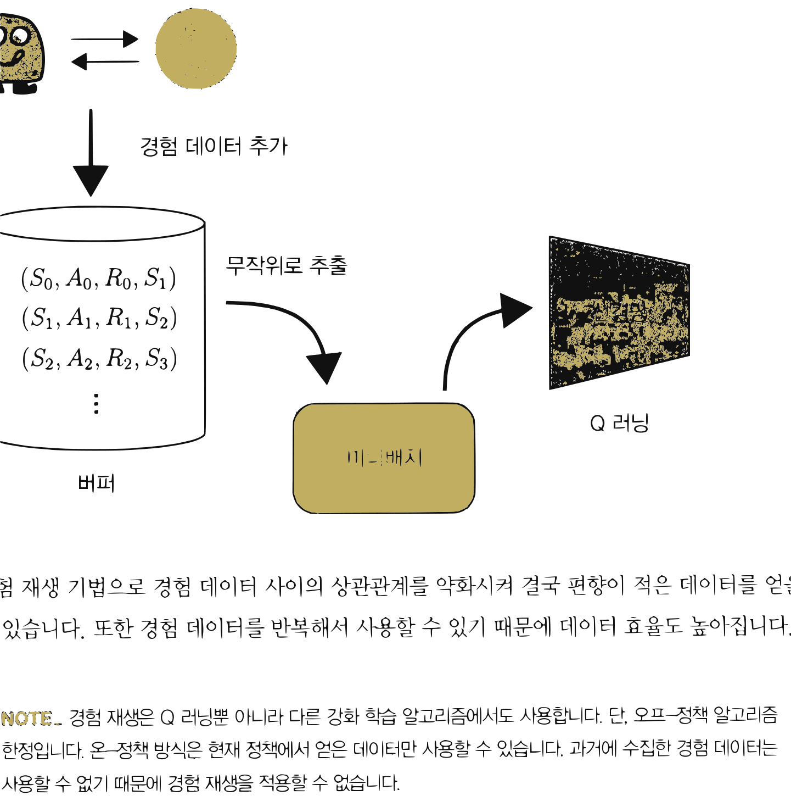
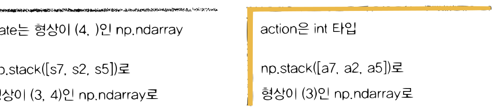
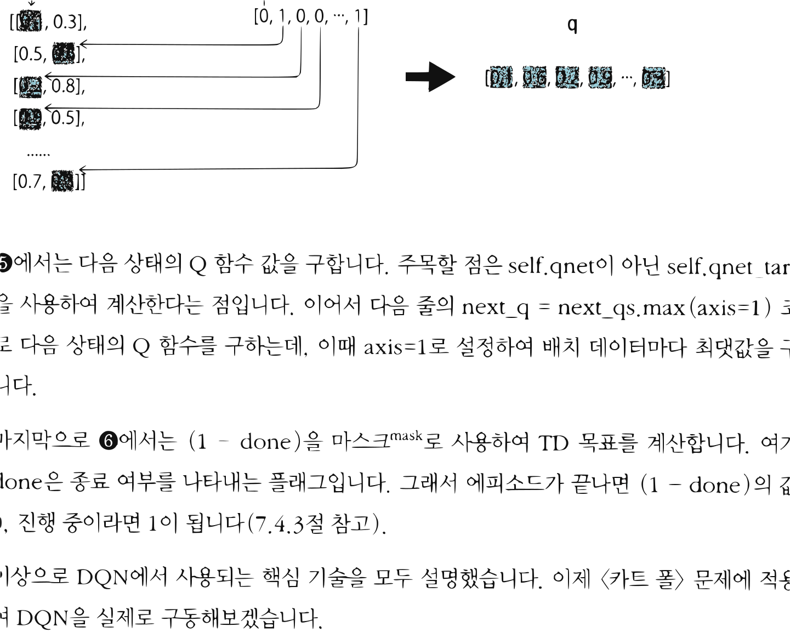
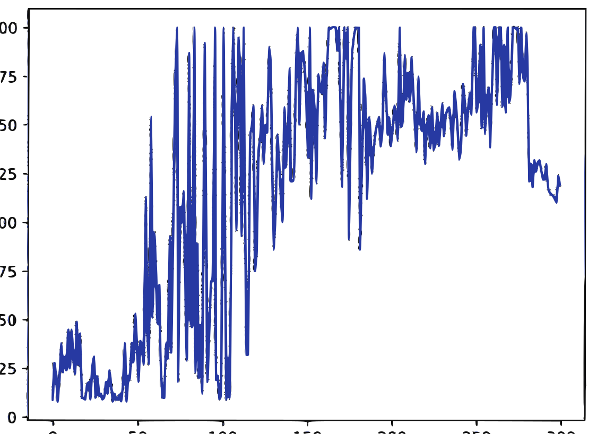

# 12.2 DQN의 핵심 기술

**그림 12-2** 과거 경험 카드 상자(Replay Buffer)에서 미니배치 샘플링을 진행하며 타깃 신경망의 학습 방향을 점검하는 지니와 도로시


DQN 학습의 안정성을 획기적으로 향상시킨 양대 산맥 기술인 **경험 재생(Experience Replay)**과 **목표 신경망(Target Network)**의 수학적 배경과 구현 방법을 배웁니다. 데이터 간 시간적 상관관계를 차단하여 인공신경망의 독립동일분포(i.i.d) 가정을 충족시키는 딥마인드 특유의 천재적인 최적화 트릭들을 지니의 마법 도구들을 통해 통쾌하게 정복해봅시다!

---

Q 러닝에서는 추정치를 사용하여 추정치를 갱신합니다(이 원리를 '부트스트래핑'이라고 했죠). 아직 정확하지 않은 추정치를 사용하여 현재의 추정치를 갱신하기 때문에 Q 러닝(넓게 보면 TD법)은 불안정해지기 쉽다는 성질이 있습니다. 여기에 신경망처럼 표현력이 높은 함수 근사화 기법이 더해지면 결과는 더욱 불안정해집니다.

> [!NOTE]
> 신경망은 표현력이 높다는 게 장점이지만 단점도 될 수 있습니다. 대표적인 예가 학습 데이터에 지나치게 잘 맞춰질 수 있다는 점이며 이를 **과대적합**<sup>overfitting; 과적합</sup>이라고 합니다.

DQN은 Q 러닝과 신경망을 결합한 기법으로, 신경망의 학습을 안정화하기 위해 '경험 재생'과 '목표 신경망' 기술을 사용한다는 점이 특징입니다(다른 기법도 쓰지만, 그 부분은 나중에 설명하겠습니다). 이러한 기술을 통해 DQN은 처음으로 비디오 게임과 같은 복잡한 문제를 성공적으로 풀어내는 데 성공했습니다. 이번 절에서는 DQN의 핵심 기술 두 가지를 순서대로 설명하겠습니다. 경험 재생부터 만나보죠.

## 12.2.1 경험 재생

신경망으로 '지도 학습'을 성공적으로 해결한 사례는 많습니다. 하지만 2013년 DQN이 발표되기 전까지 신경망으로 '강화 학습' 문제를 성공적으로 해결한 사례는 거의 없었습니다(주사위 놀이 사례가 유일했습니다<sup>[10]</sup>). 강화 학습 알고리즘에, 특히 Q 러닝에 신경망을 적용하기 어려운 이유는 무엇일까요? 어떻게 하면 Q 러닝과 신경망을 말끔하게 결합할 수 있을까요? 그 해답은 '지도 학습'과 'Q 러닝'의 차이에서 찾을 수 있습니다.

먼저 지도 학습에 대해 복습해보죠. 손글씨 숫자 이미지 모음인 MNIST를 예로 들어 설명하겠습니다. 이 데이터셋에는 이미지 데이터와 정답 레이블이 쌍으로 주어집니다. MNIST를 신경망으로 학습하는 일반적인 흐름은 [그림 12-4]와 같습니다.


**그림 12-4** 지도 학습의 흐름


데이터셋 (이미지 데이터, 정답 레이블) -> 무작위로 추출 -> 미니배치 -> 신경망 학습

그림과 같이 훈련용 데이터셋에서 일부 데이터를 무작위로 추출합니다. 이렇게 추출한 데이터를 **미니배치**<sup>mini-batch</sup>라고 합니다. 이 미니배치를 이용해 신경망의 매개변수를 갱신합니다. 한편, 미니배치를 만들 때는 데이터가 편향되지 않도록 주의해야 합니다(예컨대 '2' 이미지만 뽑아내지 않도록 방지). 신경망 학습에서는 데이터셋으로부터 데이터를 무작위로 추출하는 게 일반적인데, 바로 데이터 편향을 막기 위해서입니다.

다음은 Q 러닝 차례입니다. Q 러닝은 에이전트가 환경 속에서 어떤 행동을 취할 때마다 데이터를 생성합니다. 어떤 시간 *t*에서 얻은 $E_t = (S_t, A_t, R_t, S_{t+1})$을 이용해 Q 함수를 갱신합니다. 여기서 $E_t$를 **경험 데이터**라고 합니다. 경험 데이터는 시간이 흐름에 따라 얻어지며, 경험 데이터 사이에는 강한 상관관계가 있습니다(예컨대 $E_t$와 $E_{t+1}$ 사이에는 강한 상관관계가 있습니다). 다르게 표현하면, Q 러닝에서는 상관관계가 높은(편향된) 데이터를 사용하여 학습한다는 뜻입니다. 이 점이 지도 학습과 Q 러닝의 첫 번째 차이입니다. 이 차이를 메우는 기법으로 경험 재생이 있습니다.

**경험 재생**<sup>experience replay</sup>의 아이디어는 아주 간단합니다. 우선 에이전트가 경험한 데이터 $E_t = (S_t, A_t, R_t, S_{t+1})$을 '버퍼'에 저장합니다(버퍼란 데이터를 일시적으로 보관하는 저장소입니다). 그리고 Q 함수를 갱신할 때는 이 버퍼로부터 경험 데이터를 무작위로 꺼내 사용합니다([그림 12-5]).


**그림 12-5** 경험 재생을 이용한 학습의 흐름


에이전트 <-> 환경 -> 경험 데이터 추가 -> 버퍼 ($(S_0, A_0, R_0, S_1), (S_1, A_1, R_1, S_2), (S_2, A_2, R_2, S_3), \dots$) -> 무작위로 추출 -> 미니배치 -> 신경망 (Q 러닝)

경험 재생 기법으로 경험 데이터 사이의 상관관계를 약화시켜 결국 편향이 적은 데이터를 얻을 수 있습니다. 또한 경험 데이터를 반복해서 사용할 수 있기 때문에 데이터 효율도 높아집니다.

> [!NOTE]
> 경험 재생은 Q 러닝뿐 아니라 다른 강화 학습 알고리즘에서도 사용합니다. 단, 오프-정책 알고리즘 한정입니다. 온-정책 방식은 현재 정책에서 얻은 데이터만 사용할 수 있습니다. 과거에 수집한 경험 데이터는 사용할 수 없기 때문에 경험 재생을 적용할 수 없습니다.

## 12.2.2 경험 재생 구현

경험 재생 버퍼에는 현실적으로 데이터를 무한정 저장할 수 없습니다. 따라서 최대 크기를 미리 정해놓습니다. 예를 들어 최대 5만 개의 경험 데이터를 저장할 수 있도록 하는 식입니다. 그리고 최대 크기를 초과하여 데이터가 추가되면 오래된 데이터부터 삭제합니다. 이렇게 하면 버퍼에는 최신 데이터만 담기게 되겠죠. 이러한 선입선출 방식의 데이터 저장소로는 파이썬 표준 라이브러리의 `collections.deque`가 적격입니다.


이제 경험 재생 메커니즘을 ReplayBuffer라는 클래스로 구현해보겠습니다.

<div align="right"><b>ch08/replay_buffer.py</b></div>

```python
from collections import deque
import random
import numpy as np

class ReplayBuffer:
    def __init__(self, buffer_size, batch_size):
        self.buffer = deque(maxlen=buffer_size)
        self.batch_size = batch_size

    def add(self, state, action, reward, next_state, done):
        data = (state, action, reward, next_state, done)
        self.buffer.append(data)

    def __len__(self):
        return len(self.buffer)

    def get_batch(self):
        data = random.sample(self.buffer, self.batch_size)

        state = np.stack([x[0] for x in data])
        action = np.array([x[1] for x in data])
        reward = np.array([x[2] for x in data])
        next_state = np.stack([x[3] for x in data])
        done = np.array([x[4] for x in data]).astype(np.int32)
        return state, action, reward, next_state, done
```

먼저 초기화 매개변수로 buffer_size와 batch_size를 받습니다. buffer_size는 버퍼의 크기, batch_size는 미니배치의 크기입니다. 버퍼는 `self.buffer = deque(maxlen=buffer_size)` 코드로 초기화했습니다. deque는 리스트처럼 쓸 수 있고 최대 크기를 넘어서면 오래된 데이터부터 삭제해줍니다.

`add()`는 경험 데이터를 추가하는 메서드입니다. 버퍼에 추가되는 데이터는 (state, action, reward, next_state, done) 묶음을 하나의 단위로 처리합니다.

`__len__()` 메서드는 `len()` 함수를 사용하여 버퍼의 크기를 알려줍니다. 예를 들어 `replay_buffer = ReplayBuffer(50000, 32)` 코드로 만든 버퍼에 현재 들어 있는 데이터 크기를 알고 싶다면 `len(replay_buffer)` 형태로 호출하면 됩니다.


마지막은 `get_batch()` 메서드입니다. 버퍼에 담긴 데이터에서 미니배치를 생성해주는 메서드죠. self.buffer에서 데이터를 무작위로 가져와 신경망이 처리하기 쉽도록 np.ndarray 인스턴스로 변환합니다. 본문 코드는 [그림 12-6]을 참고하면 쉽게 이해될 것입니다.

**그림 12-6** 미니배치 원소를 np.ndarray로 변환하는 코드 예제


* `self.buffer` `[(s0, a0, r0, s1), (s1, a1, r1, s2), ..., (s9, a9, r9, s10)]` -> 예를 들어 3개를 무작위로 샘플링 -> `[(s7, a7, r7, s8), (s2, a2, r2, s3), (s5, a5, r5, s6)]`
* state는 형상이 (4,)인 np.ndarray -> `np.stack([s7, s2, s5])`로 형상이 (3, 4)인 np.ndarray로
* action은 int 타입 -> `np.stack([a7, a2, a5])`로 형상이 (3,)인 np.ndarray로

이제 \<카트 폴\> 환경에서 경험 재생을 사용해봅시다. 코드는 다음과 같습니다.

<div align="right"><b>ch08/replay_buffer.py</b></div>

```python
import gym

env = gym.make('CartPole-v0', render_mode='human')
replay_buffer = ReplayBuffer(buffer_size=10000, batch_size=32)

for episode in range(10): # ❶ 에피소드 10회 수행
    state = env.reset()[0]
    done = False

    while not done:
        action = 0 # ❷ 항상 0번째 행동만 수행
        # ❸ 경험 데이터 획득
        next_state, reward, terminated, truncated, info = env.step(action)
        done = terminated | truncated

        replay_buffer.add(state, action, reward, next_state, done) # ❹ 버퍼에 추가
        state = next_state
# 경험 데이터 버퍼로부터 미니배치 생성
state, action, reward, next_state, done = replay_buffer.get_batch()

print(state.shape)        # [출력 결과] (32, 4)
print(action.shape)       # [출력 결과] (32,)
print(reward.shape)       # [출력 결과] (32,)
print(next_state.shape)   # [출력 결과] (32, 4)
print(done.shape)         # [출력 결과] (32,)
```

❶ 에피소드를 10회 수행했습니다. 각 에피소드에서는 ❷ 항상 0번째 행동만 수행하고 ❸ 얻은 데이터를 ❹ replay_buffer에 추가합니다. 그리고 마지막으로 ❺ `replay_buffer.get_batch()`로 미니배치를 가져옵니다.

출력 결과에서 알 수 있듯이 배치 크기(여기서는 32)만큼의 데이터가 np.ndarray 인스턴스로 추출됐음을 확인할 수 있습니다.

이상으로 경험 재생 구현을 마칩니다. 다음 절에서는 Q 러닝에 사용되는 또 다른 핵심 기술인 '목표 신경망'을 알아보겠습니다.

## 12.2.3 목표 신경망

이번에도 지도 학습과 Q 러닝을 비교해서 생각해보겠습니다. 지도 학습에서는 학습 데이터에 정답 레이블이 부여됩니다. 이때 각 입력에 대한 정답 레이블이 변할 일은 없습니다. 예를 들어 MNIST의 입력 이미지가 있고 정답 레이블은 7이라고 해보죠. 그러면 이 레이블은 영원히 7입니다. 신경망의 학습 과정에서 4로 바뀌는 일은 절대로 없습니다.

그렇다면 Q 러닝은 어떨까요? Q 러닝에서는 $Q(S_t, A_t)$의 값이 $R_t + \gamma \max_a Q(S_{t+1}, a)$가 되도록 Q 함수를 갱신합니다. TD 목표는 지도 학습에서의 정답 레이블에 해당합니다. 하지만 TD 목표의 값은 Q 함수가 갱신될 때마다 달라집니다. 이것이 바로 지도 학습과 Q 러닝의 차이입니다. 그리고 이 차이를 메우기 위해 'TD 목표를 고정'하는 기술인 **목표 신경망**<sup>target network</sup>을 사용합니다.

목표 신경망은 어떻게 구현할까요? 먼저 Q 함수를 나타내는 원본 신경망(qnet)을 준비합니다. 그리고 구조가 같은 신경망(qnet_target)을 하나 더 준비합니다. qnet은 일반적인 Q 러닝으로 갱신합니다. 반면 qnet_target은 주기적으로 qnet의 가중치와 동기화시키고, 그 외에


는 가중치 매개변수를 고정된 상태로 둡니다. 이후 qnet_target을 사용하여 TD 목표의 값을 계산하면 정답 레이블인 TD 목표가 바뀌는 일을 억제할 수 있습니다. 즉, 정답 레이블인 TD 목표가 달라지지 않기 때문에 신경망 학습이 안정화될 것이라고 기대할 수 있습니다.

> [!NOTE]
> 목표 신경망은 TD 목표의 값을 고정하기 위한 기법입니다. 단, TD 목표가 전혀 갱신되지 않으면 Q 함수의 학습이 진행되지 않으므로 주기적으로(예컨대 100 에피소드마다) 목표 신경망을 갱신합니다.

## 12.2.4 목표 신경망 구현

목표 신경망을 코드로 구현해보겠습니다. 여기서는 다음 절에서 다룰 DQN 전체 구현을 염두에 두고 DQNAgent 코드의 일부를 보여드리겠습니다.

<div align="right"><b>ch08/dqn.py</b></div>

```python
import copy
from dezero import Model
from dezero import optimizers
import dezero.functions as F
import dezero.layers as L

class QNet(Model): # ❶ 신경망 클래스
    def __init__(self, action_size):
        super().__init__()
        self.l1 = L.Linear(128)
        self.l2 = L.Linear(128)
        self.l3 = L.Linear(action_size)

    def forward(self, x):
        x = F.relu(self.l1(x))
        x = F.relu(self.l2(x))
        x = self.l3(x)
        return x

class DQNAgent: # # 에이전트 클래스
    def __init__(self):
        self.gamma = 0.98
        self.lr = 0.0005
        self.epsilon = 0.1
        self.buffer_size = 10000 # 경험 재생 버퍼 크기
        self.batch_size = 32 # 미니배치 크기
        self.action_size = 2

        self.replay_buffer = ReplayBuffer(self.buffer_size, self.batch_size)
        self.qnet = QNet(self.action_size)        # ❷ 원본 신경망
        self.qnet_target = QNet(self.action_size) # ❷ 목표 신경망
        self.optimizer = optimizers.Adam(self.lr)
        self.optimizer.setup(self.qnet)           # ❸ 옵티마이저에 qnet 등록

    def sync_qnet(self): # ❹ 두 신경망 동기화
        self.qnet_target = copy.deepcopy(self.qnet)

    def get_action(self, state):
        if np.random.rand() < self.epsilon:
            return np.random.choice(self.action_size)
        else:
            state = state[np.newaxis, :] # 배치 처리용 차원 추가
            qs = self.qnet(state)
            return qs.data.argmax()
```

❶ 먼저 신경망인 QNet 클래스를 준비합니다. ❷ 그리고 이 클래스를 이용하여 에이전트인 DQNAgent 클래스가 self.qnet과 self.qnet_target이라는 두 벌의 신경망을 갖도록 구성합니다(둘 다 같은 구조의 신경망입니다). ❸ 그리고 옵티마이저에는 self.qnet만 등록합니다. 그래서 가중치 매개변수 갱신은 self.qnet에서만 이루어집니다(옵티마이저가 self.qnet_target의 가중치 매개변수는 갱신하지 않습니다).

❹ 다음으로 `sync_qnet()`은 두 신경망을 동기화하는 메서드입니다. 동기화에는 파이썬 표준 라이브러리의 `copy.deepcopy()` 메서드를 사용했습니다. deepcopy는 '깊은 복사'라는 뜻으로, 모든 데이터를 완벽하게 복제하고 싶을 때 사용합니다. 여기서는 self.qnet의 완전한 복사본을 만들고 이를 self.qnet_target으로 설정했습니다.

> [!NOTE]
> copy 모듈에는 '얕은 복사(copy.copy)'와 '깊은 복사(copy.deepcopy)'가 있습니다. 얕은 복사는 객체를 구성하는 데이터의 '참조'만 복사합니다. 만약 지금 코드에서 얕은 복사를 사용하면 두 신경망은 '물리적으로 하나인' 가중치 매개변수를 '공유'하게 됩니다.

마지막으로 DQNAgent 클래스에서 가중치 매개변수를 갱신하는 메서드를 보겠습니다.


<div align="right"><b>ch08/dqn.py</b></div>

```python
class DQNAgent:
    ...

    def update(self, state, action, reward, next_state, done):
        # ❶ 경험 재생 버퍼에 경험 데이터 추가
        self.replay_buffer.add(state, action, reward, next_state, done)
        if len(self.replay_buffer) < self.batch_size:
            return # 데이터가 미니배치 크기만큼 쌓이지 않았다면 여기서 끝

        # ❷ 미니배치 크기 이상이 쌓이면 미니배치 생성
        state, action, reward, next_state, done = self.replay_buffer.get_batch()

        qs = self.qnet(state) # ❸
        q = qs[np.arange(self.batch_size), action] # ❹

        next_qs = self.qnet_target(next_state) # ❺
        next_q = next_qs.max(axis=1)
        next_q.unchain()
        target = reward + (1 - done) * self.gamma * next_q # ❻

        loss = F.mean_squared_error(q, target)

        self.qnet.cleargrads()
        loss.backward()
        self.optimizer.update()
```

`update()` 메서드가 호출되면 ❶ 먼저 버퍼(self.replay_buffer)에 경험 데이터를 추가합니다. ❷ 그리고 미니배치 크기 이상의 경험 데이터가 저장되면 버퍼에서 미니배치로 데이터를 가져옵니다.

❸에서 32개 분량의 데이터를 모아 신경망(self.qnet)에 제공합니다. 배치 크기가 32이고 상태 크기가 4이므로 state는 (32, 4) 형상의 np.ndarray입니다. 그래서 출력 qs의 형상은 (32, 2)가 됩니다. \<카트 폴\> 문제에서는 행동의 크기가 2이므로 각 행동에 대한 Q 함수가 출력된 것입니다.

❹에서 action은 (32, ) 형상의 np.ndarray입니다. action에는 에이전트가 수행한 행동이 저장됩니다. 예를 들어 [0, 1, 0, 0, $\dots$, 1]과 같은 데이터가 저장되죠. 그래서 `q = qs[np.arange(self.batch_size), action]` 코드는 [그림 12-7]과 같이 qs에서 action에 해당하는 원소를 가져오는 일을 합니다.


**그림 12-7** `q = qs[np.arange(self.batch_size), action]` 코드가 수행하는 작업


`qs`: `[[0.1, 0.3], [0.5, 0.6], [0.2, 0.8], [0.9, 0.5], ..., [0.7, 0.3]]`
`action`: `[0, 1, 0, 0, ..., 1]`
`q`: `[0.1, 0.6, 0.2, 0.9, ..., 0.3]`

❺에서는 다음 상태의 Q 함수 값을 구합니다. 주목할 점은 self.qnet이 아닌 self.qnet_target을 사용하여 계산한다는 점입니다. 이어서 다음 줄의 `next_q = next_qs.max(axis=1)` 코드로 다음 상태의 Q 함수를 구하는데, 이때 axis=1로 설정하여 배치 데이터마다 최댓값을 구합니다.

마지막으로 ❻에서는 `(1 - done)`을 마스크<sup>mask</sup>로 사용하여 TD 목표를 계산합니다. 여기서 done은 종료 여부를 나타내는 플래그입니다. 그래서 에피소드가 끝나면 `(1 - done)`의 값은 0, 진행 중이라면 1이 됩니다(7.4.3절 참고).

이상으로 DQN에서 사용되는 핵심 기술을 모두 설명했습니다. 이제 \<카트 폴\> 문제에 적용하여 DQN을 실제로 구동해보겠습니다.

## 12.2.5 DQN 실행

DQNAgent 클래스를 사용하여 \<카트 폴\> 문제에 도전해봅시다.

<div align="right"><b>ch08/dqn.py</b></div>

```python
episodes = 300 # # 에피소드 수
sync_interval = 20 # # 신경망 동기화 주기(20번째 에피소드마다 동기화)
env = gym.make('CartPole-v0', render_mode='rgb_array')
agent = DQNAgent()
reward_history = [] # # 에피소드별 보상 기록

for episode in range(episodes):
    state = env.reset()[0]
    done = False
    total_reward = 0

    while not done:
        action = agent.get_action(state)
        next_state, reward, terminated, truncated, info = env.step(action)
        done = terminated | truncated

        agent.update(state, action, reward, next_state, done)
        state = next_state
        total_reward += reward

    if episode % sync_interval == 0:
        agent.sync_qnet()

    reward_history.append(total_reward)
```

에피소드를 총 300번 실행했습니다. 또한 20번째 에피소드마다 `agent.sync_qnet()`을 호출하여 목표 신경망을 동기화합니다. 그 외에는 지금까지 살펴본 코드와 거의 같습니다.

이 코드는 완료까지 시간이 살짝 걸립니다. 모든 에피소드가 끝나면 `reward_history`에는 에피소드별로 얻은 보상의 총합이 기록되어 있습니다. [그림 12-8]은 이 기록을 시각화한 그래프입니다(실행할 때마다 달라집니다).

**그림 12-8** \<카트 폴\>에서 에피소드별 보상 총합의 추이




그래프의 가로축은 에피소드 수, 세로축은 보상 합계입니다. 이번 문제의 경우 보상 총합은 막대가 균형을 유지한 시간(타임 스텝)입니다. 에피소드가 거듭될수록 전반적으로 보상의 총합이 커지는 듯 보입니다. 다만 변동폭이 커서 섣불리 판단하기 어렵습니다. 이처럼 강화 학습 알고리즘을 평가할 때 한 번의 실험 결과만으로 판단하는 것은 위험합니다. 그래서 같은 실험을 반복 수행하여 얻은 결과를 평균하여 평균하는 게 좋습니다. [그림 12-9]는 같은 실험을 100번 반복하여 결과를 평균한 그래프입니다.

**그림 12-9** 100번 실험 후 평균한 결과


[그림 12-9]를 보면 초기에는 균형을 제대로 잡지 못하고 금방 실패합니다. 하지만 50회를 지나면서부터 서서히 '요령'을 익히기 시작하며, 150회 정도까지는 순조롭게 학습이 진행됩니다. 그러다가 이후부터는 다소 하락하는 모습을 보입니다. 어쨌든 전체적으로 보면 좋은 방향으로 학습이 진행되는 것으로 보입니다.

참고로 학습 중인 에이전트는 *ε*-탐욕 정책에 따라 행동합니다. 즉, *ε*의 확률로 무작위로 행동합니다. 이제 학습이 끝난 에이전트에게 탐욕 행동을 선택하도록 해봅시다.

<div align="right"><b>ch08/dqn.py</b></div>

```python
agent.epsilon = 0 # # 탐욕 정책(무작위로 행동할 확률 ε을 0으로 설정)
state = env.reset()[0]
done = False
total_reward = 0

while not done:
    action = agent.get_action(state)
    next_state, reward, terminated, truncated, info = env.step(action)
    done = terminated | truncated
    state = next_state
    total_reward += reward
    env.render()
print('Total Reward:', total_reward)
```

**출력 결과**
```text
Total Reward: 116
```

이번 결과에서 학습을 마친 에이전트는 탐욕 행동을 통해 116단계까지 균형을 잡을 수 있었습니다. 결과는 매번 달라지지만(\<카트 폴\>의 초기 상태가 매번 조금씩 달라짐), 대체로 100을 넘는 결과를 얻게 됩니다. 아직 균형을 완벽하게 잡지는 못하지만 그래도 올바른 방향으로 학습하고 있습니다. 여기서 하이퍼파라미터를 조정하면(특히 에피소드 수를 늘리면) 결과가 더 나아질 것입니다.

> [!NOTE]
> **하이퍼파라미터**<sup>hyperparameter</sup>는 사람이 미리 설정한 값입니다. 이번 코드에서는 다음 항목들이 하이퍼파라미터에 해당합니다.
>
> * 할인율 (gamma = 0.98)
> * 학습률 (lr = 0.0005)
> * *ε*-탐욕 확률 (epsilon = 0.05)
> * 경험 재생 버퍼 크기 (buffer_size = 100000)
> * 미니배치 크기 (batch_size = 32)
> * 에피소드 수 (episodes = 300)
> * 동기화 주기 (sync_interval = 20)
> * 신경망 구조 (계층 수, Linear 계층의 노드 수 등)


