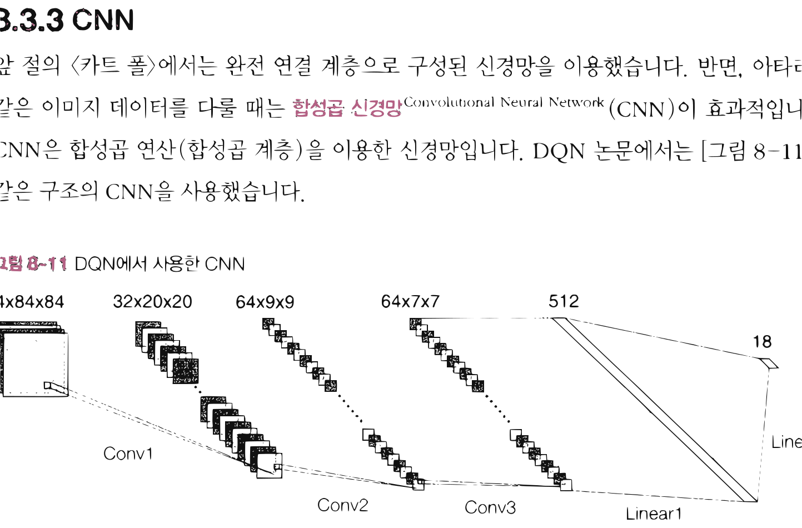
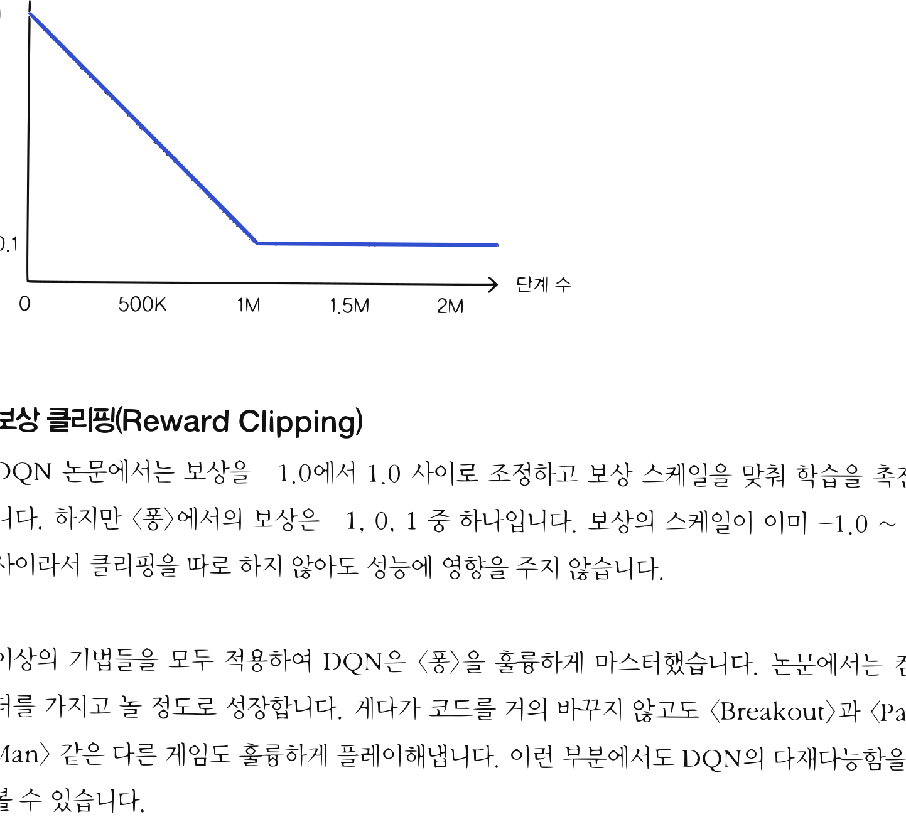

# 12.3 DQN과 아타리

**그림 12-3** 픽셀 화면 프레임 이미지 상태 입력을 CNN에 전달해 게임 액션 점수를 학습하는 도로시와 지니

인공지능 역사에 큰 획을 그었던 **아타리 2600(Atari 2600)** 비디오 게임 정복 사례를 분석합니다. 여러 프레임의 게임 화면을 쌓아 상태로 취급하는 이미지 전처리 방법과, 공간적 특징을 포착하는 CNN(합성곱 신경망)의 적용 구조를 요정 지니의 픽셀 스크린 분석 비유를 통해 쉽게 해부해봅시다!

---

DQN은 「Playing Atari with Deep Reinforcement Learning」 논문[11]에서 제안한 기법입니다. 제목에 있는 'Atari아타리'는 게임 회사의 이름입니다. 강화 학습 분야에서는 이 회사가 제작한 옛날 게임들을 가리켜 '아타리'라고 부르고 있습니다.

> [!NOTE]
> DQN이 2013년에 발표된 후 2015년 과학 잡지 『네이처Nature』에 DQN 논문[12]이 실렸습니다. 제목은 「Human-level control through deep reinforcement learning」이었죠. 이 논문에서는 DQN이 게임을 사람과 동등한 수준으로 플레이할 수 있음을 보여주었습니다.

앞 절에서는 DQN을 이용해 \<카트 폴\>을 학습시켰습니다. 그렇다면 더 어려운 문제인 '아타리'와 같은 게임이라면 어떨까요? 좋은 소식과 나쁜 소식이 있습니다. 좋은 소식은 방금 구현한 DQN 코드를 조금만 수정하면 아타리도 잘 학습시킬 수 있다는 것입니다. 나쁜 소식은 아타리를 학습하는 데는 시간이 너무 오래 걸린다는 것입니다. GPU를 사용하면 많이 단축되지만 그래도 하루는 걸립니다. 그래서 이 책에서는 아타리용 DQN 코드를 따로 제공하지 않고 앞 절에서 보여드린 DQN과의 차이점을 중심으로 설명하겠습니다.

## 12.3.1 아타리 게임 환경

OpenAI Gym은 아타리 게임용 환경도 제공합니다(자세한 설치 방법은 OpenAI Gym의 문서를 참고하세요). 아타리 환경에는 다양한 게임이 준비되어 있습니다. 이번 절에서는 그중 \<퐁Pong\>이라는 게임을 대상으로 설명하겠습니다(그림 12-10).

**그림 12-10** 게임 \<퐁\>의 화면

점수판(현재 1:0), 플레이어, 공, 적(컴퓨터)

\<퐁\>은 [그림 12-10]과 같이 공을 주고받는 게임입니다. 탁구 경기를 하늘에서 내려다본다고 상상하면 쉽게 이해될 것입니다. 적은 왼쪽의 보드(판)를, 플레이어는 오른쪽의 보드를 위아래로 움직여 공을 쳐내고 공이 상대편 진지를 넘어가면 점수를 얻습니다. 에이전트는 '가로 210, 세로 160, RGB 3 채널'의 게임 화면 이미지를 상태로 부여받습니다.

\<퐁\> 게임도 앞 절의 DQN을 이용해 비슷하게 풀 수 있습니다. 다만 \<카트 폴\>보다 복잡한 문제이기 때문에 더 많은 노력이 필요합니다. 지금부터 그 부분을 설명하겠습니다.

## 12.3.2 전처리

이 책에서 지금까지 설명한 강화 학습 이론은 마르코프 결정 과정(MDP)을 전제로 했습니다. MDP에서는 최적 행동을 결정하는 데 필요한 정보가 '현재 상태'에 모두 담겨 있습니다. 하지만 안타깝게도 \<퐁\>은 MDP의 요건을 충족하지 못합니다. 예를 들어 [그림 12-10]의 이미지만으로는 공이 어느 방향으로 움직이고 있는지 알 수 없고, 공의 진행 방향을 모르는 상태에서는 최적 행동을 알아낼 수 없습니다. 이런 문제를 **부분 관찰 마르코프 결정 과정**Partially Observable Markov Decision Process(POMDP)이라고 합니다.

\<퐁\> 형태의 비디오 게임이라면 POMDP를 MDP로 간단하게 변환할 수 있습니다. DQN 논문[12]에서는 네 개의 프레임이 연속된 이미지를 겹쳐서 하나의 '상태'로 취급합니다. 연속된 이

미지를 이용하면 상태가 어떻게 전이되는지를 알 수 있기 때문입니다(공의 움직임도 알 수 있습니다). 그러면 기존처럼 MDP로 취급할 수 있게 됩니다.

> [!NOTE]
> POMDP용 강화 학습도 활발히 연구되고 있습니다. POMDP에서는 현재의 관찰만으로는 충분하지 않기 때문에 과거의 관찰도 고려하여 행동을 결정해야 합니다. 그래서 흔히 **순환 신경망**Recurrent Neural Network(RNN)을 이용합니다. RNN을 이용하면 과거에 입력된 데이터를 이어받아 계산할 수 있기 때문입니다.

또한 DQN 논문에서는 프레임을 중첩하기 전에 다음과 같은 작업들을 처리합니다.

* 이미지 주변 자르기(이미지 주변의 불필요한 요소 제거)
* 그레이 스케일(회색조 이미지로 변환)
* 이미지 크기 조정
* 정규화(이미지의 원솟값을 0.0에서 1.0 사이로 변환)

이러한 전처리 후 4개의 프레임을 중첩시킵니다.

## 12.3.3 CNN

앞 절의 \<카트 폴\>에서는 완전 연결 계층으로 구성된 신경망을 이용했습니다. 반면, 아타리와 같은 이미지 데이터를 다룰 때는 **합성곱 신경망**Convolutional Neural Network(CNN)이 효과적입니다. CNN은 합성곱 연산(합성곱 계층)을 이용한 신경망입니다. DQN 논문에서는 [그림 12-11]과 같은 구조의 CNN을 사용했습니다.

**그림 12-11** DQN에서 사용한 CNN

4x84x84 -> Conv1 -> 32x20x20 -> Conv2 -> 64x9x9 -> Conv3 -> 64x7x7 -> Linear1 -> 512 -> Linear2 -> 18

그림에서 볼 수 있듯이 입력에 가까운 층에서는 합성곱 계층을 사용하고, 출력에 가까운 층에서는 완전 연결 계층을 사용합니다. 마지막 출력층은 문제에서의 행동 후보 개수만큼을 출력합니다. 활성화 함수로는 ReLU를 썼습니다.

## 12.3.4 기타 아이디어

지금까지 설명한 방법 외에도 DQN 논문에서는 다음과 같은 기법도 사용했습니다. 이 기법들은 DQN뿐 아니라 다른 강화 학습 알고리즘에서도 많이 쓰입니다.

#### GPU 사용
아타리와 같은 게임에서는 이미지를 다루기 때문에 데이터가 매우 큽니다. 자연스럽게 학습에 필요한 계산량도 많아지죠. 이 계산을 빠르게 하기 위해서는 GPU(또는 TPU) 등의 가속 하드웨어를 이용해 병렬로 계산하는 게 효과적입니다. 참고로 DeZero에도 GPU로 계산하는 기능이 있습니다.

#### *ε*값 조정
강화 학습에서는 활용과 탐색의 균형이 중요합니다. 에이전트의 경험이 늘어날수록 가치 함수의 신뢰도가 높아진다는 점을 고려하면, 에피소드 수에 비례하여 탐색의 비율을 줄이는 편이 합리적입니다. 즉, 초기 단계에서는 탐색을 많이 시도하고 학습이 진행될수록 활용의 비중을 늘리는 전략이죠. *ε*-탐욕 정책에 이 아이디어를 적용하려면 에이전트가 행동을 거듭할수록 *ε*값을 줄이면 됩니다. DQN 논문에서는 처음 100만 단계까지는 *ε*을 1.0에서 0.1까지 선형으로 감소시키고 이후에는 0.1로 고정하는 방식을 택했습니다.

**그림 12-12** DQN에서의 *ε*값 변경 추이

가로축: 단계 수 (0, 500K, 1M, 1.5M, 2M)
세로축: *ε* (1, 0.1)

#### 보상 클리핑(Reward Clipping)
DQN 논문에서는 보상을 -1.0에서 1.0 사이로 조정하고 보상 스케일을 맞춰 학습을 촉진합니다. 하지만 \<퐁\>에서의 보상은 -1, 0, 1 중 하나입니다. 보상의 스케일이 이미 -1.0 ~ 1.0 사이라서 클리핑을 따로 하지 않아도 성능에 영향을 주지 않습니다.

이상의 기법들을 모두 적용하여 DQN은 \<퐁\>을 훌륭하게 마스터했습니다. 논문에서는 컴퓨터를 가지고 놀 정도로 성장합니다. 게다가 코드를 거의 바꾸지 않고도 \<Breakout\>과 \<Pac-Man\> 같은 다른 게임도 훌륭하게 플레이해냅니다. 이런 부분에서도 DQN의 다재다능함을 엿볼 수 있습니다.

