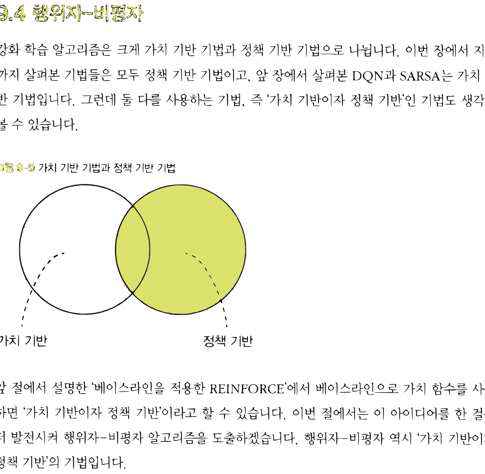
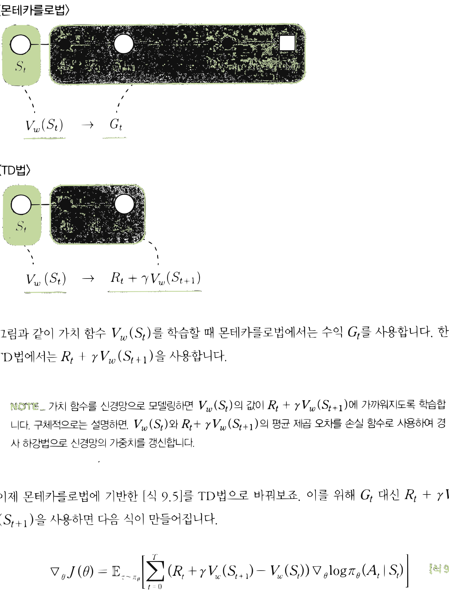
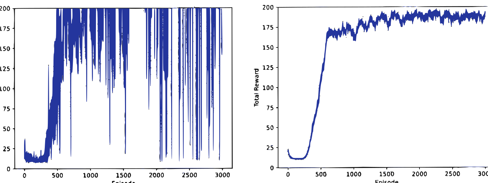

# 13.4 행위자-비평자

**그림 13-4** 무대 위에서 춤을 추는 행위자(Actor) 도로시와 심사판을 들고 평가해주는 비평자(Critic) 지니의 연계 구조


정책을 갱신하는 **행위자(Actor)**와 상태의 가치를 평가하는 **비평자(Critic)**가 협동하여 학습하는 심층 강화학습의 주류 프레임워크인 **Actor-Critic** 기법을 공부합니다. 몬테카를로 반환값 대신 TD 오차(Temporal Difference Error)를 행동의 성과 지표로 사용하는 수학적 증명과 구현 방법을 지니와 도로시의 연기 지휘 비유를 통해 확실하게 습득해봅시다!

---

강화 학습 알고리즘은 크게 가치 기반 기법과 정책 기반 기법으로 나뉩니다. 이번 장에서 지금까지 살펴본 기법들은 모두 정책 기반 기법이고, 앞 장에서 살펴본 DQN과 SARSA는 가치 기반 기법입니다. 그런데 둘 다를 사용하는 기법, 즉 '가치 기반이자 정책 기반'인 기법도 생각해 볼 수 있습니다.

**그림 13-9** 가치 기반 기법과 정책 기반 기법


가치 기반 / 정책 기반

앞 절에서 설명한 '베이스라인을 적용한 REINFORCE'에서 베이스라인으로 가치 함수를 사용하면 '가치 기반이자 정책 기반'이라고 할 수 있습니다. 이번 절에서는 이 아이디어를 한 걸음 더 발전시켜 행위자-비평자 알고리즘을 도출하겠습니다. 행위자-비평자 역시 '가치 기반이자 정책 기반'의 기법입니다.


## 13.4.1 행위자-비평자 도출

먼저 '베이스라인을 적용한 REINFORCE'를 복습해보죠. 이 기법에서 목적 함수의 기울기는 다음 식으로 표현됩니다.

$$\nabla_{\theta} J(\theta) = \mathbb{E}_{\tau \sim \pi_{\theta}} \left[ \sum_{t=0}^{T} (G_t - b(S_t)) \nabla_{\theta} \log \pi_{\theta} (A_t | S_t) \right] \tag{식 9.4}$$

[식 10.4]에서 *G*<sub>*t*</sub>는 수익, $b(S_t)$는 베이스라인을 나타냅니다. 베이스라인은 임의의 함수를 사용할 수 있습니다. 이번 절에서는 신경망으로 모델링한 가치 함수를 베이스라인으로 사용합니다. 이를 위해 다음 기호들을 새롭게 사용합니다.

* *w* : 가치 함수를 나타내는 신경망의 모든 가중치 매개변수
* $V_w(S_t)$ : 가치 함수를 모델링한 신경망

그러면 목적 함수의 기울기는 다음 식으로 표현됩니다.

$$\nabla_{\theta} J(\theta) = \mathbb{E}_{\tau \sim \pi_{\theta}} \left[ \sum_{t=0}^{T} (G_t - V_w(S_t)) \nabla_{\theta} \log \pi_{\theta} (A_t | S_t) \right] \tag{식 9.5}$$

[식 10.5]에는 문제가 하나 있습니다. 수익 *G*<sub>*t*</sub>는 목표에 도달해야 비로소 정해진다는 문제입니다. 즉, 목표에 도달하기 전까지는 정책이나 가치 함수를 갱신할 수 없습니다. 사실 몬테카를로법에 기초한 기법 모두에 해당하는 단점이죠. 이 단점을 해결한 기법이 7장에서 다룬 TD법입니다. TD법으로 가치 함수를 학습하면 [그림 13-10]과 같이 1단계 후(또는 $n$단계 후)의 결과를 이용하여 갱신할 수 있습니다.


**그림 13-10** 몬테카를로법과 TD법 비교


\<몬테카를로법\>
$V_w(S_t) \rightarrow G_t$

\<TD법\>
$V_w(S_t) \rightarrow R_t + \gamma V_w(S_{t+1})$

그림과 같이 가치 함수 $V_w(S_t)$를 학습할 때 몬테카를로법에서는 수익 *G*<sub>*t*</sub>를 사용합니다. 한편 TD법에서는 $R_t + \gamma V_w(S_{t+1})$을 사용합니다.

> [!NOTE]
> 가치 함수를 신경망으로 모델링하면 $V_w(S_t)$의 값이 $R_t + \gamma V_w(S_{t+1})$에 가까워지도록 학습합니다. 구체적으로는 설명하면, $V_w(S_t)$와 $R_t + \gamma V_w(S_{t+1})$의 평균 제곱 오차를 손실 함수로 사용하여 경사 하강법으로 신경망의 가중치를 갱신합니다.

이제 몬테카를로법에 기반한 [식 10.5]를 TD법으로 바꿔보죠. 이를 위해 *G*<sub>*t*</sub> 대신 $R_t + \gamma V_w(S_{t+1})$을 사용하면 다음 식이 만들어집니다.

$$\nabla_{\theta} J(\theta) = \mathbb{E}_{\tau \sim \pi_{\theta}} \left[ \sum_{t=0}^{T} (R_t + \gamma V_w(S_{t+1}) - V_w(S_t)) \nabla_{\theta} \log \pi_{\theta} (A_t | S_t) \right] \tag{식 9.6}$$


[식 10.6]에 기반한 방법이 바로 **행위자-비평자**<sup>Actor-Critic</sup>입니다. 여기서 정책 $\pi_{\theta}$와 가치 함수 $V_w$는 모두 신경망이며 이 두 신경망을 병렬로 학습시킵니다. 정확하게는 정책 $\pi_{\theta}$는 [식 10.6]에 따라 학습시키고, 가치 함수 $V_w$는 TD법에 따라 $V_w(S_t)$의 값이 $R_t + \gamma V_w(S_{t+1})$에 가까워지도록 학습시킵니다.

> [!NOTE]
> 행위자-비평자의 '행위자'는 정책 $\pi_{\theta}$에 해당하고, '비평자'는 가치 함수 $V_w$에 해당합니다. 즉, 행위자가 정책 $\pi_{\theta}$에 따라 선택한 행동의 좋은 정도를 비평자가 $V_w$를 기준으로 평가한다는 뜻입니다.

## 13.4.2 행위자-비평자 구현

먼저 정책 신경망과 가치 함수 신경망의 코드를 보겠습니다.

<div align="right"><b>ch09/actor_critic.py</b></div>

```python
import numpy as np
import gym
from dezero import Model
from dezero import optimizers
import dezero.functions as F
import dezero.layers as L

class PolicyNet(Model): # # 정책 신경망
    def __init__(self, action_size=2):
        super().__init__()
        self.l1 = L.Linear(128)
        self.l2 = L.Linear(action_size)

    def forward(self, x):
        x = F.relu(self.l1(x))
        x = self.l2(x)
        x = F.softmax(x) # # 확률 출력
        return x

class ValueNet(Model): # # 가치 함수 신경망
    def __init__(self):
        super().__init__()
        self.l1 = L.Linear(128)
        self.l2 = L.Linear(1)
    def forward(self, x):
        x = F.relu(self.l1(x))
        x = self.l2(x)
        return x
```

PolicyNet 클래스가 정책용이고, ValueNet 클래스가 가치 함수용입니다. 정책의 최종 출력은 소프트맥스 함수의 출력이므로 '확률'입니다.

다음은 Agent 클래스입니다.

<div align="right"><b>ch09/actor_critic.py</b></div>

```python
class Agent:
    def __init__(self):
        self.gamma = 0.98
        self.lr_pi = 0.0002
        self.lr_v = 0.0005
        self.action_size = 2

        self.pi = PolicyNet()
        self.v = ValueNet()
        self.optimizer_pi = optimizers.Adam(self.lr_pi).setup(self.pi)
        self.optimizer_v = optimizers.Adam(self.lr_v).setup(self.v)

    def get_action(self, state):
        state = state[np.newaxis, :] # # ❶ 배치 처리용 축 추가
        probs = self.pi(state)
        probs = probs[0]
        action = np.random.choice(len(probs), p=probs.data)
        return action, probs[action] # # 선택된 행동과 해당 행동의 확률 반환

    def update(self, state, action_prob, reward, next_state, done):
        # 배치 처리용 축 추가
        state = state[np.newaxis, :]
        next_state = next_state[np.newaxis, :]

        # # ❷ 가치 함수(self.v)의 손실 계산
        target = reward + self.gamma * self.v(next_state) * (1 - done) # # TD 목표
        target.unchain()
        v = self.v(state) # # 현재 상태의 가치 함수
        loss_v = F.mean_squared_error(v, target) # # 두 값의 평균 제곱 오차

        # # ❸ 정책(self.pi)의 손실 계산
        delta = target - v
        delta.unchain()
        loss_pi = -F.log(action_prob) * delta

        # 신경망 학습
        self.v.cleargrads()
        self.pi.cleargrads()
        loss_v.backward()
        loss_pi.backward()
        self.optimizer_v.update()
        self.optimizer_pi.update()
```

`get_action()` 메서드는 정책에 따른 행동을 선택해줍니다. 주의할 점이 하나 있습니다. 신경망에 입력되는 데이터는 미니배치로 처리되기 때문에, 데이터(상태) 하나를 처리할 때는 축을 하나 추가하여 배치로 처리할 때와 같은 형상으로 만들어야 합니다. 코드 ❶이 이 작업을 해줍니다. 또한 이 메서드는 선택된 행동과 그 확률을 함께 반환합니다. 행동이 선택될 확률은 나중에 손실 함수를 계산할 때 쓰입니다.

`update()` 메서드에서는 가치 함수와 정책을 학습합니다. 코드의 ❷에서는 가치 함수(`self.v`)에 대한 손실을 구합니다. TD 목표를 계산하고(target), 현재 상태의 가치 함수(v)와의 평균 제곱 오차를 구합니다. 다음으로 ❸에서는 정책(`self.pi`)에 대한 손실을 구합니다. [식 10.6]에 따라 마이너스를 곱한 값이 손실이 됩니다. 나머지는 일반적인 신경망 학습 코드입니다.

에이전트를 움직이는 코드는 지금까지와 같으니 생략하겠습니다. 이 코드를 실행하면 [그림 13-11]의 결과를 얻을 수 있습니다.

**그림 13-11** 에피소드별 보상 총합의 추이(왼쪽은 1회 실행, 오른쪽은 100회 실행 평균)




그림과 같이 학습이 순조롭게 진행됨을 알 수 있습니다. 이상으로 행위자-비평자의 구현을 마칩니다.

