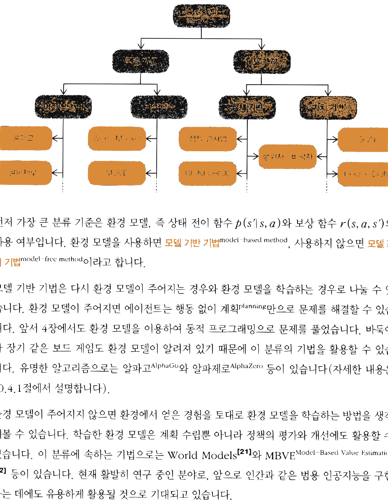

# 14.1 심층 강화 학습 알고리즘 분류

**그림 14-1** 가치 기반(Value-Based) 경로와 정책 기반(Policy-Based) 경로의 분기점을 가리키는 지니와 도로시

심층 강화학습의 다양한 알고리즘들을 명확한 기준에 의거하여 계통적으로 분류합니다. 가치 기반 기법과 정책 기반 기법의 차이점, 그리고 모델 기반(Model-Based)과 모델 프리(Model-Free) 방식의 갈림길을 요정 지니의 지도 설명 비유로 깔끔하게 정리해봅시다!

---

심층 강화 학습 알고리즘들은 크게 [그림 14-1]처럼 분류할 수 있습니다. 분류 방법은 OpenAI의 문헌[20]을 참고했습니다.

**그림 14-1** 심층 강화 학습 알고리즘 분류

- 심층 강화 학습 알고리즘
  - 모델 기반
    - 주어진 모델 이용 (알파고, 알파제로)
    - 모델 학습 (World Models, MBVE)
  - 모델 프리
    - 정책 기반 (정책 경사법, REINFORCE)
    - 가치 기반 (DQN, Double DQN)
    - 두 영역의 교집합: 행위자-비평자

먼저 가장 큰 분류 기준은 환경 모델, 즉 상태 전이 함수 $p(s'|s,a)$와 보상 함수 $r(s,a,s')$의 사용 여부입니다. 환경 모델을 사용하면 **모델 기반 기법**model-based method, 사용하지 않으면 **모델 프리 기법**model-free method이라고 합니다.

모델 기반 기법은 다시 환경 모델이 주어지는 경우와 환경 모델을 학습하는 경우로 나눌 수 있습니다. 환경 모델이 주어지면 에이전트는 행동 없이 계획planning만으로 문제를 해결할 수 있습니다. 앞서 5장에서도 환경 모델을 이용하여 동적 프로그래밍으로 문제를 풀었습니다. 바둑이나 장기 같은 보드 게임도 환경 모델이 알려져 있기 때문에 이 분류의 기법을 활용할 수 있습니다. 유명한 알고리즘으로는 알파고AlphaGo와 알파제로AlphaZero 등이 있습니다(자세한 내용은 14.4.1절에서 설명합니다).

환경 모델이 주어지지 않으면 환경에서 얻은 경험을 토대로 환경 모델을 학습하는 방법을 생각할 수 있습니다. 학습한 환경 모델은 계획 수립뿐 아니라 정책의 평가와 개선에도 활용할 수 있습니다. 이 분류에 속하는 기법으로는 World Models[21]와 MBVEModel-Based Value Estimation [22] 등이 있습니다. 현재 활발히 연구 중인 분야로, 앞으로 인간과 같은 범용 인공지능을 구현하는 데에도 유용하게 활용될 것으로 기대되고 있습니다.

> [!CAUTION]
> 환경 모델을 학습하는 방법에는 몇 가지 문제가 있습니다. 가장 큰 문제는 에이전트가 환경 모델이 생성하는 샘플 데이터의 일부만 얻을 수 있다는 점입니다. 학습한 환경 모델과 실제 환경 사이에 괴리(편향)가 생길 수 있다는 이야기죠. 그 결과 에이전트가 학습한 모델에서는 적합했던 행동이 실제 환경에서는 바람직하지 않은 행동일 수 있습니다.

환경 모델을 학습하는 기법들은 잠재력이 크지만, 현재까지는 모델 프리 기법들이 더 많은 성과를 거두고 있습니다. 이 책에서 소개하는 기법들도 모델 프리입니다. 모델 프리 기법은 크게 정책 기반 기법과 가치 기반 기법, 그리고 이 둘을 모두 갖춘 기법으로 분류할 수 있습니다.

정책 기반 기법에는 정책 경사법과 REINFORCE가 해당되며, 행위자-비평자는 '정책 기반이자 가치 기반' 기법입니다(10장 참고). 14.2절에서 정책 경사법을 발전시킨 알고리즘들을 소개합니다.

가치 기반 기법은 가치 함수를 모델링하여 학습하는 기법입니다. 그중 가장 중요한 기법은 DQN입니다. 14.3절에서 DQN을 발전시킨 알고리즘들을 소개합니다.

