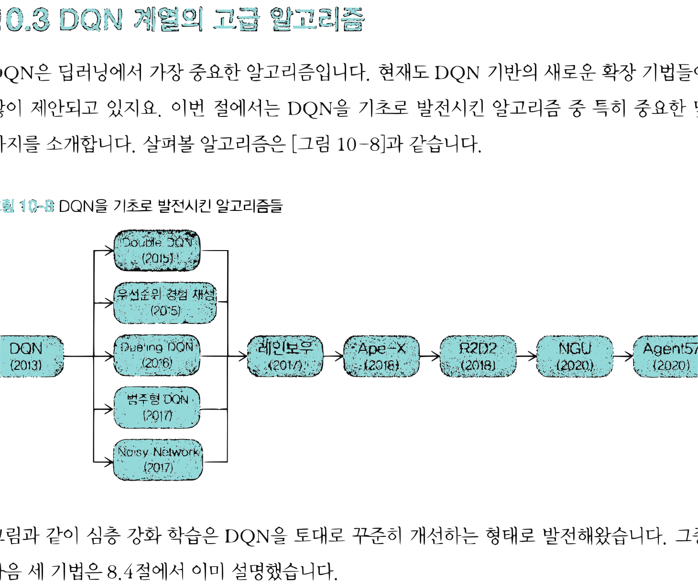
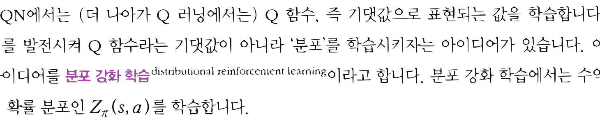
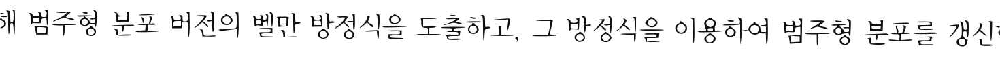
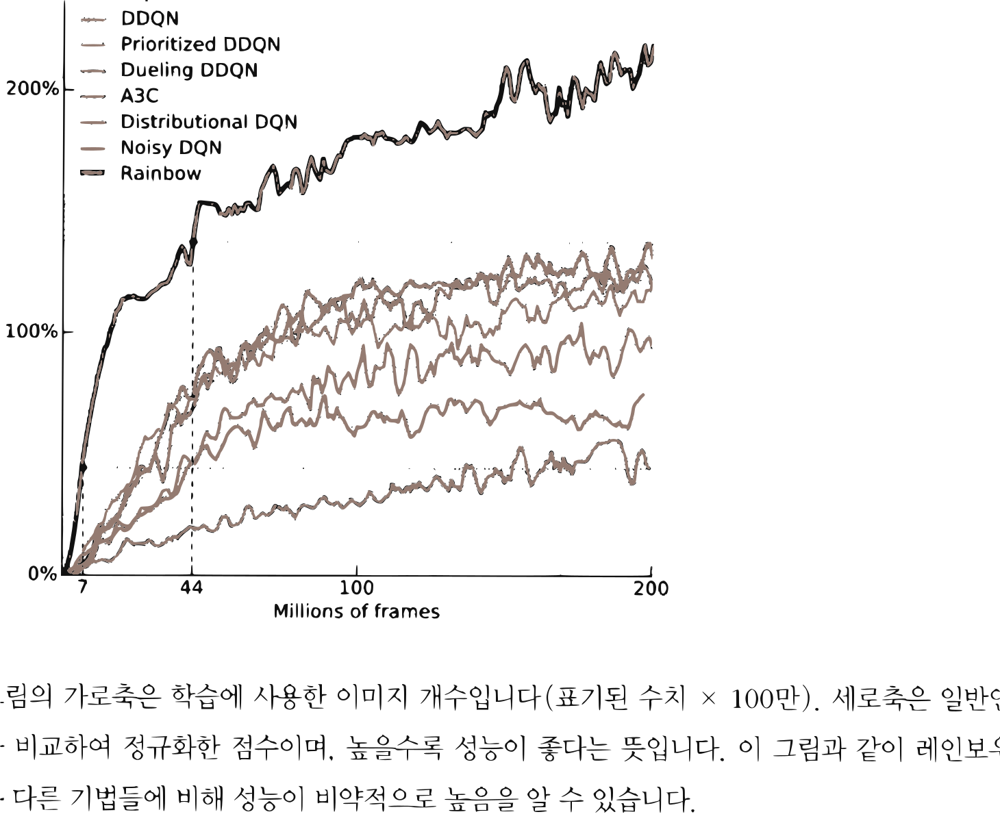

# 14.3 DQN 계열의 고급 알고리즘

**그림 14-3** 7가지 무지개 광채 카드를 보며 무지개 열차(Rainbow)에 가치 기반 고급 트릭들을 싣고 전진하는 도로시와 지니

12장에서 다룬 DQN을 궁극의 성능으로 끌어올린 혁신적인 DQN 계열 고급 알고리즘들을 공부합니다. 가치의 확률 분포 자체를 예측하는 **범주형 DQN**, 매개변수에 노이즈를 섞어 자율 탐색을 유도하는 **Noisy Network**, 그리고 이 기법들을 하나로 결합한 끝판왕 **레인보우(Rainbow DQN)** 및 그 후속 발전 동향을 요정 지니의 칠판 그림을 통해 알차게 소화해봅시다!

---

DQN은 딥러닝에서 가장 중요한 알고리즘입니다. 현재도 DQN 기반의 새로운 확장 기법들이 많이 제안되고 있지요. 이번 절에서는 DQN을 기초로 발전시킨 알고리즘 중 특히 중요한 몇 가지를 소개합니다. 살펴볼 알고리즘은 [그림 14-8]과 같습니다.

**그림 14-8** DQN을 기초로 발전시킨 알고리즘들

- DQN (2013)
  - -> Double DQN (2015)
  - -> 우선순위 경험 재생 (2015)
  - -> Dueling DQN (2016)
  - -> 범주형 DQN (2017)
  - -> Noisy Network (2017)
- 위의 기법들이 합쳐져 -> 레인보우 (2017) -> Ape-X (2018) -> R2D2 (2018) -> NGU (2020) -> Agent57 (2020)

그림과 같이 심층 강화 학습은 DQN을 토대로 꾸준히 개선하는 형태로 발전해왔습니다. 그중 다음 세 기법은 8.4절에서 이미 설명했습니다.

* Double DQN
* 우선순위 경험 재생(Prioritized Experience Replay)
* Dueling DQN

이번 절에서는 나머지 기법들을 만나보겠습니다.

## 14.3.1 범주형 DQN

범주형 DQNcategorical DQN [27] 기법들부터 알아보겠습니다. 이미 보았듯이 Q 함수의 수식은 다음과 같습니다.

$$Q_{\pi}(s, a) = \mathbb{E}_{\pi} [ G_t | S_t = s, A_t = a ]$$

[그림 14-9]와 같이 확률적 사건인 수익 *G**t*를 기댓값이라는 하나의 값으로 표현하는 것이 Q 함수의 특징입니다.

**그림 14-9** 수익의 확률 분포와 Q 함수의 관계($Z_{\pi}(s,a)$는 수익의 확률 분포)

$Z_{\pi}(s, a)$ -> 기댓값 -> $Q_{\pi}(s, a)$ (1.8)

DQN에서는 (더 나아가 Q 러닝에서는) Q 함수, 즉 기댓값으로 표현되는 값을 학습합니다. 이를 발전시켜 Q 함수라는 기댓값이 아니라 '분포'를 학습시키자는 아이디어가 있습니다. 이 아이디어를 **분포 강화 학습**distributional reinforcement learning이라고 합니다. 분포 강화 학습에서는 수익의 확률 분포인 $Z_{\pi}(s, a)$를 학습합니다.

범주형 DQN은 바로 이 분포 강화 학습을 기반으로 합니다. 여기서 '범주형'이란 [그림 14-10]과 같이 범주형 분포로 모델링한다는 뜻입니다.

**그림 14-10** 범주형 분포로 모델링(파란색 선이 '실제 분포')

$Z_{\pi}(s, a)$의 범주형 분포 표현 (이산적인 히스토그램 막대와 함께 그려진 정규분포 곡선)

범주형 분포는 여러 범주(이산 값) 중 어느 범주에 속할 것인지에 대한 확률 분포입니다. [그림 14-10]과 같이 수익이 취하는 값이 몇 개의 영역(빈bin)으로 나뉘고, 각 빈에 들어갈 확률이 범주형 분포로 모델링됩니다.

범주형 DQN에서는 수익을 범주형 분포로 모델링하고 그 '분포의 형태'를 학습합니다. 이를 위해 범주형 분포 버전의 벨만 방정식을 도출하고, 그 방정식을 이용하여 범주형 분포를 갱신합니다. 참고로 범주형 분포의 빈이 51개일 때 '아타리' 과제에서 성능이 가장 좋았기 때문에 범주형 DQN을 'C51'이라고도 부릅니다.

## 14.3.2 Noisy Network

DQN에서는 *ε*-탐욕 정책으로 행동을 결정합니다. *ε*의 확률로 무작위 행동을 선택하고, 나머지 $1 - \epsilon$의 확률로 탐욕 행동(Q 함수가 가장 큰 행동)을 선택하죠. 실전에서는 대체로 에피소드가 진행될수록 *ε*값을 조금씩 낮추도록 스케줄링합니다. 여기서 문제는 *ε*값인데, *ε*은 하이퍼파라미터라서 어떻게 설정하느냐에 따라 최종 정확도가 크게 달라질 수 있습니다. 하지만 *ε*값의 후보는 매우 다양합니다.

이러한 *ε* 설정 문제를 해결하기 위해 Noisy Network[28]가 제안되었습니다. Noisy Network는 신경망에 무작위성을 도입합니다. 그 덕분에 행동을 (*ε*-탐욕 정책이 아닌) 탐욕 정책에 따라 선택할 수 있습니다. 정확하게는 출력 쪽의 완전 연결 계층에서 '노이즈가 들어간 완전 연결 계층'을 사용합니다. '노이즈가 들어간 완전 연결 계층'에서 가중치는 정규분포의 평균과 분산으로 모델링되며 (순전파할 때마다) 가중치가 정규분포에서 샘플링됩니다. 이렇게 하면 순전파할 때마다 무작위성이 스며들어 최종 출력이 달라집니다.

## 14.3.3 레인보우

지금까지 다양한 DQN 확장 알고리즘을 소개했습니다. 그리고 이 모든 것을 결합한 기법이 바로 레인보우Rainbow [29]입니다. 레인보우는 기존 DQN에 다음과 같은 기법들을 모두 조합하여 사용합니다.

* Double DQN
* 우선순위 경험 재생
* Dueling DQN
* 범주형 DQN
* Noisy Network

[그림 14-11]은 아타리 게임에서 레인보우와 그 외 기법들의 성능을 측정한 결과입니다.

**그림 14-11** 레인보우와 그 외 기법의 정확도 비교[29]

가로축: Millions of frames (7, 44, 100, 200)
세로축: Median human-normalized score (0%, 100%, 200%)

그림의 가로축은 학습에 사용한 이미지 개수입니다(표기된 수치 $\times$ 100만). 세로축은 일반인과 비교하여 정규화한 점수이며, 높을수록 성능이 좋다는 뜻입니다. 이 그림과 같이 레인보우는 다른 기법들에 비해 성능이 비약적으로 높음을 알 수 있습니다.

## 14.3.4 레인보우 이후의 발전된 알고리즘

레인보우 이후 CPU/GPU를 이용한 여러 분산 병렬 학습이 큰 성과를 올렸습니다. 이를 분산 강화 학습이라고도 하며, 실행 환경을 여러 개 준비하여 학습을 병렬로 진행합니다. 분산 강화 학습으로 유명한 기법이 Ape-X[30]입니다. Ape-X는 레인보우를 기반으로 여러 개의 에이전트를 각각의 CPU에서 독립적으로 행동시킵니다. 이때 에이전트들의 탐색 비중인 *ε*을 모두 다르게 설정하여 다양한 경험 데이터를 수집합니다. 이처럼 분산 병렬화를 통해 학습을 빠르게 진행하는 동시에 경험 데이터를 다양하게 얻어 성능을 높였습니다.

R2D2[31]는 Ape-X를 더욱 개선한 기법입니다. R2D2는 Ape-X에 더해 시계열 데이터를 처리하는 순환 신경망(RNN)을 사용했습니다(정확하게는 LSTM 사용). 간단한 아이디어지만

RNN으로 학습하기 위해 많은 노력을 기울여 Ape-X의 성능을 한층 높이는 데 성공했습니다. 참고로 R2D2의 이름은 Recurrent(순환)와 Replay(경험 재생)에서 'R' 두 개를 가져오고, Distributed(분산)와 Deep Q-Network(DQN)에서 'D' 두 개를 가져와서 만든 이름입니다(물론 영화 <스타워즈>의 유명 캐릭터 이름에서 따온 것이기도 합니다).

다음은 R2D2를 더욱 발전시킨 NGU[32]입니다. NGU는 'Never Give Up(절대 포기하지 마)'의 약자입니다. NGU는 R2D2의 토대에 **내적 보상**intrinsic reward 메커니즘을 추가하여 어려운 과제, 특히 보상이 적은 과제에서도 탐색을 포기하지 않도록 했습니다. 알고리즘 이름은 이러한 특성에서 유래했습니다. 내적 보상은 상태 전이가 예상과 다를수록, 즉 얼마나 '놀랐는가'에 따라 스스로 보상을 더해주는 기법입니다. 보상이 0에 가까운 희박한 작업에서 내적 보상은 (보상의 크기가 아니라) '호기심'에 따라 행동하도록 유도합니다. 이 과정에서 (잘만 하면) 보상을 극대화하는 방법을 찾을 수 있습니다.

> [!NOTE]
> 아이들, 특히 어린아이는 새롭고 놀라운 경험을 찾아 놀기를 좋아합니다. 확실한 목적을 가지고 학습하기보다는 호기심이 이끄는 대로 행동합니다. 내적 보상의 목표는 바로 이처럼 호기심을 쫓는 행동을 에이전트에 주입하는 것입니다.

마지막으로 만나볼 기법은 Agent57[33]입니다. NGU를 발전시킨 기법이죠. 중요한 특성은 내적 보상 메커니즘을 개선하고 '메타 컨트롤러'라는 구조를 사용하여 에이전트들에게 할당되는 정책을 유연하게 배분했다는 점입니다. 아타리, 정확하게는 '아타리 2600'에는 게임이 모두 '57'개가 있습니다. Agent57은 이 모든 게임에서 사람보다 우수한 성적을 거두는 데 성공했습니다. 강화 학습 알고리즘으로서는 처음 이룬 쾌거였습니다.

