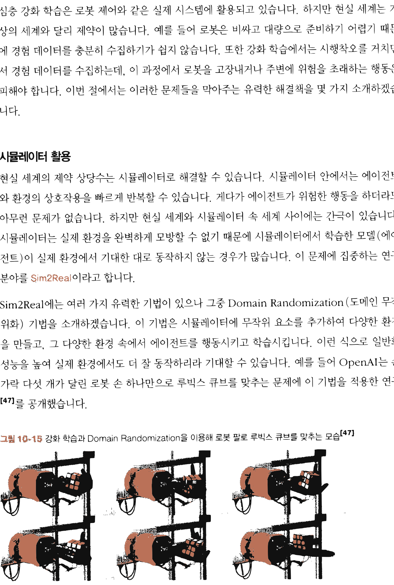
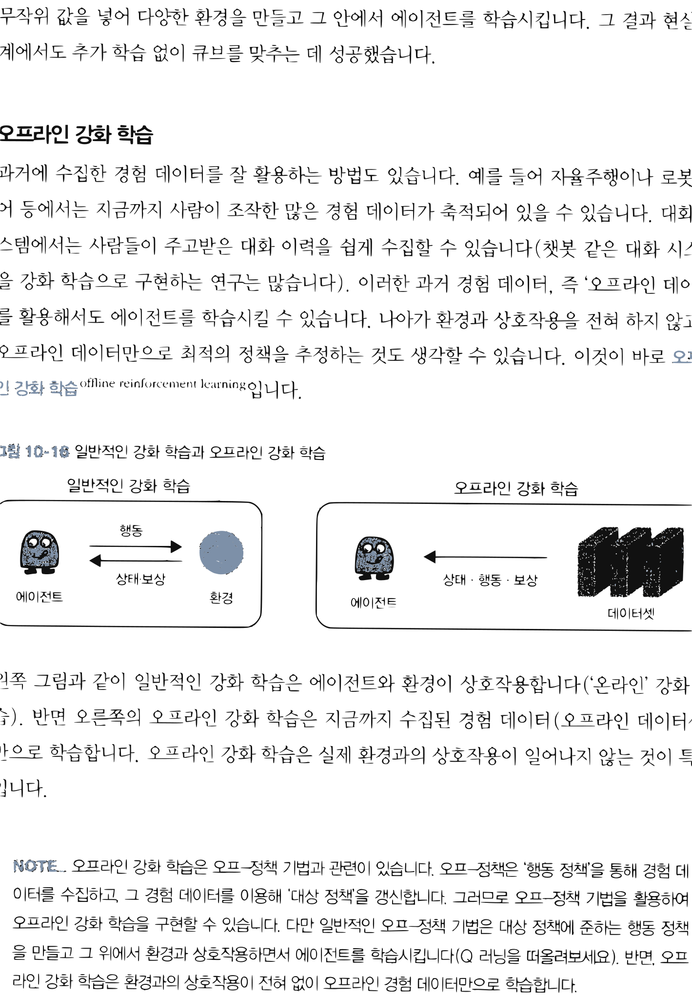

# 14.5 심층 강화 학습이 풀어야 할 숙제와 가능성

**그림 14-5** 가상 환경의 징검다리와 현실 세계의 깊은 틈새 사이에서 오프라인 강화학습(Offline RL) 다리를 안전하게 놓아주는 지니 요정

심층 강화학습이 현실 세계에 상용화되기 위해 반드시 넘어야 할 현실적인 장벽들과 이에 대응하는 미래 연구 분야를 전망합니다. 가상-현실 간의 차이(Sim-to-Real)를 극복하기 위한 시뮬레이터 튜닝법, 실시간 안전성 문제를 해결하는 **오프라인 강화학습(Offline RL)**과 **모방 학습(Imitation Learning)**, 그리고 임의의 실세계 문제를 MDP(Markov Decision Process)로 안전하게 정식화(Formulation)하기 위한 꿀팁들을 지니와 도로시의 마지막 특강으로 풍성하게 학습해봅시다!

---

이번 절에서는 심층 강화 학습을 현실 세계 시스템에 적용하기 위해 풀어야 할 숙제와 해결책을 제시합니다. 그런 다음 강화 학습 문제를 MDP로 기술할 때 고려할 사항을 논의하고, 마지막으로 강화 학습의 잠재력을 이야기하며 마무리하겠습니다.

---
\* 옮긴이_ 구글뿐 아니라 엔비디아와 AMD 등 선진 반도체 설계 회사들은 이미 인공지능을 칩 설계에 적극 활용하고 있습니다.

## 14.5.1 현실 세계에 적용하기

심층 강화 학습은 로봇 제어와 같은 실제 시스템에 활용되고 있습니다. 하지만 현실 세계는 가상의 세계와 달리 제약이 많습니다. 예를 들어 로봇은 비싸고 대량으로 준비하기 어렵기 때문에 경험 데이터를 충분히 수집하기가 쉽지 않습니다. 또한 강화 학습에서는 시행착오를 거치면서 경험 데이터를 수집하는데, 이 과정에서 로봇을 고장내거나 주변에 위험을 초래하는 행동은 피해야 합니다. 이번 절에서는 이러한 문제들을 막아주는 유력한 해결책을 몇 가지 소개하겠습니다.

#### 시뮬레이터 활용

현실 세계의 제약 상당수는 시뮬레이터로 해결할 수 있습니다. 시뮬레이터 안에서는 에이전트와 환경의 상호작용을 빠르게 반복할 수 있습니다. 게다가 에이전트가 위험한 행동을 하더라도 아무런 문제가 없습니다. 하지만 현실 세계와 시뮬레이터 속 세계 사이에는 간극이 있습니다. 시뮬레이터는 실제 환경을 완벽하게 모방할 수 없기 때문에 시뮬레이터에서 학습한 모델(에이전트)이 실제 환경에서 기대한 대로 동작하지 않는 경우가 많습니다. 이 문제에 집중하는 연구 분야를 **Sim2Real**이라고 합니다.

Sim2Real에는 여러 가지 유력한 기법이 있으나 그중 Domain Randomization(도메인 무작위화) 기법을 소개하겠습니다. 이 기법은 시뮬레이터에 무작위 요소를 추가하여 다양한 환경을 만들고, 그 다양한 환경 속에서 에이전트를 행동시키고 학습시킵니다. 이런 식으로 일반화 성능을 높여 실제 환경에서도 더 잘 동작하리라 기대할 수 있습니다. 예를 들어 OpenAI는 손가락 다섯 개가 달린 로봇 손 하나만으로 루빅스 큐브를 맞추는 문제에 이 기법을 적용한 연구[47]를 공개했습니다.

**그림 14-15** 강화 학습과 Domain Randomization을 이용해 로봇 팔로 루빅스 큐브를 맞추는 모습[47]

로봇 손이 루빅스 큐브를 쥐고 이리저리 맞추는 사진들

이 연구에서는 광원과 텍스처 등의 렌더링 이미지 매개변수나 마찰과 같은 역학적 매개변수에 무작위 값을 넣어 다양한 환경을 만들고 그 안에서 에이전트를 학습시킵니다. 그 결과 현실 세계에서도 추가 학습 없이 큐브를 맞추는 데 성공했습니다.

#### 오프라인 강화 학습

과거에 수집한 경험 데이터를 잘 활용하는 방법도 있습니다. 예를 들어 자율주행이나 로봇 제어 등에서는 지금까지 사람이 조작한 많은 경험 데이터가 축적되어 있을 수 있습니다. 대화 시스템에서는 사람들이 주고받은 대화 이력을 쉽게 수집할 수 있습니다(챗봇 같은 대화 시스템을 강화 학습으로 구현하는 연구는 많습니다). 이러한 과거 경험 데이터, 즉 '오프라인 데이터'를 활용해서도 에이전트를 학습시킬 수 있습니다. 나아가 환경과 상호작용을 전혀 하지 않고도 오프라인 데이터만으로 최적의 정책을 추정하는 것도 생각할 수 있습니다. 이것이 바로 **오프라인 강화 학습**offline reinforcement learning입니다.

**그림 14-16** 일반적인 강화 학습과 오프라인 강화 학습

일반적인 강화 학습: 에이전트 -> 행동 -> 환경 -> 상태/보상 -> 에이전트
오프라인 강화 학습: 에이전트 -> 상태/행동/보상 -> 데이터셋

왼쪽 그림과 같이 일반적인 강화 학습은 에이전트와 환경이 상호작용합니다('온라인' 강화 학습). 반면 오른쪽의 오프라인 강화 학습은 지금까지 수집된 경험 데이터(오프라인 데이터셋)만으로 학습합니다. 오프라인 강화 학습은 실제 환경과의 상호작용이 일어나지 않는 것이 특징입니다.

> [!NOTE]
> 오프라인 강화 학습은 오프-정책 기법과 관련이 있습니다. 오프-정책은 '행동 정책'을 통해 경험 데이터를 수집하고, 그 경험 데이터를 이용해 '대상 정책'을 갱신합니다. 그러므로 오프-정책 기법을 활용하여 오프라인 강화 학습을 구현할 수 있습니다. 다만 일반적인 오프-정책 기법은 대상 정책에 준하는 행동 정책을 만들고 그 위에서 환경과 상호작용하면서 에이전트를 학습시킵니다(Q 러닝을 떠올려보세요). 반면, 오프라인 강화 학습은 환경과의 상호작용이 전혀 없이 오프라인 경험 데이터만으로 학습합니다.

오프라인 강화 학습에는 기술적으로 풀어야 할 숙제가 몇 가지 있습니다. 예를 들어 오프라인 데이터셋만으로 어떻게 정책을 평가하고 개선할 것인가 하는 숙제를 풀어야 합니다. 물론 오프-정책 기법에서 설명한 방법도 활용할 수 있습니다(중요도 샘플링 등). 그 외에도 다양한 기법이 제안되어 현재 활발히 연구 중입니다.[48]

#### 모방 학습

인간은 숙련된 전문가에게서 배우는 일이 많습니다. 예를 들어 야구 선수를 꿈꾸는 소년은 프로 선수가 배트를 휘두르는 모습을 흉내 내기 위해 연습합니다. 이와 마찬가지로 전문가의 동작을 모방하도록 정책을 학습하는 방법을 생각할 수 있습니다. 이것이 바로 **모방 학습**imitation learning입니다. 모방 학습에서는 전문가의 시연을 참고하여 그 동작을 모방하는 것을 목표로 정책을 학습합니다.

모방 학습에도 다양한 기법이 제안되고 있습니다. 예를 들어 「Deep Q-Learning from Demonstrations」 논문[49]에서는 인간 전문가가 아타리를 플레이하는 모습을 모방합니다. 구체적으로는 전문가의 플레이에서 얻은 '상태, 행동, 보상'의 시계열 데이터(전문가 데이터)를 DQN의 경험 재생 버퍼에 추가하고 그 위에서 DQN으로 학습을 수행합니다. 경험 재생 버퍼에서 전문가 데이터가 선택될 확률을 높이고 동시에 전문가 데이터에 가까워지도록 DQN의 갱신식을 조정하는 것이죠. 이런 식으로 전문가 데이터에 가깝게 행동하는 DQN을 구현할 수 있습니다.

## 14.5.2 MDP로 공식화하기 위한 팁

강화 학습의 많은 이론은 마르코프 결정 과정Markov Decision Process(MDP)을 전제로 합니다. 이 책에서는 강화 학습 문제가 MDP로 주어진다고 전제하고 그 위에서 다양한 알고리즘을 탐구했습니다. 하지만 실제 문제를 강화 학습으로 풀려면 우선 문제를 MDP 형식에 맞는 공식으로 표현할 수 있어야 합니다. 그리고 MDP로 어떻게 공식화하느냐가 최종 결과에 큰 영향을 줍니다. 이번 절에서는 강화 학습 문제를 MDP로 공식화할 때 고려할 점들을 이야기합니다.

#### MDP가 지닌 유연성

현실에 존재하는 모든 문제를 MDP라는 문제 형식에 맞출 수는 없습니다. 하지만 놀랍도록 많은 문제가 MDP로 공식화할 수 있다고 알려져 있습니다. MDP는 환경과 에이전트가 '상태, 행동, 보상'이라는 세 가지 정보를 서로 '던져주는' 구조입니다. 이때 어떤 센서를 사용할지, 행동을 어떻게 제어할지, 보상을 어떻게 설정할지 등 세부 정보는 문제에 따라 유연하게 결정할 수 있습니다. 이러한 유연성 덕분에 MDP를 적용할 수 있는 범위는 생각보다 넓습니다.

또한 에이전트의 행동은 고차원적인 것부터 저차원적인 것까지 생각할 수 있습니다. 예를 들어 로봇 제어 문제에서는 '쓰레기 버리기'나 '충전하기' 같은 행동을 고차원적인 결정이라고 생각할 수 있습니다. 한편 '모터에 *x*볼트 전류를 흘려보내기'와 같은 행동은 저차원적인 결정이라고 할 수 있습니다. 상태도 마찬가지로 높은 수준부터 낮은 수준까지 다양한 관점에서 생각할 수 있습니다.

시간(타임 스텝)의 단위도 에이전트가 결정하는 시점에 따라 다르게 설정할 수 있습니다. 예를 들어 단계 하나는 1밀리초가 될 수도 있고, 1분이 될 수도, 1시간이나 하루, 심지어 한 달이 될 수도 있습니다. 이처럼 문제에 따라 상태, 행동, 시간 단위를 유연하게 바꿀 수 있기 때문에 MDP의 적용 범위가 그만큼 넓어집니다.

#### MDP에서 설정이 필요한 사항

현실의 문제를 해결하려면 어떻게 MDP로 공식화하느냐가 관건입니다. 새로운 문제를 MDP로 공식화하려면 다음과 같은 사항들을 결정해야 합니다.

* 해결하고자 하는 문제는 일회성 과제인가, 아니면 지속적 과제인가?
* 보상의 가치는?(보상 함수 설정)
* 에이전트가 취할 수 있는 행동은 무엇인가?
* 환경의 상태를 무엇으로 규정할 것인가?
* 수익의 할인율은?
* 어디까지를 환경으로, 어디까지를 에이전트로 할 것인가?

이 사항들은 문제에 따라 자연스럽게 결정되는 경우도 있고 설정하기 어려운 경우도 있습니다. 예를 들어 바둑과 같은 보드 게임은 간단합니다. 일회성 과제이고 보상은 최종적으로 이기면 1,

지면 -1, 그 외의 수에는 0으로 설정할 수 있습니다. 에이전트가 취하는 행동은 '돌을 어디에 둘 것인가'가 됩니다. 환경의 상태는 바둑판 위의 돌 배치가 될 것입니다.

한편, 에이전트와 환경의 경계를 나누기가 의외로 어려운 경우가 있습니다. 일반적으로는 원하는 대로 제어할 수 있는 대상을 에이전트로 간주합니다. 로봇 팔을 조작하는 문제를 생각해봅시다. 로봇 팔에는 관절마다 모터가 달려 있고 모터에 흐르는 전류(혹은 전압)를 자유롭게 제어할 수 있습니다. 반면, 손이나 발과 같은 물리적 부분(하드웨어)은 마음대로 제어하기 어렵습니다. 그래서 하드웨어는 에이전트의 외부, 즉 환경으로 설정하는 게 좋습니다. 이처럼 모든 요소를 마음대로 제어할 수 있는 대상을 에이전트로 규정하는 것이 일반적입니다.

> [!NOTE]
> 강화 학습으로 현실 세계의 문제에 도전하다 보면, 보상 함수 설계가 문제 해결의 열쇠가 되는 경우가 많습니다. 그래서 실무에서는 현재 보상 함수의 설계와 학습된 정책의 결과를 관찰하면서 보상 함수를 반복해서 재설계하곤 합니다.

#### 공식화를 잘하기 위한 팁

MDP로 멋지게 공식화하는 방법은 과학보다는 예술에 가까운 측면이 있습니다. 이론도 중요하지만 경험과 직관이 큰 도움이 되는 이유입니다. 그래서 특히 강화 학습 분야에서 유명한 기존 연구를 많이 살펴보라고 강력히 권합니다. 논문을 읽을 때 어떻게 MDP로 공식화했는지를 주의 깊게 살펴보세요. 그러면 멋지게 공식화하는 힌트를 많이 얻을 것입니다.

## 14.5.3 범용 인공지능 시스템

인공지능 분야는 빠르게 발전하고 있습니다. 밤낮으로 다양한 시스템이 개발되어 큰 성과를 거두고 있죠. 하지만 거의 모든 시스템이 특정한 작업에 국한된 것도 사실입니다. 이미지를 인식하고, 바둑을 두고, 자동차를 운전하는 등의 시스템은 그 작업에만 특화되어 개발되고 있습니다. 반면 우리 인간은 수많은 일을 할 줄 압니다. 주변 환경을 인식하고, 언어를 이해하고, 자동차를 운전하고, 바둑을 둘 수 있습니다. 마치 인간처럼 다방면으로 활용할 수 있는 인공지능을 **범용 인공지능**Artificial General Intelligence(AGI)이라고 합니다.

강화 학습은 범용 인공지능을 실현하기 위한, 적어도 이에 근접하기 위한 핵심 분야라고 믿는 연구자가 많습니다. 예를 들어 딥마인드DeepMind 연구진이 발표한 「Reward is Enough」 논문[50]에서는 "지능 혹은 지능과 관련된 능력은 보상 총합의 극대화만으로 충분히 이해할 수 있다"라는 가설을 논의합니다. 나아가 보상 총합의 극대화를 목표로 하는 강화 학습 기술로 범용 인공지능을 실현할 가능성을 언급하고 있습니다.

우리는 이 책을 통해 강화 학습이 무엇인지 알아봤습니다. 강화 학습은 보상 총합을 극대화한다는 목표를 향해, 환경과의 상호작용 속에서 에이전트가 정책을 학습합니다. '보상 총합 극대화'라는 목적만 있다면 어쩌면 지적 능력을 갖추기에 충분할지도 모릅니다. 그리고 강화 학습을 활용한 기법이 향후 범용 인공지능을 구현해 낼지도 모릅니다. 물론 아직까지는 가설일 뿐이라서 현재로서는 답을 알 수 없습니다. 하지만 이런 관점이 있다는 사실을 아는 것만으로도 세상을 바라보는 시야가 넓어지지 않을까 생각합니다.

