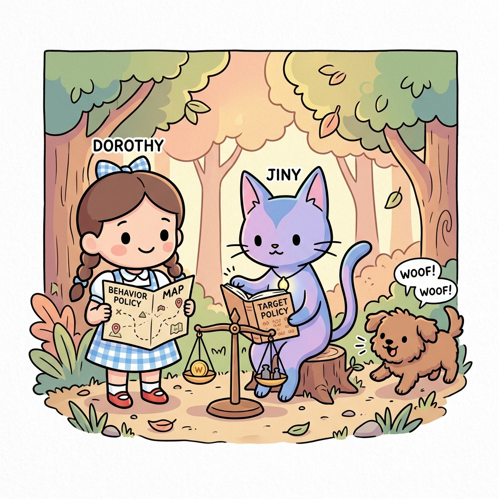
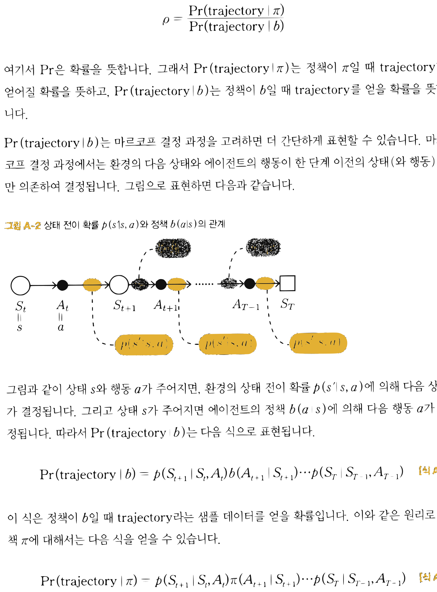
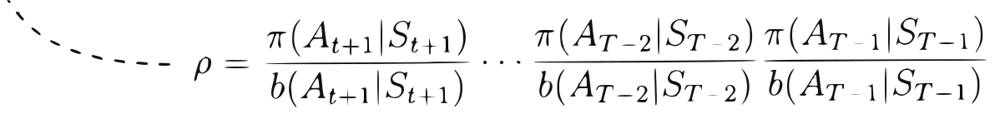

# APPENDIX A

# 오프-정책 몬테카를로법

**그림 A-0** 탐험 지도(Behavior Policy)를 든 도로시와 타깃 정책책(Target Policy)을 쥔 채 확률 비율 저울을 맞추어 오프-정책을 학습하는 지니


---

> **도로시와 토토의 비유로 이해하기**:
> 도로시는 돋보기를 들고 "내가 원래 가려던 이상적인 길(My Policy)"과 "실제로 남들이 부딪쳐 본 길(Other Policy)"을 정밀하게 대조해 봅니다. 두 행동 확률의 차이를 비율로 정산하여 곱해주는 중요도 샘플링(Importance Sampling)을 통해 남의 경험으로도 완벽한 내 길을 찾아낼 수 있습니다!

오프-정책 몬테카를로법에 대해 알아봅시다. 이론을 먼저 설명하고 이어서 오프-정책 몬테카를로법으로 '3 $\times$ 4 그리드 월드' 문제를 푸는 코드를 구현하겠습니다. 이번 부록은 5장과 이어지는 내용입니다.

## A.1 오프-정책 몬테카를로법 이론

'온-정책' 방식의 몬테카를로법이 무엇인지부터 다시 정리해보죠. 이번 절의 목표는 다음 식으로 정의되는 Q 함수를 몬테카를로법으로 근사하는 것입니다.

$$q_{\pi}(s, a) = \mathbb{E}_{\pi} [ G | s, a ]$$

*q*<sub>*π*</sub>(*s*, *a*)는 상태 *s*, 행동 *a*에서 시작하여 이후 정책 *π*에 따라 행동했을 때 얻는 수익 $G$의 기댓값입니다. 몬테카를로법을 이용해 Q 함수를 근사하려면 정책 *π*에 따라 행동하고 거기서 얻은 수익의 평균을 구하면 됩니다. 예를 들어 수익 샘플 데이터를 $n$개 얻었다면 다음과 같이 근사할 수 있습니다.

샘플링: $G^{(i)} \sim \pi \quad (i = 1, 2, \cdots, n)$

$$Q_{\pi}(s, a) = \frac{G^{(1)} + G^{(2)} + \cdots + G^{(n)}}{n}$$

부록 A 오프-정책 몬테카를로법 341


이어서 '오프-정책' 몬테카를로법을 생각해봅시다. 중요도 샘플링을 이용하면 Q 함수를 다음 식으로 표현할 수 있습니다.

$$q_{\pi}(s, a) = \mathbb{E}_b [ \rho G | s, a ] \tag{식 A.1}$$

여기서 중요한 점은 다음 두 가지입니다.

* 정책 $b$를 따를 때의 기댓값으로 표현 ($\mathbb{E}_b[\cdots]$)
* 두 정책(확률 분포)의 차이를 메우기 위해 '가중치' 추가

가중치 $\rho$는 '정책 *π*를 가정했을 때 수익 $G$를 얻을 확률'과 '정책 $b$를 가정했을 때 수익 $G$를 얻을 확률'의 비율입니다. 이제 [식 A.1]을 다음과 같이 몬테카를로법으로 근사합니다.

샘플링: $G^{(i)} \sim b \quad (i = 1, 2, \cdots, n)$

$$Q_{\pi}(s, a) = \frac{\rho^{(1)} G^{(1)} + \rho^{(2)} G^{(2)} + \cdots + \rho^{(n)} G^{(n)}}{n}$$

$i$번째 수익 $G^{(i)}$의 가중치를 $\rho^{(i)}$로 표기했습니다. 이 식과 같이 에이전트는 행동 정책 $b$에 따라 행동하고, 거기서 얻은 샘플 데이터들에 가중치 $\rho$를 부여한 평균을 구합니다.

다음으로 가중치 $\rho$를 구하는 방법을 알아보겠습니다. 정책 $b$에 의해 다음과 같은 시계열 데이터를 얻는다고 해보죠.

**그림 A-1** 상태 $S_t = s$, 행동 $A_t = a$에서 시작하여 정책 $b$에 의해 얻어진 시계열 데이터의 예


$S_t(=s) \to A_t(=a) \to S_{t+1} \to A_{t+1} \to \cdots \to A_{T-1} \to S_T$

[그림 A-1]의 시계열 데이터를 trajectory(궤적)라고 합니다. 즉, trajectory는 다음 식으로 정의됩니다.

$$\text{trajectory} = S_t, A_t, S_{t+1}, A_{t+1}, \cdots, A_{T-1}, S_T$$


그러면 가중치 $\rho$는 다음처럼 표현할 수 있습니다.

$$\rho = \frac{\text{Pr}(\text{trajectory} | \pi)}{\text{Pr}(\text{trajectory} | b)}$$

여기서 $\text{Pr}$은 확률을 뜻합니다. 그래서 $\text{Pr}(\text{trajectory} | \pi)$는 정책이 *π*일 때 trajectory가 얻어질 확률을 뜻하고, $\text{Pr}(\text{trajectory} | b)$는 정책이 $b$일 때 trajectory를 얻을 확률을 뜻합니다.

$\text{Pr}(\text{trajectory} | b)$는 마르코프 결정 과정을 고려하면 더 간단하게 표현할 수 있습니다. 마르코프 결정 과정에서는 환경의 다음 상태와 에이전트의 행동이 한 단계 이전의 상태(와 행동)에만 의존하여 결정됩니다. 그림으로 표현하면 다음과 같습니다.

**그림 A-2** 상태 전이 확률 $p(s'|s, a)$와 정책 $b(a|s)$의 관계


$S_t \xrightarrow{p(s'|s,a)} S_{t+1}$
$S_{t+1} \xrightarrow{b(a|s)} A_{t+1}$

그림과 같이 상태 *s*와 행동 *a*가 주어지면, 환경의 상태 전이 확률 $p(s'|s, a)$에 의해 다음 상태가 결정됩니다. 그리고 상태 *s*가 주어지면 에이전트의 정책 $b(a|s)$에 의해 다음 행동 *a*가 결정됩니다. 따라서 $\text{Pr}(\text{trajectory} | b)$는 다음 식으로 표현됩니다.

$$\text{Pr}(\text{trajectory} | b) = p(S_{t+1} | S_t, A_t)b(A_{t+1} | S_{t+1}) \cdots p(S_T | S_{T-1}, A_{T-1}) \tag{식 A.2}$$

이 식은 정책이 $b$일 때 trajectory라는 샘플 데이터를 얻을 확률입니다. 이와 같은 원리로 정책 *π*에 대해서는 다음 식을 얻을 수 있습니다.

$$\text{Pr}(\text{trajectory} | \pi) = p(S_{t+1} | S_t, A_t)\pi(A_{t+1} | S_{t+1}) \cdots p(S_T | S_{T-1}, A_{T-1}) \tag{식 A.3}$$

부록 A 오프-정책 몬테카를로법 343


가중치 $\rho$는 [식 A.2]와 [식 A.3]의 비율입니다. 그런데 환경의 상태 전이 확률 $p(s'|s, a)$가 두 식 모두에 등장합니다. 각각이 분모와 분자로 쓰이니 상쇄시키면 $\rho$의 식을 다음처럼 표현할 수 있습니다.

$$\rho = \frac{\text{Pr}(\text{trajectory} | \pi)}{\text{Pr}(\text{trajectory} | b)} = \frac{\pi(A_{t+1} | S_{t+1}) \cdots \pi(A_{T-1} | S_{T-1})}{b(A_{t+1} | S_{t+1}) \cdots b(A_{T-1} | S_{T-1})} \tag{식 A.4}$$

[식 A.4]와 같이 가중치 $\rho$는 정책만의 비율로 구할 수 있습니다. 이상이 오프-정책 몬테카를로법입니다. 알고리즘의 절차를 정리하면 다음과 같습니다.

1. 행동 정책 $b$로 샘플링한다(시계열 데이터의 trajectory를 얻는다).
2. 얻은 trajectory에서 수익 $G$를 계산한다.
3. [식 A.4]에 따라 가중치 $\rho$를 계산한다.
4. 1~3을 여러 번 반복하여 $\rho G$의 평균을 구한다.

## A.2 오프-정책 몬테카를로법 구현

이제 구현으로 넘어가겠습니다. 먼저 가중치 $\rho$를 효율적으로 구현하는 방법을 알아보겠습니다. 방법은 5.2.3절에서 설명한 것과 같습니다. 다음 그림을 보죠.


**그림 A-3** 모든 '상태와 행동 쌍'을 시작 위치로 간주


$S_t, A_t \to \cdots \to S_{T-3}, A_{T-3} \to S_{T-2}, A_{T-2} \to S_{T-1}, A_{T-1} \to S_T$
$S_{T-1}, A_{T-1}$ 에 대해 $\rho = 1$
$S_{T-2}, A_{T-2}$ 에 대해 $\rho = \frac{\pi(A_{T-1} | S_{T-1})}{b(A_{T-1} | S_{T-1})}$
$S_{T-3}, A_{T-3}$ 에 대해 $\rho = \frac{\pi(A_{T-2} | S_{T-2})}{b(A_{T-2} | S_{T-2})} \frac{\pi(A_{T-1} | S_{T-1})}{b(A_{T-1} | S_{T-1})}$
$S_t, A_t$ 에 대해 $\rho = \frac{\pi(A_{t+1} | S_{t+1})}{b(A_{t+1} | S_{t+1})} \cdots \frac{\pi(A_{T-2} | S_{T-2})}{b(A_{T-2} | S_{T-2})} \frac{\pi(A_{T-1} | S_{T-1})}{b(A_{T-1} | S_{T-1})}$

[그림 A-3]은 상태와 행동의 쌍 ($S_t, A_t$)을 시작 위치로 삼았을 때의 결과입니다. 이때 중간에 등장하는 상태와 행동 쌍 데이터들도 각각을 시작 위치로 해서 얻은 샘플 데이터로 간주할 수 있습니다. 따라서 가중치 $\rho$를 구할 때 왼쪽부터 계산하기보다는, 오른쪽 끝(목표)에서 출발하여 왼쪽으로 갱신하는 편이 효율적입니다. 좀 더 구체적으로 알아보겠습니다.

먼저 $\rho$의 초깃값을 1로 설정합니다. 그러면 $Q_{\pi}(S_{T-1}, A_{T-1})$의 가중치 $\rho$는 1이 됩니다. 다음으로 $Q_{\pi}(S_{T-2}, A_{T-2})$의 가중치 $\rho$를 다음과 같이 갱신합니다.

$$\rho \leftarrow \frac{\pi(A_{T-1} | S_{T-1})}{b(A_{T-1} | S_{T-1})} \times \rho$$

같은 방법으로 $Q_{\pi}(S_{T-3}, A_{T-3})$의 가중치는 다음과 같이 갱신합니다.

$$\rho \leftarrow \frac{\pi(A_{T-2} | S_{T-2})}{b(A_{T-2} | S_{T-2})} \times \rho$$

이처럼 목표에서 시작하여 역방향으로 가중치를 갱신하면 효율적으로 계산할 수 있습니다.

부록 A 오프-정책 몬테카를로법 345


이어서 오프-정책 몬테카를로법으로 정책을 제어하는 에이전트를 코드로 구현하겠습니다.

<div align="right"><b>ch05/mc_control_offpolicy.py</b></div>

```python
import numpy as np
from common.gridworld import GridWorld
from common.utils import greedy_probs

class McOffPolicyAgent:
    def __init__(self):
        self.gamma = 0.9
        self.epsilon = 0.1
        self.alpha = 0.2
        self.action_size = 4

        random_actions = {0: 0.25, 1: 0.25, 2: 0.25, 3: 0.25}
        self.pi = defaultdict(lambda: random_actions)
        self.b = defaultdict(lambda: random_actions) # ❶ 행동 정책 초기화
        self.Q = defaultdict(lambda: 0)
        self.memory = []

    def get_action(self, state):
        action_probs = self.b[state] # ❷ 행동 정책에서 행동 추출
        actions = list(action_probs.keys())
        probs = list(action_probs.values())
        return np.random.choice(actions, p=probs)

    def add(self, state, action, reward):
        data = (state, action, reward)
        self.memory.append(data)

    def reset(self):
        self.memory.clear()

    def update(self):
        G = 0
        rho = 1

        for data in reversed(self.memory):
            state, action, reward = data
            key = (state, action)

            # ❸ 샘플 데이터로 Q 함수 갱신
            G = self.gamma * rho * G + reward
            self.Q[key] += (G - self.Q[key]) * self.alpha
            rho *= self.pi[state][action] / self.b[state][action]

            # ❹ pi는 탐욕 정책, b는 ε-탐욕 정책으로 갱신
            self.pi[state] = greedy_probs(self.Q, state, epsilon=0)
            self.b[state] = greedy_probs(self.Q, state, self.epsilon)
```

이 코드는 5.4절에서 구현한 McAgent 클래스와 거의 같습니다. 따라서 다른 점을 중심으로 설명하겠습니다.

먼저 ❶에서 b라는 이름의 행동 정책을 무작위 행동으로 초기화합니다. 이어서 ❷의 get_action() 메서드에서는 정책 b에 따라 결정한 행동을 가져옵니다.

❸에서는 중요도 샘플링의 가중치 rho를 사용하여 갱신하고 있습니다. 코드가 복잡해 보일 수 있지만 5.4절의 McAgent 클래스와 비교해보면 달라진 부분은 다음과 같이 아주 적습니다.

```python
# 온-정책(5.4절 코드)
G = self.gamma * G + reward
self.Q[key] += (G - self.Q[key]) * self.alpha

# 오프-정책(현재 코드)
G = self.gamma * rho * G + reward
self.Q[key] += (G - self.Q[key]) * self.alpha
rho *= self.pi[state][action] / self.b[state][action]
```

샘플 데이터로 얻은 수익은 가중치 rho로 보정해야 합니다. 따라서 이와 같이 수익 G의 갱신에 rho를 사용합니다.

마지막으로 ❹에서 정책을 개선합니다. 행동 정책 b는 *ε*-탐욕 정책($\epsilon = 0.1$)으로 갱신하고, 대상 정책 pi는 *ε*-탐욕 정책($\epsilon = 0$)으로 갱신합니다. 대상 정책 pi에서는 $\epsilon = 0$이므로 완전히 탐욕화시켰습니다.

> [!NOTE]
> 행동 정책은 '탐색'이 목적이므로 모든 행동을 균등하게 선택하는 정책(무작위 정책)도 괜찮습니다. 하지만 여기서는 수익의 분산을 줄이기 위해 행동 정책 b를 *ε*-탐욕 정책으로 갱신했습니다. *ε*-탐욕 정책으로 갱신함으로써, 행동 정책 b를 대상 정책 pi의 확률 분포에 가깝게 만들면서 탐색을 수행할 수 있습니다. 두 확률 분포를 가깝게 만들면 분산이 작아진다는 사실은 5.5.3절에서 설명했습니다.

부록 A 오프-정책 몬테카를로법 347


이제 McOffPolicyAgent 클래스를 사용하여 문제를 풀어봅시다. 결과는 다음과 같습니다.

**그림 A-4** 오프-정책 에이전트를 사용하여 얻은 결과


결과는 매번 달라지지만 대체로 좋은 결과를 얻을 수 있습니다. 참고로 [그림 A-4]의 정책은 최적 정책과 일치합니다.

> [!CAUTION]
> 이번에 살펴본 간단한 문제에서는 오프-정책 몬테카를로법이 잘 작동했습니다. 하지만 문제가 커지면 좋은 결과를 얻기가 어려워집니다. 샘플 데이터의 분산이 커지기 때문입니다. 그렇다면 분산이 커지는 이유는 무엇일까요? 문제가 커질수록 목표에 도달하기까지 더 많은 상태와 행동을 거쳐야 하기 때문입니다. 그만큼 중요도 샘플링에 의한 가중치 $\rho$의 분산이 커지는 것이죠. 이처럼 오프-정책 몬테카를로법은 정책 개선에 대량의 에피소드가 필요하고 계산에 시간이 오래 걸린다는 단점이 있습니다.

