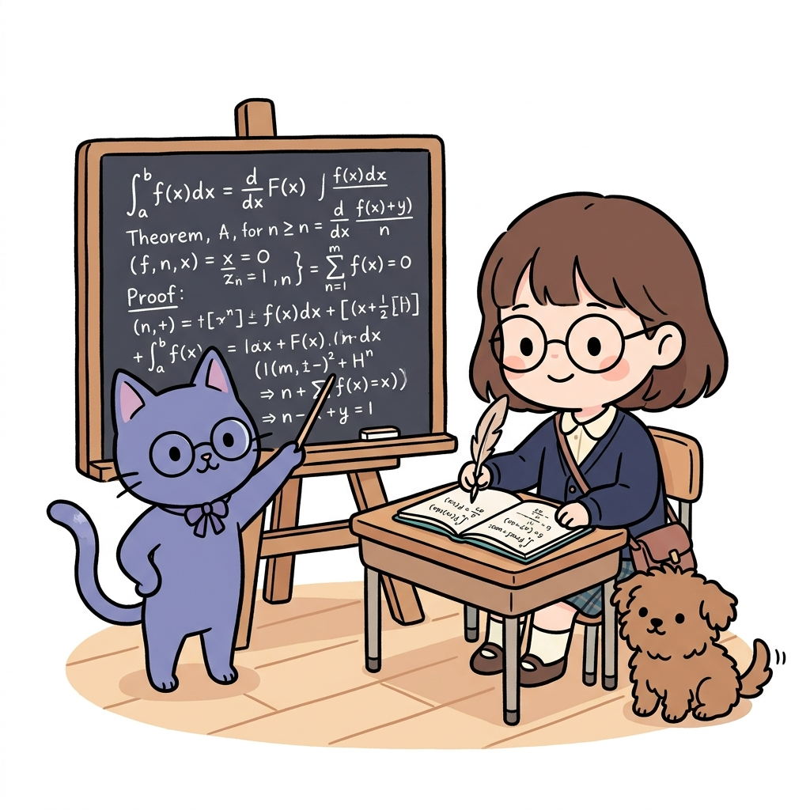

# APPENDIX D

# 정책 경사법 증명

**그림 D-0** 미분과 적분 기호가 빼곡한 칠판 앞에서 엄밀한 정책 경사 정리를 수학적으로 증명하는 지니와 깃펜 필기를 하는 도로시

---

> **도로시와 토토의 비유로 이해하기**:
> 안경을 쓴 도로시 꼬마 박사님이 칠판 가득 적분 기호(∫)와 정책 경사(∇) 수식들을 채우며, 감각적으로 공부하던 정책 경사 정리(Policy Gradient Theorem)를 수학적으로 완벽하게 증명해 냅니다. 토토가 뒤에서 놀라 만세를 부르고 있군요!

9장에서 소개한 수식을 증명해봅시다.

## D.1 정책 경사법 도출

9.1절에서 설명했듯이 $J(\theta) = \mathbb{E}_{\tau \sim \pi_{\theta}} [ G(\tau) ]$일 경우 기울기는 [식 10.1]로 표현됩니다.

$$\nabla_{\theta} J(\theta) = \mathbb{E}_{\tau \sim \pi_{\theta}} \left[ \sum_{t=0}^T G(\tau) \nabla_{\theta} \log \pi_{\theta}(A_t | S_t) \right] \tag{식 9.1}$$

그러면 [식 10.1]을 도출해보겠습니다.

먼저 기호를 확인합시다. 정책을 $\pi_{\theta}$라고 했을 때 궤적 $\tau$를 얻을 수 있는 확률을 $\text{Pr}(\tau | \theta)$로 표현합시다. 그러면 $\nabla_{\theta} J(\theta)$를 수식으로 다음처럼 전개할 수 있습니다.

부록 D 정책 경사법 증명 355

$$\begin{aligned}
\nabla_{\theta} J(\theta) &= \nabla_{\theta} \mathbb{E}_{\tau \sim \pi_{\theta}} [ G(\tau) ] \\
&= \nabla_{\theta} \sum_{\tau} \text{Pr}(\tau | \theta) G(\tau) \quad \text{(기댓값 확장)} \\
&= \sum_{\tau} \nabla_{\theta} (\text{Pr}(\tau | \theta) G(\tau)) \quad \text{($\nabla_{\theta}$를 $\sum$ 안으로 이동)} \\
&= \sum_{\tau} \{ G(\tau) \nabla_{\theta} \text{Pr}(\tau | \theta) + \text{Pr}(\tau | \theta) \nabla_{\theta} G(\tau) \} \quad \text{(곱의 미분)} \\
&= \sum_{\tau} G(\tau) \nabla_{\theta} \text{Pr}(\tau | \theta) \quad \text{($\nabla_{\theta} G(\tau)$는 항상 0)} \\
&= \sum_{\tau} G(\tau) \text{Pr}(\tau | \theta) \frac{\nabla_{\theta} \text{Pr}(\tau | \theta)}{\text{Pr}(\tau | \theta)} \quad \left( \text{곱하기 } \frac{\text{Pr}(\tau | \theta)}{\text{Pr}(\tau | \theta)} \right) \\
&= \sum_{\tau} G(\tau) \text{Pr}(\tau | \theta) \nabla_{\theta} \log \text{Pr}(\tau | \theta) \quad \text{(로그-기울기 트릭)} \\
&= \mathbb{E}_{\tau \sim \pi_{\theta}} [ G(\tau) \nabla_{\theta} \log \text{Pr}(\tau | \theta) ] \tag{식 D.1}
\end{aligned}$$

수식의 오른쪽 설명을 참고하여 하나하나 따라가봅시다. 미분을 알고 있다면 특별히 어려운 점은 없을 것입니다. 다만 '로그-기울기 트릭'은 생소할 테니 설명해보겠습니다. 이 트릭은 다음 관계를 이용합니다.

$$\nabla_{\theta} \log \text{Pr}(\tau | \theta) = \frac{\nabla_{\theta} \text{Pr}(\tau | \theta)}{\text{Pr}(\tau | \theta)}$$

$\log$의 기울기를 구하는 식일 뿐이지만 이 식을 통해 $\nabla_{\theta} \text{Pr}(\tau | \theta)$와 $\text{Pr}(\tau | \theta) \nabla_{\theta} \log \text{Pr}(\tau | \theta)$를 '바꿔치기'할 수 있음을 알 수 있습니다. 이를 **로그-기울기 트릭**log-gradient trick 혹은 **로그-파생 트릭**log-derivative trick이라고 하며, 머신러닝에서 자주 쓰이는 식 변형입니다.

이어서 [식 D.1]을 더욱 확장하기 위해 다음 관계를 이용합니다.

$$\begin{aligned}
\text{Pr}(\tau | \theta) &= p(S_0)\pi_{\theta}(A_0 | S_0) p(S_1 | S_0, A_0) \cdots \pi_{\theta}(A_T | S_T) p(S_{T+1} | S_T, A_T) \\
&= p(S_0) \prod_{t=0}^T \pi_{\theta}(A_t | S_t) p(S_{t+1} | S_t, A_t)
\end{aligned}$$

$p(S_0)$은 초기 상태 $S_0$의 확률입니다. 이 식과 같이 궤적 $\tau$를 얻을 확률은 초기 상태의 확률, 정책, 그리고 다음 상태의 전이 확률의 곱으로 (분해하여) 표현됩니다. 또한 $\log \text{Pr}(\tau | \theta)$는

다음과 같이 나타낼 수 있습니다.

$$\log \text{Pr}(\tau | \theta) = \log p(S_0) + \sum_{t=0}^T \log p(S_{t+1} | S_t, A_t) + \sum_{t=0}^T \log \pi_{\theta}(A_t | S_t)$$

$\log xy = \log x + \log y$이므로, 이 식처럼 더하기로 표현할 수 있습니다. 그리고 이 식으로부터 $\nabla_{\theta} \log \text{Pr}(\tau | \theta)$는 다음과 같이 구할 수 있습니다.

$$\begin{aligned}
\nabla_{\theta} \log \text{Pr}(\tau | \theta) &= \nabla_{\theta} \left\{ \log p(S_0) + \sum_{t=0}^T \log p(S_{t+1} | S_t, A_t) + \sum_{t=0}^T \log \pi_{\theta}(A_t | S_t) \right\} \\
&= \nabla_{\theta} \sum_{t=0}^T \log \pi_{\theta}(A_t | S_t)
\end{aligned}$$

$\nabla_{\theta}$는 *θ*에 대한 기울기입니다. *θ*와 관계없는 원소의 기울기인 $\nabla_{\theta} \log p(S_0)$과 $\nabla_{\theta} \sum_{t=0}^T \log p(S_{t+1} | S_t, A_t)$는 결국 0이 되니, 지금까지의 식에서 다음 식을 얻을 수 있습니다.

$$\begin{aligned}
\nabla_{\theta} J(\theta) &= \mathbb{E}_{\tau \sim \pi_{\theta}} [ G(\tau) \nabla_{\theta} \log \text{Pr}(\tau | \theta) ] \tag{식 D.1} \\
&= \mathbb{E}_{\tau \sim \pi_{\theta}} \left[ \sum_{t=0}^T G(\tau) \nabla_{\theta} \log \pi_{\theta}(A_t | S_t) \right] \tag{식 9.1}
\end{aligned}$$

이것으로 $\nabla_{\theta} J(\theta)$의 도출이 모두 끝났습니다.

## D.2 베이스라인 도출

9.3절에서는 다음의 식 변형을 보여주었습니다.

$$\begin{aligned}
\nabla_{\theta} J(\theta) &= \mathbb{E}_{\tau \sim \pi_{\theta}} \left[ \sum_{t=0}^T G_t \nabla_{\theta} \log \pi_{\theta}(A_t | S_t) \right] \tag{식 9.3} \\
&= \mathbb{E}_{\tau \sim \pi_{\theta}} \left[ \sum_{t=0}^T (G_t - b(S_t)) \nabla_{\theta} \log \pi_{\theta}(A_t | S_t) \right] \tag{식 9.4}
\end{aligned}$$

부록 D 정책 경사법 증명 357

[식 10.4]와 같이 *G**t* 대신 $G_t - b(S_t)$를 사용할 수 있습니다. 여기서 $b(S_t)$는 임의의 함수이며 '베이스라인'이라고 합니다. 이번 절에서는 [식 10.4]를 도출해보겠습니다.

먼저 다음 식이 성립함을 증명합니다.

$$\mathbb{E}_{x \sim P_{\theta}} [ \nabla_{\theta} \log P_{\theta}(x) ] = 0 \tag{식 D.2}$$

확률 변수 *x*가 확률 분포 $P_{\theta}(x)$로부터 생성된다고 가정하죠. $P_{\theta}(x)$는 매개변수 *θ*에 따라 확률 분포의 형태가 달라집니다. 그러면 다음 식이 성립합니다.

$$\sum_x P_{\theta}(x) = 1$$

$P_{\theta}(x)$는 확률 분포이므로 모든 *x*의 값을 더하면 1입니다. 다음으로 이 식의 기울기를 구합니다.

$$\nabla_{\theta} \sum_x P_{\theta}(x) = \nabla_{\theta} 1 = 0$$

이어서 '로그-기울기 트릭'을 이용하여 식을 다음처럼 전개합니다.

$$\begin{aligned}
0 &= \nabla_{\theta} \sum_x P_{\theta}(x) \\
&= \sum_x \nabla_{\theta} P_{\theta}(x) \\
&= \sum_x P_{\theta}(x) \nabla_{\theta} \log P_{\theta}(x) \\
&= \mathbb{E}_{x \sim P_{\theta}} [ \nabla_{\theta} \log P_{\theta}(x) ]
\end{aligned}$$

이로써 [식 D.2]가 증명되었습니다.

다음으로 [식 D.2]를 우리 문제에 적용해봅시다. 구체적으로 [식 D.2]의 *x* 대신 행동 *A**t*를 사용하고, $P_{\theta}(\,\cdot\,)$ 대신 정책 $\pi_{\theta}(\,\cdot\, | S_t)$를 사용합니다. 그러면 다음 식을 얻을 수 있습니다.

$$\mathbb{E}_{A_t \sim \pi_{\theta}} [ \nabla_{\theta} \log \pi_{\theta}(A_t | S_t) ] = 0 \tag{식 D.3}$$

[식 D.3]은 행동 *A**t*에 대한 기댓값입니다. 따라서 다음 식과 같이 임의의 함수 $b(S_t)$를 기댓값 안에 넣어도 등식이 성립합니다.

$$\mathbb{E}_{A_t \sim \pi_{\theta}} [ b(S_t) \nabla_{\theta} \log \pi_{\theta}(A_t | S_t) ] = 0 \tag{식 D.4}$$

$b(S_t)$는 *S**t*를 인수로 받는 함수이며, *A**t*가 바뀌어도 항상 똑같은 값입니다.

> [!CAUTION]
> 수익 *G**t*는 행동 *A**t*에 따라 달라지므로 다음 식은 성립하지 않습니다.
> 
> $$\mathbb{E}_{A_t \sim \pi_{\theta}} [ G_t \nabla_{\theta} \log \pi_{\theta}(A_t | S_t) ] = 0$$

[식 D.4]는 $t = 0 \sim T$ 모두에서 성립합니다. 이로부터 다음 식을 얻을 수 있습니다.

$$\mathbb{E}_{\tau \sim \pi_{\theta}} \left[ \sum_{t=0}^T b(S_t) \nabla_{\theta} \log \pi_{\theta}(A_t | S_t) \right] = 0$$

이상으로 [식 10.4]가 성립함을 알 수 있습니다.

부록 D 정책 경사법 증명 359
