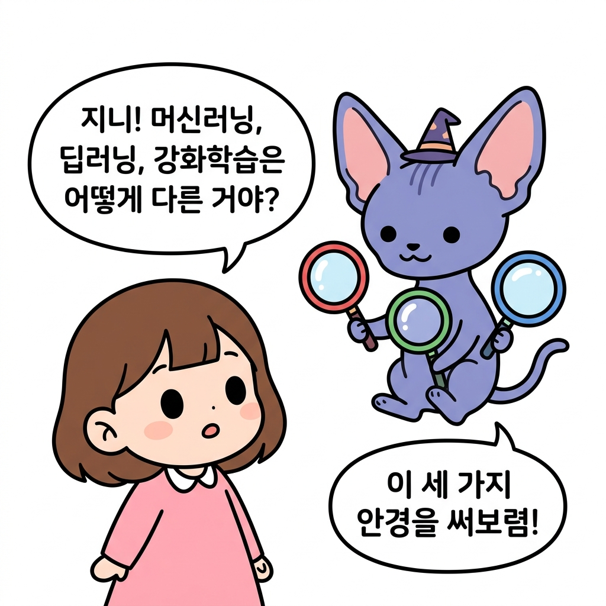
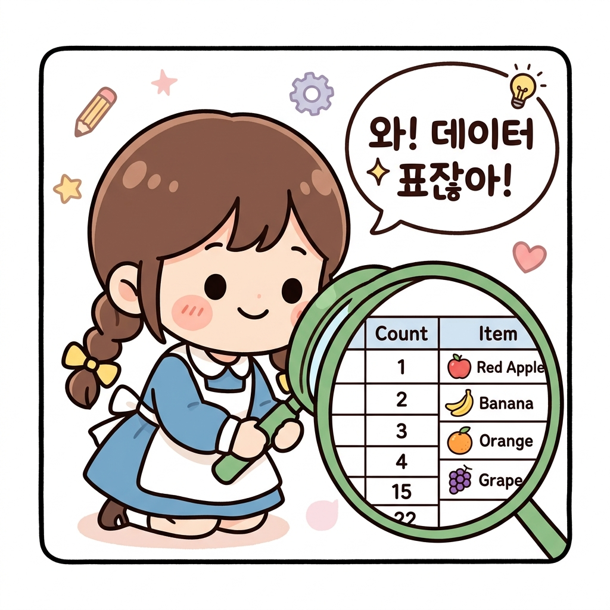
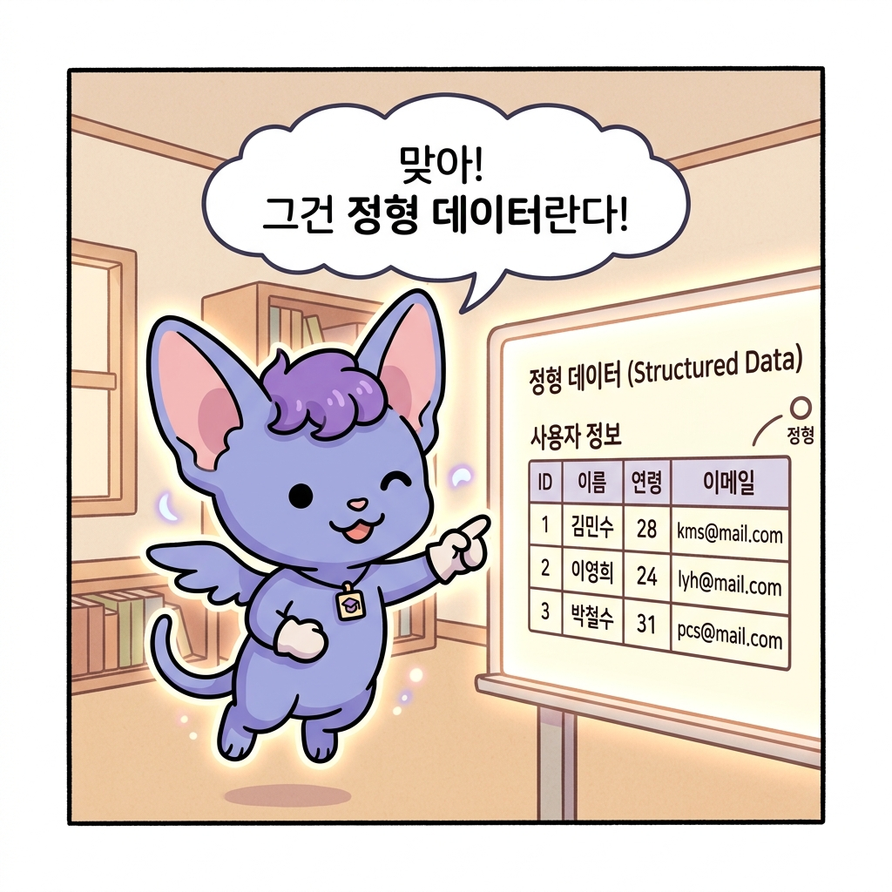
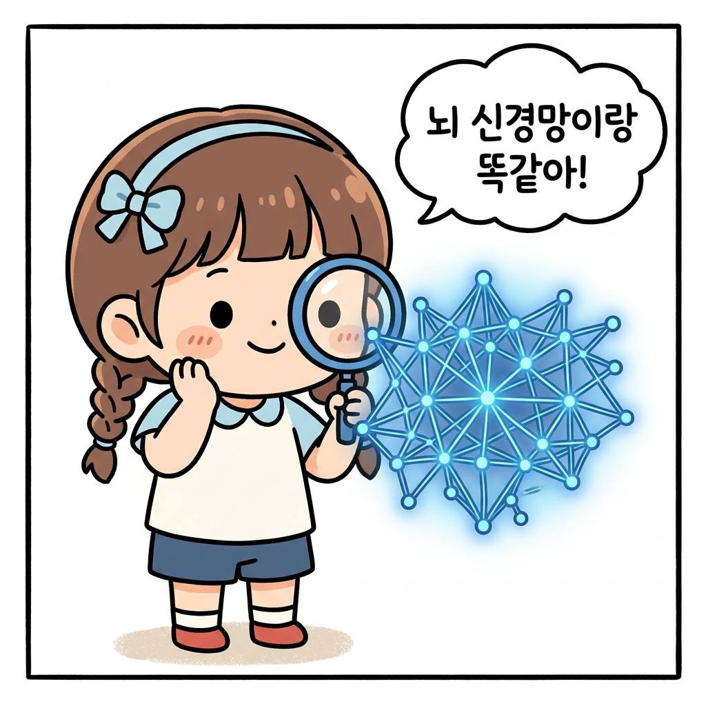
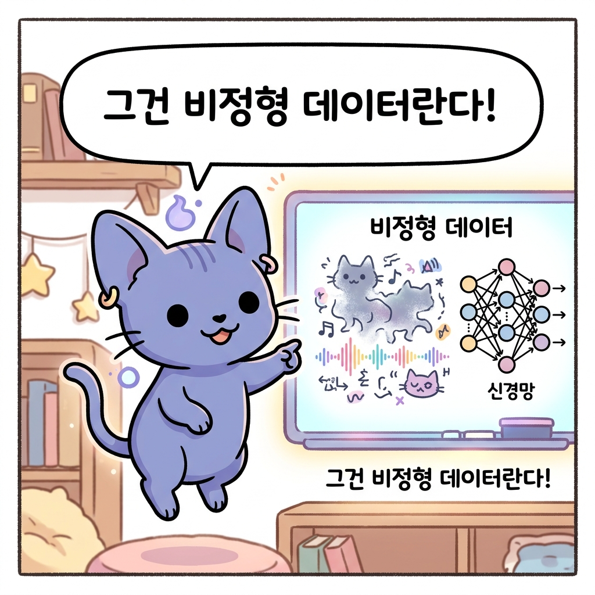
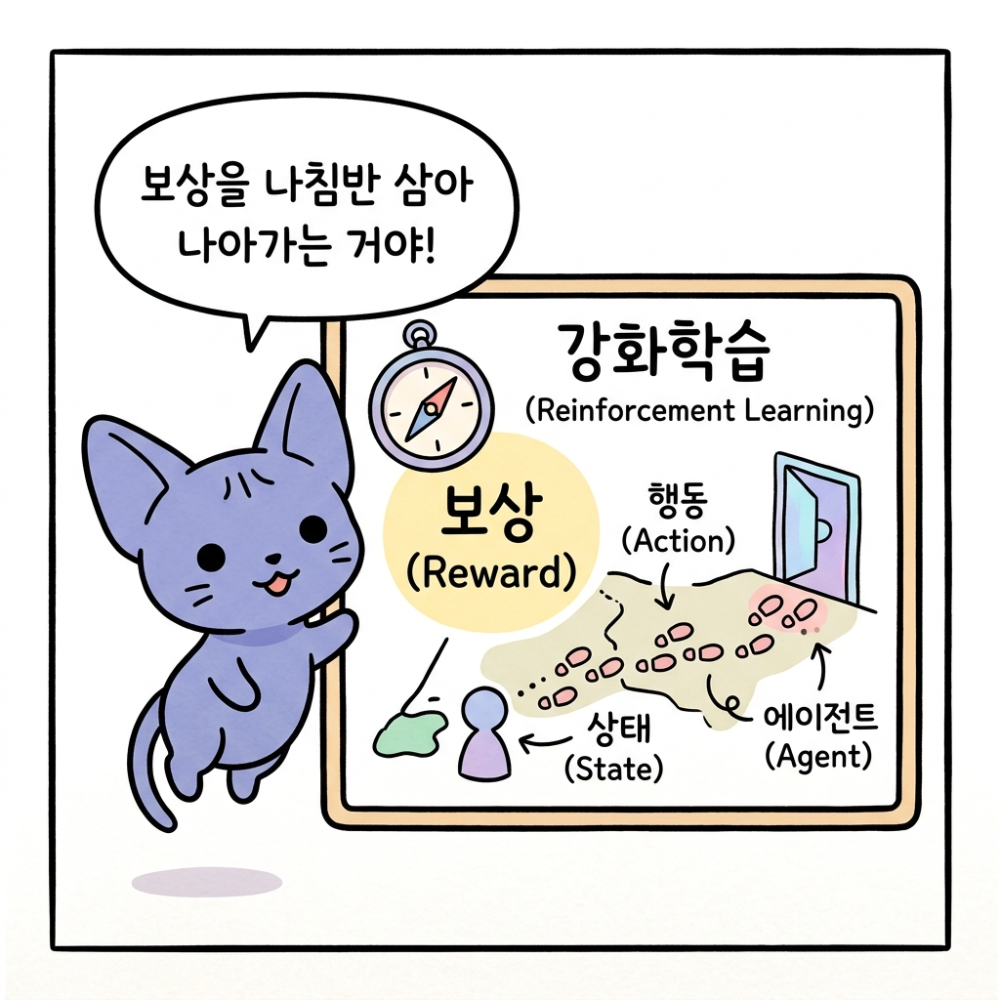

# 01.1 AI의 세 가지 마법: 머신러닝, 딥러닝, 강화학습 구분하기

"지니! 인공지능의 세계에는 머신러닝, 딥러닝, 강화학습이라는 단어가 자주 나오잖아. 이 셋은 각각 어떤 특징을 가지고 있고, 서로 어떻게 다른 거야?"

도로시가 울창한 마법의 숲을 바라보며 지니에게 물었습니다. 지니는 공중에 둥둥 뜬 채로 보랏빛 안개 속에서 알록달록한 세 종류 of 돋보기 렌즈를 꺼내 도로시에게 건넸습니다.

**그림 1-1** 도로시에게 세 가지 신비로운 마법 렌즈를 건네주는 지니와 호기심 가득한 토토

"좋은 질문이야, 도로시! 이 세 가지 마법의 안경을 하나씩 번갈아 써보렴. 세상이 어떻게 다르게 보이는지 알게 될 거야!"

---

## 01.1.1 머신러닝 안경: 가지런한 규칙과 정형 데이터의 마법

> **정형 데이터Structured Data**는 표나 엑셀 파일처럼 일정한 규칙과 규격에 맞춰 정돈된 데이터를 의미합니다. **머신러닝Machine Learning**은 이러한 정형 데이터 속의 숫자 규칙과 패턴을 파악하여 컴퓨터가 스스로 판단 기준을 세우도록 돕는 인공지능 학습 기법입니다.

도로시가 첫 번째 초록색 안경(머신러닝 안경)을 쓰자, 숲속의 사과들이 일제히 숫자 정보가 적힌 표로 변해 보였습니다.

* **사과 A**: 무게 150g, 지름 7cm → 빨간 사과
* **사과 B**: 무게 180g, 지름 8cm → 빨간 사과
* **과일 C**: 무게 120g, 지름 5cm → 주황 귤

"와! 숲속의 물건들이 깔끔한 **표 모양**의 **숫자**로 정리되어 보여!"

**그림 1-1-1** 머신러닝의 특징을 담은 도로시의 초록 안경 컷 만화

지니가 고개를 끄덕였습니다.

"맞아. 그렇게 깔끔하게 정리된 데이터를 **정형 데이터Structured Data**라고 불러. **머신러닝Machine Learning**은 바로 이런 숫자 표나 정리된 규칙들을 바탕으로 학습하는 기초 마법이야.

**그림 1-1-1-b** 지니의 정형 데이터와 머신러닝 마법 설명 컷 만화

미리 준비된 데이터를 마법 모델에 입력해 주면, 모델이 데이터의 패턴을 파악해서 새로운 사과가 나타났을 때 그것이 사과인지 귤인지 척척 맞혀낼 수 있게 된단다."

* **주요 대상**: 정형 데이터 (표, 숫자, 정돈된 기록)
* **특징**: 데이터의 특정 특징(무게, 지름 등)을 사람이 먼저 잘 정리해 주는 경우가 많습니다.

---

## 01.1.2 딥러닝 안경: 안개 속 그림과 비정형 데이터를 읽는 고차원 마법

> **비정형 데이터Unstructured Data**는 이미지, 동영상, 자연어 등 일정한 형태와 규격이 없는 데이터를 의미합니다. **딥러닝Deep Learning**은 여러 층으로 이루어진 **인공신경망Artificial Neural Network**을 통해 컴퓨터가 비정형 데이터의 고유한 특징을 **스스로 발견**하고 인지하게 만드는 고차원 학습 기법입니다.

도로시가 두 번째 파란색 안경(딥러닝 안경)을 쓰자, 숲 전체가 수십억 개의 반짝이는 신경망 실타래로 복잡하게 연결되어 보였습니다. 저 멀리 동굴 벽에 그려진 흐릿한 고대 숲의 그림(이미지)과 바람에 실려 오는 복잡한 울림소리(자연어)가 보였습니다.

**그림 1-1-2** 딥러닝의 특징을 담은 도로시의 파란 안경 컷 만화

"지니, 이번에는 표로 정리된 숫자가 아니라, 복잡한 그림이랑 소리들이 가득해! 이건 어떻게 읽어야 하지?"

"그건 **비정형 데이터Unstructured Data**란다. 형태가 정해져 있지 않아 컴퓨터가 한눈에 알아보기 무척 까다롭지. 이를 해결하기 위해 인간의 뇌 신경망을 닮은 **인공신경망Artificial Neural Network** 마법을 사용하는 기법이 바로 **딥러닝Deep Learning**이야."

**그림 1-1-2-b** 지니의 비정형 데이터와 딥러닝 마법 설명 컷 만화

딥러닝 안경은 수많은 '**은닉층'**이라는 마법의 필터를 거쳐 작동합니다.

> **은닉층Hidden Layer**: 입력층(눈으로 보는 데이터)과 출력층(최종 판단 결과) 사이에 존재하는 **보이지 않는 인공신경망** 층들을 의미합니다. 입력된 데이터에서 점, 선, 면 같은 얕은 특징부터 사물의 온전한 형태 같은 깊은 특징까지 단계별로 걸러내고 학습하는 필터 역할을 합니다.

* 흐릿한 그림이 들어오면, 첫 번째 신경망 층이 선과 모서리를 감지하고,
* 다음 층이 둥근 모양을 감지하며,
* 마지막 층에서 "아하! 이건 도로시의 얼굴이구나!" 하고 복잡한 이미지를 스스로 이해하게 됩니다.

* **주요 대상**: 비정형 데이터 (이미지, 동영상, 자연어 음성 등)
* **특징**: 사람이 특징을 분석해 주지 않아도, 깊은 인공신경망이 스스로 데이터 속에서 특징을 발견해 학습합니다.

---

## 01.1.3 강화학습 안경: 몸으로 부딪치며 깨닫는 행동의 마법

> **강화학습Reinforcement Learning**은 정답지가 주어지지 않는 대신, 에이전트가 환경과 직접 충돌하고 반응하며 얻는 **보상Reward 피드백**을 최대화하는 방향으로 학습하는 기법입니다. 온몸으로 성공과 실패를 겪으며 배우는 **시행착오Trial and Error 학습**의 특징을 가집니다.

마지막으로 도로시가 빨간색 안경(강화학습 안경)을 쓰자, 눈앞이 완전히 캄캄해지며 어두운 마법의 미로 방이 나타났습니다. 도로시의 손에는 나무 지팡이 하나만 쥐어져 있었습니다.

"지니! 갑자기 앞이 하나도 안 보이고 캄캄해졌어! 여기서 어떻게 길을 찾아가야 하지?"

지니가 도로시의 어깨 위에 둥둥 떠서 부드럽게 대답했습니다.

"걱정 마, 도로시. 이것이 바로 강화학습이 직면하는 상황이란다. 아무런 사전 정보도 없이 미지의 환경에 놓였을 때, 우리는 오직 스스로 행동하고 부딪쳐 보며 길을 터득해야 해. 그 단계를 하나씩 따라가 보자!"

### 🚶 1단계: 일단 움직이며 탐색하기 (행동과 관찰)

도로시는 안대를 쓴 채 조심스럽게 마법 지팡이로 바닥을 톡톡 두드렸습니다.

**그림 1-1-3-a** 1단계: 지팡이로 바닥을 두드려 보며 주변을 탐색하는 도로시

"이렇게 앞을 가늠하기 위해 지팡이로 톡톡 두드리고 발을 내딛는 과정이 바로 **행동Action**이야. 지금 도로시가 서 있는 미로의 상황은 **상태State**에 해당하지."

### ⚠️ 2단계: 돌부리에 걸리기 (실패와 벌점 피드백)

도로시가 왼쪽으로 지팡이를 휘두르다 커다란 돌부리에 세게 부딪쳤습니다. "아야!" 소리가 절로 나왔고, 허공에 붉은 벌점(`-10`) 신호가 떴습니다.

**그림 1-1-3-b** 2단계: 숨겨진 돌부리에 부딪쳐 아픔을 느끼고 감점을 받는 도로시

"돌부리에 부딪치거나 벽에 가로막혀 아픔을 느끼는 것이 바로 환경이 주는 **음의 보상Negative Reward**이란다. 이 실패의 경험을 통해 모델은 '이 방향은 위험하구나'라는 것을 뼈아프게 깨닫고, 수첩에 기록하게 되지."

### 🎉 3단계: 안전한 평지 찾기 (성공과 득점 보상)

돌부리를 피해 도로시가 조심스럽게 오른쪽 바닥을 두드리자, 매끄럽고 평평한 황금 타일이 만져졌습니다. 그곳을 딛자 기분 좋은 징글 소리와 함께 푸른 득점(`+50`) 신호가 허공에 빛났습니다.

**그림 1-1-3-c** 3단계: 평평한 황금 타일을 딛고 안전을 확보하며 득점 보상을 받는 도로시

"안전하고 바른 길을 선택했을 때 얻는 기쁨이 바로 **양의 보상Positive Reward**이야. 강화학습 모델은 수없이 안대를 쓴 채 지팡이를 두드려 보며, 이 보상 점수를 가장 많이 얻을 수 있는 최적의 움직임 지도인 **정책Policy**을 스스로 만들어 낸단다."

지니가 환하게 웃으며 정리했습니다.

"보렴! 강화학습은 이미 깔끔하게 정리된 데이터 표를 앉아서 분석하는 것이 아니야. 스스로 **환경 속에서 지팡이를 내딛는 시행착오Trial and Error**를 거쳐 가며, 오직 보상 신호만을 나침반 삼아 목적지까지 가는 최선의 방법을 직접 온몸으로 깨우치는 행동의 마법이란다!"

**그림 1-1-3-d** 지니의 강화학습 마법 최종 요약 컷 만화

* **주요 대상**: 행동에 따른 상태 변화와 보상 피드백
* **특징**: 데이터의 정답 라벨이 없으며, 성공과 실패의 누적 보상의 합을 최대화하도록 에이전트 스스로 학습합니다.

---

## 01.1.4 한눈에 비교하기

세 가지 인공지능 방법론(패러다임)의 핵심 차이를 정리하면 다음과 같습니다.

| 마법 분류 (Paradigm) | 입력 데이터 (Input Data) | 학습 목표 및 방식 (Learning Objective) | 주요 알고리즘/기법 (Examples) |
| :--- | :--- | :--- | :--- |
| **머신러닝 (Machine Learning)** | 정형 데이터 (Structured Data) | 데이터 간의 선형/비선형적 상관관계 및 사전에 정의된 규칙 탐색 | 회귀 분석, 결정 트리, SVM 등 |
| **딥러닝 (Deep Learning)** | 비정형 데이터 (Unstructured Data) | 다층 인공신경망을 활용한 고차원 특징(Feature)의 자동 추출 및 학습 | CNN, RNN, Transformer 등 |
| **강화학습 (Reinforcement Learning)** | 에이전트의 행동 피드백 (State, Action, Reward) | 환경과의 조작적 상호작용 및 시행착오를 통한 누적 보상(Reward) 합의 극대화 | Q-Learning, DQN, Policy Gradient 등 |

각 방법론은 상호 배타적인 것이 아니며, 최적의 문제 해결을 위해 머신러닝의 수리적 분석 기법과 딥러닝의 표현 학습, 강화학습의 정책 결정을 융합하여 사용하는 형태로 발전하고 있습니다.

