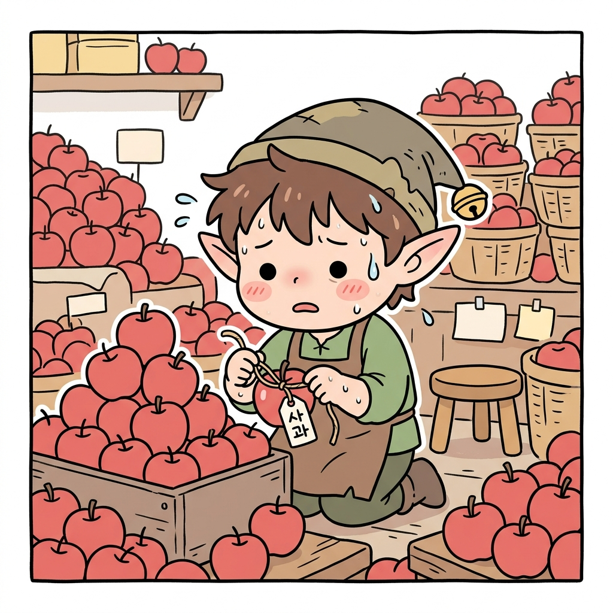
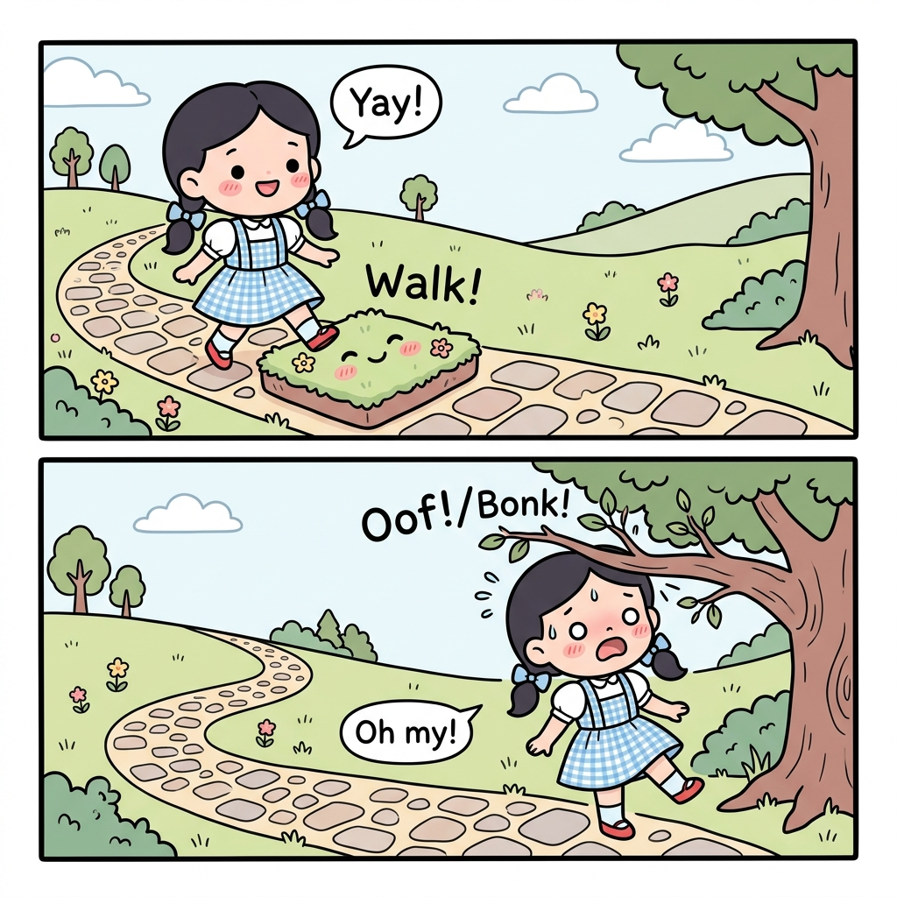
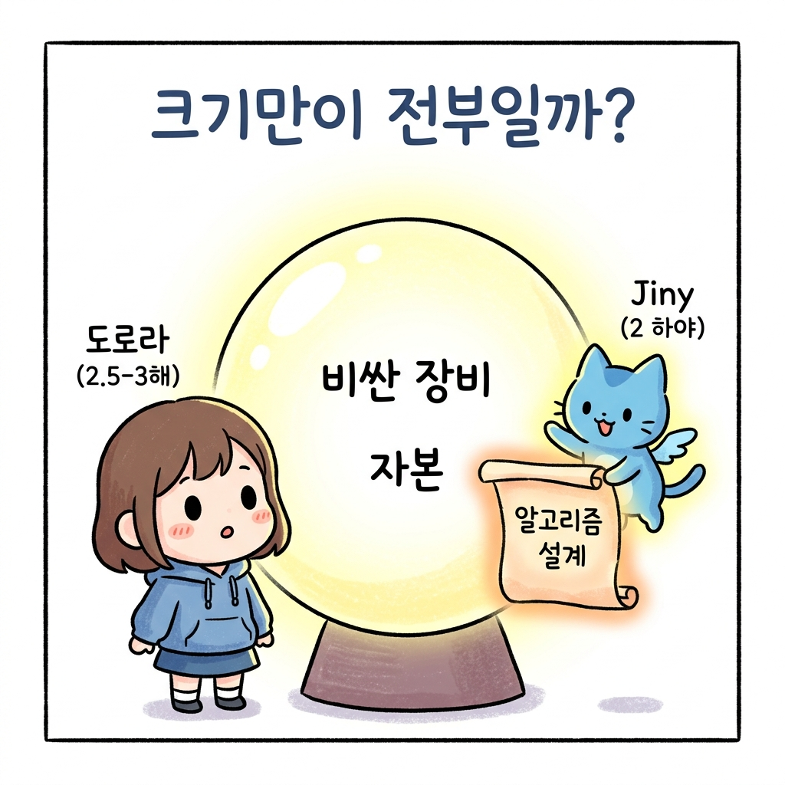
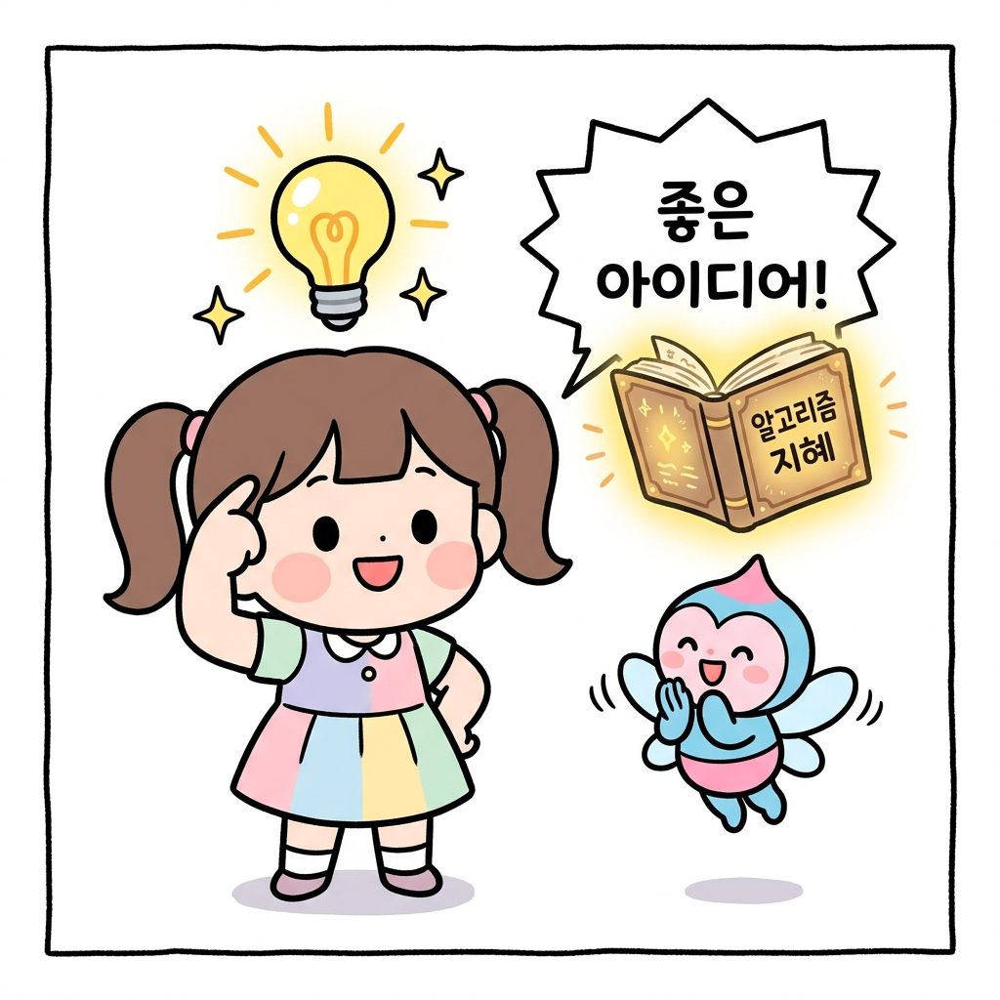

# 01.2 왜 강화학습을 공부해야 할까?

> **강화학습Reinforcement Learning**은 데이터 라벨링에 필요한 고단한 수작업과 초고성능 연산 장비의 자본적 한계에서 벗어나, 에이전트 스스로의 경험 데이터 생성과 정교한 정책/보상 알고리즘 설계를 통해 해답을 개척해 나가는 자기완성형(자급자족) 인공지능 마법입니다.

"지니! AI 마법은 정말 멋지지만, 거대한 마법 상자나 수많은 요정 일꾼들이 있어야만 쓸 수 있는 것 아니야?"

숲속 갈림길에 멈춰 선 도로시가 수첩을 짚어보며 걱정스레 물었습니다. 

곁에 있던 토토도 꼬리를 내리며 작게 낑낑거렸습니다. 

그러자 도로시의 머리맡에 둥둥 떠 있던 요술 고양이 지니가 보랏빛 마법 연기를 흩날리며 생긋 웃었습니다.

"아니란다, 도로시! 일반적인 AI 마법과 **강화학습 마법**은 근본부터 달라. 왜 그런지 하나씩 알려줄게!"

**그림 1-2** 지니가 숲속에서 도로시와 토토에게 AI 마법의 비밀을 설명해 주는 장면

---

## 01.2.1 데이터 라벨링의 늪과 자본의 장벽

기존의 지도 학습(Supervised Learning)이나 비지도 학습 마법을 부리기 위해서는 엄청난 규모의 **자원**과 사전 **노동**이 필요합니다.

컴퓨터에게 무엇이 사과이고 무엇이 돌인지 알려주려면, 모든 데이터마다 정답 이름표인 **라벨(Label)**을 수동으로 붙여두어야 하기 때문입니다.

**그림 1-2-1** 수많은 일꾼 요정이 밤낮으로 데이터에 라벨을 붙여야 하는 지도학습의 늪

* **데이터 라벨링의 한계**: 수백만 장의 사과 사진에 일일이 "사과"라고 태그를 다는 고단한 노가다 작업(라벨링)이 필수적입니다.
* **거대 컴퓨팅 파워의 제약**: 이 거대한 데이터베이스를 훈련하기 위해 수억 원을 호가하는 마법 수정 구슬(초고성능 GPU 서버)을 구매해야 합니다.

결국, 막대한 자본과 엄청난 수의 일꾼 요정을 거느린 거대 마법 왕국(대기업)만이 이 마법의 혜택을 온전히 누리기 쉽습니다.

---

## 01.2.2 강화학습의 자급자족 데이터 생성

반면에 **강화학습 마법**은 사전 준비 데이터나 이름표가 전혀 필요하지 않습니다.

에이전트가 환경 속에서 직접 발걸음을 내딛고, 스스로 부딪치며 데이터를 현장에서 실시간으로 자급자족하기 때문입니다.

**그림 1-2-2** 도로시가 길을 직접 걷고 부딪치며 스스로 경험 데이터를 만들어내는 강화학습

* **경험을 통한 자급자족**: 도로시가 길을 걸어가다가 "어라? 나뭇가지에 머리를 부딪쳤더니 아프네!(감점)", "이쪽 길로 걸어가니 푹신하고 기분이 좋네!(보상)" 하고 직접 온몸으로 경험하며 훈련 데이터를 만들어 냅니다.
* **시간과 비용의 혁신적 단축**: 애초에 이름표를 붙이는 사전 노동 자체가 없으므로, 데이터 라벨링에 쓰이는 막대한 비용과 시간의 제약에서 완벽히 탈출할 수 있습니다.

---

## 01.2.3 장비보다 설계의 지혜가 빛나는 무대

"하지만 지니, 계산 속도가 엄청나게 빠른 거대 수정 구슬이 있어야 마법이 성공하는 것 아냐?"

도로시가 여전히 미심쩍은 표정으로 묻자, 지니가 발을 동동 굴리며 장난스레 대답했습니다.

**그림 1-2-2-b** 거대하고 비싼 수정 구슬(장비)보다 지혜가 담긴 작은 마법 스크롤(알고리즘)이 중요하다는 비유

"물론 수정 구슬이 좋으면 빨리 계산할 수 있겠지! 하지만 강화학습 마법은 단순히 연산 속도가 빠르다고 해서 무조건 성공하는 게 아니야. 오히려 **마법을 설계하는 도로시의 지혜**에 모든 것이 달려있단다!"

**그림 1-2-2-c** 머릿속에 반짝이는 아이디어(지혜)로 알고리즘을 설계하는 도로시와 응원하는 지니

강화학습에서는 컴퓨터의 성능보다 다음과 같은 설계 능력이 성공의 핵심 열쇠가 됩니다.

1. **보상 함수 설계(Reward Function Design)**: 에이전트가 어떤 상황에서 더 큰 점수를 얻고 감점을 받아야 가장 빠른 최적의 해답을 찾을 수 있을지 정의하는 알고리즘 능력.
2. **환경과 행동 공간 코딩(Environment & Action Space)**: 해결하고자 하는 현실의 복잡한 문제를 컴퓨터가 이해할 수 있는 상태와 행동의 관계(MDP)로 영리하게 추상화하고 코딩하는 소프트웨어 공학적 설계 능력.

즉, 고가의 장비나 거대한 자본이 부족한 1인 개발자나 스타트업이라 할지라도, **알고리즘을 깊이 이해하고 깔끔한 코드를 작성할 지혜**만 있다면 거대 왕국의 마법을 뛰어넘는 혁신적인 결과물을 스스로 만들어낼 수 있습니다.

**그림 1-2-2-d** 당근(보상)과 채찍(감점)을 영리하게 활용하여 에이전트의 규칙(환경)을 코딩하는 모습

---

## 🌟 정리하자면!

강화학습은 자본력과 장비가 부족한 환경에서도 오직 **프로그래밍 실력**과 **수학적 아이디어**로 비즈니스 환경의 복잡한 문제를 해결할 수 있는 가장 현실적이고 강력한 무기입니다.

"와! 그렇다면 나도 지니가 가르쳐주는 원리를 제대로 공부하면 이 멋진 숲길의 비밀을 풀고 훌륭한 탐험가가 될 수 있겠네?"

도로시의 눈이 반짝였고, 토토도 신이 나서 컹컹 짖었습니다. 

자, 그럼 우리도 도로시와 함께 스스로 데이터를 만들며 성장하는 강화학습 마법의 기초를 본격적으로 배우러 떠나볼까요?
