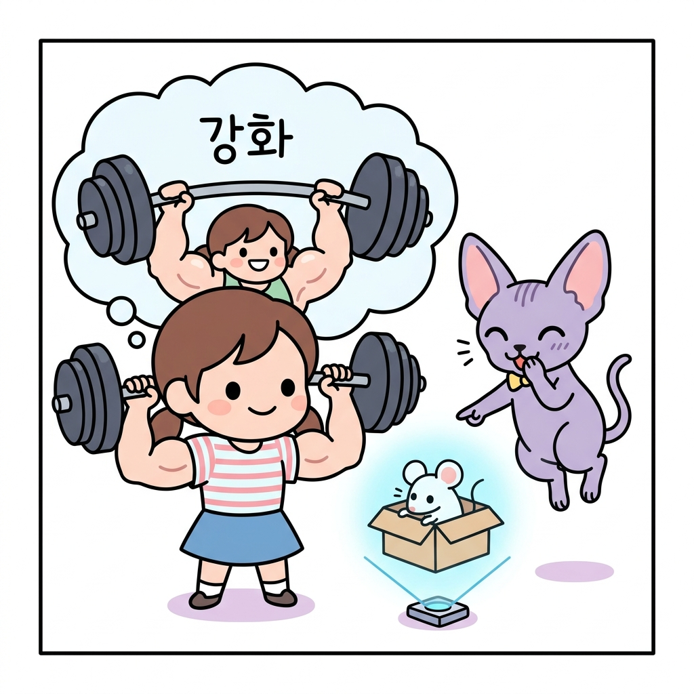
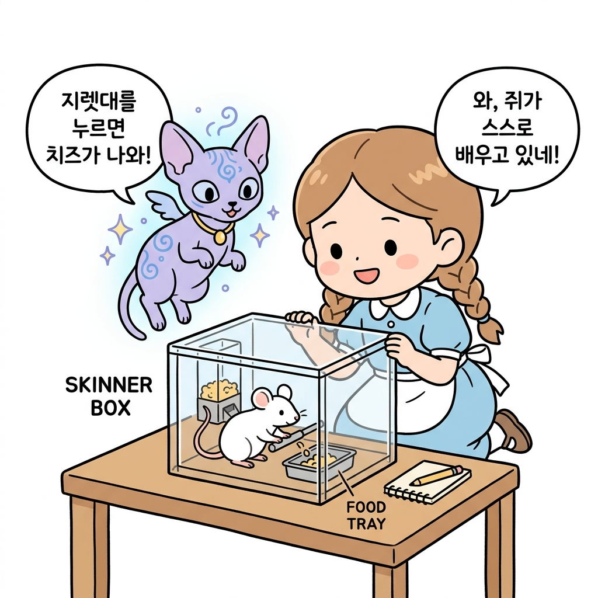
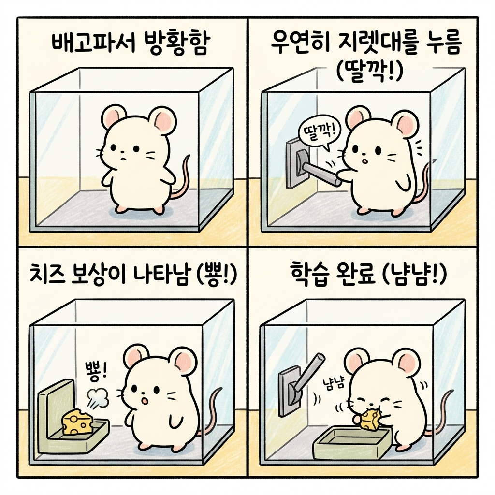
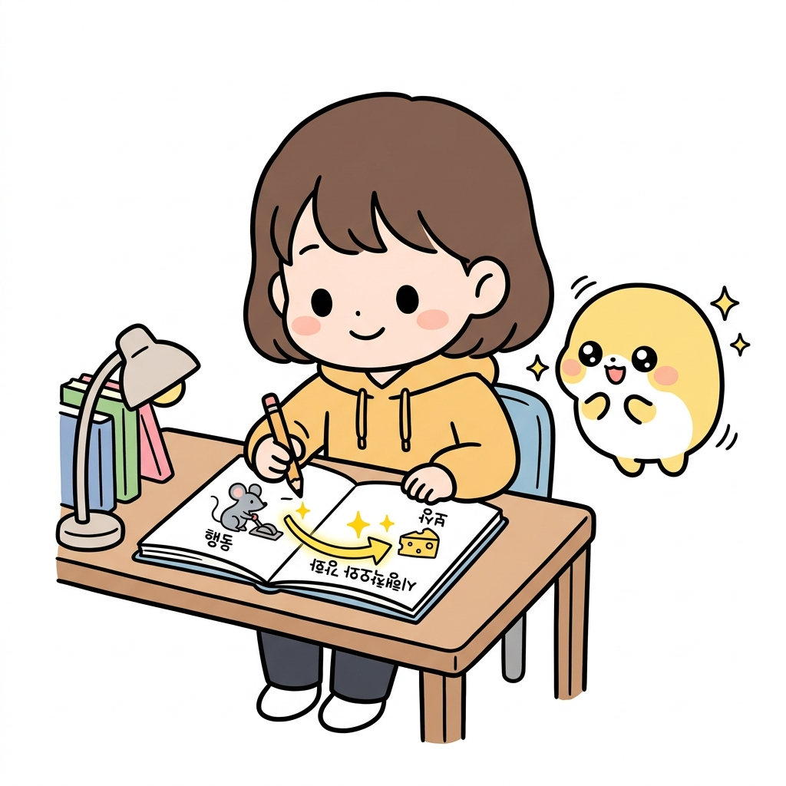
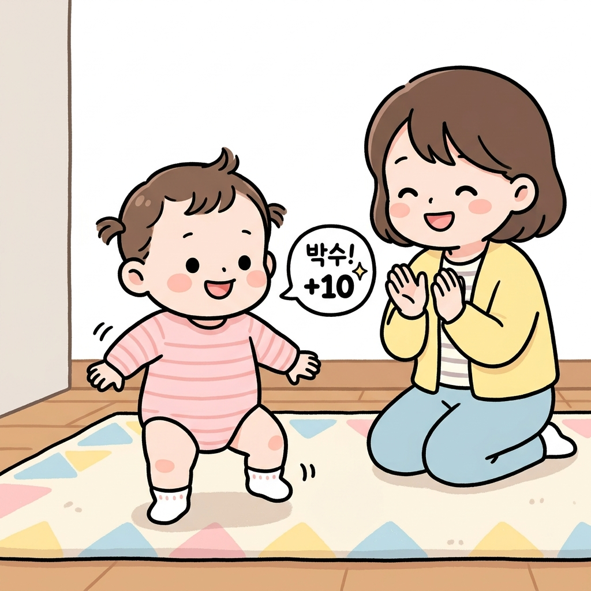
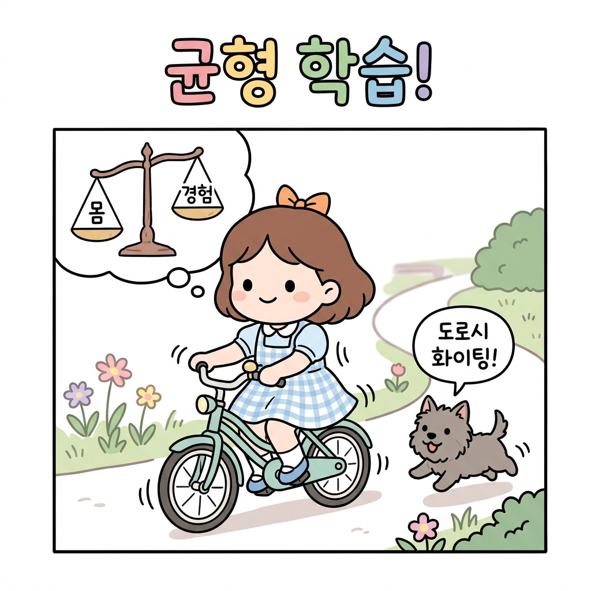

# 01.3 스키너의 쥐 실험과 일상의 강화

> **조작적 조건화Operative Conditioning**는 동물이 어떤 행동을 취했을 때 **보상**이나 **벌**을 제공함으로써 그 행동을 반복하게 만들거나 억제하는 심리학 기법입니다. 강화학습의 **'강화'**라는 명칭은 행동 뒤에 따르는 피드백을 통해 행동의 빈도를 조절하는 행동심리학의 이 개념에서 유래했습니다.

"도로시, 강화학습의 **'강화'**라는 단어는 원래 어디서 왔는지 아니?"

지니가 푸른 연기를 헤치며 손가락으로 공중에 입체 홀로그램 상자를 띄웠습니다. 상자 안에는 귀여운 하얀 쥐 한 마리가 바쁘게 냄새를 맡으며 돌아다니고 있었습니다.

"음, 왠지 몸을 단단하게 단련하는 체력 훈련 같은 단어인걸?"

**그림 1-3-a** 체력 단련(근육 강화)을 연상하며 오해하는 도로시와 쥐 실험 홀로그램을 띄우는 지니

도로시가 고개를 갸웃거리자, 옆에서 지니가 빙그레 웃었습니다.

"후훗, 아니란다! 이건 20세기 조작적 조건화 연구로 유명한 행동심리학자 **스키너B. F. Skinner** 박사의 실험 상자를 본뜬 홀로그램이야. 강화학습의 진짜 뿌리는 바로 이 **행동심리학**의 연구에 있단다."

**그림 1-3-b-1** 지니와 도로시가 신비한 투명 상자 속에서 지렛대를 누르며 노는 쥐를 관찰하는 모습

---

## 01.3.1 스키너의 상자 실험 (Skinner Box)

지니는 홀로그램 상자 속의 쥐가 어떻게 행동하는지 보여주며 설명을 이어갔습니다.

1. **상자 안의 굶주린 쥐**: 상자 안에는 작은 지렛대(Lever)와 먹이 디스펜서(Dispenser)가 있습니다. 처음 들어온 쥐는 몹시 배가 고파 상자 안을 무작위로 돌아다닙니다.
2. **우연한 발견**: 돌아다닌 쥐가 우연히 지렛대를 발로 누릅니다.
3. **보상의 획득**: 딸깍! 소리와 함께 먹이 통에서 맛있는 치즈 알갱이(보상)가 하나 떨어집니다.
4. **반복과 깨달음**: 처음에는 지렛대와 먹이의 연관성을 몰라 다시 방황하지만, 우연히 두 번, 세 번 누르면서 결국 **"지렛대를 누르면 먹이가 나온다"**는 사실을 스스로 학습하게 됩니다.
5. **행동의 강화**: 이제 쥐는 배가 고플 때마다 다른 행동을 하지 않고 지렛대로 바로 직행하여 지렛대를 쉴 새 없이 누르게 됩니다.

**그림 1-3-b-2** 배고픈 쥐가 무작위로 탐색하다가 지렛대를 누르고 보상(치즈)을 얻는 4단계 시행착오 학습 과정

"와! 쥐가 누구한테 배우지도 않았는데 스스로 맛있는 걸 얻는 규칙을 알아낸 거네?"

"그렇지! 심리학에서는 이를 **'시행착오Trial and Error 학습'**이라고 부르고, 특정 행동을 했을 때 좋은 결과(먹이)가 따라와서 그 행동의 빈도가 늘어나는 현상을 **'강화Reinforcement'**라고 정의했단다. 

쥐는 기계의 내부 구조를 이해하지는 못하지만, 자신의 '행동'과 '결과(보상)'를 강력하게 연결하여 배우는 거지."

**그림 1-3-b-3** 에이전트의 '행동'과 이에 따른 '보상' 피드백을 수첩에 연결해 보며 시행착오와 강화를 이해하는 도로시

---

## 01.3.2 우리 일상에서의 강화 사례

"생각해보니 우리도 이 쥐처럼 무언가를 배운 적이 있는 것 같아!"

도로시의 말에 토토가 꼬리를 세차게 흔들며 동의를 표현했습니다. 지니가 맞장구를 쳤습니다.

"빙고! 우리는 태어나서 지금까지 온통 이 '강화'를 통해 성장했단다."

### 👶 아기의 걸음마

아기는 태어나서 걸음마를 배울 때 물리학 책을 읽거나 부모님의 특강을 듣지 않습니다.

* 다리에 힘을 주어 일어서 봅니다. (행동)
* 뒤뚱거리다가 엉덩방아를 찧습니다. (실패 피드백 / 벌점)
* 균형을 잡기 위해 상체를 꼿꼿이 세워 봅니다. (행동)
* 우연히 한 걸음을 딛게 되어 부모님의 뜨거운 박수를 받습니다. (성공 피드백 / 보상)
* 이 과정을 수백 번 반복하면서 몸의 균형을 유지하고 걷는 법을 몸으로 깨우치게(강화) 됩니다.

**그림 1-3-c** 부모님의 박수 보상을 받으며 걸음마를 배우는 아기의 시행착오 학습

### 🚲 자전거 타기

자전거를 처음 배울 때를 기억해 보세요.

* "이 자전거는 무게가 15kg이고 바퀴 마찰계수가 이정도니, 나는 핸들을 오른쪽으로 12도 꺾으면서 몸의 무게중심을 왼쪽으로 5cm 옮겨야지"라고 계산하며 타는 사람은 아무도 없습니다.
* 그냥 안장 위에 올라타 페달을 밟아보고, 휘청거리며 넘어질 뻔하는 아슬아슬한 경험과 무사히 앞으로 나아가는 시원함을 온몸으로 겪어(시행착오) 나가며, 균형을 잡는 근육의 미세한 움직임을 스스로 체득합니다.

**그림 1-3-d** 부딪히고 넘어지는 위험 속에서도 균형 중심을 직접 겪으며 자전거 학습(강화)을 터득하는 도로시

"아하! 지니가 내게 가르쳐줄 강화학습이라는 것도, 바로 컴퓨터에게 이런 아기나 자전거를 타는 사람처럼 **직접 온몸으로 겪어보고 똑똑해지는 마법**을 가르쳐주는 거구나?"

"맞아! 정답지가 적힌 책을 주지 않아도 스스로 부딪치며 배울 수 있는 이 놀라운 능력을 컴퓨터에게 선물하는 것, 그것이 바로 **강화학습**이란다!"

---

## 🌟 정리하자면!

강화학습은 행동주의 심리학의 **조작적 조건화(시행착오 학습)**에 그 이론적 뿌리를 두고 있으며, 주어진 정답 데이터 없이 에이전트가 직접 환경과 상호작용하며 겪은 **행동**과 **보상(피드백)**을 결합하여 스스로 최적의 정책을 찾아가는 자율 학습 시스템입니다.

